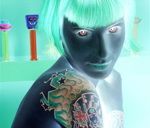

# 你好，色彩！ 
> 原文发表于 2010-02-01, 地址: http://www.cnblogs.com/chenxizhang/archive/2010/02/01/1661346.html 


这是关于反色和补色的一些基础知识

 转载自：<http://hi.baidu.com/graydeer/blog/item/300a94513367502443a75b33.html>

  

 现在来讲讲Photoshop(PS)“图像(Image)>调整(Adjust)”菜单的功能。你可以使用《[**图像的简单玩法**](http://hi.baidu.com/graydeer/blog/item/34bd6d09dd232fcf3bc763c5.html)》中的演示程序和本文提供的公式来测试一些图片。

 

 ### 反相(Invert)

 

 关键词：Inverse;Negative Film;反色;补色;反转图像色彩;翻转图象颜色;反转负片;反转负冲;反转片负冲;负片效果;底片效果

 Photoshop菜单：图像>调整>反相(Ctrl+I)

 公式：CNew = 255 - COld

  

| 
```
c=255-c
```
 |


反相可以把图片变成照片底片的效果。如果你用扫描仪扫了一张底片，也可以用此功能把底片变为正常颜色。


反相其实就是用255分别减去颜色的RGB值。例如颜色RGB(24,55,0)，反相后为RGB(255-24,255-55,255-0) = RGB(231,200,255)。


从公式可以看出，反相前后的颜色相加正好等于255，因此这两种颜色是互补的。那么它们是否在色相环上也互补呢？我们可以验证一下，例如颜色RGB(132,173,191)，转为HSB后色相H=198，反相后H=18，正好相差了180度。你可以随便再试一些颜色，会发现结果都是一样的，因此反相前后的颜色在色环上互为补色。


几种常见颜色的反色(Invert Color)：


| 正色 | 反色 |
| --- | --- |
| 黑色（0,0,0） | 白色（255,255,255） |
| 灰色（127,127,127） | 灰色（128,128,128） |
| 红色（255,0,0） | 青色（0,255,255） |
| 绿色（0,255,0） | 洋红色（255,0,255） |
| 蓝色（0,0,255） | 黄色（255,255,0） |
| 橙色（255,127,0） | 湖蓝（0,128,255） |
| 紫色（127,0,255） | 草绿（128,255,0） |
| 粉绿（0,225,128） | 玫瑰红（255,0,128） |


### 补色(Complement Color)


 


Photoshop菜单：图像>调整>色相/饱和度(Ctrl+U)，色相值调到+180


公式：CNew = Max(R,G,B) + Min(R,G,B) - COld


| 
```
c=maxRGB+minRGB-c
```
 |


用过Adobe Illustrator(AI)的同学可能会注意到，在AI的颜色面板菜单中，有Invert和Complement两项。Invert是反色，Complement是补色，可是两者有什么区别呢？


前面讲过，一种颜色反相后，颜色的色相值与反相前相差180度，这是反色和补色的共同点。不同点是，反色除了要改变色相以外，饱和度和亮度也做出了相应的改变，而补色不改变饱和度和亮度。例如，黑色的反色是白色，黑色的补色还是黑色。


补色是颜色的RGB最大、最小值总和，分别减去颜色的RGB值。例如颜色RGB(24,55,0)，它的补色为RGB(55+0-24,55+0-55,55+0-0) = RGB(31,0,55)。

