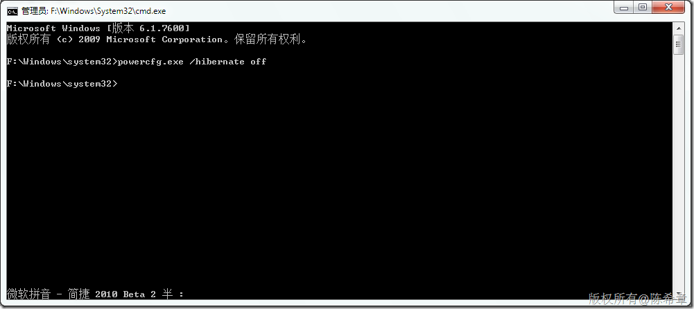

# Win 7 ：禁用计算机的休眠模式 
> 原文发表于 2010-02-05, 地址: http://www.cnblogs.com/chenxizhang/archive/2010/02/05/1664670.html 

Vista/Win7默认启用休眠模式,并且会在系统盘生成一个几乎等同于内存大小的临时文件,这个文件是无法删除的,并且即使用其他方法删除后, 也会在开机后自动生成, 那么怎么取消呢?用管理员模式运行”命令提示符” (附件里面), 实际上就是DOS命令行运行shell cmd.exe 然后做如下命令操作: 
>  关闭休眠模式,并且自动删除休眠档案: **powercfg.exe /hibernate off** 启用休眠模式: **powercfg.exe /hibernate on**
> 
> 
> 
> 
> 
> 
> 
> 

 很简单, 这样就搞定, 不需要重启计算机. 

