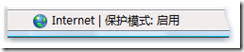

# Internet Explorer 保护模式有何功能？ 
> 原文发表于 2010-02-28, 地址: http://www.cnblogs.com/chenxizhang/archive/2010/02/28/1675261.html 

### Internet Explorer 保护模式是一项功能，它使在计算机上安装[恶意软件](mshelp://windows/?id=85b8c3e6-28c4-464d-b883-7764d16f54a2#gtmt_malicious_software_def)更为困难。

 除了帮助保护您的计算机免受恶意软件的威胁，在您以管理员身份登录时，保护模式还可让您安装所需的 ActiveX 控件或加载项。 在 Internet、本地 Intranet 和受限制网站区域中，默认情况下已启用保护模式，并且状态栏上出现的图标可以让您知道它正在运行。  除了在网页尝试“安装”软件时发出警告以外，当网页尝试“运行”特定的软件程序时，Internet Explorer 也将发出警告。当软件程序不在 Internet Explorer 中以保护模式运行时将发出警告，因为该程序可能比用户更希望访问计算机。在网站使用加载项运行计算机上的软件程序时通常会出现这种情况。如果您正在一次查看多个网站，请在授予权限之前检查所有的网站，以确保您知道哪个网站正要尝试运行此程序。如果您信任此程序，并且要让它在任何网站上运行，请选中“不再对此程序显示此警告”复选框。 ##### 注意

 * 如果您关闭警告然后要再次显示它，则需要重置 Internet Explorer 设置。有关详细信息，请参阅[重置 Internet Explorer 设置](mshelp://windows/?id=ff6cc789-e857-439d-a384-08bfa4535427)。

 * 如果您不想让网页使用加载项来运行计算机上的特定软件程序，并且不想看到如上所述的警告对话框，则可以禁用正在使用的加载项。打开“管理加载项”，然后禁用尝试使用您不允许的程序的加载项。如果不知道要禁用哪个加载项，您可以尝试禁用所有加载项，然后逐个启用这些加载项，直到您发现您要禁用的加载项为止。有关详细信息，另请参阅 [Internet Explorer 加载项：常见问题](mshelp://windows/?id=e85a03aa-c7c6-428e-9891-67ea76df9b7e)。

