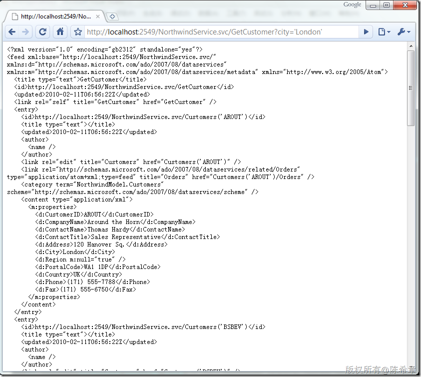

# ADO.NET Data Service中如何自定义Operation 
> 原文发表于 2010-02-28, 地址: http://www.cnblogs.com/chenxizhang/archive/2010/02/28/1675270.html 


我们之前既然说到，ADO.NET Data Service其实是一个WCF服务。那么，在WCF中常见的Operation是否还存在呢？要知道，在WCF中，最主要的两个合约就是ServiceContract和OperationContract。

 ADO.NET Data Service让我们几乎忘记了这些，因为其实在很多时候确实不需要，ADO.NET Data Service是基于REST风格的设计，所以很多请求其实都可以通过修改uri来实现。例如，如果我们需要筛选，就通过$filter,如果需要排序，就通过$order，还有$skip,$top这些关键字

 但是，如果我们真的需要添加一个自定义的Operation，是否可能呢？答案是肯定的


```
        [WebGet]
        public IQueryable<Customers> GetCustomer(string city)
        {
            return from c in this.CurrentDataSource.Customers
                   where c.City == city
                   select c;

        }
```


.csharpcode, .csharpcode pre
{
 font-size: small;
 color: black;
 font-family: consolas, "Courier New", courier, monospace;
 background-color: #ffffff;
 /*white-space: pre;*/
}
.csharpcode pre { margin: 0em; }
.csharpcode .rem { color: #008000; }
.csharpcode .kwrd { color: #0000ff; }
.csharpcode .str { color: #006080; }
.csharpcode .op { color: #0000c0; }
.csharpcode .preproc { color: #cc6633; }
.csharpcode .asp { background-color: #ffff00; }
.csharpcode .html { color: #800000; }
.csharpcode .attr { color: #ff0000; }
.csharpcode .alt 
{
 background-color: #f4f4f4;
 width: 100%;
 margin: 0em;
}
.csharpcode .lnum { color: #606060; }


事实上，这并不难。编写一个方法，返回的是IQueryable接口，并且标记为WebGet


定义好这个Operation之后，应该如何使用呢？将方法名作为资源定位符，并且直接在后面追加参数及参数值即可。


[](http://images.cnblogs.com/cnblogs_com/chenxizhang/WindowsLiveWriter/ADO.NETDataServiceOperation_D8B6/image_2.png) 


上面的例子是针对查询的，那么如果我们需要其他操作呢，例如增加，更新，删除，该怎么做呢？

