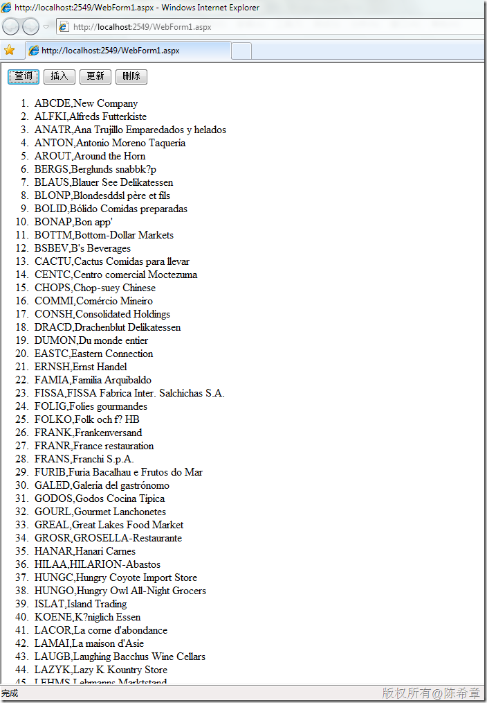

# 如何在AJAX应用中访问ADO.NET Data Service（续）——基于jquery框架 
> 原文发表于 2010-02-28, 地址: http://www.cnblogs.com/chenxizhang/archive/2010/02/28/1675305.html 


上一篇演示了如何基于Microsoft ASP.NET AJAX框架实现对ADO.NET Data Service的调用（增删改查）。下面的例子则是直接基于jquery框架的

 需要注意的是，凡是要发送给服务的数据，contentType必须设置为application/json，而且要设置data的时候，要转换为json字符串。

 在接收数据的时候，dataType要设置为json，也就是说服务会直接返回json数据给客户端，这样操作就方便多了。

  


```
<!DOCTYPE html PUBLIC "-//W3C//DTD XHTML 1.0 Transitional//EN" "http://www.w3.org/TR/xhtml1/DTD/xhtml1-transitional.dtd">
<html xmlns="http://www.w3.org/1999/xhtml">
<head runat="server">
    <title></title>

    <script src="jquery-1.3.2-vsdoc.js" type="text/javascript"></script>

    <script src="json2.js" type="text/javascript"></script>

    <script type="text/javascript" language="javascript">

        $(function() {
            $("#query").click(function() {
                //发起一个异步查询

                $.ajax({
                    type: "GET",
                    url: "NorthwindService.svc/Customers",
                    dataType: "json",
                    success: function(result) {
                        var result = result.d;
                        for (ind in result) {
                            var customer = result[ind];
                            $("<li>" + customer.CustomerID + "," + customer.CompanyName + "</li>").appendTo("#result");
                        }
                    }
                });
            });


            $("#insert").click(function() {
                //插入一个新的客户

                var customer = {
                    CustomerID: "ABCDE",
                    CompanyName: "Thinker Inc"
                };

                $.ajax({
                    type: "POST",
                    url: "NorthwindService.svc/Customers",
                    contentType: "application/json",
                    data: JSON.stringify(customer),
                    success: function(result) {
                        alert("操作成功");
                    }
                });
            });


            $("#update").click(function() {
                //更新一个客户

                var customer = null;

                $.ajax({
                    type: "GET",
                    url: "NorthwindService.svc/Customers('ABCDE')",
                    dataType: "json",
                    async: false,
                    success: function(result) {
                        customer = result.d;
                    }
                });

                alert(customer.CompanyName);
                customer.CompanyName = "New Company";

                $.ajax({
                    type: "PUT",//这里还可以使用MERGE指令，效果是一样的
                    url: "NorthwindService.svc/Customers('ABCDE')",
                    contentType: "application/json",
                    data: JSON.stringify(customer),
                    success: function(result) {
                        alert("操作成功");
                    }
                });

            });


            $("#delete").click(function() {
                //删除一个客户
                $.ajax({
                    type: "DELETE",
                    url: "NorthwindService.svc/Customers('ABCDE')",
                    success: function(result) {
                        alert("操作成功");
                    }
                });
            });

        });
    </script>

</head>
<body>
    <form id="form1" runat="server">
    <div>
        <input type="button" value="查询" id="query" />
        <input type="button" value="插入" id="insert" />
        <input type="button" value="更新" id="update" />
        <input type="button" value="删除" id="delete" />
    </div>
    <ol id="result">
    </ol>
    </form>
</body>
</html>

```

```
[](http://images.cnblogs.com/cnblogs_com/chenxizhang/WindowsLiveWriter/AJAXADO.NETDataServicejquery_A127/image_2.png) 
```

.csharpcode, .csharpcode pre
{
 font-size: small;
 color: black;
 font-family: consolas, "Courier New", courier, monospace;
 background-color: #ffffff;
 /*white-space: pre;*/
}
.csharpcode pre { margin: 0em; }
.csharpcode .rem { color: #008000; }
.csharpcode .kwrd { color: #0000ff; }
.csharpcode .str { color: #006080; }
.csharpcode .op { color: #0000c0; }
.csharpcode .preproc { color: #cc6633; }
.csharpcode .asp { background-color: #ffff00; }
.csharpcode .html { color: #800000; }
.csharpcode .attr { color: #ff0000; }
.csharpcode .alt 
{
 background-color: #f4f4f4;
 width: 100%;
 margin: 0em;
}
.csharpcode .lnum { color: #606060; }
