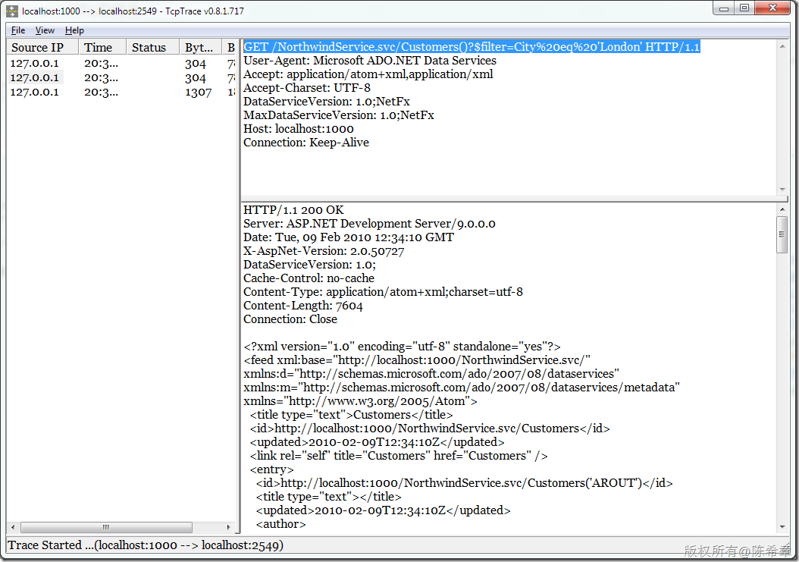
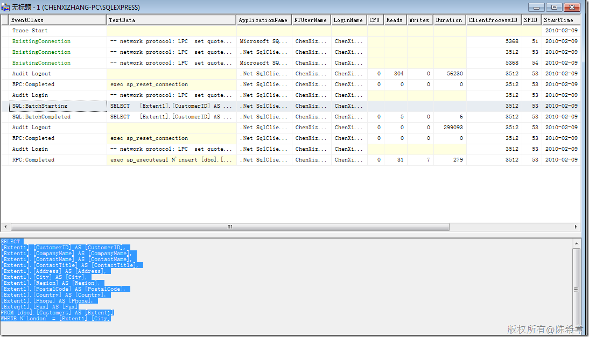

# ADO.NET Data Service之CRUD操作 
> 原文发表于 2010-02-28, 地址: http://www.cnblogs.com/chenxizhang/archive/2010/02/28/1675306.html 


1.选择数据

 （这是采用GET方法）


```
            localhost.NorthwindEntities context = new localhost.NorthwindEntities(
                new Uri("http://localhost:1000/NorthwindService.svc/"));


            //查询
            var query = from c in context.Customers
                        where c.City.Equals("London")
                        select c;

            
            Console.WriteLine(query.ToString());
            foreach (var item in query)
            {
                Console.WriteLine(item.CompanyName);
            }
```

```
这个查询，发给服务的查询字串是：
```

```
[](http://images.cnblogs.com/cnblogs_com/chenxizhang/WindowsLiveWriter/ADO.NETDataServiceCRUD_12576/image_2.png) 
```

```
查询数据库的语法是
```

```
[](http://images.cnblogs.com/cnblogs_com/chenxizhang/WindowsLiveWriter/ADO.NETDataServiceCRUD_12576/image_4.png) 
```

```
返回的数据是
```

```
HTTP/1.1 200 OK
Server: ASP.NET Development Server/9.0.0.0
Date: Tue, 09 Feb 2010 12:33:14 GMT
X-AspNet-Version: 2.0.50727
DataServiceVersion: 1.0;
Cache-Control: no-cache
Content-Type: application/atom+xml;charset=utf-8
Content-Length: 7604
Connection: Close

<?xml version="1.0" encoding="utf-8" standalone="yes"?>
<feed xml:base="http://localhost:1000/NorthwindService.svc/" xmlns:d="http://schemas.microsoft.com/ado/2007/08/dataservices" xmlns:m="http://schemas.microsoft.com/ado/2007/08/dataservices/metadata" xmlns="http://www.w3.org/2005/Atom">
  <title type="text">Customers</title>
  <id>http://localhost:1000/NorthwindService.svc/Customers</id>
  <updated>2010-02-09T12:33:14Z</updated>
  <link rel="self" title="Customers" href="Customers" />
  <entry>
    <id>http://localhost:1000/NorthwindService.svc/Customers('AROUT')</id>
    <title type="text"></title>
    <updated>2010-02-09T12:33:14Z</updated>
    <author>
      <name />
    </author>
    <link rel="edit" title="Customers" href="Customers('AROUT')" />
    <link rel="http://schemas.microsoft.com/ado/2007/08/dataservices/related/Orders" type="application/atom+xml;type=feed" title="Orders" href="Customers('AROUT')/Orders" />
    <category term="NorthwindModel.Customers" scheme="http://schemas.microsoft.com/ado/2007/08/dataservices/scheme" />
    <content type="application/xml">
      <m:properties>
        <d:CustomerID>AROUT</d:CustomerID>
        <d:CompanyName>Around the Horn</d:CompanyName>
        <d:ContactName>Thomas Hardy</d:ContactName>
        <d:ContactTitle>Sales Representative</d:ContactTitle>
        <d:Address>120 Hanover Sq.</d:Address>
        <d:City>London</d:City>
        <d:Region m:null="true" />
        <d:PostalCode>WA1 1DP</d:PostalCode>
        <d:Country>UK</d:Country>
        <d:Phone>(171) 555-7788</d:Phone>
        <d:Fax>(171) 555-6750</d:Fax>
      </m:properties>
    </content>
  </entry>
  <entry>
    <id>http://localhost:1000/NorthwindService.svc/Customers('BSBEV')</id>
    <title type="text"></title>
    <updated>2010-02-09T12:33:14Z</updated>
    <author>
      <name />
    </author>
    <link rel="edit" title="Customers" href="Customers('BSBEV')" />
    <link rel="http://schemas.microsoft.com/ado/2007/08/dataservices/related/Orders" type="application/atom+xml;type=feed" title="Orders" href="Customers('BSBEV')/Orders" />
    <category term="NorthwindModel.Customers" scheme="http://schemas.microsoft.com/ado/2007/08/dataservices/scheme" />
    <content type="application/xml">
      <m:properties>
        <d:CustomerID>BSBEV</d:CustomerID>
        <d:CompanyName>B's Beverages</d:CompanyName>
        <d:ContactName>Victoria Ashworth</d:ContactName>
        <d:ContactTitle>Sales Representative</d:ContactTitle>
        <d:Address>Fauntleroy Circus</d:Address>
        <d:City>London</d:City>
        <d:Region m:null="true" />
        <d:PostalCode>EC2 5NT</d:PostalCode>
        <d:Country>UK</d:Country>
        <d:Phone>(171) 555-1212</d:Phone>
        <d:Fax m:null="true" />
      </m:properties>
    </content>
  </entry>
  <entry>
    <id>http://localhost:1000/NorthwindService.svc/Customers('CONSH')</id>
    <title type="text"></title>
    <updated>2010-02-09T12:33:14Z</updated>
    <author>
      <name />
    </author>
    <link rel="edit" title="Customers" href="Customers('CONSH')" />
    <link rel="http://schemas.microsoft.com/ado/2007/08/dataservices/related/Orders" type="application/atom+xml;type=feed" title="Orders" href="Customers('CONSH')/Orders" />
    <category term="NorthwindModel.Customers" scheme="http://schemas.microsoft.com/ado/2007/08/dataservices/scheme" />
    <content type="application/xml">
      <m:properties>
        <d:CustomerID>CONSH</d:CustomerID>
        <d:CompanyName>Consolidated Holdings</d:CompanyName>
        <d:ContactName>Elizabeth Brown</d:ContactName>
        <d:ContactTitle>Sales Representative</d:ContactTitle>
        <d:Address>Berkeley Gardens 12  Brewery</d:Address>
        <d:City>London</d:City>
        <d:Region m:null="true" />
        <d:PostalCode>WX1 6LT</d:PostalCode>
        <d:Country>UK</d:Country>
        <d:Phone>(171) 555-2282</d:Phone>
        <d:Fax>(171) 555-9199</d:Fax>
      </m:properties>
    </content>
  </entry>
  <entry>
    <id>http://localhost:1000/NorthwindService.svc/Customers('EASTC')</id>
    <title type="text"></title>
    <updated>2010-02-09T12:33:14Z</updated>
    <author>
      <name />
    </author>
    <link rel="edit" title="Customers" href="Customers('EASTC')" />
    <link rel="http://schemas.microsoft.com/ado/2007/08/dataservices/related/Orders" type="application/atom+xml;type=feed" title="Orders" href="Customers('EASTC')/Orders" />
    <category term="NorthwindModel.Customers" scheme="http://schemas.microsoft.com/ado/2007/08/dataservices/scheme" />
    <content type="application/xml">
      <m:properties>
        <d:CustomerID>EASTC</d:CustomerID>
        <d:CompanyName>Eastern Connection</d:CompanyName>
        <d:ContactName>Ann Devon</d:ContactName>
        <d:ContactTitle>Sales Agent</d:ContactTitle>
        <d:Address>35 King George</d:Address>
        <d:City>London</d:City>
        <d:Region m:null="true" />
        <d:PostalCode>WX3 6FW</d:PostalCode>
        <d:Country>UK</d:Country>
        <d:Phone>(171) 555-0297</d:Phone>
        <d:Fax>(171) 555-3373</d:Fax>
      </m:properties>
    </content>
  </entry>
  <entry>
    <id>http://localhost:1000/NorthwindService.svc/Customers('NORTS')</id>
    <title type="text"></title>
    <updated>2010-02-09T12:33:14Z</updated>
    <author>
      <name />
    </author>
    <link rel="edit" title="Customers" href="Customers('NORTS')" />
    <link rel="http://schemas.microsoft.com/ado/2007/08/dataservices/related/Orders" type="application/atom+xml;type=feed" title="Orders" href="Customers('NORTS')/Orders" />
    <category term="NorthwindModel.Customers" scheme="http://schemas.microsoft.com/ado/2007/08/dataservices/scheme" />
    <content type="application/xml">
      <m:properties>
        <d:CustomerID>NORTS</d:CustomerID>
        <d:CompanyName>North/South</d:CompanyName>
        <d:ContactName>Simon Crowther</d:ContactName>
        <d:ContactTitle>Sales Associate</d:ContactTitle>
        <d:Address>South House 300 Queensbridge</d:Address>
        <d:City>London</d:City>
        <d:Region m:null="true" />
        <d:PostalCode>SW7 1RZ</d:PostalCode>
        <d:Country>UK</d:Country>
        <d:Phone>(171) 555-7733</d:Phone>
        <d:Fax>(171) 555-2530</d:Fax>
      </m:properties>
    </content>
  </entry>
  <entry>
    <id>http://localhost:1000/NorthwindService.svc/Customers('SEVES')</id>
    <title type="text"></title>
    <updated>2010-02-09T12:33:14Z</updated>
    <author>
      <name />
    </author>
    <link rel="edit" title="Customers" href="Customers('SEVES')" />
    <link rel="http://schemas.microsoft.com/ado/2007/08/dataservices/related/Orders" type="application/atom+xml;type=feed" title="Orders" href="Customers('SEVES')/Orders" />
    <category term="NorthwindModel.Customers" scheme="http://schemas.microsoft.com/ado/2007/08/dataservices/scheme" />
    <content type="application/xml">
      <m:properties>
        <d:CustomerID>SEVES</d:CustomerID>
        <d:CompanyName>Seven Seas Imports</d:CompanyName>
        <d:ContactName>Hari Kumar</d:ContactName>
        <d:ContactTitle>Sales Manager</d:ContactTitle>
        <d:Address>90 Wadhurst Rd.</d:Address>
        <d:City>London</d:City>
        <d:Region m:null="true" />
        <d:PostalCode>OX15 4NB</d:PostalCode>
        <d:Country>UK</d:Country>
        <d:Phone>(171) 555-1717</d:Phone>
        <d:Fax>(171) 555-5646</d:Fax>
      </m:properties>
    </content>
  </entry>
</feed>
```

.csharpcode, .csharpcode pre
{
 font-size: small;
 color: black;
 font-family: consolas, "Courier New", courier, monospace;
 background-color: #ffffff;
 /*white-space: pre;*/
}
.csharpcode pre { margin: 0em; }
.csharpcode .rem { color: #008000; }
.csharpcode .kwrd { color: #0000ff; }
.csharpcode .str { color: #006080; }
.csharpcode .op { color: #0000c0; }
.csharpcode .preproc { color: #cc6633; }
.csharpcode .asp { background-color: #ffff00; }
.csharpcode .html { color: #800000; }
.csharpcode .attr { color: #ff0000; }
.csharpcode .alt 
{
 background-color: #f4f4f4;
 width: 100%;
 margin: 0em;
}
.csharpcode .lnum { color: #606060; }

.csharpcode, .csharpcode pre
{
 font-size: small;
 color: black;
 font-family: consolas, "Courier New", courier, monospace;
 background-color: #ffffff;
 /*white-space: pre;*/
}
.csharpcode pre { margin: 0em; }
.csharpcode .rem { color: #008000; }
.csharpcode .kwrd { color: #0000ff; }
.csharpcode .str { color: #006080; }
.csharpcode .op { color: #0000c0; }
.csharpcode .preproc { color: #cc6633; }
.csharpcode .asp { background-color: #ffff00; }
.csharpcode .html { color: #800000; }
.csharpcode .attr { color: #ff0000; }
.csharpcode .alt 
{
 background-color: #f4f4f4;
 width: 100%;
 margin: 0em;
}
.csharpcode .lnum { color: #606060; }

2.插入数据


（这个操作是POST）


```
            //增加新客户
            localhost.Customers newCustomer = new localhost.Customers()
            {
                CustomerID = "FFFFF",
                CompanyName = "Thinker Inc"
            };
            context.AddToCustomers(newCustomer);

```

.csharpcode, .csharpcode pre
{
 font-size: small;
 color: black;
 font-family: consolas, "Courier New", courier, monospace;
 background-color: #ffffff;
 /*white-space: pre;*/
}
.csharpcode pre { margin: 0em; }
.csharpcode .rem { color: #008000; }
.csharpcode .kwrd { color: #0000ff; }
.csharpcode .str { color: #006080; }
.csharpcode .op { color: #0000c0; }
.csharpcode .preproc { color: #cc6633; }
.csharpcode .asp { background-color: #ffff00; }
.csharpcode .html { color: #800000; }
.csharpcode .attr { color: #ff0000; }
.csharpcode .alt 
{
 background-color: #f4f4f4;
 width: 100%;
 margin: 0em;
}
.csharpcode .lnum { color: #606060; }

发送给服务器的数据是


```
POST /NorthwindService.svc/Customers HTTP/1.1
User-Agent: Microsoft ADO.NET Data Services
Accept: application/atom+xml,application/xml
Accept-Charset: UTF-8
DataServiceVersion: 1.0;NetFx
MaxDataServiceVersion: 1.0;NetFx
Content-Type: application/atom+xml
Host: localhost:1000
Content-Length: 978
Expect: 100-continue

<?xml version="1.0" encoding="utf-8" standalone="yes"?>
<entry xmlns:d="http://schemas.microsoft.com/ado/2007/08/dataservices" xmlns:m="http://schemas.microsoft.com/ado/2007/08/dataservices/metadata" xmlns="http://www.w3.org/2005/Atom">
  <category scheme="http://schemas.microsoft.com/ado/2007/08/dataservices/scheme" term="NorthwindModel.Customers" />
  <title />
  <updated>2010-02-09T12:34:10.5029331Z</updated>
  <author>
    <name />
  </author>
  <id />
  <content type="application/xml">
    <m:properties>
      <d:Address m:null="true" />
      <d:City m:null="true" />
      <d:CompanyName>Thinker Inc</d:CompanyName>
      <d:ContactName m:null="true" />
      <d:ContactTitle m:null="true" />
      <d:Country m:null="true" />
      <d:CustomerID>FFFFF</d:CustomerID>
      <d:Fax m:null="true" />
      <d:Phone m:null="true" />
      <d:PostalCode m:null="true" />
      <d:Region m:null="true" />
    </m:properties>
  </content>
</entry>
```

```
返回的数据是
```

```
HTTP/1.1 100 Continue
Server: ASP.NET Development Server/9.0.0.0
Date: Tue, 09 Feb 2010 12:34:10 GMT
Content-Length: 0

HTTP/1.1 201 Created
Server: ASP.NET Development Server/9.0.0.0
Date: Tue, 09 Feb 2010 12:34:10 GMT
X-AspNet-Version: 2.0.50727
DataServiceVersion: 1.0;
Location: http://localhost:1000/NorthwindService.svc/Customers('FFFFF')
Cache-Control: no-cache
Content-Type: application/atom+xml;charset=utf-8
Content-Length: 1347
Connection: Close

<?xml version="1.0" encoding="utf-8" standalone="yes"?>
<entry xml:base="http://localhost:1000/NorthwindService.svc/" xmlns:d="http://schemas.microsoft.com/ado/2007/08/dataservices" xmlns:m="http://schemas.microsoft.com/ado/2007/08/dataservices/metadata" xmlns="http://www.w3.org/2005/Atom">
  <id>http://localhost:1000/NorthwindService.svc/Customers('FFFFF')</id>
  <title type="text"></title>
  <updated>2010-02-09T12:34:10Z</updated>
  <author>
    <name />
  </author>
  <link rel="edit" title="Customers" href="Customers('FFFFF')" />
  <link rel="http://schemas.microsoft.com/ado/2007/08/dataservices/related/Orders" type="application/atom+xml;type=feed" title="Orders" href="Customers('FFFFF')/Orders" />
  <category term="NorthwindModel.Customers" scheme="http://schemas.microsoft.com/ado/2007/08/dataservices/scheme" />
  <content type="application/xml">
    <m:properties>
      <d:CustomerID>FFFFF</d:CustomerID>
      <d:CompanyName>Thinker Inc</d:CompanyName>
      <d:ContactName m:null="true" />
      <d:ContactTitle m:null="true" />
      <d:Address m:null="true" />
      <d:City m:null="true" />
      <d:Region m:null="true" />
      <d:PostalCode m:null="true" />
      <d:Country m:null="true" />
      <d:Phone m:null="true" />
      <d:Fax m:null="true" />
    </m:properties>
  </content>
</entry>
```

.csharpcode, .csharpcode pre
{
 font-size: small;
 color: black;
 font-family: consolas, "Courier New", courier, monospace;
 background-color: #ffffff;
 /*white-space: pre;*/
}
.csharpcode pre { margin: 0em; }
.csharpcode .rem { color: #008000; }
.csharpcode .kwrd { color: #0000ff; }
.csharpcode .str { color: #006080; }
.csharpcode .op { color: #0000c0; }
.csharpcode .preproc { color: #cc6633; }
.csharpcode .asp { background-color: #ffff00; }
.csharpcode .html { color: #800000; }
.csharpcode .attr { color: #ff0000; }
.csharpcode .alt 
{
 background-color: #f4f4f4;
 width: 100%;
 margin: 0em;
}
.csharpcode .lnum { color: #606060; }


```
 
```

.csharpcode, .csharpcode pre
{
 font-size: small;
 color: black;
 font-family: consolas, "Courier New", courier, monospace;
 background-color: #ffffff;
 /*white-space: pre;*/
}
.csharpcode pre { margin: 0em; }
.csharpcode .rem { color: #008000; }
.csharpcode .kwrd { color: #0000ff; }
.csharpcode .str { color: #006080; }
.csharpcode .op { color: #0000c0; }
.csharpcode .preproc { color: #cc6633; }
.csharpcode .asp { background-color: #ffff00; }
.csharpcode .html { color: #800000; }
.csharpcode .attr { color: #ff0000; }
.csharpcode .alt 
{
 background-color: #f4f4f4;
 width: 100%;
 margin: 0em;
}
.csharpcode .lnum { color: #606060; }

3.更新数据


（这个操作是用MERGE)


```
            var c = context.Customers.Where(w => w.CustomerID == "FFFFF");
            var customer = c.FirstOrDefault();
            customer.CompanyName = "Microsoft";
            context.UpdateObject(customer);
```


.csharpcode, .csharpcode pre
{
 font-size: small;
 color: black;
 font-family: consolas, "Courier New", courier, monospace;
 background-color: #ffffff;
 /*white-space: pre;*/
}
.csharpcode pre { margin: 0em; }
.csharpcode .rem { color: #008000; }
.csharpcode .kwrd { color: #0000ff; }
.csharpcode .str { color: #006080; }
.csharpcode .op { color: #0000c0; }
.csharpcode .preproc { color: #cc6633; }
.csharpcode .asp { background-color: #ffff00; }
.csharpcode .html { color: #800000; }
.csharpcode .attr { color: #ff0000; }
.csharpcode .alt 
{
 background-color: #f4f4f4;
 width: 100%;
 margin: 0em;
}
.csharpcode .lnum { color: #606060; }


 


发送给服务的数据是


```
MERGE /NorthwindService.svc/Customers('FFFFF') HTTP/1.1
User-Agent: Microsoft ADO.NET Data Services
Accept: application/atom+xml,application/xml
Accept-Charset: UTF-8
DataServiceVersion: 1.0;NetFx
MaxDataServiceVersion: 1.0;NetFx
Content-Type: application/atom+xml
Host: localhost:1000
Content-Length: 1040
Expect: 100-continue

<?xml version="1.0" encoding="utf-8" standalone="yes"?>
<entry xmlns:d="http://schemas.microsoft.com/ado/2007/08/dataservices" xmlns:m="http://schemas.microsoft.com/ado/2007/08/dataservices/metadata" xmlns="http://www.w3.org/2005/Atom">
  <category scheme="http://schemas.microsoft.com/ado/2007/08/dataservices/scheme" term="NorthwindModel.Customers" />
  <title />
  <updated>2010-02-09T12:48:12.3845677Z</updated>
  <author>
    <name />
  </author>
  <id>http://localhost:1000/NorthwindService.svc/Customers('FFFFF')</id>
  <content type="application/xml">
    <m:properties>
      <d:Address m:null="true" />
      <d:City m:null="true" />
      <d:CompanyName>Microsoft</d:CompanyName>
      <d:ContactName m:null="true" />
      <d:ContactTitle m:null="true" />
      <d:Country m:null="true" />
      <d:CustomerID>FFFFF</d:CustomerID>
      <d:Fax m:null="true" />
      <d:Phone m:null="true" />
      <d:PostalCode m:null="true" />
      <d:Region m:null="true" />
    </m:properties>
  </content>
</entry>
```


.csharpcode, .csharpcode pre
{
 font-size: small;
 color: black;
 font-family: consolas, "Courier New", courier, monospace;
 background-color: #ffffff;
 /*white-space: pre;*/
}
.csharpcode pre { margin: 0em; }
.csharpcode .rem { color: #008000; }
.csharpcode .kwrd { color: #0000ff; }
.csharpcode .str { color: #006080; }
.csharpcode .op { color: #0000c0; }
.csharpcode .preproc { color: #cc6633; }
.csharpcode .asp { background-color: #ffff00; }
.csharpcode .html { color: #800000; }
.csharpcode .attr { color: #ff0000; }
.csharpcode .alt 
{
 background-color: #f4f4f4;
 width: 100%;
 margin: 0em;
}
.csharpcode .lnum { color: #606060; }


发送给数据库的指令是


```
exec sp\_executesql N'update [dbo].[Customers]
set [CompanyName] = @0, [ContactName] = null, [ContactTitle] = null, [Address] = null, [City] = null, [Region] = null, [PostalCode] = null, [Country] = null, [Phone] = null, [Fax] = null
where ([CustomerID] = @1)
',N'@0 nvarchar(9),@1 nchar(5)',@0=N'Microsoft',@1=N'FFFFF'
```

.csharpcode, .csharpcode pre
{
 font-size: small;
 color: black;
 font-family: consolas, "Courier New", courier, monospace;
 background-color: #ffffff;
 /*white-space: pre;*/
}
.csharpcode pre { margin: 0em; }
.csharpcode .rem { color: #008000; }
.csharpcode .kwrd { color: #0000ff; }
.csharpcode .str { color: #006080; }
.csharpcode .op { color: #0000c0; }
.csharpcode .preproc { color: #cc6633; }
.csharpcode .asp { background-color: #ffff00; }
.csharpcode .html { color: #800000; }
.csharpcode .attr { color: #ff0000; }
.csharpcode .alt 
{
 background-color: #f4f4f4;
 width: 100%;
 margin: 0em;
}
.csharpcode .lnum { color: #606060; }

 


回复给客户端的数据是


```
HTTP/1.1 204 No Content
Server: ASP.NET Development Server/9.0.0.0
Date: Tue, 09 Feb 2010 12:48:12 GMT
X-AspNet-Version: 2.0.50727
DataServiceVersion: 1.0;
Cache-Control: no-cache
Content-Length: 0
Connection: Close

```

.csharpcode, .csharpcode pre
{
 font-size: small;
 color: black;
 font-family: consolas, "Courier New", courier, monospace;
 background-color: #ffffff;
 /*white-space: pre;*/
}
.csharpcode pre { margin: 0em; }
.csharpcode .rem { color: #008000; }
.csharpcode .kwrd { color: #0000ff; }
.csharpcode .str { color: #006080; }
.csharpcode .op { color: #0000c0; }
.csharpcode .preproc { color: #cc6633; }
.csharpcode .asp { background-color: #ffff00; }
.csharpcode .html { color: #800000; }
.csharpcode .attr { color: #ff0000; }
.csharpcode .alt 
{
 background-color: #f4f4f4;
 width: 100%;
 margin: 0em;
}
.csharpcode .lnum { color: #606060; }

4.删除数据


（这个操作是DELETE)


```
            var c = context.Customers.Where(w => w.CustomerID == "FFFFF");
            var customer = c.FirstOrDefault();
            customer.CompanyName = "Microsoft";
            context.DeleteObject(customer);
```

```
发送给服务的数据是
```

```
DELETE /NorthwindService.svc/Customers('FFFFF') HTTP/1.1
User-Agent: Microsoft ADO.NET Data Services
Accept: application/atom+xml,application/xml
Accept-Charset: UTF-8
DataServiceVersion: 1.0;NetFx
MaxDataServiceVersion: 1.0;NetFx
Content-Type: application/atom+xml
Host: localhost:1000
Content-Length: 0

```

.csharpcode, .csharpcode pre
{
 font-size: small;
 color: black;
 font-family: consolas, "Courier New", courier, monospace;
 background-color: #ffffff;
 /*white-space: pre;*/
}
.csharpcode pre { margin: 0em; }
.csharpcode .rem { color: #008000; }
.csharpcode .kwrd { color: #0000ff; }
.csharpcode .str { color: #006080; }
.csharpcode .op { color: #0000c0; }
.csharpcode .preproc { color: #cc6633; }
.csharpcode .asp { background-color: #ffff00; }
.csharpcode .html { color: #800000; }
.csharpcode .attr { color: #ff0000; }
.csharpcode .alt 
{
 background-color: #f4f4f4;
 width: 100%;
 margin: 0em;
}
.csharpcode .lnum { color: #606060; }

.csharpcode, .csharpcode pre
{
 font-size: small;
 color: black;
 font-family: consolas, "Courier New", courier, monospace;
 background-color: #ffffff;
 /*white-space: pre;*/
}
.csharpcode pre { margin: 0em; }
.csharpcode .rem { color: #008000; }
.csharpcode .kwrd { color: #0000ff; }
.csharpcode .str { color: #006080; }
.csharpcode .op { color: #0000c0; }
.csharpcode .preproc { color: #cc6633; }
.csharpcode .asp { background-color: #ffff00; }
.csharpcode .html { color: #800000; }
.csharpcode .attr { color: #ff0000; }
.csharpcode .alt 
{
 background-color: #f4f4f4;
 width: 100%;
 margin: 0em;
}
.csharpcode .lnum { color: #606060; }


发送给数据库服务器的指令是


```
exec sp\_executesql N'delete [dbo].[Customers]
where ([CustomerID] = @0)',N'@0 nchar(5)',@0=N'FFFFF'
```


.csharpcode, .csharpcode pre
{
 font-size: small;
 color: black;
 font-family: consolas, "Courier New", courier, monospace;
 background-color: #ffffff;
 /*white-space: pre;*/
}
.csharpcode pre { margin: 0em; }
.csharpcode .rem { color: #008000; }
.csharpcode .kwrd { color: #0000ff; }
.csharpcode .str { color: #006080; }
.csharpcode .op { color: #0000c0; }
.csharpcode .preproc { color: #cc6633; }
.csharpcode .asp { background-color: #ffff00; }
.csharpcode .html { color: #800000; }
.csharpcode .attr { color: #ff0000; }
.csharpcode .alt 
{
 background-color: #f4f4f4;
 width: 100%;
 margin: 0em;
}
.csharpcode .lnum { color: #606060; }


得到的回复是


HTTP/1.1 204 No Content  
Server: ASP.NET Development Server/9.0.0.0  
Date: Tue, 09 Feb 2010 13:01:04 GMT  
X-AspNet-Version: 2.0.50727  
DataServiceVersion: 1.0;  
Cache-Control: no-cache  
Content-Length: 0  
Connection: Close 


