# 在SharePoint服务器中执行备份和还原 
> 原文发表于 2010-02-28, 地址: http://www.cnblogs.com/chenxizhang/archive/2010/02/28/1675308.html 

第一种是针对

 Web Application以及数据库级别
======================

 这个操作必须在管理中心中完成

 1. 在管理中心中进行备份

 [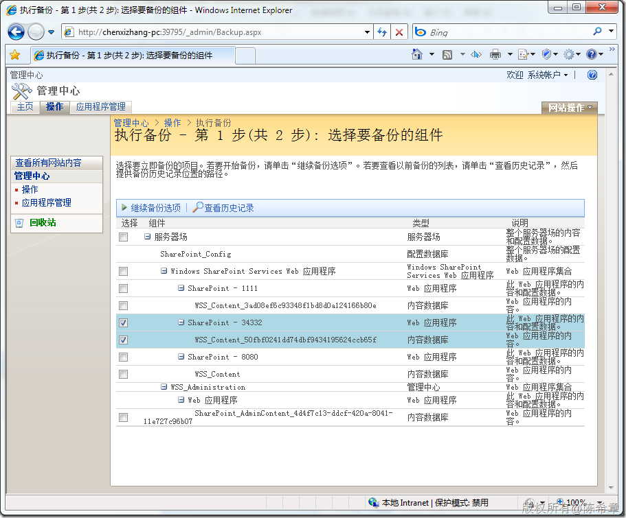](http://images.cnblogs.com/cnblogs_com/chenxizhang/WindowsLiveWriter/SharePoint_C312/image_2.png) 

 [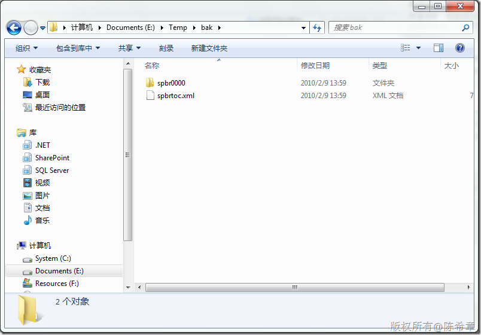](http://images.cnblogs.com/cnblogs_com/chenxizhang/WindowsLiveWriter/SharePoint_C312/image_14.png) 

 2. 在管理中心中进行还原操作

 [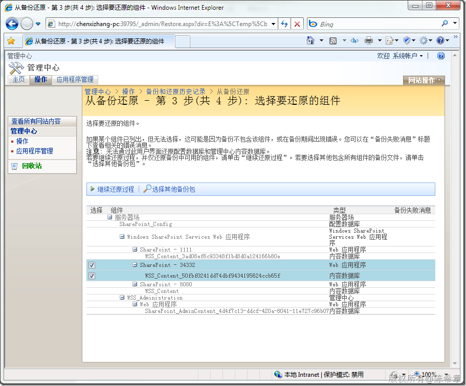](http://images.cnblogs.com/cnblogs_com/chenxizhang/WindowsLiveWriter/SharePoint_C312/image6.png) 

  [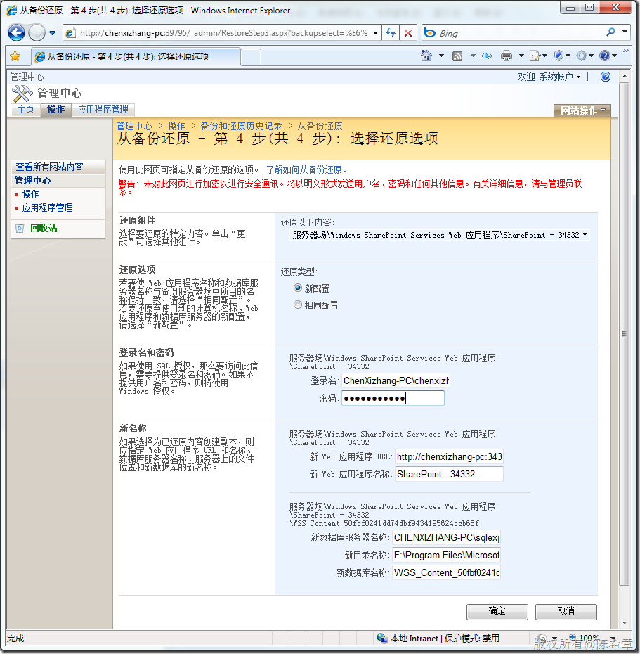](http://images.cnblogs.com/cnblogs_com/chenxizhang/WindowsLiveWriter/SharePoint_C312/image10.png) 

 这里的选项，我测试下来的结果是必须要选择“新配置”

  

  

 第二种备份还原机制是针对

 网站级别
----

 所谓网站可能也包含子网站。总之，他们是网站，而不是应用程序。

 这个操作需要在SharePoint Designer中完成。

  

 1. 首先打开某个网站，然后点击“网站”=〉“管理”=〉“备份网站”

 [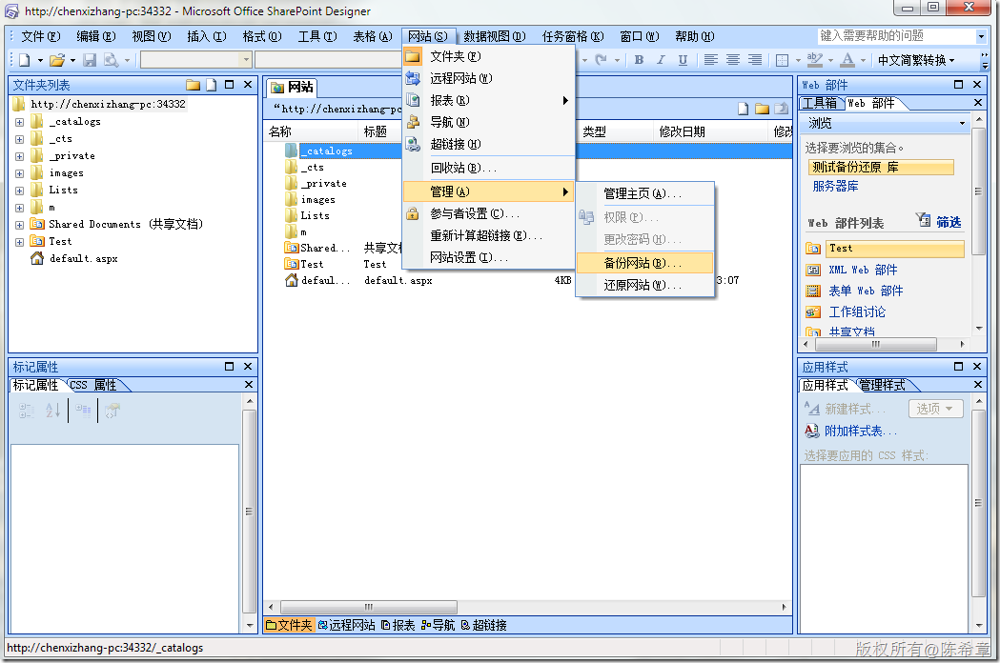](http://images.cnblogs.com/cnblogs_com/chenxizhang/WindowsLiveWriter/SharePoint_C312/image_8.png) 

 [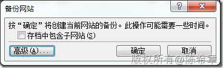](http://images.cnblogs.com/cnblogs_com/chenxizhang/WindowsLiveWriter/SharePoint_C312/image_10.png) 

 此时会被要求指定一个保存位置，这是一个cmp文件（content migration package)

 [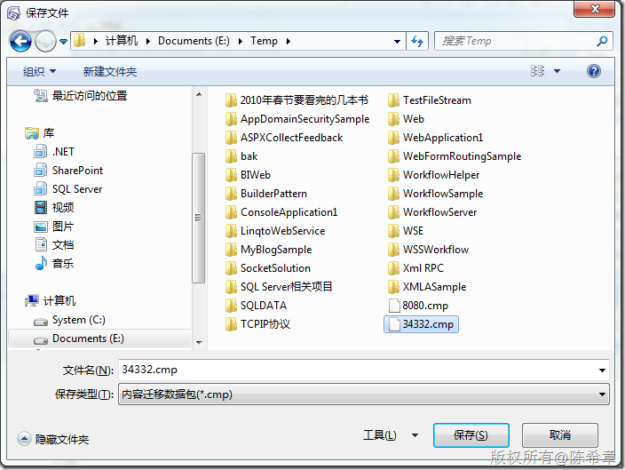](http://images.cnblogs.com/cnblogs_com/chenxizhang/WindowsLiveWriter/SharePoint_C312/image_12.png) 

  

 接下来，如果我们需要在任何其他的位置进行网站还原的话

   这里有些特殊，必须先创建一个空白网站，然后在这个空白网站基础上进行还原。

 [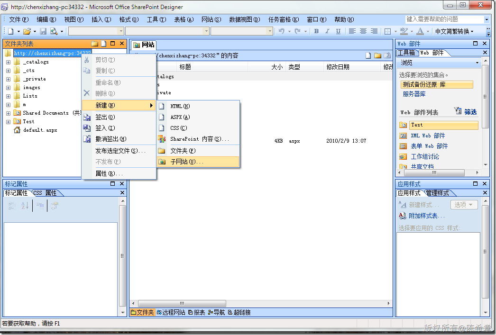](http://images.cnblogs.com/cnblogs_com/chenxizhang/WindowsLiveWriter/SharePoint_C312/image_16.png) 

 [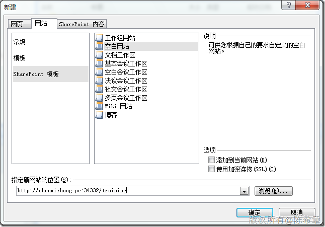](http://images.cnblogs.com/cnblogs_com/chenxizhang/WindowsLiveWriter/SharePoint_C312/image_18.png) 

 创建好网站之后，就可以在SharePoint Designer中，通过“网站”=〉“管理”=〉“还原网站”

  

  

  

 第三种是针对列表级别的备份和还原。准确地说，这不是备份和还原，而是导出和导入

  

 [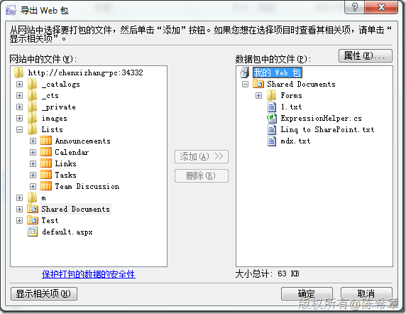](http://images.cnblogs.com/cnblogs_com/chenxizhang/WindowsLiveWriter/SharePoint_C312/image_22.png) 

 [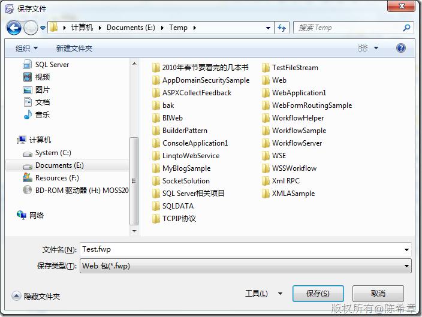](http://images.cnblogs.com/cnblogs_com/chenxizhang/WindowsLiveWriter/SharePoint_C312/image_24.png)

