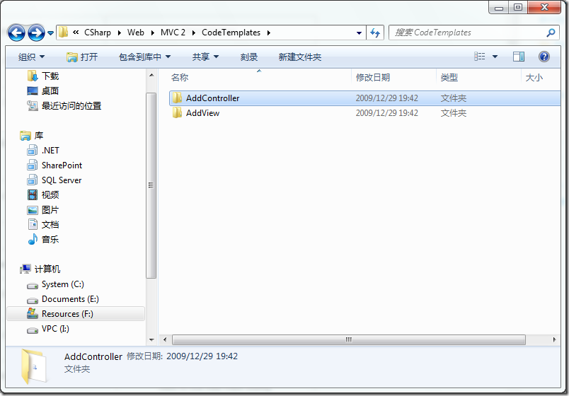
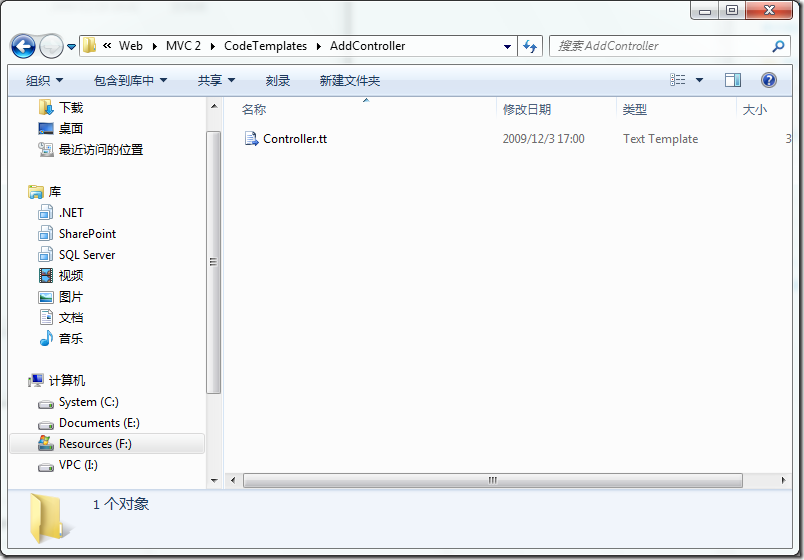
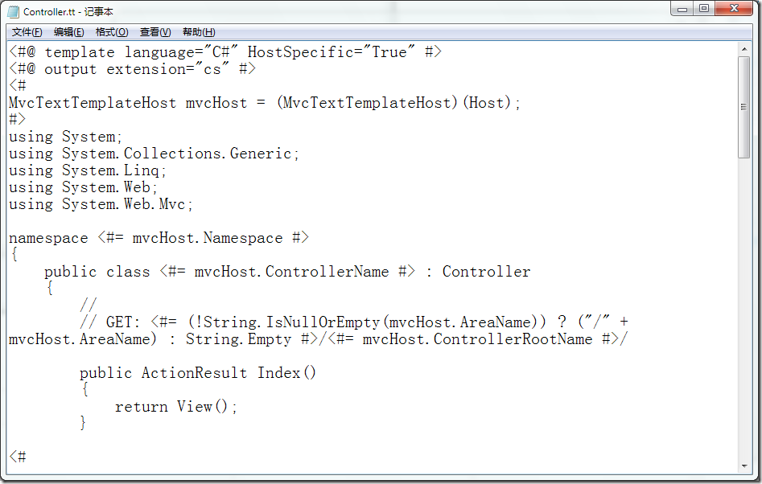

# T4 Templates: A Quick-Start Guide for ASP.NET MVC Developers 
> 原文发表于 2010-03-03, 地址: http://www.cnblogs.com/chenxizhang/archive/2010/03/03/1676938.html 

本文链接：<http://blogs.msdn.com/webdevtools/archive/2009/01/29/t4-templates-a-quick-start-guide-for-asp-net-mvc-developers.aspx>

  

 简单地说，这是一套业界比较认可的代码生成机制。T4的意思是：[Text Template Transformation Toolkit](http://msdn.microsoft.com/en-us/library/bb126445.aspx)

 MVC使用了T4作为代码生成模板，它的目的是让用户可以定制Controller和View模板。

 这些模板在下面的目录

 F:\Program Files\Microsoft Visual Studio 9.0\Common7\IDE\ItemTemplates\CSharp\Web\MVC 2\CodeTemplates\

  

  

 模板里面的大致如下

  

 那么，在模板中，可以使用的一些特殊变量主要包含什么呢？请看下面的介绍

 ##### Add Controller:

 

| **Property Name** | **Type** | **Description** |
| ItemName | System.String | The name of the Controller class, including the ‘Controller’ suffix |
| NameSpace | System.String | The namespace into which the Controller is being generated |
| ExtraActionMethods | System.Boolean | Indicates whether or not the user checked the option in the Add Controller dialog to get extra action methods |
| ControllerRootName | System.String | The name of the controller class without the ‘Controller’ suffix |

 ##### Add View:

 

| **Property Name** | **Type** | **Description** |
| ItemName | System.String | The name of the view (without extension), as typed in the Add View dialog |
| NameSpace | System.String | The default namespace of the view’s parent folder |
| IsViewUserControl | System.Boolean | Evaluates to true if the user chose a partial view in the Add View dialog |
| IsViewContentPage | System.Boolean | Evaluates to true if the user is creating a view with a master page |
| IsViewPage | System.Boolean | Evaluates to true if the user is creating a regular view page |
| MasterPage | System.String | Path to the master page the user chose in the dialog (to be used only when IsViewContentPage is true) |
| ContentPlaceholder | System.String | Name of the primary content place holder into which the generated content will be placed. This is the content place holder id the user typed into the Add View dialog |
| ContentPlaceHolders | System.Collections.Generic.List<System.String> | A list of all content place holder ID’s in the master page, if a master page was chosen for this view |
| LanguageExtension | System.String | The output file’s extension (including the period) |
| ViewDataTypeGenericString | System.String | This is a string that is used to output the generics clause for the ‘Inherits’ attribute in the view's directive (for strongly-typed views).  Example: “<MyType>” or “(Of MyType)” |
| ViewDataType | System.Type | This is a Type object representing the type to which a strongly-typed view is bound. It can be used to get information on the properties in the type and the like |

  
