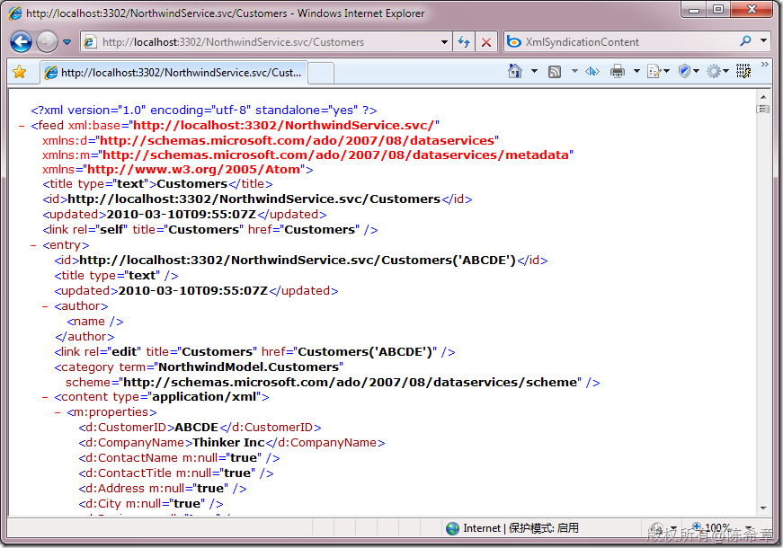
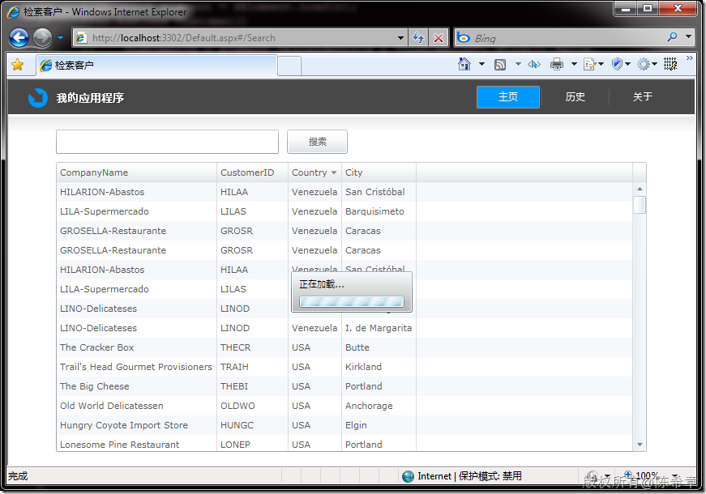

# 在Silverlight中读取ADO.NET数据服务的两种方式 
> 原文发表于 2010-03-10, 地址: http://www.cnblogs.com/chenxizhang/archive/2010/03/10/1682850.html 


1。 数据服务的返回数据格式

 [](http://images.cnblogs.com/cnblogs_com/chenxizhang/WindowsLiveWriter/SilverlightADO.NET_112B5/image_2.png) 

 注意，没有办法通过添加引用的方式调用该服务，估计有安全方面的一些考虑吧

  

 2。因为ADO.NET数据服务是可以直接通过http请求实现，所以下面两个代码都可以完成工作 

 首先准备地址和查询，并且直接通过webclient来发起请求即可


```
            Uri svc = new Uri(Application.Current.Host.Source, "../NorthwindService.svc/Customers()?$orderby=CustomerID desc");

            WebClient proxy = new WebClient();
            proxy.OpenReadCompleted += new OpenReadCompletedEventHandler(proxy\_OpenReadCompleted);
            proxy.OpenReadAsync(svc);
```

```
然后在proxy\_OpenReadCompleted方法中编写如下代码即可
```

```
                XNamespace d = "http://schemas.microsoft.com/ado/2007/08/dataservices";
                XNamespace xmlns = "http://www.w3.org/2005/Atom";
                XDocument doc = XDocument.Load(e.Result);
                var query = from entry in doc.Root.Elements(xmlns + "entry")
                            select new Customer()
                            {
                                CustomerID = entry.Descendants(d + "CustomerID").First().Value,
                                CompanyName = entry.Descendants(d + "CompanyName").First().Value,
                                Country = entry.Descendants(d + "Country").First().Value,
                                City = entry.Descendants(d + "City").First().Value
                            };

                foreach (var item in query)
                {
                    oc.Add(item);
                }

```

.csharpcode, .csharpcode pre
{
 font-size: small;
 color: black;
 font-family: consolas, "Courier New", courier, monospace;
 background-color: #ffffff;
 /*white-space: pre;*/
}
.csharpcode pre { margin: 0em; }
.csharpcode .rem { color: #008000; }
.csharpcode .kwrd { color: #0000ff; }
.csharpcode .str { color: #006080; }
.csharpcode .op { color: #0000c0; }
.csharpcode .preproc { color: #cc6633; }
.csharpcode .asp { background-color: #ffff00; }
.csharpcode .html { color: #800000; }
.csharpcode .attr { color: #ff0000; }
.csharpcode .alt 
{
 background-color: #f4f4f4;
 width: 100%;
 margin: 0em;
}
.csharpcode .lnum { color: #606060; }


.csharpcode, .csharpcode pre
{
 font-size: small;
 color: black;
 font-family: consolas, "Courier New", courier, monospace;
 background-color: #ffffff;
 /*white-space: pre;*/
}
.csharpcode pre { margin: 0em; }
.csharpcode .rem { color: #008000; }
.csharpcode .kwrd { color: #0000ff; }
.csharpcode .str { color: #006080; }
.csharpcode .op { color: #0000c0; }
.csharpcode .preproc { color: #cc6633; }
.csharpcode .asp { background-color: #ffff00; }
.csharpcode .html { color: #800000; }
.csharpcode .attr { color: #ff0000; }
.csharpcode .alt 
{
 background-color: #f4f4f4;
 width: 100%;
 margin: 0em;
}
.csharpcode .lnum { color: #606060; }


另外，因为数据服务返回的数据其实是基于ATOM格式的，所以还可以通过下面的方式解析


```
                XNamespace d = "http://schemas.microsoft.com/ado/2007/08/dataservices";
                XNamespace xmlns = "http://www.w3.org/2005/Atom";
                #region //读取到数据进行解析
                XmlReader reader = XmlReader.Create(e.Result);
                SyndicationFeed feed = SyndicationFeed.Load(reader);
                foreach (var item in feed.Items)
                {
                    XmlSyndicationContent c = (XmlSyndicationContent)item.Content;
                    XmlDictionaryReader r = c.GetReaderAtContent();
                    XElement element = XElement.Load(r);
                    oc.Add(new Customer()
                    {
                        CustomerID = element.Descendants(d + "CustomerID").First().Value,
                        CompanyName = element.Descendants(d + "CompanyName").First().Value,
                        Country = element.Descendants(d + "Country").First().Value,
                        City = element.Descendants(d + "City").First().Value
                    });

                    r.Close();

                    oc.Add(LoadXml<Customer>(r));
                }

                reader.Close();
```


.csharpcode, .csharpcode pre
{
 font-size: small;
 color: black;
 font-family: consolas, "Courier New", courier, monospace;
 background-color: #ffffff;
 /*white-space: pre;*/
}
.csharpcode pre { margin: 0em; }
.csharpcode .rem { color: #008000; }
.csharpcode .kwrd { color: #0000ff; }
.csharpcode .str { color: #006080; }
.csharpcode .op { color: #0000c0; }
.csharpcode .preproc { color: #cc6633; }
.csharpcode .asp { background-color: #ffff00; }
.csharpcode .html { color: #800000; }
.csharpcode .attr { color: #ff0000; }
.csharpcode .alt 
{
 background-color: #f4f4f4;
 width: 100%;
 margin: 0em;
}
.csharpcode .lnum { color: #606060; }


 


大家可以看出两个方法其实有相似之处，因为都涉及到了XML的解析。但他们也有类似的一个问题，就是如果我们的类型属性很多，那么那些代码很繁琐。不是吗？其实是有规律可循的。我一般会用下面的方法来解决问题


```
        /// <summary>
        /// 这是一个静态方法，可以将一段XML转换为一个对象
        /// </summary>
        /// <typeparam name="T"></typeparam>
        /// <param name="xml"></param>
        /// <returns></returns>
        public static T LoadXml<T>(XmlReader reader) 
            where T:new()
        {
            XNamespace d = "http://schemas.microsoft.com/ado/2007/08/dataservices";
            XElement element = XElement.Load(reader);
            T result = new T();
            foreach (var p in typeof(T).GetProperties())
            {
                Type pType = p.PropertyType;
                string pName = p.Name;
                string pValue = element.Descendants(d + pName).First().Value;
                p.SetValue(result, Convert.ChangeType(pValue, pType, null), null);
            }

            reader.Close();
            return result;
        
        }

        /// <summary>
        /// 这是一个静态方法，可以将一段XML转换为一个对象
        /// </summary>
        /// <typeparam name="T"></typeparam>
        /// <param name="xml"></param>
        /// <returns></returns>
        public static T LoadXml<T>(XElement element)
            where T : new()
        {
            XNamespace d = "http://schemas.microsoft.com/ado/2007/08/dataservices";
            T result = new T();
            foreach (var p in typeof(T).GetProperties())
            {
                Type pType = p.PropertyType;
                string pName = p.Name;
                string pValue = element.Descendants(d + pName).First().Value;
                p.SetValue(result, Convert.ChangeType(pValue, pType, null), null);
            }

            return result;

        }
```


.csharpcode, .csharpcode pre
{
 font-size: small;
 color: black;
 font-family: consolas, "Courier New", courier, monospace;
 background-color: #ffffff;
 /*white-space: pre;*/
}
.csharpcode pre { margin: 0em; }
.csharpcode .rem { color: #008000; }
.csharpcode .kwrd { color: #0000ff; }
.csharpcode .str { color: #006080; }
.csharpcode .op { color: #0000c0; }
.csharpcode .preproc { color: #cc6633; }
.csharpcode .asp { background-color: #ffff00; }
.csharpcode .html { color: #800000; }
.csharpcode .attr { color: #ff0000; }
.csharpcode .alt 
{
 background-color: #f4f4f4;
 width: 100%;
 margin: 0em;
}
.csharpcode .lnum { color: #606060; }

这样一来，我们的代码就可以简化成下面这样，看起来不错对吧


```
                var query = from entry in doc.Root.Elements(xmlns + "entry")
                            select LoadXml<Customer>(entry);

```

.csharpcode, .csharpcode pre
{
 font-size: small;
 color: black;
 font-family: consolas, "Courier New", courier, monospace;
 background-color: #ffffff;
 /*white-space: pre;*/
}
.csharpcode pre { margin: 0em; }
.csharpcode .rem { color: #008000; }
.csharpcode .kwrd { color: #0000ff; }
.csharpcode .str { color: #006080; }
.csharpcode .op { color: #0000c0; }
.csharpcode .preproc { color: #cc6633; }
.csharpcode .asp { background-color: #ffff00; }
.csharpcode .html { color: #800000; }
.csharpcode .attr { color: #ff0000; }
.csharpcode .alt 
{
 background-color: #f4f4f4;
 width: 100%;
 margin: 0em;
}
.csharpcode .lnum { color: #606060; }

[](http://images.cnblogs.com/cnblogs_com/chenxizhang/WindowsLiveWriter/SilverlightADO.NET_112B5/image_4.png)

