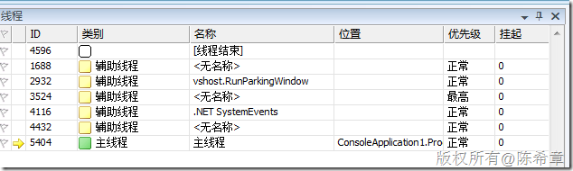

# 默认情况下程序启动后到底是几个线程？ 
> 原文发表于 2010-03-13, 地址: http://www.cnblogs.com/chenxizhang/archive/2010/03/13/1685269.html 


默认情况下，在调试状态下我们可以看到下面的效果

 [](http://images.cnblogs.com/cnblogs_com/chenxizhang/WindowsLiveWriter/3dd1b29a9549_1366F/image_2.png) 

 这里面的线程中

 * 主线程 不必多说，就是程序的主要工作线程
* SystemEvents线程之前探讨过是系统事件触发之后的工作线程
* 另外几个线程，很奇怪。但至少那个vshost.RunParkingWindow，从字面上说可能与vshost有关

  

 接下来，我们尝试禁用掉vshost（下图中禁用“启用Visual Studio宿主进程”）

 [](http://images.cnblogs.com/cnblogs_com/chenxizhang/WindowsLiveWriter/3dd1b29a9549_1366F/image_4.png) 

 再来看线程信息

  [](http://images.cnblogs.com/cnblogs_com/chenxizhang/WindowsLiveWriter/3dd1b29a9549_1366F/image_6.png) 

 整个世界清净多了，现在就剩下了一个线程。这与我们一般意义上讲的单线程程序是相吻合的。

 那么，为什么连那个System Events线程都没有了呢？这是因为我们当前程序并没有监控有关的SystemEvents事件，所以它默认是不会创建这个线程的

 如果我们添加了如下的代码


```
using System;
using System.Threading;
using Microsoft.Win32;

namespace ConsoleApplication1
{
    class Program
    {
        
        static void Main(string[] args)
        {

            Console.WriteLine("Main Thread ID:{0}", Thread.CurrentThread.ManagedThreadId);

            SystemEvents.TimerElapsed += new TimerElapsedEventHandler(SystemEvents\_TimerElapsed);
            SystemEvents.CreateTimer(1000);
            Console.Read();


        }

        static void SystemEvents\_TimerElapsed(object sender, TimerElapsedEventArgs e)
        {
            Console.WriteLine("System Events Thread ID:{0}",Thread.CurrentThread.ManagedThreadId);
        }

    }
}

```

.csharpcode, .csharpcode pre
{
 font-size: small;
 color: black;
 font-family: consolas, "Courier New", courier, monospace;
 background-color: #ffffff;
 /*white-space: pre;*/
}
.csharpcode pre { margin: 0em; }
.csharpcode .rem { color: #008000; }
.csharpcode .kwrd { color: #0000ff; }
.csharpcode .str { color: #006080; }
.csharpcode .op { color: #0000c0; }
.csharpcode .preproc { color: #cc6633; }
.csharpcode .asp { background-color: #ffff00; }
.csharpcode .html { color: #800000; }
.csharpcode .attr { color: #ff0000; }
.csharpcode .alt 
{
 background-color: #f4f4f4;
 width: 100%;
 margin: 0em;
}
.csharpcode .lnum { color: #606060; }

那么，此时就可以看到那个辅助线程了


[](http://images.cnblogs.com/cnblogs_com/chenxizhang/WindowsLiveWriter/3dd1b29a9549_1366F/image_8.png) 


那么，到这里为止，你应该知道了，一个应用程序开起来之后到底会有几个线程了吧？

