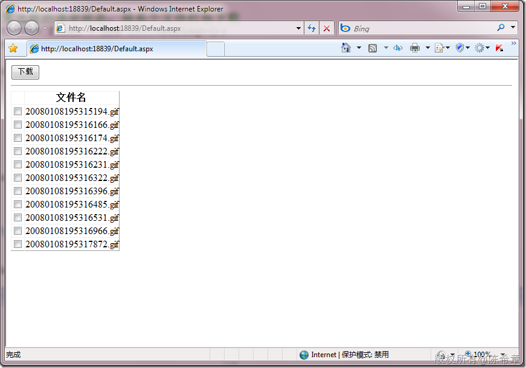
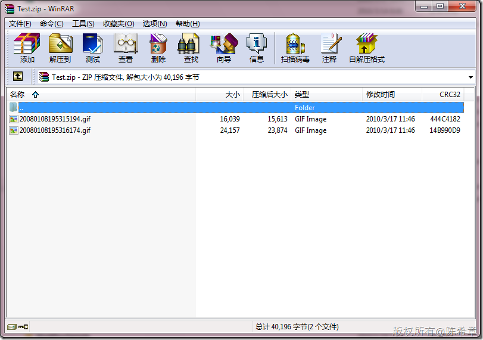

# 如何实现多文件下载（实例） 
> 原文发表于 2010-03-17, 地址: http://www.cnblogs.com/chenxizhang/archive/2010/03/17/1687989.html 


有网友看了我之前喜写的多文件下载的文章，想自己实现一个类似的。但遇到困难。我这里准备了一个可以参考的完整的例子。其实不难，我希望这位朋友还是要把基础功夫学好。

  

 1. 页面


```
<%@ Page Language="C#" AutoEventWireup="true" CodeBehind="Default.aspx.cs" Inherits="MultipleFileDownLoadSample.\_Default" %>

<!DOCTYPE html PUBLIC "-//W3C//DTD XHTML 1.0 Transitional//EN" "http://www.w3.org/TR/xhtml1/DTD/xhtml1-transitional.dtd">
<html xmlns="http://www.w3.org/1999/xhtml">
<head runat="server">
    <title></title>
</head>
<body>
    <form id="form1" runat="server">
    <div>
    <asp:Button ID="btDownload" runat="server" Text="下载" onclick="btDownload\_Click" 
            style="height: 26px" />
    <hr />
    
        <asp:GridView ID="gv" runat="server" AutoGenerateColumns="false">
            <Columns>
                <asp:TemplateField>
                    <ItemTemplate>
                        <asp:CheckBox ID="chk" runat="server" />
                    </ItemTemplate>
                </asp:TemplateField>
                <asp:TemplateField HeaderText="文件名">
                    <ItemTemplate>
                        <asp:Label ID="file" runat="server" Text='<%# Eval("FileName") %>'></asp:Label>
                    </ItemTemplate>
                </asp:TemplateField>
            </Columns>
        </asp:GridView>
    </div>
    </form>
</body>
</html>

```

.csharpcode, .csharpcode pre
{
 font-size: small;
 color: black;
 font-family: consolas, "Courier New", courier, monospace;
 background-color: #ffffff;
 /*white-space: pre;*/
}
.csharpcode pre { margin: 0em; }
.csharpcode .rem { color: #008000; }
.csharpcode .kwrd { color: #0000ff; }
.csharpcode .str { color: #006080; }
.csharpcode .op { color: #0000c0; }
.csharpcode .preproc { color: #cc6633; }
.csharpcode .asp { background-color: #ffff00; }
.csharpcode .html { color: #800000; }
.csharpcode .attr { color: #ff0000; }
.csharpcode .alt 
{
 background-color: #f4f4f4;
 width: 100%;
 margin: 0em;
}
.csharpcode .lnum { color: #606060; }

 


2. 代码


```
using System;
using System.Collections.Generic;
using System.Linq;
using System.Web;
using System.Web.UI;
using System.Web.UI.WebControls;

using System.IO;
using ICSharpCode.SharpZipLib.Zip;

namespace MultipleFileDownLoadSample
{
    public partial class \_Default : System.Web.UI.Page
    {
        protected void Page\_Load(object sender, EventArgs e)
        {
            if (!IsPostBack) {
                DataBind();
            }
        }
        public override void DataBind()
        {
            //读取images目录下面的文件列表，绑定到GridView上面
            var query = from item in Directory.GetFiles(Server.MapPath("~/images"))
                        select new
                        {
                            FileName = Path.GetFileName(item)
                        };

            gv.DataSource = query;
            gv.DataBind();
        }


        private void Download(IEnumerable<string> files,string zipFileName ){
            //根据所选文件打包下载
            MemoryStream ms = new MemoryStream();
            byte[] buffer = null;

            using (ZipFile file = ZipFile.Create(ms))
            {
                file.BeginUpdate();
                file.NameTransform = new MyNameTransfom();//通过这个名称格式化器，可以将里面的文件名进行一些处理。默认情况下，会自动根据文件的路径在zip中创建有关的文件夹。

                foreach (var item in files)
                {
                    file.Add(Server.MapPath(string.Format("~/images/{0}",item)));
                }


                file.CommitUpdate();

                buffer = new byte[ms.Length];
                ms.Position = 0;
                ms.Read(buffer, 0, buffer.Length);
            }


            Response.AddHeader("content-disposition", "attachment;filename="+zipFileName);
            Response.BinaryWrite(buffer);
            Response.Flush();
            Response.End();
        }

        protected void btDownload\_Click(object sender, EventArgs e)
        {
            //根据复选框的选中状态，将多个文件打包下载
            List<string> files = new List<string>();
            foreach (GridViewRow item in gv.Rows)
            {
                var chk = item.FindControl("chk") as CheckBox;
                if (chk.Checked)
                {
                    var label = item.FindControl("file") as Label;
                    files.Add(label.Text);
                }
            }

            Download(files, "Test.zip");
        }
    }

    public class MyNameTransfom : ICSharpCode.SharpZipLib.Core.INameTransform
    {

        #region INameTransform 成员

        public string TransformDirectory(string name)
        {
            return null;
        }

        public string TransformFile(string name)
        {
            return Path.GetFileName(name);
        }

        #endregion
    }
}

```

.csharpcode, .csharpcode pre
{
 font-size: small;
 color: black;
 font-family: consolas, "Courier New", courier, monospace;
 background-color: #ffffff;
 /*white-space: pre;*/
}
.csharpcode pre { margin: 0em; }
.csharpcode .rem { color: #008000; }
.csharpcode .kwrd { color: #0000ff; }
.csharpcode .str { color: #006080; }
.csharpcode .op { color: #0000c0; }
.csharpcode .preproc { color: #cc6633; }
.csharpcode .asp { background-color: #ffff00; }
.csharpcode .html { color: #800000; }
.csharpcode .attr { color: #ff0000; }
.csharpcode .alt 
{
 background-color: #f4f4f4;
 width: 100%;
 margin: 0em;
}
.csharpcode .lnum { color: #606060; }

 


3. 效果


[](http://images.cnblogs.com/cnblogs_com/chenxizhang/WindowsLiveWriter/89feafbd55cf_A737/image_2.png) 


[](http://images.cnblogs.com/cnblogs_com/chenxizhang/WindowsLiveWriter/89feafbd55cf_A737/image_4.png) 


 


4. 源文件


[MultipleFileDownLoadSample.rar](http://files.cnblogs.com/chenxizhang/MultipleFileDownLoadSample.rar "MultipleFileDownLoadSample.rar")

