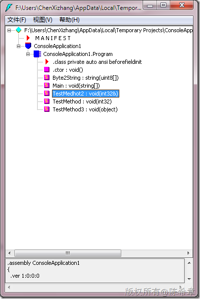
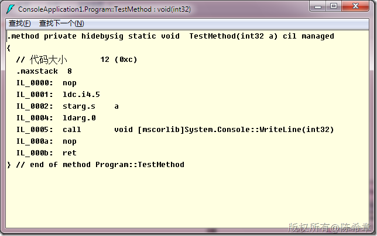
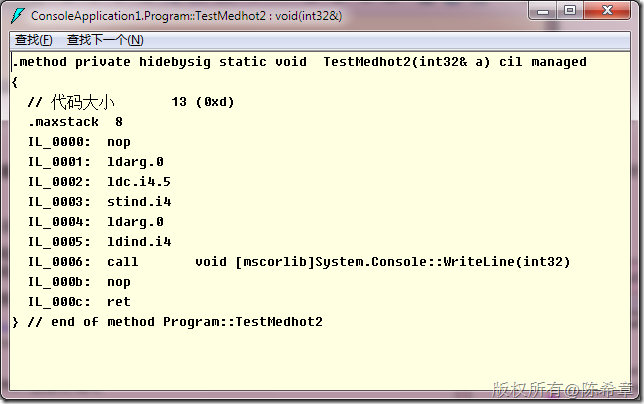
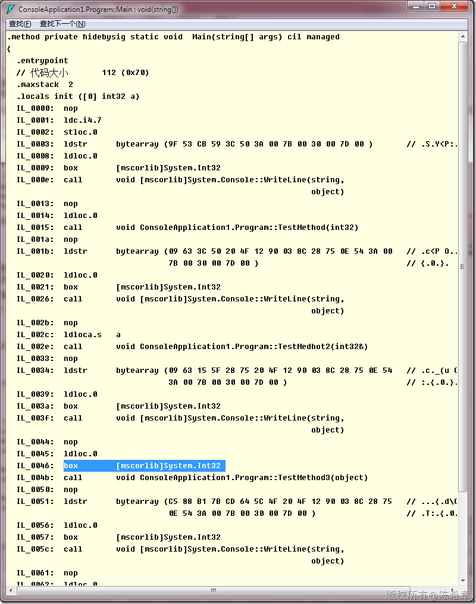
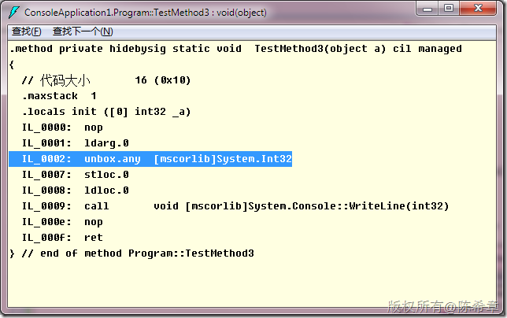

# 再谈CLR：值类型按照引用传递（以及与装箱拆箱的区别） 
> 原文发表于 2010-03-19, 地址: http://www.cnblogs.com/chenxizhang/archive/2010/03/19/1689673.html 


**经常被问到这样的问题：值类型能不能按引用传递？传递之后又是什么样的处理方式**

  

  当然是可以的，不管是现在还是以前都可以。我们来看看下面两个方法的区别


```
        static void TestMethod(int a) {
            a = 5;
            Console.WriteLine(a);
        }

        static void TestMedhot2(ref int a) {
            a = 5;
            Console.WriteLine(a);
        }

```

.csharpcode, .csharpcode pre
{
 font-size: small;
 color: black;
 font-family: consolas, "Courier New", courier, monospace;
 background-color: #ffffff;
 /*white-space: pre;*/
}
.csharpcode pre { margin: 0em; }
.csharpcode .rem { color: #008000; }
.csharpcode .kwrd { color: #0000ff; }
.csharpcode .str { color: #006080; }
.csharpcode .op { color: #0000c0; }
.csharpcode .preproc { color: #cc6633; }
.csharpcode .asp { background-color: #ffff00; }
.csharpcode .html { color: #800000; }
.csharpcode .attr { color: #ff0000; }
.csharpcode .alt 
{
 background-color: #f4f4f4;
 width: 100%;
 margin: 0em;
}
.csharpcode .lnum { color: #606060; }

[](http://images.cnblogs.com/cnblogs_com/chenxizhang/WindowsLiveWriter/CLR_A1D5/image_2.png) 


我们知道int是值类型，在第一个方法中，我们按照默认的方式进行传递，其实就是所谓的按值传递。


[](http://images.cnblogs.com/cnblogs_com/chenxizhang/WindowsLiveWriter/CLR_A1D5/image_4.png) 


我们看到在IL\_0002这个地方，是把a这个变量压入了栈。也就是说，此时在栈中是有一个a变量代表的值的 ，例如5


 


然后我们再来看另外一个方法。首先从直观上看，int32&和int32肯定是有区别的，我们都知道在C++中，&表示指针的意思


[](http://images.cnblogs.com/cnblogs_com/chenxizhang/WindowsLiveWriter/CLR_A1D5/image_6.png) 


然后，我们并没有看到它将a这个变量压入栈中。那么他到底是做了什么事情呢


- ldind.* : 间接载入指令，通过指针获取数据。 
- stind.* : 间接存储指令，通过指针存储数据。 
注意，虽然按照引用传递，但这个与“装箱和拆箱”还不是一回事情。什么时候发生装箱拆箱呢？就是将值类型转换为了引用类型（一般指Object）.假设我们如下的方法


```
        static void TestMethod3(object a) {
            Console.WriteLine(a);
        }
```

.csharpcode, .csharpcode pre
{
 font-size: small;
 color: black;
 font-family: consolas, "Courier New", courier, monospace;
 background-color: #ffffff;
 /*white-space: pre;*/
}
.csharpcode pre { margin: 0em; }
.csharpcode .rem { color: #008000; }
.csharpcode .kwrd { color: #0000ff; }
.csharpcode .str { color: #006080; }
.csharpcode .op { color: #0000c0; }
.csharpcode .preproc { color: #cc6633; }
.csharpcode .asp { background-color: #ffff00; }
.csharpcode .html { color: #800000; }
.csharpcode .attr { color: #ff0000; }
.csharpcode .alt 
{
 background-color: #f4f4f4;
 width: 100%;
 margin: 0em;
}
.csharpcode .lnum { color: #606060; }

然后，我们在Main里面去调用


```
            int a = 7;
            TestMethod(a);
            TestMedhot2(ref a);
            TestMethod3(a);
```

.csharpcode, .csharpcode pre
{
 font-size: small;
 color: black;
 font-family: consolas, "Courier New", courier, monospace;
 background-color: #ffffff;
 /*white-space: pre;*/
}
.csharpcode pre { margin: 0em; }
.csharpcode .rem { color: #008000; }
.csharpcode .kwrd { color: #0000ff; }
.csharpcode .str { color: #006080; }
.csharpcode .op { color: #0000c0; }
.csharpcode .preproc { color: #cc6633; }
.csharpcode .asp { background-color: #ffff00; }
.csharpcode .html { color: #800000; }
.csharpcode .attr { color: #ff0000; }
.csharpcode .alt 
{
 background-color: #f4f4f4;
 width: 100%;
 margin: 0em;
}
.csharpcode .lnum { color: #606060; }

这里调用TestMethod3的时候会发生装箱



[](http://images.cnblogs.com/cnblogs_com/chenxizhang/WindowsLiveWriter/CLR_A1D5/image_10.png) 


 

- 也就是说，如果仅仅是按引用传递参数的话，那么不会发生装箱和拆箱的问题。也就是说，它并没有产生另外一份数据，而是用指针的方式指向了参数所代表的那份数据而已（这份数据可能在栈上面，也可能在堆上面），但总之是一个指针引用，所以说，按照引用传递的情况，我们如果在TestMetho2中修改了a的值，那么后续访问a这个变量，它的值就确实被改变了。


思考一下：为什么说可能在堆上面呢？


下面有一个完整的例子


```
using System;

namespace ConsoleApplication1
{
    class Program
    {
        static void Main(string[] args)
        {


            int a = 7;
            Console.WriteLine("原始值:{0}",a);
            TestMethod(a);
            Console.WriteLine("按值传递调用后:{0}", a);
            
            TestMedhot2(ref a);
            Console.WriteLine("按引用传递调用后:{0}", a);
            
            TestMethod3(a);//这里发生装箱
            Console.WriteLine("装箱操作传递调用后:{0}", a);
            


            Console.WriteLine(a);

            Console.Read();
        }


        static void TestMethod(int a) {
            a = 5;
            Console.WriteLine(a);
        }

        static void TestMedhot2(ref int a) {
            a = 5;
            Console.WriteLine(a);
        }

        static void TestMethod3(object a) {
            int \_a = (int)a;//这里发生拆箱
            Console.WriteLine(\_a);
        }


    }
}

```

.csharpcode, .csharpcode pre
{
 font-size: small;
 color: black;
 font-family: consolas, "Courier New", courier, monospace;
 background-color: #ffffff;
 /*white-space: pre;*/
}
.csharpcode pre { margin: 0em; }
.csharpcode .rem { color: #008000; }
.csharpcode .kwrd { color: #0000ff; }
.csharpcode .str { color: #006080; }
.csharpcode .op { color: #0000c0; }
.csharpcode .preproc { color: #cc6633; }
.csharpcode .asp { background-color: #ffff00; }
.csharpcode .html { color: #800000; }
.csharpcode .attr { color: #ff0000; }
.csharpcode .alt 
{
 background-color: #f4f4f4;
 width: 100%;
 margin: 0em;
}
.csharpcode .lnum { color: #606060; }
