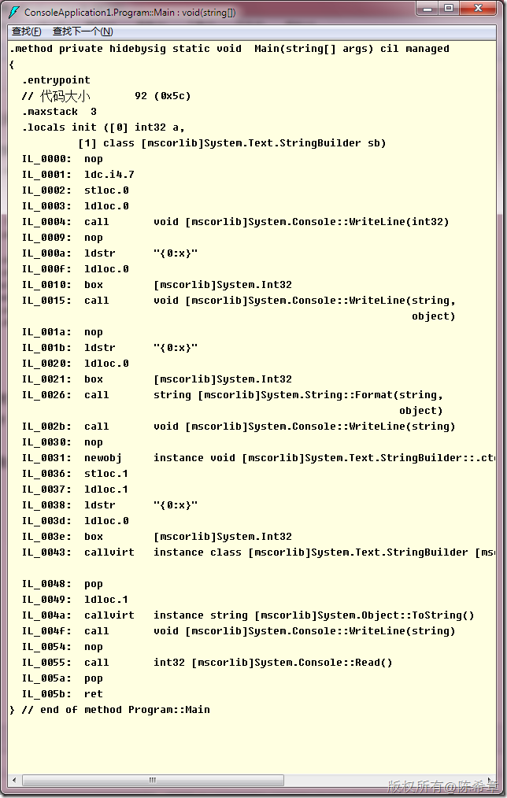
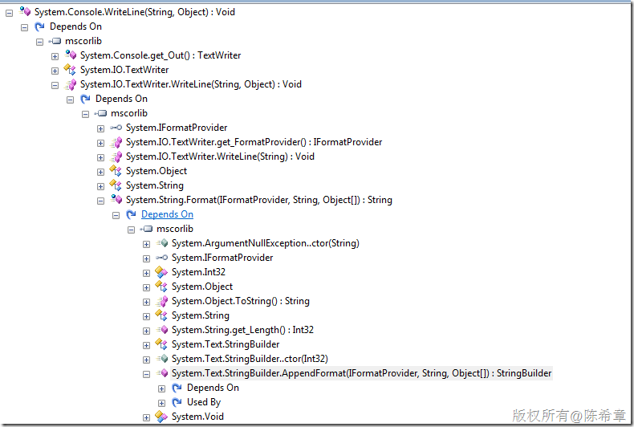
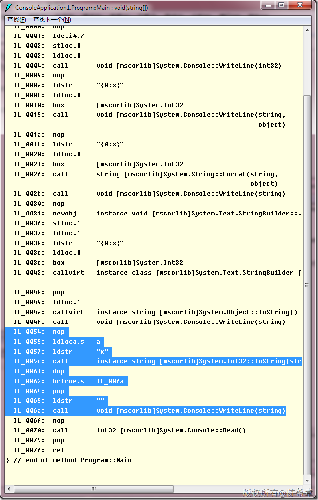
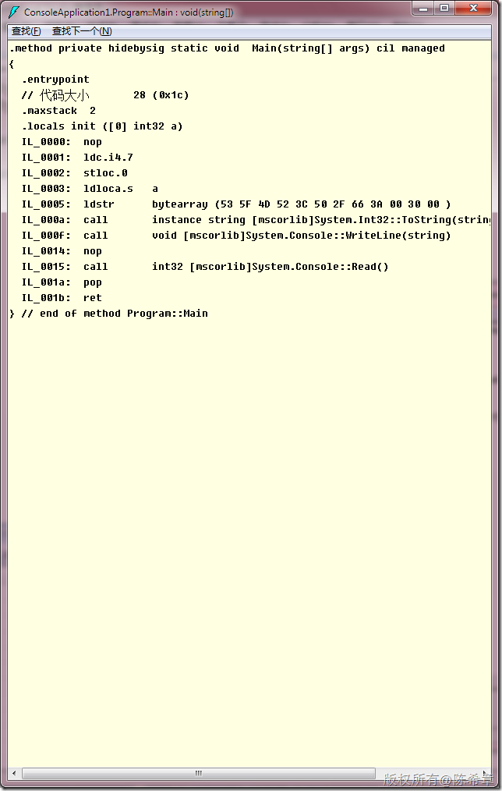

# 再谈CLR：无法避免的装箱 
> 原文发表于 2010-03-19, 地址: http://www.cnblogs.com/chenxizhang/archive/2010/03/19/1689699.html 


大家可以思考下面的代码


```
        static void Main(string[] args)
        {


            int a = 7;
            Console.WriteLine(a);

            Console.WriteLine("{0:x}", a);
            Console.WriteLine(string.Format("{0:x}", a));
            StringBuilder sb = new StringBuilder();
            sb.AppendFormat("{0:x}", a);
            Console.WriteLine(sb.ToString());
            Console.Read();
        }

```


.csharpcode, .csharpcode pre
{
 font-size: small;
 color: black;
 font-family: consolas, "Courier New", courier, monospace;
 background-color: #ffffff;
 /*white-space: pre;*/
}
.csharpcode pre { margin: 0em; }
.csharpcode .rem { color: #008000; }
.csharpcode .kwrd { color: #0000ff; }
.csharpcode .str { color: #006080; }
.csharpcode .op { color: #0000c0; }
.csharpcode .preproc { color: #cc6633; }
.csharpcode .asp { background-color: #ffff00; }
.csharpcode .html { color: #800000; }
.csharpcode .attr { color: #ff0000; }
.csharpcode .alt 
{
 background-color: #f4f4f4;
 width: 100%;
 margin: 0em;
}
.csharpcode .lnum { color: #606060; }


有几个问题：


1. 这几个方法哪些会发生装箱，哪些不会？


2. 他们有什么区别吗？


 


要了解这两点，可以通过下面的图形


[](http://images.cnblogs.com/cnblogs_com/chenxizhang/WindowsLiveWriter/CLR_AA7E/image_2.png)
所以，答案就是，只有第一种没有发生装箱操作。其他三种都发生了。
而后面三种，本质上有差别吗？
我们看到最后一种，是有callvirt指令的，也就是说它创建了一个stringbuilder对象，这是引用类型的。
他们真的有差别吗？
其实没有差别，如果我们通过工具查看源代码就会知道，Console.WriteLine方法，其实是调用了TextWriter.WriteLine方法，而这个又调用里的String.Format方法 ，而这个又调用了stringbuilder的AppendFormat方法
[](http://images.cnblogs.com/cnblogs_com/chenxizhang/WindowsLiveWriter/CLR_AA7E/image_4.png)
那么，为什么需要谈这些？我们的问题是：是否可以完全避免装箱呢？答案是：可以，但代价不见得小
我们为什么会用strnig.Format就是因为要拼接字符串。那么能不能直接拼接呢？
```
            Console.WriteLine("" + a.ToString("x"));

```

.csharpcode, .csharpcode pre
{
 font-size: small;
 color: black;
 font-family: consolas, "Courier New", courier, monospace;
 background-color: #ffffff;
 /*white-space: pre;*/
}
.csharpcode pre { margin: 0em; }
.csharpcode .rem { color: #008000; }
.csharpcode .kwrd { color: #0000ff; }
.csharpcode .str { color: #006080; }
.csharpcode .op { color: #0000c0; }
.csharpcode .preproc { color: #cc6633; }
.csharpcode .asp { background-color: #ffff00; }
.csharpcode .html { color: #800000; }
.csharpcode .attr { color: #ff0000; }
.csharpcode .alt 
{
 background-color: #f4f4f4;
 width: 100%;
 margin: 0em;
}
.csharpcode .lnum { color: #606060; }

[](http://images.cnblogs.com/cnblogs_com/chenxizhang/WindowsLiveWriter/CLR_AA7E/image_6.png)
看起来确实没有了装箱对吧，但其实因为string本身不可变长，此时仍然会产生两个string
  那么下面这个方式是否可行呢
```
            Console.WriteLine(a.ToString("当前值是:0"));

```

.csharpcode, .csharpcode pre
{
 font-size: small;
 color: black;
 font-family: consolas, "Courier New", courier, monospace;
 background-color: #ffffff;
 /*white-space: pre;*/
}
.csharpcode pre { margin: 0em; }
.csharpcode .rem { color: #008000; }
.csharpcode .kwrd { color: #0000ff; }
.csharpcode .str { color: #006080; }
.csharpcode .op { color: #0000c0; }
.csharpcode .preproc { color: #cc6633; }
.csharpcode .asp { background-color: #ffff00; }
.csharpcode .html { color: #800000; }
.csharpcode .attr { color: #ff0000; }
.csharpcode .alt 
{
 background-color: #f4f4f4;
 width: 100%;
 margin: 0em;
}
.csharpcode .lnum { color: #606060; }

[](http://images.cnblogs.com/cnblogs_com/chenxizhang/WindowsLiveWriter/CLR_AA7E/image_8.png)
      如果大家有兴趣，可以看看这个AppendFormat方法
```
public StringBuilder AppendFormat(IFormatProvider provider, string format, params object[] args)
{
    int num3;
    if ((format == null) || (args == null))
    {
        throw new ArgumentNullException((format == null) ? "format" : "args");
    }
    char[] chArray = format.ToCharArray(0, format.Length);
    int index = 0;
    int length = chArray.Length;
    char ch = '\0';
    ICustomFormatter formatter = null;
    if (provider != null)
    {
        formatter = (ICustomFormatter) provider.GetFormat(typeof(ICustomFormatter));
    }
Label\_004E:
    num3 = index;
    int num4 = index;
    while (index < length)
    {
        ch = chArray[index];
        index++;
        if (ch == '}')
        {
            if ((index < length) && (chArray[index] == '}'))
            {
                index++;
            }
            else
            {
                FormatError();
            }
        }
        if (ch == '{')
        {
            if ((index < length) && (chArray[index] == '{'))
            {
                index++;
            }
            else
            {
                index--;
                break;
            }
        }
        chArray[num4++] = ch;
    }
    if (num4 > num3)
    {
        this.Append(chArray, num3, num4 - num3);
    }
    if (index == length)
    {
        return this;
    }
    index++;
    if (((index == length) || ((ch = chArray[index]) < '0')) || (ch > '9'))
    {
        FormatError();
    }
    int num5 = 0;
    do
    {
        num5 = ((num5 * 10) + ch) - 0x30;
        index++;
        if (index == length)
        {
            FormatError();
        }
        ch = chArray[index];
    }
    while (((ch >= '0') && (ch <= '9')) && (num5 < 0xf4240));
    if (num5 >= args.Length)
    {
        throw new FormatException(Environment.GetResourceString("Format\_IndexOutOfRange"));
    }
    while ((index < length) && ((ch = chArray[index]) == ' '))
    {
        index++;
    }
    bool flag = false;
    int num6 = 0;
    if (ch == ',')
    {
        index++;
        while ((index < length) && (chArray[index] == ' '))
        {
            index++;
        }
        if (index == length)
        {
            FormatError();
        }
        ch = chArray[index];
        if (ch == '-')
        {
            flag = true;
            index++;
            if (index == length)
            {
                FormatError();
            }
            ch = chArray[index];
        }
        if ((ch < '0') || (ch > '9'))
        {
            FormatError();
        }
        do
        {
            num6 = ((num6 * 10) + ch) - 0x30;
            index++;
            if (index == length)
            {
                FormatError();
            }
            ch = chArray[index];
        }
        while (((ch >= '0') && (ch <= '9')) && (num6 < 0xf4240));
    }
    while ((index < length) && ((ch = chArray[index]) == ' '))
    {
        index++;
    }
    object arg = args[num5];
    string str = null;
    if (ch == ':')
    {
        index++;
        num3 = index;
        num4 = index;
        while (true)
        {
            if (index == length)
            {
                FormatError();
            }
            ch = chArray[index];
            index++;
            switch (ch)
            {
                case '{':
                    if ((index < length) && (chArray[index] == '{'))
                    {
                        index++;
                    }
                    else
                    {
                        FormatError();
                    }
                    break;

                case '}':
                    if ((index < length) && (chArray[index] == '}'))
                    {
                        index++;
                    }
                    else
                    {
                        index--;
                        if (num4 > num3)
                        {
                            str = new string(chArray, num3, num4 - num3);
                        }
                        goto Label\_0253;
                    }
                    break;
            }
            chArray[num4++] = ch;
        }
    }
Label\_0253:
    if (ch != '}')
    {
        FormatError();
    }
    index++;
    string str2 = null;
    if (formatter != null)
    {
        str2 = formatter.Format(str, arg, provider);
    }
    if (str2 == null)
    {
        if (arg is IFormattable)
        {
            str2 = ((IFormattable) arg).ToString(str, provider);
        }
        else if (arg != null)
        {
            str2 = arg.ToString();
        }
    }
    if (str2 == null)
    {
        str2 = string.Empty;
    }
    int repeatCount = num6 - str2.Length;
    if (!flag && (repeatCount > 0))
    {
        this.Append(' ', repeatCount);
    }
    this.Append(str2);
    if (flag && (repeatCount > 0))
    {
        this.Append(' ', repeatCount);
    }
    goto Label\_004E;
}

 

 

```

.csharpcode, .csharpcode pre
{
 font-size: small;
 color: black;
 font-family: consolas, "Courier New", courier, monospace;
 background-color: #ffffff;
 /*white-space: pre;*/
}
.csharpcode pre { margin: 0em; }
.csharpcode .rem { color: #008000; }
.csharpcode .kwrd { color: #0000ff; }
.csharpcode .str { color: #006080; }
.csharpcode .op { color: #0000c0; }
.csharpcode .preproc { color: #cc6633; }
.csharpcode .asp { background-color: #ffff00; }
.csharpcode .html { color: #800000; }
.csharpcode .attr { color: #ff0000; }
.csharpcode .alt 
{
 background-color: #f4f4f4;
 width: 100%;
 margin: 0em;
}
.csharpcode .lnum { color: #606060; }


