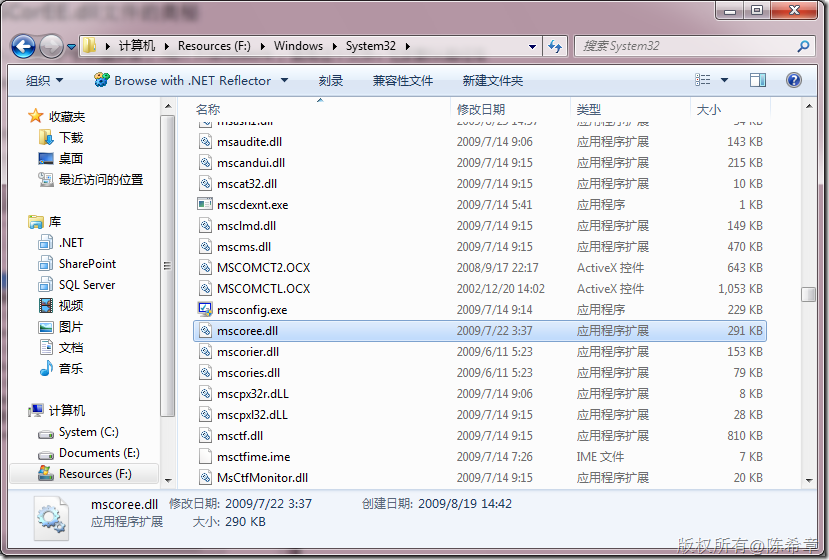
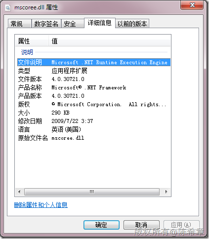

# 再谈CLR：MSCorEE.dll文件的奥秘 
> 原文发表于 2010-03-19, 地址: http://www.cnblogs.com/chenxizhang/archive/2010/03/19/1690097.html 

这是一个特殊的文件，如果用户的机器安装了.NET Framework ，就有这个文件。它的默认路径在

 %systemdrive%\system32

  

 而它就是CLR的运行引擎

 

