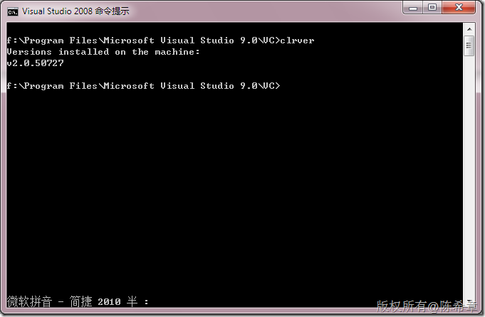
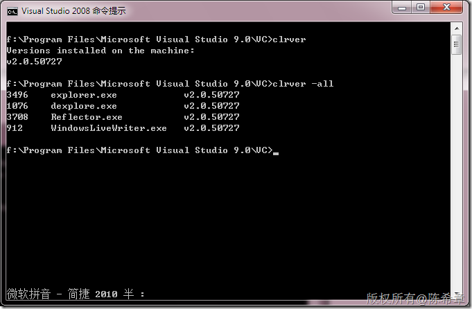

# 再谈CLR：CLR的版本 
> 原文发表于 2010-03-19, 地址: http://www.cnblogs.com/chenxizhang/archive/2010/03/19/1690100.html 

CLR的版本问题有点让人迷惑。很多朋友甚至没有意识到这个问题，大家经常看到Framework在变版本，例如我们现在用过的版本有

 1. 1.0
2. 1.1
3. 2.0
4. 3.0
5. 3.5

 但要注意的是，Framework 的版本变化并不代表CLR的版本变化，事实上，现在虽然我们用的Framework 是3.5，但是它所用的CLR版本仍然是2.0

 有什么工具可以看到这些信息呢？

 这里介绍一个工具 CLRVer.exe

  

 这个工具还有一个有意思的选项，-all ，这个选项可以帮助我们列出当前正在运行的进程中所用到的版本号

  

   

 值得一提的是，有些网站程序，需要检测用户是否安装了某个版本的框架，那么可以知道，这需要通过javascript来做到

 下面是一个例子

 [http://www.cnblogs.com/gaohades/archive/2007/04/27/729331.html](http://www.cnblogs.com/gaohades/archive/2007/04/27/729331.html "http://www.cnblogs.com/gaohades/archive/2007/04/27/729331.html")

 但应该说，这种做法不是很合理，因为只有IE的User-Agent里面才有CLR的信息，而firefox或者其他的就没有

