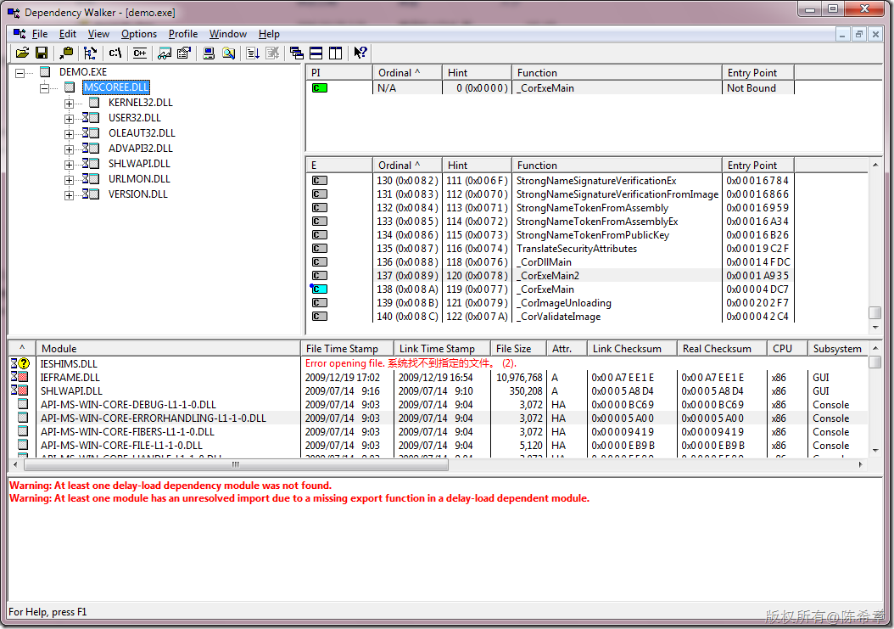
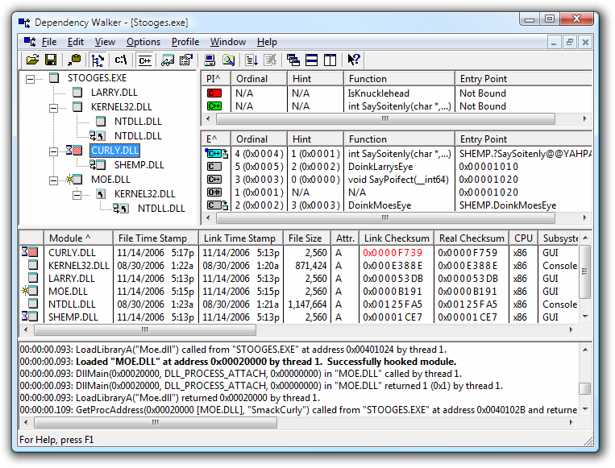

# 再谈CLR：查看程序集的依赖关系 
> 原文发表于 2010-03-19, 地址: http://www.cnblogs.com/chenxizhang/archive/2010/03/19/1690143.html 

depends.exe，原先在vs2005是提供的，但是vs2008中却没有了。下面的网站提供了单独下载

  

 从这个图，更加可以看出来.NET的应用程序对mscoree.dll（.NET Framework Execute Engine)的依赖性 。

  

  

 [http://dependencywalker.com/](http://dependencywalker.com/ "http://dependencywalker.com/")

 Dependency Walker is a free utility that scans any 32-bit or 64-bit Windows module (exe, dll, ocx, sys, etc.) and builds a hierarchical tree diagram of all dependent modules. For each module found, it lists all the functions that are exported by that module, and which of those functions are actually being called by other modules. Another view displays the minimum set of required files, along with detailed information about each file including a full path to the file, base address, version numbers, machine type, debug information, and more.  
Dependency Walker is also very useful for troubleshooting system errors related to loading and executing modules. Dependency Walker detects many common application problems such as missing modules, invalid modules, import/export mismatches, circular dependency errors, mismatched machine types of modules, and module initialization failures.  
Dependency Walker runs on Windows 95, 98, Me, NT, 2000, XP, 2003, and Vista. It can process any 32-bit or 64-bit Windows module, including ones designed for Windows CE. It can be run as graphical application or as a console application. Dependency Walker handles all types of module dependencies, including implicit, explicit (dynamic / runtime), forwarded, delay-loaded, and injected. A detailed help is included. Dependency Walker is completely free to use. However, you may not profit from the distribution of it, nor may you bundle it with another product. 

