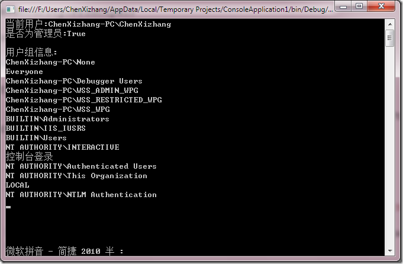

# 用户身份验证之Windows验证 
> 原文发表于 2010-03-20, 地址: http://www.cnblogs.com/chenxizhang/archive/2010/03/20/1690315.html 


下面的代码演示了如何在程序中读取用户的Windows身份信息


```
using System;
using System.Collections.Generic;
using System.Linq;
using System.Text;
using System.Threading;

using System.Security.Principal;

namespace ConsoleApplication1
{
    class Program
    {
        static void Main(string[] args)
        {
            AppDomain.CurrentDomain.SetPrincipalPolicy(System.Security.Principal.PrincipalPolicy.WindowsPrincipal);
            //打印当前用户的用户名
            Console.WriteLine("当前用户:{0}",
                Thread.CurrentPrincipal.Identity.Name);
            //判断当前用户是否属于某个windows组
            Console.WriteLine("是否为管理员:{0}",
                Thread.CurrentPrincipal.IsInRole("BuiltIn\\Administrators"));

            WindowsPrincipal p =(WindowsPrincipal) Thread.CurrentPrincipal;
            WindowsIdentity i = p.Identity as WindowsIdentity;

            //打印当前用户的windows组信息
            Console.WriteLine("{0}用户组信息:",Environment.NewLine);
            foreach (var item in i.Groups.Translate(typeof(NTAccount)))
            {
                Console.WriteLine(item);
            }

            Console.Read();
        }
    }
}

```

.csharpcode, .csharpcode pre
{
 font-size: small;
 color: black;
 font-family: consolas, "Courier New", courier, monospace;
 background-color: #ffffff;
 /*white-space: pre;*/
}
.csharpcode pre { margin: 0em; }
.csharpcode .rem { color: #008000; }
.csharpcode .kwrd { color: #0000ff; }
.csharpcode .str { color: #006080; }
.csharpcode .op { color: #0000c0; }
.csharpcode .preproc { color: #cc6633; }
.csharpcode .asp { background-color: #ffff00; }
.csharpcode .html { color: #800000; }
.csharpcode .attr { color: #ff0000; }
.csharpcode .alt 
{
 background-color: #f4f4f4;
 width: 100%;
 margin: 0em;
}
.csharpcode .lnum { color: #606060; }

 


[](http://images.cnblogs.com/cnblogs_com/chenxizhang/WindowsLiveWriter/Windows_4454/image_2.png)

