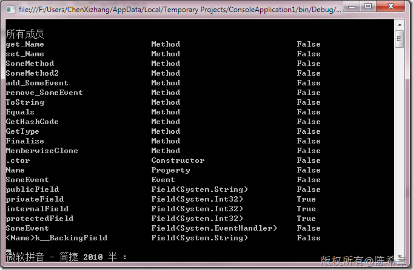

# 通过反射得到类型的所有成员 
> 原文发表于 2010-03-20, 地址: http://www.cnblogs.com/chenxizhang/archive/2010/03/20/1690579.html 


下面代码演示了如何通过反射技术得到某个类型的所有成员。需要注意的是，默认情况下，GetMembers方式是只能读取公有成员的，如果需要读取所有的成员，则需要用下面的方式


```
using System;
using System.Collections.Generic;
using System.Linq;
using System.Text;
using System.Reflection;

namespace ConsoleApplication1
{
    class Program
    {
        static void Main(string[] args)
        {
            Type t = typeof(Employee);


            Console.WriteLine();
            //下面的方法打印所有的Member
            Console.WriteLine("所有公有成员");
            foreach (var item in t.GetMembers(BindingFlags.Public|BindingFlags.NonPublic|BindingFlags.Instance))
            {
                if (item.MemberType.ToString() == "Field")
                {
                    FieldInfo field = (FieldInfo)item;
                    Console.WriteLine(
                        "{0}{1}{2}",
                        field.Name.PadRight(30),
                        string.Format("Field({0})", field.FieldType.ToString()).PadRight(30),
                        field.FieldType.IsValueType);
                }
                else
                {

                    Console.WriteLine(
                        "{0}{1}{2}",
                        item.Name.PadRight(30),
                        item.MemberType.ToString().PadRight(30),
                        item.GetType().IsValueType
                        );
                }
            }


            Console.Read();
        }
    }

    class Employee {
        public string publicField;
        private int privateField;

        internal int internalField;
        protected int protectedField;


        public string Name { get; set; }

        public void SomeMethod() { }
        private void SomeMethod2() { }

        public event EventHandler SomeEvent;

        public static int staticField;

    }
}

```


.csharpcode, .csharpcode pre
{
 font-size: small;
 color: black;
 font-family: consolas, "Courier New", courier, monospace;
 background-color: #ffffff;
 /*white-space: pre;*/
}
.csharpcode pre { margin: 0em; }
.csharpcode .rem { color: #008000; }
.csharpcode .kwrd { color: #0000ff; }
.csharpcode .str { color: #006080; }
.csharpcode .op { color: #0000c0; }
.csharpcode .preproc { color: #cc6633; }
.csharpcode .asp { background-color: #ffff00; }
.csharpcode .html { color: #800000; }
.csharpcode .attr { color: #ff0000; }
.csharpcode .alt 
{
 background-color: #f4f4f4;
 width: 100%;
 margin: 0em;
}
.csharpcode .lnum { color: #606060; }


[](http://images.cnblogs.com/cnblogs_com/chenxizhang/WindowsLiveWriter/927d1e34a46d_10144/image_6.png)

