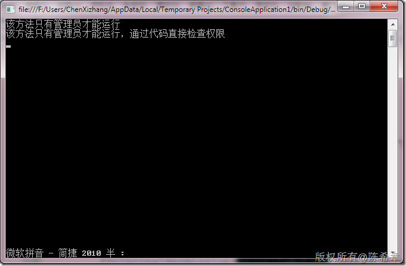

# 如何在代码中执行应用程序安全性检查（声明式和代码式） 
> 原文发表于 2010-03-20, 地址: http://www.cnblogs.com/chenxizhang/archive/2010/03/20/1690584.html 


这是今天课堂上一个例子，讲解了如何通过代码方式和声明式的方式检查应用程序的安全性。


```
using System;
using System.Collections.Generic;
using System.Linq;
using System.Text;
using System.Security.Permissions;
namespace ConsoleApplication1
{
    class Program
    {
        static void Main(string[] args)
        {
            AppDomain.CurrentDomain.SetPrincipalPolicy(System.Security.Principal.PrincipalPolicy.WindowsPrincipal);


            try
            {
                SomeMethod();//通过声明式检查权限
            }
            catch
            {
                Console.WriteLine("调用方法发生了错误");
            }

            SomeMethod2();//通过代码的方式检查权限

            Console.Read();
        }


        [PrincipalPermission(SecurityAction.Demand,Role="BUILTIN\\Administrators")]
        static void SomeMethod() {
            Console.WriteLine("该方法只有管理员才能运行");
        }

        static void SomeMethod2() {
            try
            {
                //PrincipalPermission p = new PrincipalPermission("chenxizhang-pc\\chenxizhang", "BUILTIN\\Administrators");

                PrincipalPermission p = new PrincipalPermission(null, "BUILTIN\\Administrators");
               

                p.Demand();
                Console.WriteLine("该方法只有管理员才能运行，通过代码直接检查权限");
            }
            catch {
                Console.WriteLine("调用方法发生了错误");
            }
        }
    }
}

```

```
[](http://images.cnblogs.com/cnblogs_com/chenxizhang/WindowsLiveWriter/fb249cbfcbe4_10550/image_2.png) 
```

.csharpcode, .csharpcode pre
{
 font-size: small;
 color: black;
 font-family: consolas, "Courier New", courier, monospace;
 background-color: #ffffff;
 /*white-space: pre;*/
}
.csharpcode pre { margin: 0em; }
.csharpcode .rem { color: #008000; }
.csharpcode .kwrd { color: #0000ff; }
.csharpcode .str { color: #006080; }
.csharpcode .op { color: #0000c0; }
.csharpcode .preproc { color: #cc6633; }
.csharpcode .asp { background-color: #ffff00; }
.csharpcode .html { color: #800000; }
.csharpcode .attr { color: #ff0000; }
.csharpcode .alt 
{
 background-color: #f4f4f4;
 width: 100%;
 margin: 0em;
}
.csharpcode .lnum { color: #606060; }
