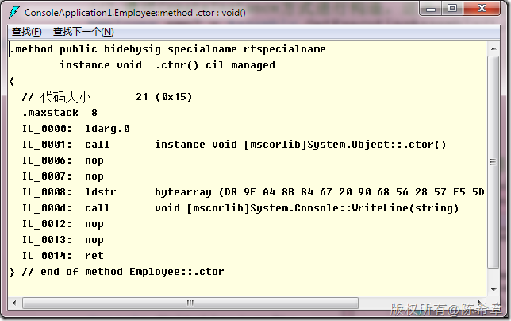
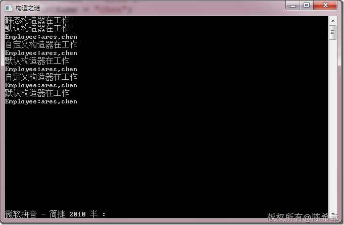

# 再谈CLR：构造之谜 
> 原文发表于 2010-03-21, 地址: http://www.cnblogs.com/chenxizhang/archive/2010/03/21/1691105.html 


这一篇谈谈类型构造的问题。主要针对构造器这个层面进行一些探讨。

 1. 有哪几种构造器

 * 默认构造器（无参数） * 自定义构造器（有参数） * 静态构造器

 2.何时调用构造器

 * 通过new关键字创建实例的时候 * 通过createInstance方法创建实例的时候 * 静态构造器是不能调用的，是由CLR调用，而且它只被调用一次（Assembly级别）

 3. 特殊问题

 * 默认构造器默认有一个实现，当然没有任何代码

 [](http://images.cnblogs.com/cnblogs_com/chenxizhang/WindowsLiveWriter/CLR_5E34/image_2.png) 

 * 如果我们编写了自定义构造器，此时默认构造器就不会自动产生一个，除非显式定义。（这个行为有点怪异）


```
using System;
using System.Collections.Generic;
using System.Linq;
using System.Text;
using System.Reflection;
using System.Threading;

namespace ConsoleApplication1
{
    class Program
    {
        static void Main(string[] args)
        {

            Console.Title = "构造之谜";

            //1.通过new的方式进行构造
            Employee emp = new Employee() { FirstName = "ares", LastName = "chen" };
            Console.WriteLine(emp);

            //如果没有默认构造器，则编译出错
            Employee emp1 = new Employee("ares", "chen");
            Console.WriteLine(emp1);


            //2.通过CreateInstance方式进行构造，这是调用默认构造器
            Employee emp2 = Assembly.GetExecutingAssembly().CreateInstance(typeof(Employee).FullName) as Employee;
            //如果没有默认构造器，则编译不出错，而运行出错，因为CreateInstance方法是调用默认构造器的

            emp2.FirstName = "ares";
            emp2.LastName = "chen";
            Console.WriteLine(emp2);

            //3.通过带参数的CreateInstance方式构造，这是调用自定义构造器
            Employee emp3 = Assembly.GetExecutingAssembly().CreateInstance(
                typeof(Employee).FullName,
                true, BindingFlags.CreateInstance,
                null,
                new object[] { "ares", "chen" },
                Thread.CurrentThread.CurrentCulture,
                null) as Employee;

            Console.WriteLine(emp3);

            //4.通过隐式操作符来构造
            Employee emp4 = "ares,chen";
            Console.WriteLine(emp4);

            Console.Read();
        }
    }

    class Employee {

        static Employee()
        {
            //静态构造器只会被调用一次，而且永远会被调用
            Console.WriteLine("静态构造器在工作");

            //如果类型的静态成员需要经过复杂的逻辑才能初始化，那么应该在静态构造器里面对其进行处理
        }

        public Employee()
        {
            //这个构造器默认就是有的，但如果有自定义构造器，则需要显式地定义该构造器
            Console.WriteLine("默认构造器在工作");
        }

        public Employee(string firstName, string lastName) {
            //如果编写了自定义构造器，默认情况下居然会把默认构造器禁用掉。必须显式地定义默认构造器

            FirstName = firstName;
            LastName = lastName;

            Console.WriteLine("自定义构造器在工作");
        }
        public string FirstName { get; set; }
        public string LastName { get; set; }

        public override string ToString()
        {
            return string.Format("Employee:{0},{1}", FirstName, LastName);
        }


        public static implicit operator Employee(string employee) {
            return new Employee()
            {
                FirstName = employee.Split(',')[0],
                LastName = employee.Split(',')[1]
            };
        }
    }
}

```

.csharpcode, .csharpcode pre
{
 font-size: small;
 color: black;
 font-family: consolas, "Courier New", courier, monospace;
 background-color: #ffffff;
 /*white-space: pre;*/
}
.csharpcode pre { margin: 0em; }
.csharpcode .rem { color: #008000; }
.csharpcode .kwrd { color: #0000ff; }
.csharpcode .str { color: #006080; }
.csharpcode .op { color: #0000c0; }
.csharpcode .preproc { color: #cc6633; }
.csharpcode .asp { background-color: #ffff00; }
.csharpcode .html { color: #800000; }
.csharpcode .attr { color: #ff0000; }
.csharpcode .alt 
{
 background-color: #f4f4f4;
 width: 100%;
 margin: 0em;
}
.csharpcode .lnum { color: #606060; }

[](http://images.cnblogs.com/cnblogs_com/chenxizhang/WindowsLiveWriter/CLR_5E34/image_4.png)

