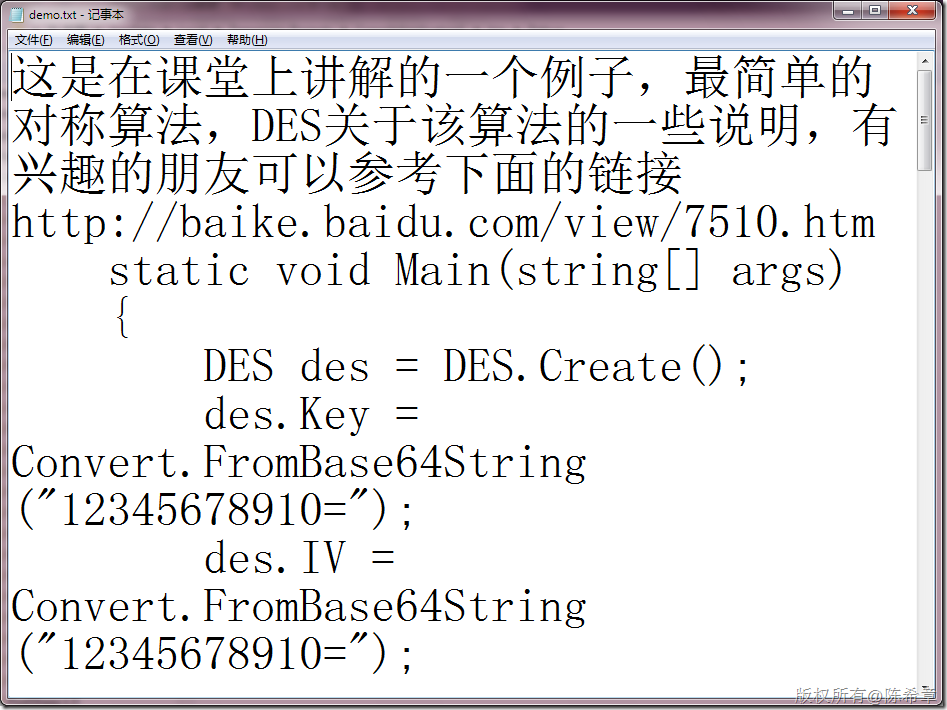
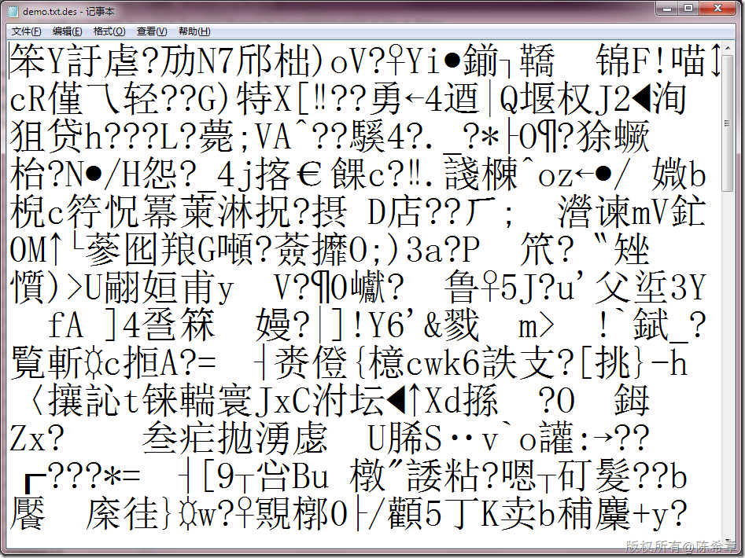
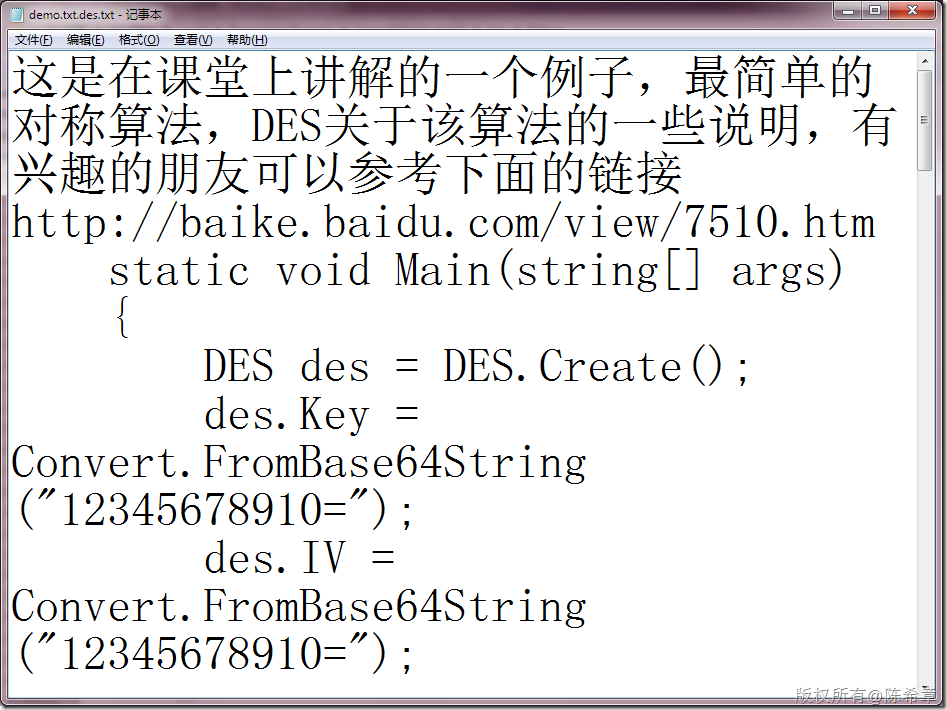

# 对称加密的例子（DES）——针对文件进行加解密 
> 原文发表于 2010-03-22, 地址: http://www.cnblogs.com/chenxizhang/archive/2010/03/22/1691881.html 


这是是今天课堂上的例子。针对文件的加解密其实与字符串加解密没有大的差别。

  


```
    static void Main(string[] args)
    {
        DES des = DES.Create();
        des.Key = Convert.FromBase64String("12345678910=");
        des.IV = Convert.FromBase64String("12345678910=");
        //DES的算法密钥和向量必须是12位，而且最后一位必须的=
        //而且必须用FromBase64String的方式获取


        string fileName = "demo.txt";
        EncryptFile(fileName, des.Key, des.IV);
        DecryptFile(fileName+".des", des.Key, des.IV);


        Console.Read();


    }

    private static void DecryptFile(string fileName, byte[] key, byte[] iv)
    {
        FileStream input = new FileStream(fileName, FileMode.Open);
        FileStream output = new FileStream(fileName + ".txt", FileMode.Create);

        DES des = DES.Create();
        CryptoStream stream = new CryptoStream(input, des.CreateDecryptor(key, iv), CryptoStreamMode.Read);
        byte[] buffer = new byte[input.Length];
        stream.Read(buffer, 0, buffer.Length);
        stream.Close();
        input.Close();

        output.Write(buffer, 0, buffer.Length);
        output.Close();
    }

    private static void EncryptFile(string fileName, byte[] key, byte[] iv)
    {
        FileStream input = new FileStream(fileName, FileMode.Open);
        FileStream output = new FileStream(fileName + ".des", FileMode.Create);

        DES des = DES.Create();
        CryptoStream stream = new CryptoStream(output, des.CreateEncryptor(key, iv), CryptoStreamMode.Write);

        byte[] buffer = new byte[input.Length];
        input.Read(buffer, 0, buffer.Length);
        input.Close();
        stream.Write(buffer, 0, buffer.Length);
        stream.FlushFinalBlock();
        stream.Close();
        output.Close();


    }
```

```
加密之前的文件
```

```
[](http://images.cnblogs.com/cnblogs_com/chenxizhang/WindowsLiveWriter/DES_11A2A/image_2.png) 
```

```
加密之后的文件
```

```
[](http://images.cnblogs.com/cnblogs_com/chenxizhang/WindowsLiveWriter/DES_11A2A/image_4.png) 
```

```
解密之后的文件
```

```
[](http://images.cnblogs.com/cnblogs_com/chenxizhang/WindowsLiveWriter/DES_11A2A/image_6.png) 
```

.csharpcode, .csharpcode pre
{
 font-size: small;
 color: black;
 font-family: consolas, "Courier New", courier, monospace;
 background-color: #ffffff;
 /*white-space: pre;*/
}
.csharpcode pre { margin: 0em; }
.csharpcode .rem { color: #008000; }
.csharpcode .kwrd { color: #0000ff; }
.csharpcode .str { color: #006080; }
.csharpcode .op { color: #0000c0; }
.csharpcode .preproc { color: #cc6633; }
.csharpcode .asp { background-color: #ffff00; }
.csharpcode .html { color: #800000; }
.csharpcode .attr { color: #ff0000; }
.csharpcode .alt 
{
 background-color: #f4f4f4;
 width: 100%;
 margin: 0em;
}
.csharpcode .lnum { color: #606060; }
