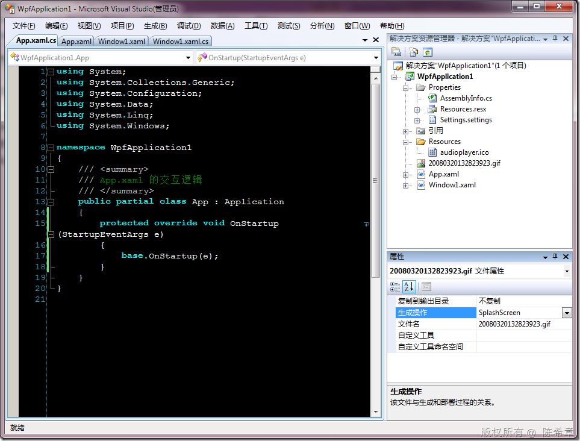
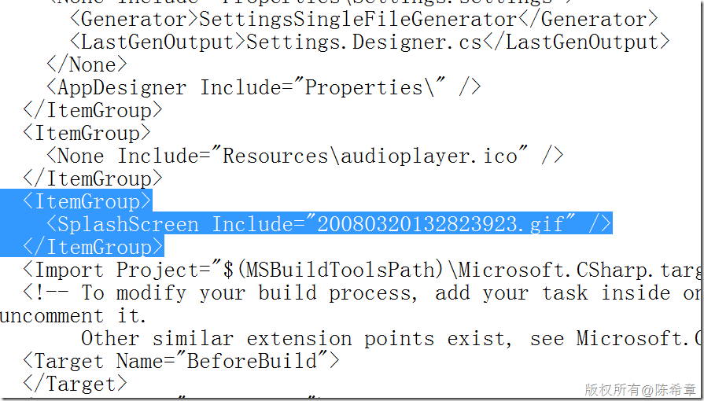
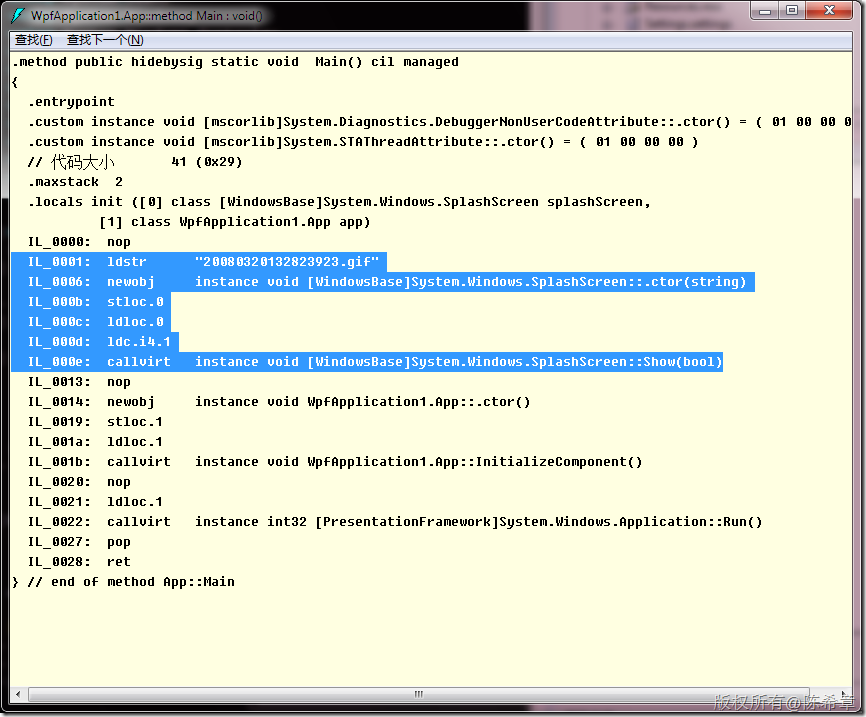

# WPF：如何为程序添加splashScreen？ 
> 原文发表于 2010-03-25, 地址: http://www.cnblogs.com/chenxizhang/archive/2010/03/25/1694606.html 


大家是否还记得在Windows Forms程序中如何实现splashScreen吗？我们一般都会使用Microsoft.VisualBasic.dll中提供的那个WindowsFormsApplicationBase类型，它有一个所谓的splashscreen属性，可以指定为一个窗体的。

 那么，同样的需求在WPF中如何实现呢？这要从两头来说，从简单来说，它实在是简单了。

 事实上，这是.NET Framework 3.5sp1的一个特性

 [http://blogs.msdn.com/jgoldb/archive/2008/08/12/what-s-new-in-wpf-3-5-sp1-splash-screen-to-improve-perceived-startup-perf.aspx](http://blogs.msdn.com/jgoldb/archive/2008/08/12/what-s-new-in-wpf-3-5-sp1-splash-screen-to-improve-perceived-startup-perf.aspx "http://blogs.msdn.com/jgoldb/archive/2008/08/12/what-s-new-in-wpf-3-5-sp1-splash-screen-to-improve-perceived-startup-perf.aspx")

  

  

 考虑到大部分的splashscreen其实都只是一个图片，所以最简单的做法是，先导入一张图片，然后设置它的生成操作为“splash screen”

 [](http://images.cnblogs.com/cnblogs_com/chenxizhang/WindowsLiveWriter/WPFsplashScreen_DE37/image_4.png) 

 注意,其他什么都不要做,此时运行程序的话,就可以看到效果

 [](http://images.cnblogs.com/cnblogs_com/chenxizhang/WindowsLiveWriter/WPFsplashScreen_DE37/image_8.png) 

 注意：虽然我们的图片是gif的格式，但显示出来的效果却是静态的。

  

 那么，到底发生了什么，让他具有了这个特性呢？我们可以打开项目的文件，就是那个csproj文件

 [](http://images.cnblogs.com/cnblogs_com/chenxizhang/WindowsLiveWriter/WPFsplashScreen_DE37/image_10.png) 

 原来它是通过在项目文件中声明一个SplashScreen来实现的。

 [注意]这个文件是给msbuild这个工具用的。

 [思考]所以试想一下，一个应用程序是否可以有多个SplashScreen呢？

  

 同时，我们还可以打开IL代码来了解一下，

     [](http://images.cnblogs.com/cnblogs_com/chenxizhang/WindowsLiveWriter/WPFsplashScreen_DE37/image_12.png) 

 从上面的il代码可以很直观地看出来，其实它是先实例化了一个SplashScreen，然后调用了它的Show方法而已。

 如果是这样的话，我们当然也可以自己写代码来实现

 首先，让我们将图片的生成操作修改为“嵌入的资源”

 [](http://images.cnblogs.com/cnblogs_com/chenxizhang/WindowsLiveWriter/WPFsplashScreen_DE37/image_14.png) 

 然后通过下面的代码就可以实现功能


```
using System;
using System.Collections.Generic;
using System.Configuration;
using System.Data;
using System.Linq;
using System.Windows;

namespace WpfApplication1
{
    /// <summary>
    /// App.xaml 的交互逻辑
    /// </summary>
    public partial class App : Application
    {
        protected override void OnStartup(StartupEventArgs e)
        {
            SplashScreen s = new SplashScreen("20080320132823923.gif");
            s.Show(true);

            base.OnStartup(e);
        }
    }
}


```

.csharpcode, .csharpcode pre
{
 font-size: small;
 color: black;
 font-family: consolas, "Courier New", courier, monospace;
 background-color: #ffffff;
 /*white-space: pre;*/
}
.csharpcode pre { margin: 0em; }
.csharpcode .rem { color: #008000; }
.csharpcode .kwrd { color: #0000ff; }
.csharpcode .str { color: #006080; }
.csharpcode .op { color: #0000c0; }
.csharpcode .preproc { color: #cc6633; }
.csharpcode .asp { background-color: #ffff00; }
.csharpcode .html { color: #800000; }
.csharpcode .attr { color: #ff0000; }
.csharpcode .alt 
{
 background-color: #f4f4f4;
 width: 100%;
 margin: 0em;
}
.csharpcode .lnum { color: #606060; }


值得一提的是，目前看来，也没有办法加载一个窗口作为SplashScreen。


如果希望闪屏至少显示多少时间，则可以考虑下面的代码


```
            SplashScreen s = new SplashScreen("20080320132823923.gif");
            s.Show(false);
            s.Close(new TimeSpan(0, 0, 10));
```

.csharpcode, .csharpcode pre
{
 font-size: small;
 color: black;
 font-family: consolas, "Courier New", courier, monospace;
 background-color: #ffffff;
 /*white-space: pre;*/
}
.csharpcode pre { margin: 0em; }
.csharpcode .rem { color: #008000; }
.csharpcode .kwrd { color: #0000ff; }
.csharpcode .str { color: #006080; }
.csharpcode .op { color: #0000c0; }
.csharpcode .preproc { color: #cc6633; }
.csharpcode .asp { background-color: #ffff00; }
.csharpcode .html { color: #800000; }
.csharpcode .attr { color: #ff0000; }
.csharpcode .alt 
{
 background-color: #f4f4f4;
 width: 100%;
 margin: 0em;
}
.csharpcode .lnum { color: #606060; }
