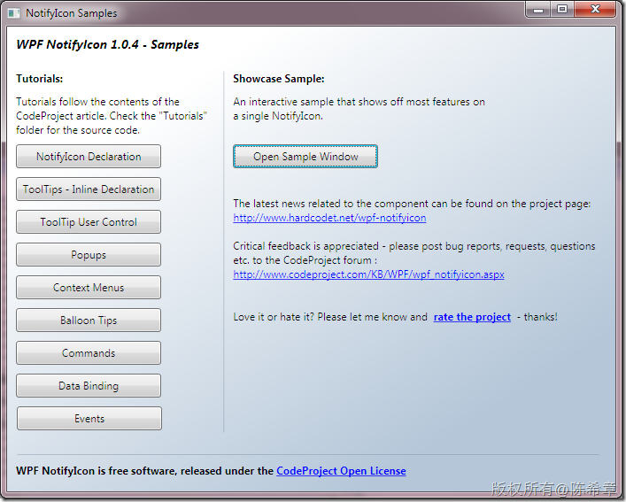
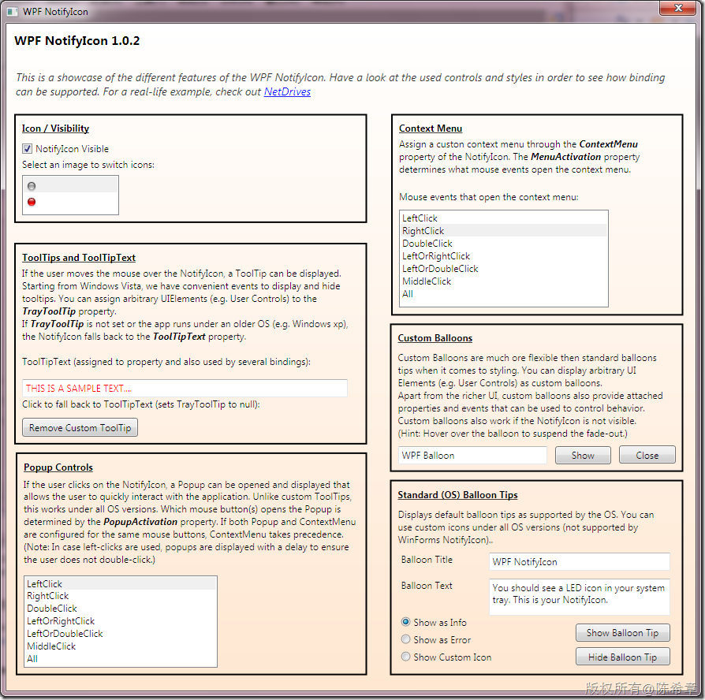
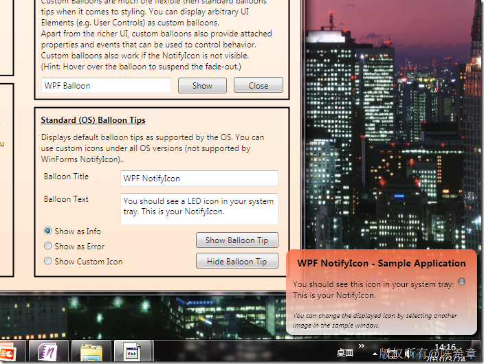
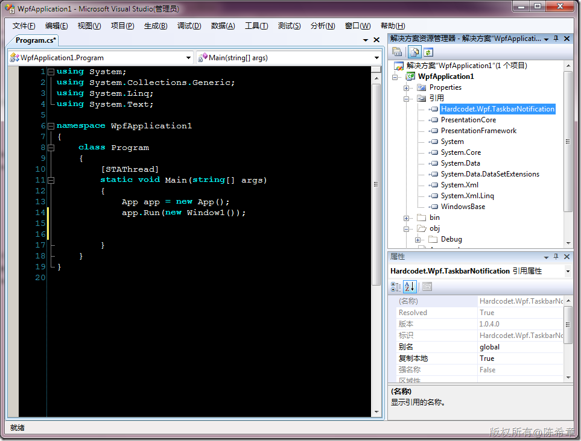
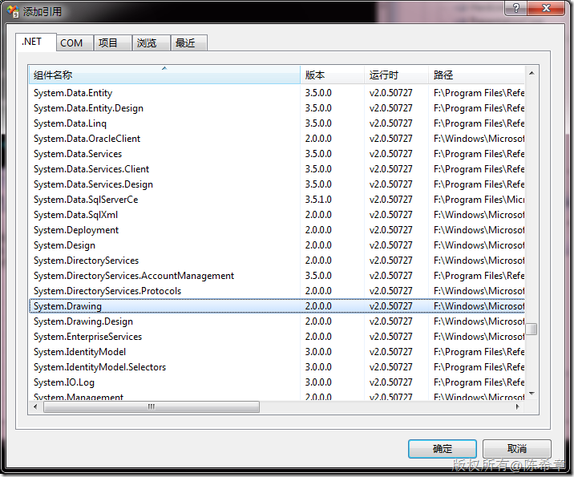
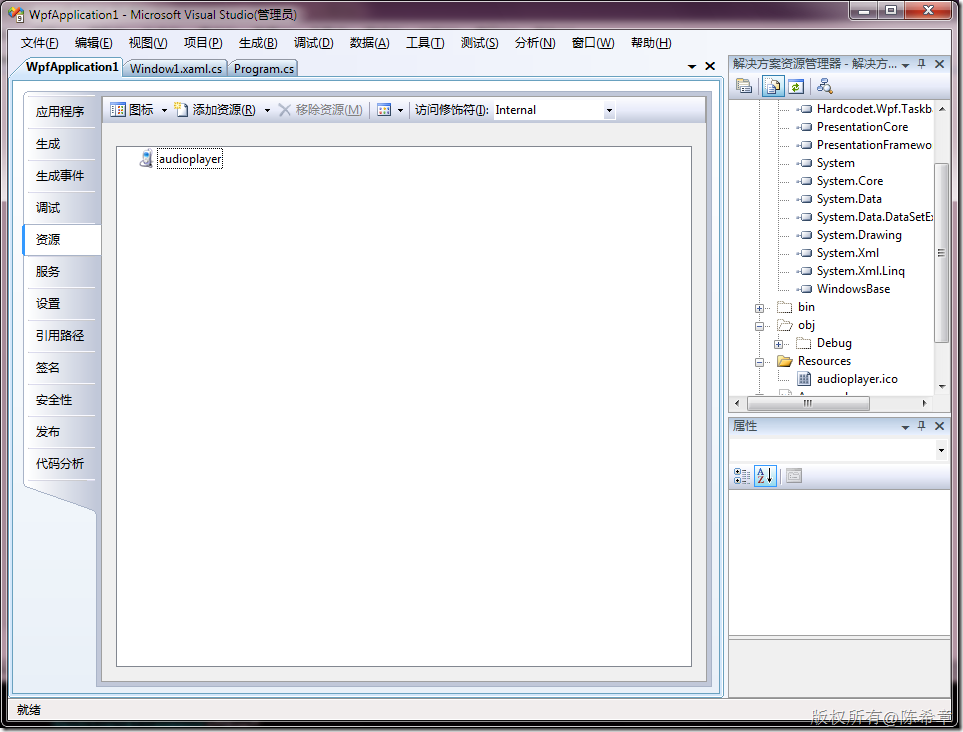

# WPF：如何实现与WindowsForms程序中类似的NotifyIcon 
> 原文发表于 2010-03-25, 地址: http://www.cnblogs.com/chenxizhang/archive/2010/03/25/1694610.html 

我有一个好消息，也有一个坏消息。请问你要先听好消息还是坏消息呢？

 还是先说坏消息吧，Windows Forms提供的控件有相当一部分在WPF中都没有对应的版本，至少目前是这样。关于这个方法的详细信息，请参考

 [http://msdn.microsoft.com/zh-cn/library/ms750559.aspx](http://msdn.microsoft.com/zh-cn/library/ms750559.aspx "http://msdn.microsoft.com/zh-cn/library/ms750559.aspx")

 很不幸，本文谈到的NotifyIcon就属于不支持的一个控件。 

  

 而好消息就是[Philipp.Sumi](http://visualstudiogallery.msdn.microsoft.com/zh-cn/site/profile?userName=Philipp.Sumi)创建一个对应的版本，并且可以通过下面的地址获取到

 [http://visualstudiogallery.msdn.microsoft.com/zh-CN/aacbc77c-4ef6-456f-80b7-1f157c2909f7](http://visualstudiogallery.msdn.microsoft.com/zh-CN/aacbc77c-4ef6-456f-80b7-1f157c2909f7 "http://visualstudiogallery.msdn.microsoft.com/zh-CN/aacbc77c-4ef6-456f-80b7-1f157c2909f7")

 [http://www.hardcodet.net/projects/wpf-notifyicon](http://www.hardcodet.net/projects/wpf-notifyicon "http://www.hardcodet.net/projects/wpf-notifyicon")

  

  

   

 那么，如何将它使用在我们的项目中来呢？

 第一步：添加引用

  

 以及还要添加System.Drawing的引用

  

  

 并添加一个ico文件作为资源

  

  

 第二步：导入命名空间

 using Hardcodet.Wpf.TaskbarNotification;   第三步：创建气泡

 public Window1()  
{  
    InitializeComponent();  
    Loaded += new RoutedEventHandler(Window1\_Loaded);  
} void Window1\_Loaded(object sender, RoutedEventArgs e)  
{  
    TaskbarIcon taskIcon = new TaskbarIcon();  
    taskIcon.Icon = Properties.Resources.audioplayer;  
    taskIcon.ShowBalloonTip("欢迎", "欢迎使用该系统", BalloonIcon.Info);  
} 

