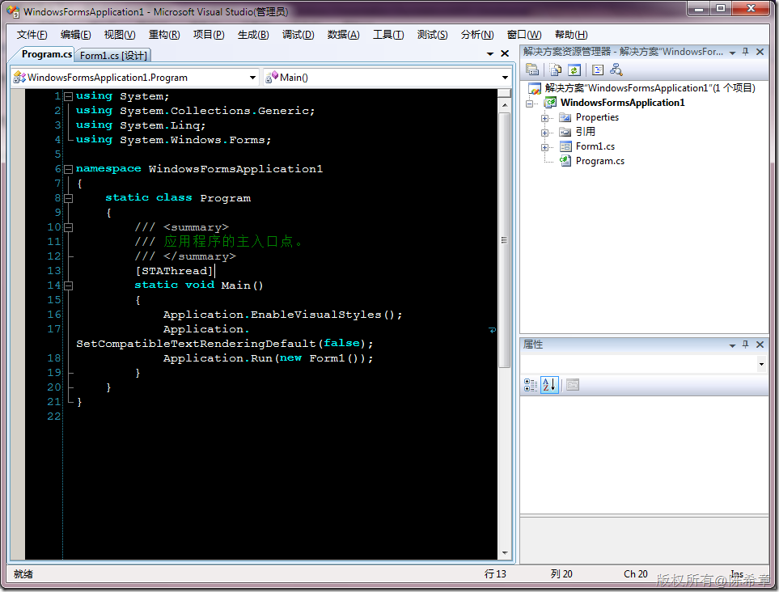
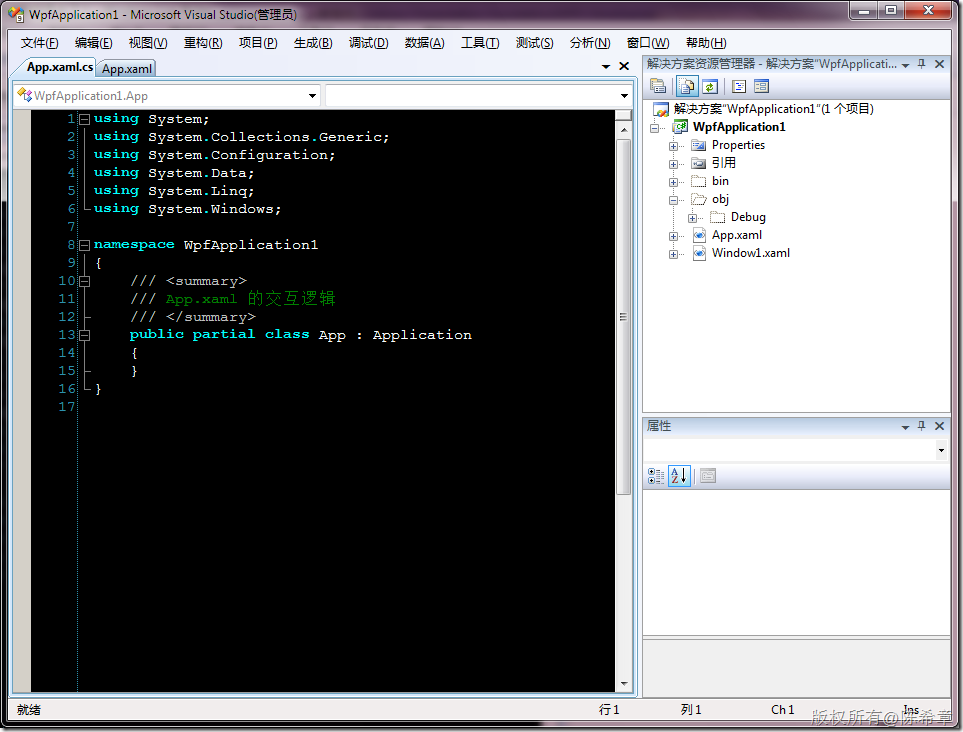
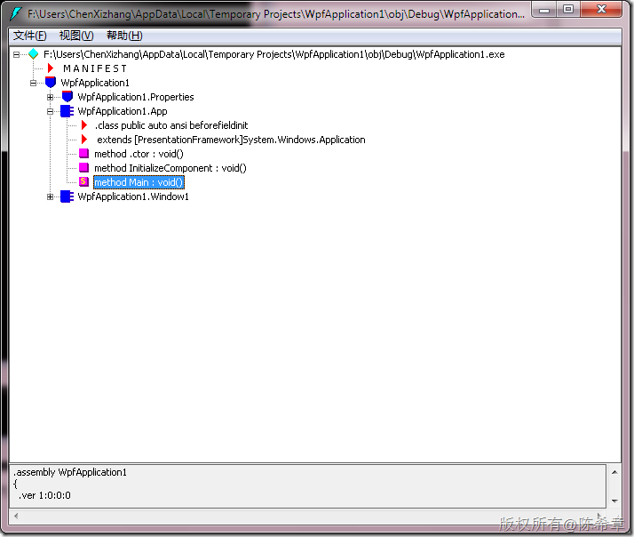
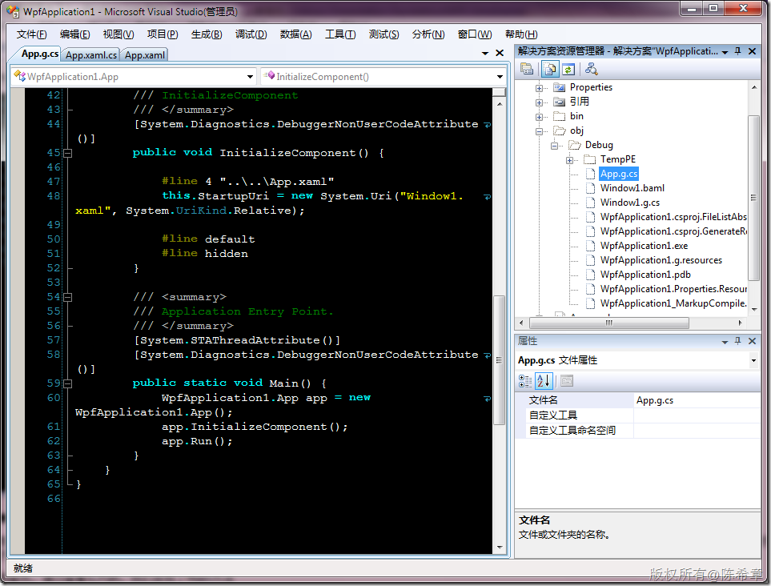
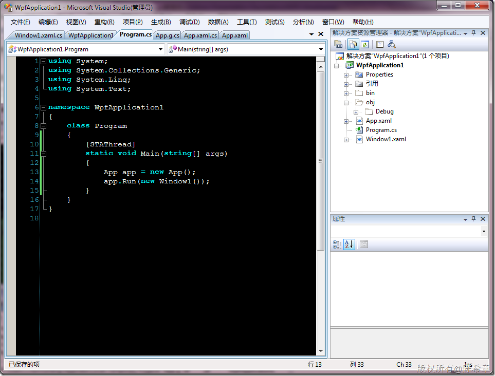
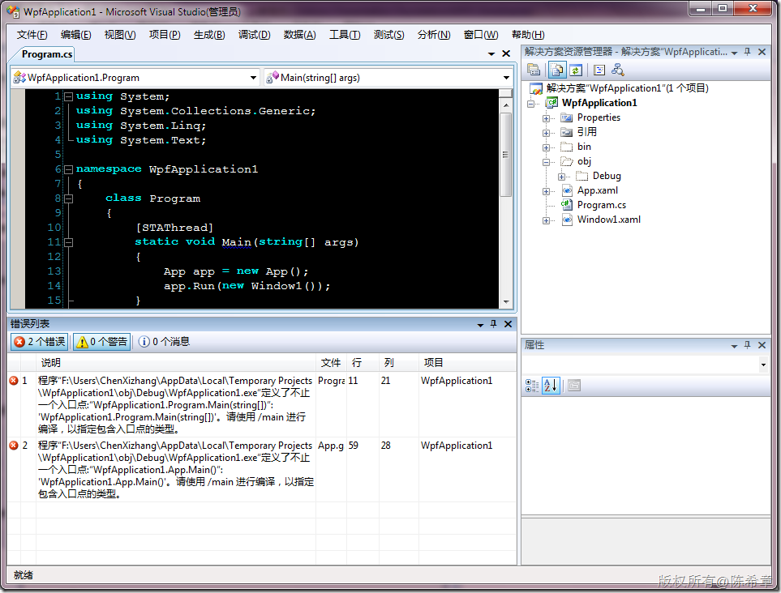
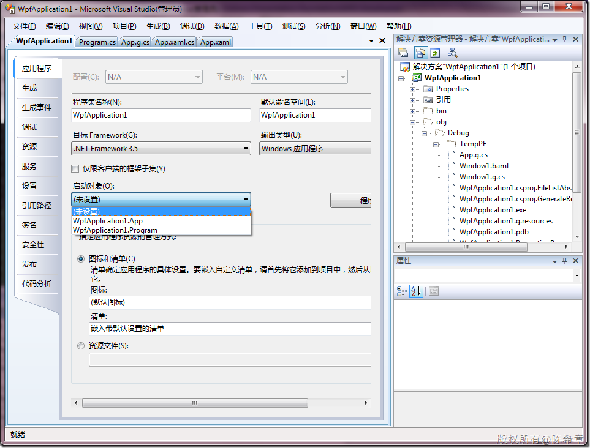
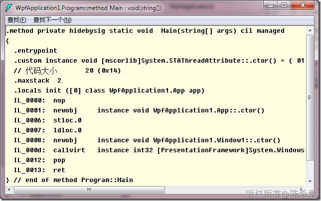
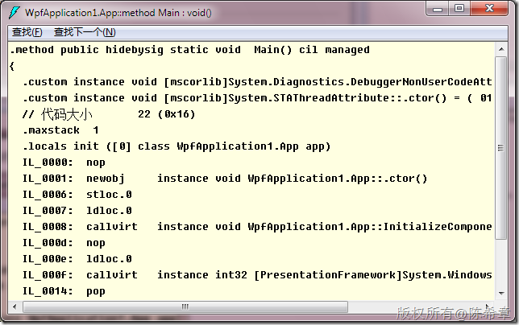

# WPF：Main方法到哪里去了？ 
> 原文发表于 2010-03-25, 地址: http://www.cnblogs.com/chenxizhang/archive/2010/03/25/1694611.html 

之前做过Windows Forms开发的朋友一定很熟悉，我们的应用程序都是从Program.cs的一个Main方法开始的，如下图所示

 

 这个Main方法也被称为所谓的“EntryPoint”，也就是说“入口点”

 但我们在一个简单的WPF应用程序中却没有找到这个方法

   

 我们首先没有看到Program.cs文件，然后更没有看到所谓的Main方法。难道说，现在不再需要Main方法了么？这似乎说不通，因为我们知道作为exe而言，它要执行的前提就是由CLR调用它的Main方法 

 然后我们继续查找，通过查看IL代码，我们发现了Main方法

  

 那么，这到底是怎么回事呢？是谁动了我们的Main方法呢？通过看下图我们恍然大悟，原来这个方法是自动生成的，请注意那个 App.g.cs文件

  

 那么，这个代码是否可以移动出来呢？答案是肯定的，我们完全可以手工做一个Program.cs文件

  

 看起来很不错，不是吗？我们通过Ctrl+Shift+B进行编译，却收到了两个错误

  

 对的，目前确实有两个Main方法，当然有些问题，那么如何解决呢？我们可以在下图中进行指定某个类为启动对象

  

 例如我们指定Program为启动对象。完成编译后，就可以成功运行我们的程序了。我们可以看到Program里面的Main方法被识别为了entrypoint

  

 而在App里面那个则属于正常方法

 

