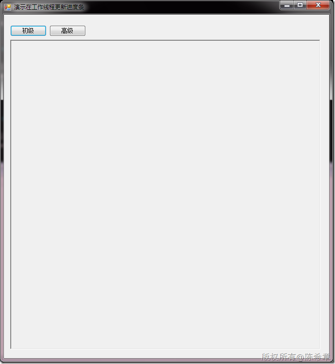
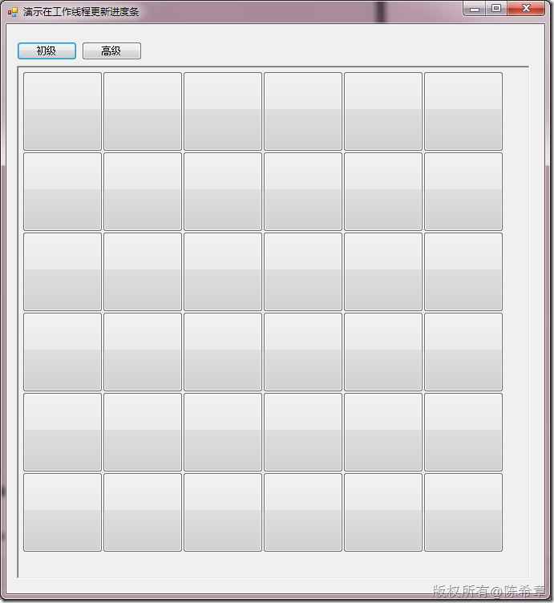
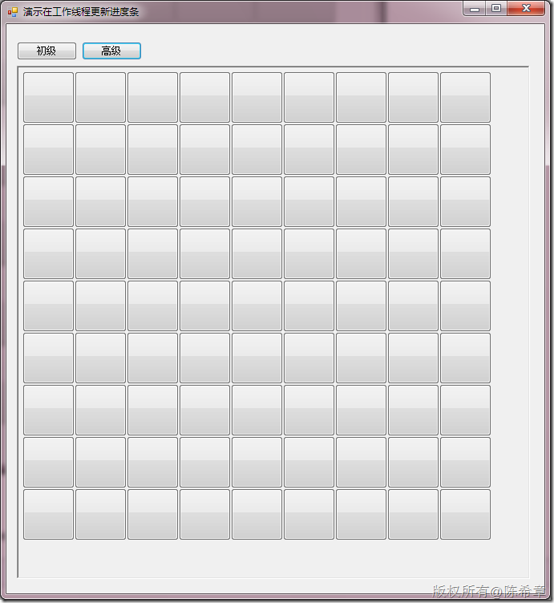
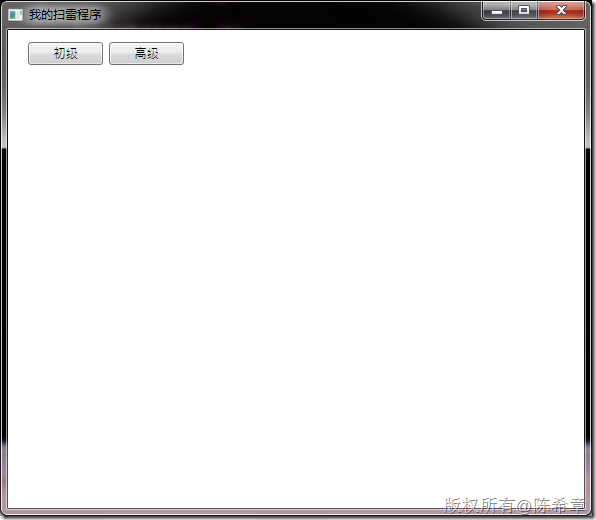
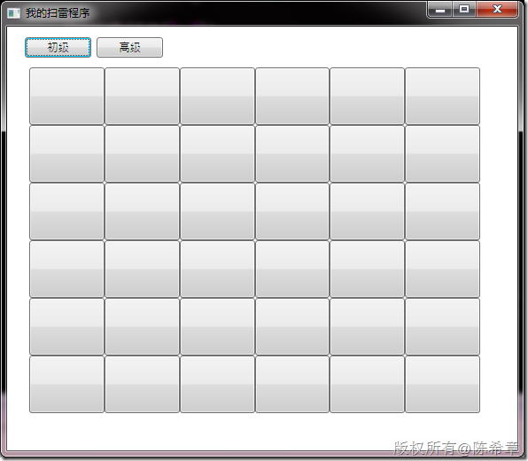
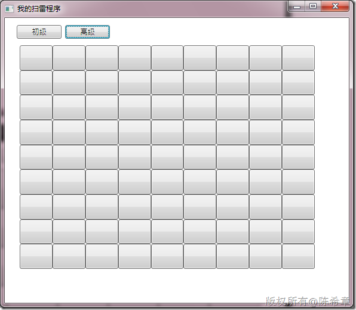

# WPF：理解ContentControl——动态添加控件和查找控件 
> 原文发表于 2010-03-25, 地址: http://www.cnblogs.com/chenxizhang/archive/2010/03/25/1694899.html 


我认为WPF的核心改变之一就是控件模型发生了重要的变化，大的方面说，现在窗口中的控件（大部分）都没有独立的Hwnd了。而且控件可以通过所谓的模板提供各种各样的表现形式。

 这一篇就来谈一谈ContentControl，的第一部分，动态添加控件和查找控件

 什么是ContentControl呢？其实WPF的绝大部分的控件，还包括窗口本身都是继承自ContentControl的。

  

 有的时候，我们需要在窗口出来之后，再动态添加一些控件。例如一个最简单的场景：我们需要做一个扫雷程序，该扫雷程序根据用户选择的难易程度决定要显示多少个地雷。

 为了便于理解，大家可以看下面这三个图片

 [](http://images.cnblogs.com/cnblogs_com/chenxizhang/WindowsLiveWriter/WPFContentControl_90E8/image_2.png) 

 [](http://images.cnblogs.com/cnblogs_com/chenxizhang/WindowsLiveWriter/WPFContentControl_90E8/image_4.png) 

 [](http://images.cnblogs.com/cnblogs_com/chenxizhang/WindowsLiveWriter/WPFContentControl_90E8/image_6.png) 

 ok，我们还是回想一下在Windows Forms里面怎么做？


```
using System;
using System.Windows.Forms;

namespace WindowsFormsApplication1
{
    public partial class Form1 : Form
    {
        public Form1()
        {
            InitializeComponent();
        }

        private void button1\_Click(object sender, EventArgs e)
        {
            //初级版，实例化6*6一共64个按钮
            CreateButton(6, 6);
        }


        private void button2\_Click(object sender, EventArgs e)
        {
            //高级版，实例化9*9一共81个按钮
            CreateButton(9, 9);
        }

        private void CreateButton(int x, int y) {
            panel1.SuspendLayout();
            panel1.Controls.Clear();

            //四个方向的边距都是5
            int width = (panel1.Width-(x+1)*5)/x;
            int height = (panel1.Height-(y+1)*5)/y;


            for (int i = 0; i < x; i++)
            {
                for (int j = 0; j < y; j++)
                {
                    Button bt = new Button()
                    {
                        Width = width,
                        Height = height,
                        Left = i*width+5,
                        Top = j*height+5
                    };

                    panel1.Controls.Add(bt);
                    
                }
            }

            panel1.ResumeLayout();
        }


    }
}

```

.csharpcode, .csharpcode pre
{
 font-size: small;
 color: black;
 font-family: consolas, "Courier New", courier, monospace;
 background-color: #ffffff;
 /*white-space: pre;*/
}
.csharpcode pre { margin: 0em; }
.csharpcode .rem { color: #008000; }
.csharpcode .kwrd { color: #0000ff; }
.csharpcode .str { color: #006080; }
.csharpcode .op { color: #0000c0; }
.csharpcode .preproc { color: #cc6633; }
.csharpcode .asp { background-color: #ffff00; }
.csharpcode .html { color: #800000; }
.csharpcode .attr { color: #ff0000; }
.csharpcode .alt 
{
 background-color: #f4f4f4;
 width: 100%;
 margin: 0em;
}
.csharpcode .lnum { color: #606060; }


我们可以花一点点时间稍微解释一下，其实我们就是用循环的方式，动态地创建了一批按钮出来，然后将他们添加到Panel的Controls集合中去。


那么，同样的思路放在WPF中来是否可行呢？我们一步一步来看吧


首先，在WPF中进行布局控制有几个主要的容器


* Canvas是按照绝对位置定位的，很像上面的Panel这种机制；
* StackPanel呢，则是基于流模式的，它没有绝对定位的概念，一批控件要么从左到右排列，要么从上而下排列
* Grid，可能是用的最多的，它可以提供按照行和列的方式更好地组织控件。而事实上，在Grid里面也可以嵌入Canvas和StackPanel，他们结合可以构造出足够复杂的 界面。


 


那么，我们就来尝试用Canvas实现与Windows Forms类似的效果吧


[](http://images.cnblogs.com/cnblogs_com/chenxizhang/WindowsLiveWriter/WPFContentControl_90E8/image_8.png) 


[](http://images.cnblogs.com/cnblogs_com/chenxizhang/WindowsLiveWriter/WPFContentControl_90E8/image_10.png) 


[](http://images.cnblogs.com/cnblogs_com/chenxizhang/WindowsLiveWriter/WPFContentControl_90E8/image_12.png) 


那么，我们的代码有什么区别呢？


第一部分是XAML代码


```
<Window x:Class="WpfApplication1.Window1"
    xmlns="http://schemas.microsoft.com/winfx/2006/xaml/presentation"
    xmlns:x="http://schemas.microsoft.com/winfx/2006/xaml"
    Title="我的扫雷程序" Height="516" Width="592">
    <Grid>
        <Button Height="23" HorizontalAlignment="Left" Margin="20,12,0,0" Name="button1" VerticalAlignment="Top" Width="75" Click="button1\_Click">初级</Button>
        <Button Height="23" HorizontalAlignment="Left" Margin="101,12,0,0" Name="button2" VerticalAlignment="Top" Width="75" Click="button2\_Click">高级</Button>
        <Canvas Margin="20,41,12,12" Name="canvas1"  />
    </Grid>
</Window>

```

.csharpcode, .csharpcode pre
{
 font-size: small;
 color: black;
 font-family: consolas, "Courier New", courier, monospace;
 background-color: #ffffff;
 /*white-space: pre;*/
}
.csharpcode pre { margin: 0em; }
.csharpcode .rem { color: #008000; }
.csharpcode .kwrd { color: #0000ff; }
.csharpcode .str { color: #006080; }
.csharpcode .op { color: #0000c0; }
.csharpcode .preproc { color: #cc6633; }
.csharpcode .asp { background-color: #ffff00; }
.csharpcode .html { color: #800000; }
.csharpcode .attr { color: #ff0000; }
.csharpcode .alt 
{
 background-color: #f4f4f4;
 width: 100%;
 margin: 0em;
}
.csharpcode .lnum { color: #606060; }

第二部分是C#代码


```
using System.Windows;
using System.Windows.Controls;

namespace WpfApplication1
{
    /// <summary>
    /// Window1.xaml 的交互逻辑
    /// </summary>
    public partial class Window1 : Window
    {
        public Window1()
        {
            InitializeComponent();
        }

        private void button1\_Click(object sender, RoutedEventArgs e)
        {
            CreateButton(6, 6);
        }


        private void button2\_Click(object sender, RoutedEventArgs e)
        {
            CreateButton(9, 9);
        }

        private void CreateButton(int x, int y)
        {
            


            canvas1.Children.Clear();

            //四个方向的边距都是5
            double width = (this.canvas1.ActualWidth - (x + 1) * 5) / x;
            double height = (this.canvas1.ActualHeight - (y + 1) * 5) / y;


            for (int i = 0; i < x; i++)
            {
                for (int j = 0; j < y; j++)
                {
                    Button bt = new Button()
                    {
                        Width = width,
                        Height = height
                    };

                    Canvas.SetTop(bt, j * height + 5);
                    Canvas.SetLeft(bt, i * width + 5);
                    //这两句很关键。按钮在Canvas中的定位与它自己的Left以及Top不是一个概念
                    

                    canvas1.Children.Add(bt);
                    
                    
                }
            }

            
        }


    }
}

```


.csharpcode, .csharpcode pre
{
 font-size: small;
 color: black;
 font-family: consolas, "Courier New", courier, monospace;
 background-color: #ffffff;
 /*white-space: pre;*/
}
.csharpcode pre { margin: 0em; }
.csharpcode .rem { color: #008000; }
.csharpcode .kwrd { color: #0000ff; }
.csharpcode .str { color: #006080; }
.csharpcode .op { color: #0000c0; }
.csharpcode .preproc { color: #cc6633; }
.csharpcode .asp { background-color: #ffff00; }
.csharpcode .html { color: #800000; }
.csharpcode .attr { color: #ff0000; }
.csharpcode .alt 
{
 background-color: #f4f4f4;
 width: 100%;
 margin: 0em;
}
.csharpcode .lnum { color: #606060; }


我们发现了以下区别


1. 现在没有Controls这个概念了，而是有一个Children属性，代表了所有的子内容


2.针对不同的容器，有一些特殊的方法来定位子元素。例如Canvas的SetTop等方法 。

