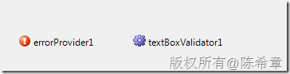
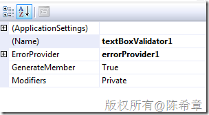
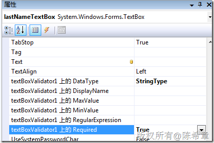
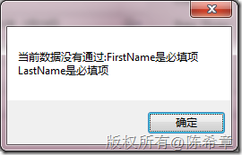
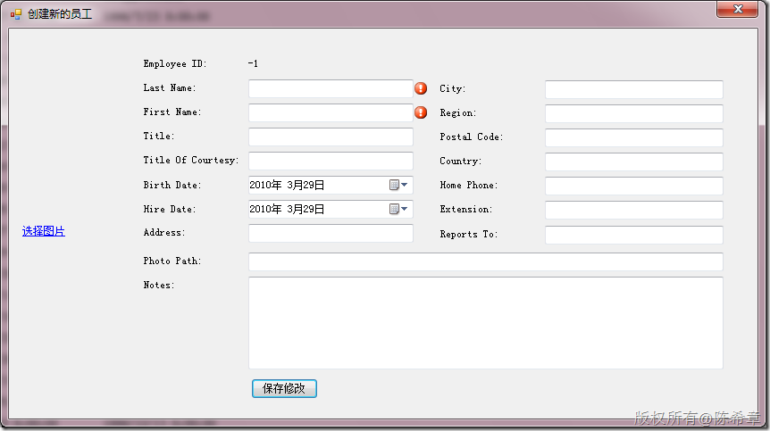

# 一个自定义的文本框验证器(WindowsForms) 
> 原文发表于 2010-03-29, 地址: http://www.cnblogs.com/chenxizhang/archive/2010/03/29/1699374.html 


这也是前两天在课堂上的一个案例，我们实现了自定义的文本框验证器。这是一个实现了IExtenderProvider 的组件。该范例部分代码改编自MSDN

 这个验证组件，可以为窗体上任意多个文本框提供验证，大致有如下几种方式

 1. 必填项检查

 2.范围检查（例如最小值为5，最大值为100）

 3. 类型检查

 4. 正则表达式检查

  

 大致的用法是：

 1. 将该组件拖拽到窗体上，同时还要拖拽一个ErrorProvider

 [](http://images.cnblogs.com/cnblogs_com/chenxizhang/WindowsLiveWriter/WindowsForms_A0FA/image_2.png) 

 2. 设置该组件的一个属性，将其与ErrorProvider绑定

 [](http://images.cnblogs.com/cnblogs_com/chenxizhang/WindowsLiveWriter/WindowsForms_A0FA/image_4.png) 

 3. 设置哪些文本框需要进行什么样的验证

 [](http://images.cnblogs.com/cnblogs_com/chenxizhang/WindowsLiveWriter/WindowsForms_A0FA/image_6.png) 

 4. 在窗体代码中，例如提交按钮代码中，使用下面的方式来做验证


```
            //使用自定义验证器
            if (!textBoxValidator1.IsValid(out errorMessage))
                MessageBox.Show(String.Format("当前数据没有通过:{0}", errorMessage));
            else
            {
                employeesBindingSource.EndEdit();
                tableAdapterManager.UpdateAll(employeesDataSet);
                this.Text = firstNameTextBox.Text + "," + lastNameTextBox.Text;

                SetControlStatus(false);
            }
```

5. 运行效果大致如下


[](http://images.cnblogs.com/cnblogs_com/chenxizhang/WindowsLiveWriter/WindowsForms_A0FA/image_8.png) 


[](http://images.cnblogs.com/cnblogs_com/chenxizhang/WindowsLiveWriter/WindowsForms_A0FA/image_10.png)
.csharpcode, .csharpcode pre
{
 font-size: small;
 color: black;
 font-family: consolas, "Courier New", courier, monospace;
 background-color: #ffffff;
 /*white-space: pre;*/
}
.csharpcode pre { margin: 0em; }
.csharpcode .rem { color: #008000; }
.csharpcode .kwrd { color: #0000ff; }
.csharpcode .str { color: #006080; }
.csharpcode .op { color: #0000c0; }
.csharpcode .preproc { color: #cc6633; }
.csharpcode .asp { background-color: #ffff00; }
.csharpcode .html { color: #800000; }
.csharpcode .attr { color: #ff0000; }
.csharpcode .alt 
{
 background-color: #f4f4f4;
 width: 100%;
 margin: 0em;
}
.csharpcode .lnum { color: #606060; }


 


该组件的完整代码如下


```
using System;
using System.Collections.Generic;
using System.Linq;
using System.Text;

using System.ComponentModel;
using System.Windows.Forms;

using System.Collections;
using System.Text.RegularExpressions;

namespace NorthwindApplication
{
    /// <summary>
    /// 这个类型是专门用来做文本框验证的
    /// 作者：陈希章
    /// </summary>
    /// 

    [ProvideProperty("DataType", typeof(Control))]
    [ProvideProperty("DisplayName", typeof(Control))]
    [ProvideProperty("MinValue", typeof(Control))]
    [ProvideProperty("MaxValue", typeof(Control))]
    [ProvideProperty("Required", typeof(Control))]
    [ProvideProperty("RegularExpression", typeof(Control))]
    //这是定义的几个属性
    public class TextBoxValidator : Component, IExtenderProvider
    {
        [Description("设置一个关联的ErrorProvider")]
        public ErrorProvider ErrorProvider { get; set; }

        #region IExtenderProvider 成员

        public bool CanExtend(object extendee)
        {
            return extendee.GetType() == typeof(TextBox);
        }

        #endregion


        ///用一个hashTable来保存控件的设置

        Hashtable tb = new Hashtable();

        private TextBoxValidatorProvidedProperties GetAddControl(Control ctrl)
        {
            if (!tb.ContainsKey(ctrl))
            {
                TextBoxValidatorProvidedProperties prop = new TextBoxValidatorProvidedProperties();
                tb.Add(ctrl, prop);
                ctrl.Validated += new EventHandler(ctrl\_Validated);
            }

            return tb[ctrl] as TextBoxValidatorProvidedProperties;

        }

        void ctrl\_Validated(object sender, EventArgs e)
        {
            ProcessError((Control)sender);
        }

        private void ProcessError(Control ctrl)
        {
            TextBoxValidatorProvidedProperties prop = (TextBoxValidatorProvidedProperties)tb[ctrl];
            string message = GetErrorMessage(ctrl);
            if (!string.IsNullOrEmpty(message) && ErrorProvider != null)
                ErrorProvider.SetError(ctrl, message);
            else
                ErrorProvider.SetError(ctrl, "");
        }

        private string GetErrorMessage(Control ctrl)
        {
            Type[] types = new[]{
                typeof(string),
                typeof(byte),
                typeof(Int16),
                typeof(Int32),
                typeof(Int64),
                typeof(Single),
                typeof(double),
                typeof(decimal),
                typeof(DateTime)
            };

            TextBoxValidatorProvidedProperties props = (TextBoxValidatorProvidedProperties)tb[ctrl];
            string displayName;
            if (string.IsNullOrEmpty(props.DisplayName))
                displayName = ctrl.Name;
            else
                displayName = props.DisplayName;

            string value = ctrl.Text;//检查是不是必填项
            if (value.Length == 0)
            {
                if (props.Required)
                    return displayName + " 是必填的!";
                else
                    return string.Empty;
            }

            Type dataType = types[(int)props.DataType];
            try
            {
                object o = Convert.ChangeType(value, dataType);//尝试强制转换到某个类型
                switch (props.DataType)
                {
                    case DataTypeConstants.ByteType:
                    case DataTypeConstants.Int16Type:
                    case DataTypeConstants.Int32Type:
                    case DataTypeConstants.Int64Type:
                        if (Convert.ToDecimal(value) != Convert.ToInt64(value))
                            return "在文本框" + displayName + "中不允许有小数点";

                        break;
                    default:
                        break;
                }
            }
            catch (Exception)
            {

                return string.Format("文本框{0}中的值{1}无法转换为{2}类型",
                    displayName,
                    value,
                    dataType);

            }


            //验证正则表达式
            if (props.RegularExpression.Length > 0)
            {
                if (!Regex.IsMatch(value, props.RegularExpression))
                {
                    return string.Format("文本框{0}中的值{1}不满足正则表达式{2}的验证规则",
                        displayName,
                        value,
                        props.RegularExpression);
                }
            }

            if (props.MinValue.Length > 0)
            {
                if (Convert.ChangeType(value, dataType).GetHashCode() < 
                    Convert.ChangeType(props.MinValue, dataType).GetHashCode())
                    return string.Format("文本框{0}中的值{1}太小了，应该至少是{2}",
                        displayName,
                        value,
                        props.MinValue);
            }

            if (props.MaxValue.Length > 0)
            {
                if (Convert.ChangeType(value, dataType).GetHashCode() >
                    Convert.ChangeType(props.MaxValue, dataType).GetHashCode())
                    return string.Format("文本框{0}中的值{1}太大了，应该最大是{2}",
                        displayName,
                        value,
                        props.MaxValue);
            }


            return string.Empty;
        }


        #region 属性
        ///定义一系列的Get和Set方法来完成属性
        ///

        public DataTypeConstants GetDataType(Control ctrl)
        {
            if (tb.ContainsKey(ctrl))
                return ((TextBoxValidatorProvidedProperties)tb[ctrl]).DataType;
            else
                return DataTypeConstants.StringType;

        }

        public void SetDataType(Control ctrl, DataTypeConstants dataType)
        {
            GetAddControl(ctrl).DataType = dataType;
        }


        public string GetMinValue(Control ctrl)
        {
            if (tb.ContainsKey(ctrl))
                return ((TextBoxValidatorProvidedProperties)tb[ctrl]).MinValue;
            else
                return string.Empty;
        }
        public void SetMinValue(Control ctrl, string value)
        {
            if (value == null) value = string.Empty;

            GetAddControl(ctrl).MinValue = value;
        }


        public string GetMaxValue(Control ctrl)
        {
            if (tb.ContainsKey(ctrl))
                return ((TextBoxValidatorProvidedProperties)tb[ctrl]).MaxValue;
            else
                return string.Empty;
        }
        public void SetMaxValue(Control ctrl, string value)
        {
            if (value == null) value = string.Empty;

            GetAddControl(ctrl).MaxValue = value;
        }

        public string GetDisplayName(Control ctrl)
        {
            if (tb.ContainsKey(ctrl))
                return ((TextBoxValidatorProvidedProperties)tb[ctrl]).DisplayName;
            else
                return string.Empty;
        }
        public void SetDisplayName(Control ctrl, string value)
        {
            GetAddControl(ctrl).DisplayName = value;
        }


        public string GetRegularExpression(Control ctrl)
        {
            if (tb.ContainsKey(ctrl))
                return ((TextBoxValidatorProvidedProperties)tb[ctrl]).RegularExpression;
            else
                return string.Empty;
        }
        public void SetRegularExpression(Control ctrl, string value)
        {
            GetAddControl(ctrl).RegularExpression = value;
        }

        public bool GetRequired(Control ctrl)
        {
            if (tb.ContainsKey(ctrl))
                return ((TextBoxValidatorProvidedProperties)tb[ctrl]).Required;
            else
                return false;
        }
        public void SetRequired(Control ctrl, bool value)
        {
            GetAddControl(ctrl).Required = value;
        }
        #endregion


        #region 验证逻辑

        public bool IsValid(out string summary)
        {
            summary = this.ValidationSummary;
            return summary.Length == 0;

        }

        private string ValidationSummary
        {
            get
            {

                var messages = this.InvalidMessages;
                StringBuilder sb = new StringBuilder();
                foreach (var item in messages)
                {
                    sb.AppendFormat("{0}\n", item.ToString());
                }

                return sb.ToString();
            }
        }

        private ArrayList InvalidMessages
        {
            get
            {
                SortedList olInvalidMessages = new SortedList();
                string message;
                foreach (Control ctrl in tb.Keys)
                {
                    message = GetErrorMessage(ctrl);
                    if (!string.IsNullOrEmpty(message))
                        olInvalidMessages.Add(ctrl.TabIndex, message);

                }


                ArrayList colErrorsByIndex = new ArrayList();
                foreach (var item in olInvalidMessages.Values)
                {
                    colErrorsByIndex.Add(item.ToString());
                }

                return colErrorsByIndex;

            }
        }

        #endregion
    }

    public class TextBoxValidatorProvidedProperties
    {
        public DataTypeConstants DataType;
        public string MinValue;
        public string MaxValue;
        public string DisplayName = string.Empty;
        public bool Required = false;
        public string RegularExpression = string.Empty;
    }

    /// <summary>
    /// 定义一个枚举，用来让用户可以选择数据类型
    /// </summary>
    public enum DataTypeConstants
    {
        StringType,
        ByteType,
        Int16Type,
        Int32Type,
        Int64Type,
        SingleType,
        DoubleType,
        DecimalType,
        DateTimeType
    }
 }

```

.csharpcode, .csharpcode pre
{
 font-size: small;
 color: black;
 font-family: consolas, "Courier New", courier, monospace;
 background-color: #ffffff;
 /*white-space: pre;*/
}
.csharpcode pre { margin: 0em; }
.csharpcode .rem { color: #008000; }
.csharpcode .kwrd { color: #0000ff; }
.csharpcode .str { color: #006080; }
.csharpcode .op { color: #0000c0; }
.csharpcode .preproc { color: #cc6633; }
.csharpcode .asp { background-color: #ffff00; }
.csharpcode .html { color: #800000; }
.csharpcode .attr { color: #ff0000; }
.csharpcode .alt 
{
 background-color: #f4f4f4;
 width: 100%;
 margin: 0em;
}
.csharpcode .lnum { color: #606060; }
