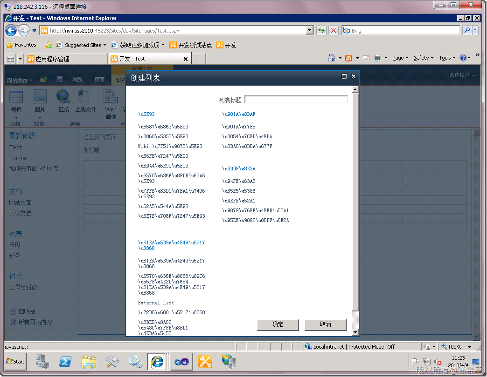
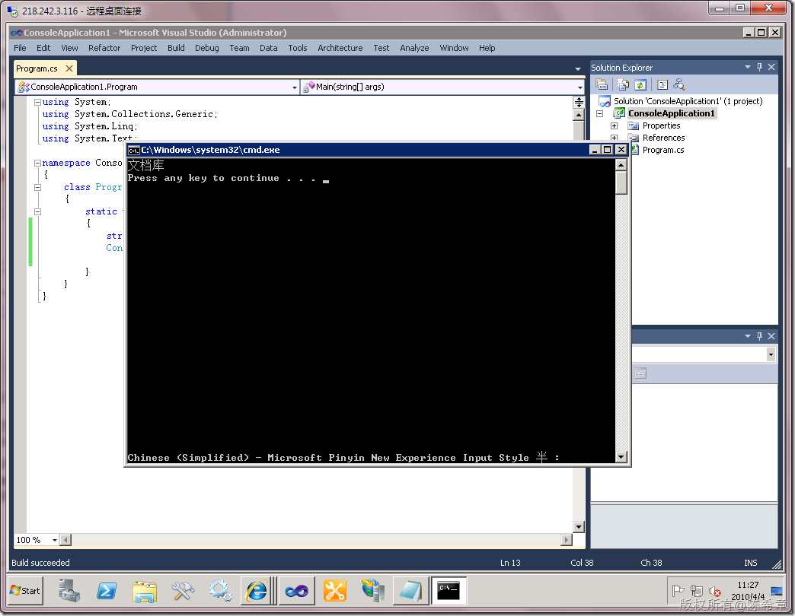

# MOSS 2010 beta1的一个bug 
> 原文发表于 2010-04-04, 地址: http://www.cnblogs.com/chenxizhang/archive/2010/04/04/1704088.html 


最近在试用MOSS 2010 beta1,发现中文版中有一个bug，如下图所示 

 [](http://images.cnblogs.com/cnblogs_com/chenxizhang/WindowsLiveWriter/MOSS2010beta1bug_A0CE/image_2.png) 

 很显然，这是由于编码问题造成的。我们一看就知道，一般\u后面跟上一个十六进制的数字，其实就表示一个unicode字符。通常出现上面这样的情况，都是语言和编码有关系。

 那么，我们尝试来看看，这些字符到底是什么呢？


```
using System;
using System.Collections.Generic;
using System.Linq;
using System.Text;

namespace ConsoleApplication1
{
    class Program
    {
        static void Main(string[] args)
        {
            string input = "\u6587\u6863\u5E93";
            Console.WriteLine(input);

        }
    }
}

```


.csharpcode, .csharpcode pre
{
 font-size: small;
 color: black;
 font-family: consolas, "Courier New", courier, monospace;
 background-color: #ffffff;
 /*white-space: pre;*/
}
.csharpcode pre { margin: 0em; }
.csharpcode .rem { color: #008000; }
.csharpcode .kwrd { color: #0000ff; }
.csharpcode .str { color: #006080; }
.csharpcode .op { color: #0000c0; }
.csharpcode .preproc { color: #cc6633; }
.csharpcode .asp { background-color: #ffff00; }
.csharpcode .html { color: #800000; }
.csharpcode .attr { color: #ff0000; }
.csharpcode .alt 
{
 background-color: #f4f4f4;
 width: 100%;
 margin: 0em;
}
.csharpcode .lnum { color: #606060; }

上面的代码运行之后，就可以看到下面的结果


[](http://images.cnblogs.com/cnblogs_com/chenxizhang/WindowsLiveWriter/MOSS2010beta1bug_A0CE/image_4.png) 


也就是说，上面的那些怪兽字其实是代表了“文档库”这三个汉字。


那么，我们是否有办法解决该问题呢，让我们先动动脑筋吧

