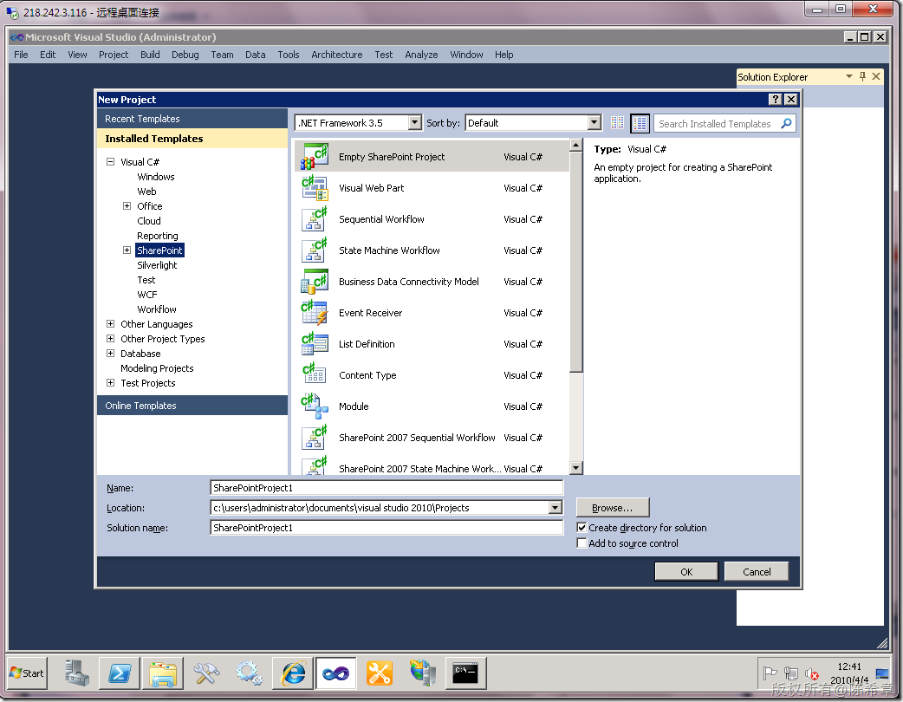
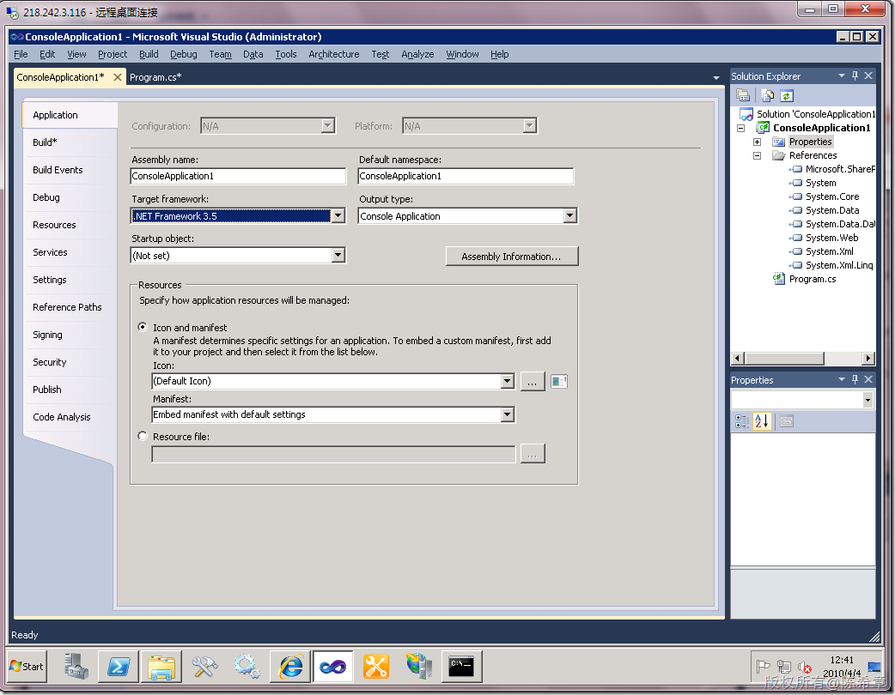
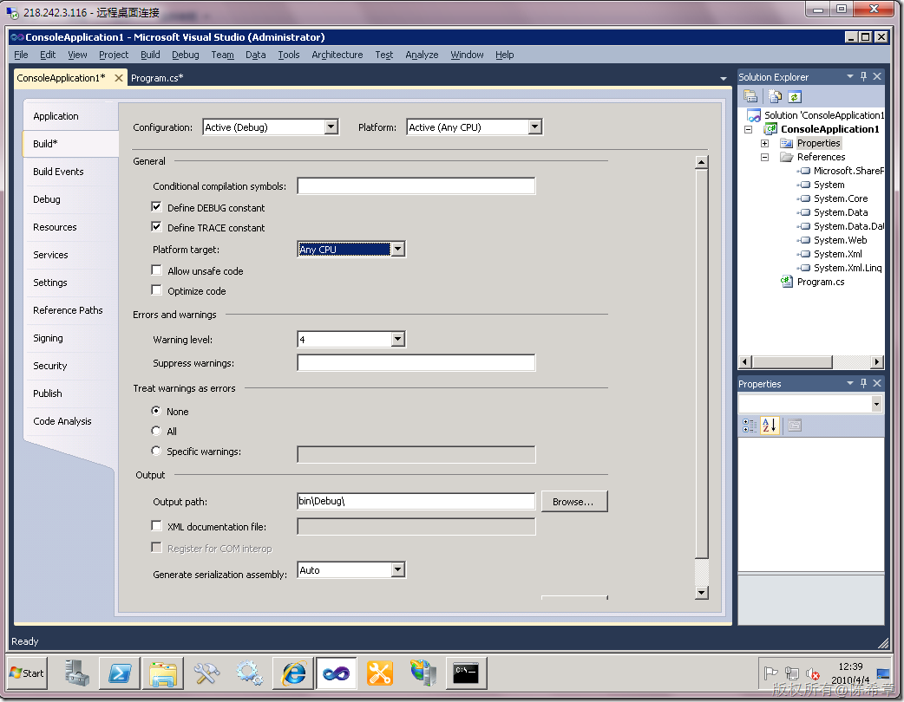
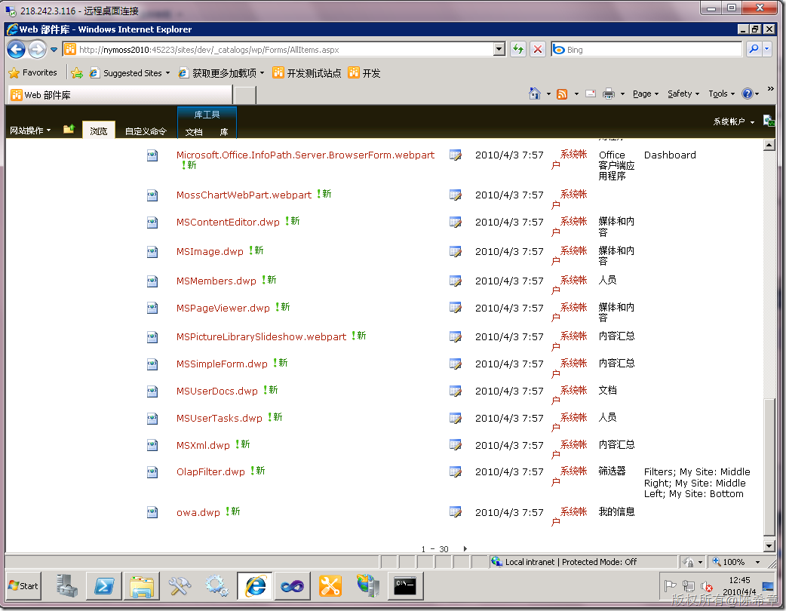
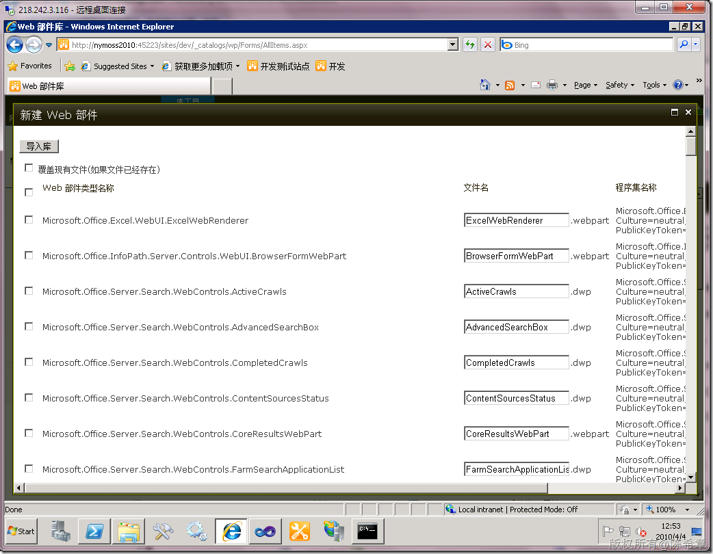

# MOSS 2010开发之注意事项 
> 原文发表于 2010-04-04, 地址: http://www.cnblogs.com/chenxizhang/archive/2010/04/04/1704116.html 

MOSS 2010已经发布了beta的版本，很多朋友已经迫不及待地想要尝尝鲜了。在开始之前，我要提醒大家下面几点

  

 1.强烈推荐用VS2010。里面有关的模板都很成熟和完整了。虽然用VS2008开发也是可以的，但我们都知道部署等有关的操作是曲折而又辛苦的。

  

 2. 框架应该特意选择.NET Framework 3.5，而不能使用默认的.NET Framework 4.0 。原因很简单，SharePoint 2010是基于.NET Framework 3.5开发的。

  

 3. 编译平台选择为X64或者AnyCPU,而不能是x86。默认是x86的 

  

    4. 不是什么都要自己开发，能够用现成的就不要自己写。尤其是那些WebPart。其实有很多内置的WebPart

  

  

 5. 尽量用英文版，尤其是beta版的阶段。这是有很多血淋林的教训的，数不胜数

 例如，我之前发现的一个bug

 [http://www.cnblogs.com/chenxizhang/archive/2010/04/04/1704088.html](http://www.cnblogs.com/chenxizhang/archive/2010/04/04/1704088.html "http://www.cnblogs.com/chenxizhang/archive/2010/04/04/1704088.html")

  

 其他注意事项，待续

