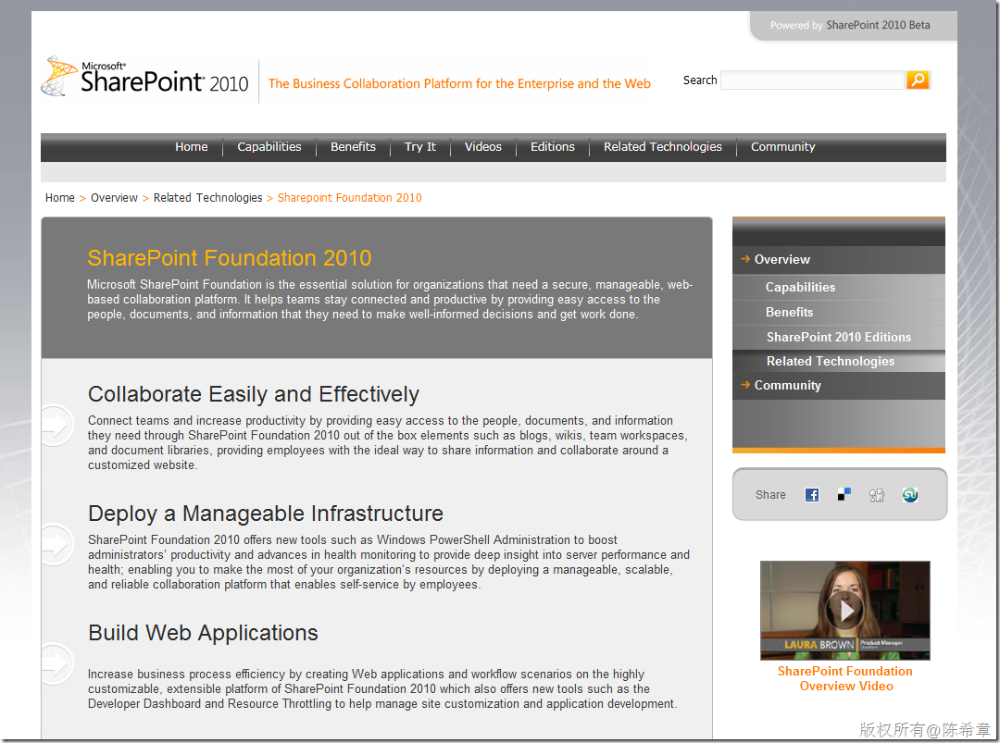

# Meet the new WSS - SharePoint Foundation 2010 
> 原文发表于 2010-04-05, 地址: http://www.cnblogs.com/chenxizhang/archive/2010/04/05/1704593.html 

<http://blogit.create.pt/blogs/raulribeiro/archive/2009/10/21/The-new-WSS-_2D00_-SharePoint-Foundation-2010.aspx>

 简单地说 ，在这一波2010的产品风潮中，原先的SharePoint Service将退出舞台，取而代之的是所谓SharePoint Foundation

 目前的产品命名有点乱，有些文档中还是声称 Windows SharePoint Service(14)。或者我们可以这样认为，SF就是对WSS的一个包装吧，目前仍然是看到有Windows SharePoint Service

 ###### [image](http://images.cnblogs.com/cnblogs_com/chenxizhang/WindowsLiveWriter/MeetthenewWSSSharePointFoundation2010_A809/image_2.png)

 关于SharePoint Foundation 2010

 <http://sharepoint2010.microsoft.com/product/related-technologies/Pages/SharePoint-Foundation-2010.aspx>

 

