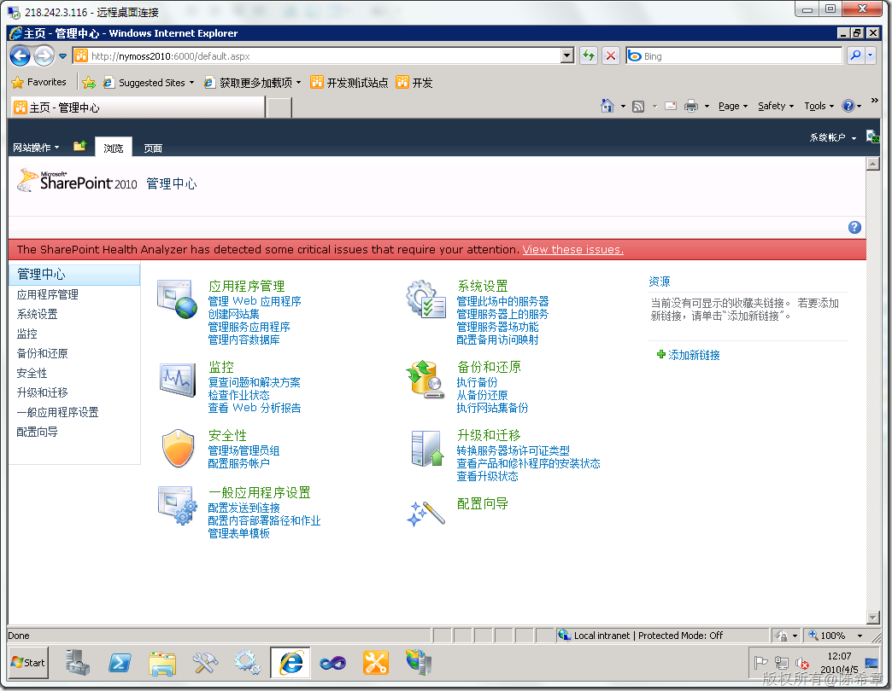
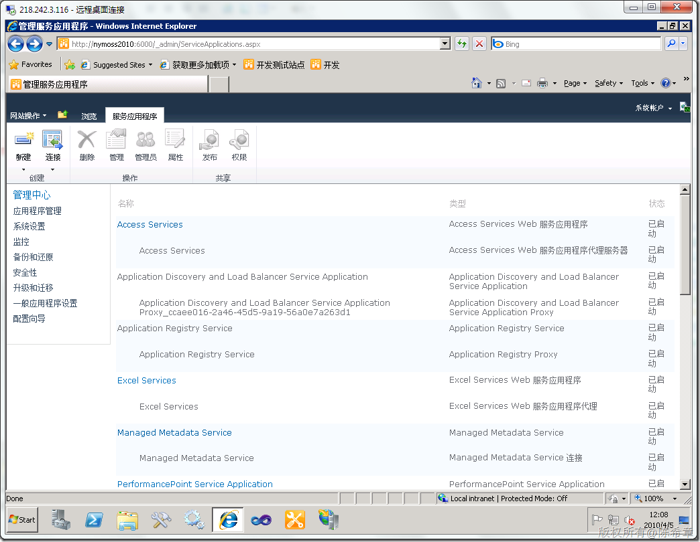
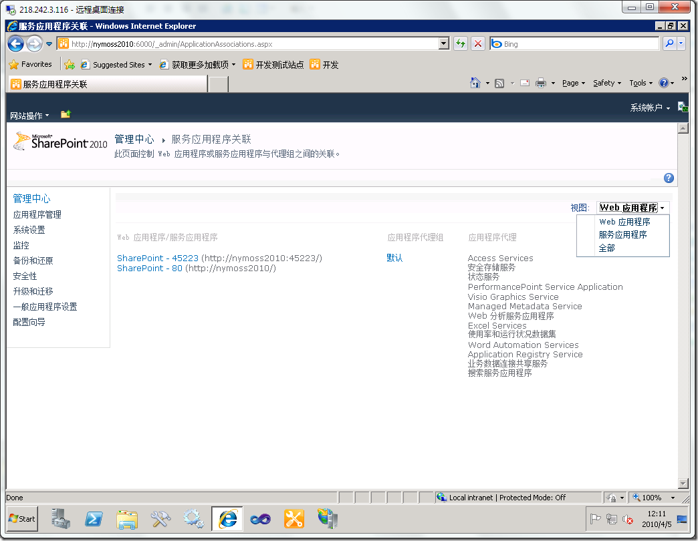
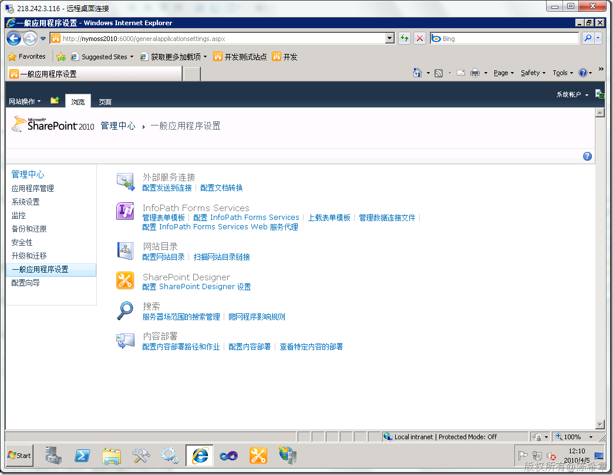

# MOSS 2010:谁动了我的“共享服务” 
> 原文发表于 2010-04-05, 地址: http://www.cnblogs.com/chenxizhang/archive/2010/04/05/1704597.html 

有关MOSS 2010中共享服务的架构，有兴趣可以参考 <http://blogs.msdn.com/spses/archive/2010/01/20/sharepoint-2010-shared-service-architecture-part-1.aspx>

  

 上一篇讲到WSS即将走进历史，其实还有很多东西随着MOSS 2010的新架构推出，都将逐渐淡出。其中一个就是“共享服务（Shared Service)”

 以前在MOSS 2007的时候，这是一个比较重要的概念，它可以有一个或者多个，每个都有一个配套的Web Application和Admin Site。

 而我们目前在管理中确实是看不到的

  

 但是，我们可以点击“管理服务应用程序”看到一些东西

  

 值得一说的是，现在添加了很多服务。这个以后再说 。完整的咧表如下

 
>  [Access Services](http://nymoss2010:6000/_admin/AccessServerSettingsPage.aspx?Id=3a59c9a14ce24624b7fb2f1a466fa023)  
> Access Services Web 服务应用程序  
> 已启动 Access Services  
> Access Services Web 服务应用程序代理服务器  
> 已启动 Application Discovery and Load Balancer Service Application  
> Application Discovery and Load Balancer Service Application  
> 已启动 Application Discovery and Load Balancer Service Application Proxy\_ccaee016-2a46-45d5-9a19-56a0e7a263d1  
> Application Discovery and Load Balancer Service Application Proxy  
> 已启动 Application Registry Service  
> Application Registry Service  
> 已启动 Application Registry Service  
> Application Registry Proxy  
> 已启动 [Excel Services](http://nymoss2010:6000/_admin/ExcelServicesAdmin.aspx?Id=5b824a0358764999be75bd2ad296303f)  
> Excel Services Web 服务应用程序  
> 已启动 Excel Services  
> Excel Services Web 服务应用程序代理  
> 已启动 [Managed Metadata Service](http://nymoss2010:6000/_Layouts/termstoremanager.aspx?tsid=00000000-0000-0000-0000-000000000000)  
> Managed Metadata Service  
> 已启动 Managed Metadata Service  
> Managed Metadata Service 连接  
> 已启动 [PerformancePoint Service Application](http://nymoss2010:6000/_admin/ManagePpsBiService.aspx?appid=587c120d-7d21-49c4-9a44-9de3fb2b5dc6)  
> PerformancePoint Service Application  
> 已启动 PerformancePoint Service Application  
> PerformancePoint Service Application Proxy  
> 已启动 [User Profile Service Application](http://nymoss2010:6000/_layouts/ManageUserProfileServiceApplication.aspx?ApplicationID=0915937f%2D79b1%2D4287%2D979d%2Dcba505cc4efa)  
> User Profile Service Application  
> 已启动 User Profile Service Application  
> User Profile Service Application Proxy  
> 已启动 [Visio Graphics Service](http://nymoss2010:6000/_admin/VisioServiceLanding.aspx?appid=db18f12f-921f-40d3-9633-5841a737b2f0)  
> Visio Graphics Service Application  
> 已启动 Visio Graphics Service  
> Visio Graphics Service 应用程序代理  
> 已启动 Web 分析服务应用程序  
> Web 分析服务应用程序  
> 已启动 Web 分析服务应用程序  
> Web 分析服务应用程序代理  
> 已启动 [Word Automation Services](http://nymoss2010:6000/_admin/WordServerManage.aspx?id=afbcd2eb37e7483a966c003940645149)  
> Word Automation Services  
> 已启动 Word Automation Services  
> Word Automation Services 代理  
> 已启动 [安全存储服务](http://nymoss2010:6000/_admin/sssvc/ManageSSSvcApplication.aspx?AppId=d3131917-07cb-471b-bf8f-40369bbc3dd2)  
> 安全存储服务应用程序  
> 已启动 [安全存储服务](http://nymoss2010:6000/_admin/sssvc/ManageSSSvcApplication.aspx?AppId=d3131917-07cb-471b-bf8f-40369bbc3dd2)  
> 安全存储服务应用程序代理  
> 已启动 安全令牌服务应用程序  
> 安全令牌服务应用程序  
> 已启动 [使用率和运行状况数据集](http://nymoss2010:6000/_admin/LogUsage.aspx)  
> 使用率和运行状况数据集服务应用程序  
> 已启动 使用率和运行状况数据集  
> 使用率和运行状况数据集代理服务器  
> 已启动 [搜索服务应用程序](http://nymoss2010:6000/searchadministration.aspx?appid=1266586a-56f2-4727-bf18-8b22746c631b)  
> 搜索服务应用程序  
> 已启动 搜索服务应用程序  
> 搜索服务应用程序代理服务器  
> 已启动 [业务数据连接共享服务](http://nymoss2010:6000/_admin/BDC/ViewBDCApplication.aspx?AppId=b51ecdd9-06c6-44a3-a668-d112edcd98c1)  
> 业务数据连接服务应用程序  
> 已启动 [业务数据连接共享服务](http://nymoss2010:6000/_admin/BDC/ViewBDCApplication.aspx?AppId=b51ecdd9-06c6-44a3-a668-d112edcd98c1)  
> 业务数据连接服务应用程序代理  
> 已启动 用于 搜索服务应用程序 的搜索管理 Web 服务  
> 搜索管理 Web 服务应用程序  
> 已启动 状态服务  
> 状态服务  
> 已启动 状态服务  
> 状态服务代理  
> 已启动
> 
> 
> 
> 
> 
> 
> 
> 
> 
> 
> 
> 
> 
> 
> 
> 
> 
> 
> 
> 
> 
> 
> 
> 
> 
> 
> 
> 
> 
> 
> 
> 
> 
> 
> 
> 
> 
> 
> 
> 
> 
> 
> 
> 
> 
> 
> 
> 
> 
> 
> 
> 
> 
> 
> 
> 
> 
> 
> 
> 
> 
> 
> 
> 

  然后如何进行关联呢？请看下面

  

 大家可能想找那个Forms Service,这里是找不到的，要到下面的页面去设置

  

 看起来还是有些乱，对吧

