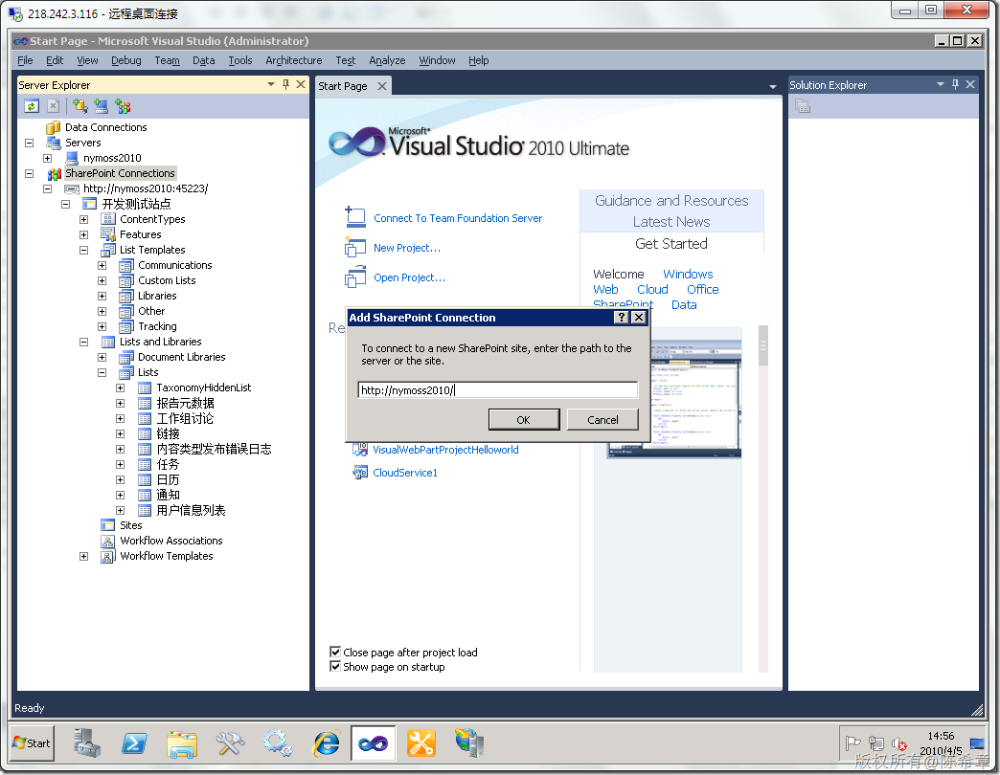
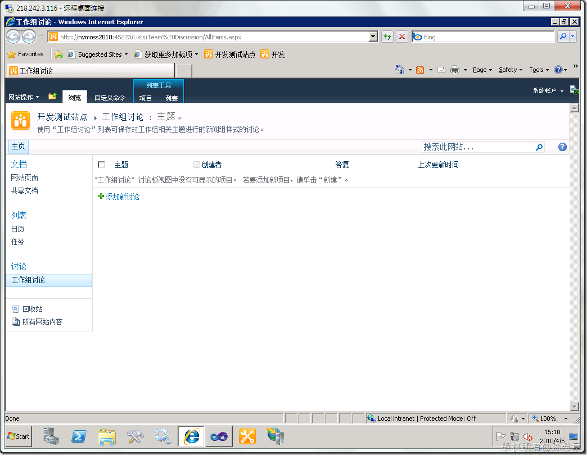

# MOSS 2010：Visual Studio 2010开发体验（1）——SharePoint Explorer 
> 原文发表于 2010-04-05, 地址: http://www.cnblogs.com/chenxizhang/archive/2010/04/05/1704680.html 


你不得不感概，原先在MOSS 2007的时代我们是多么辛苦。不是吗？

 * Visual Studio 开发体验受到局限  
适用于 WSS 的 Visual Studio 扩展  
Visual Studio Tools for Office 与 VS2008 之间的配合  
SharePoint 开发人员需要依赖于社区工具 * 开发人员不得不应对层出不穷的细节工作  
手工编辑 CAML 文件  
熟悉 WSS 的 RootFiles 目录  
手工编辑 manifest.xml 文件  
为解决方案包构建 .wsp 文件

  

 是的 ，对这些痛苦我们记忆犹新。好吧，现在是时候改变了

 * SharePoint 2010 采用端到端的开发体验  
用于浏览网站的 SharePoint Explorer  
SharePoint 2010 项目与组件模板  
适用于各种主要应用场景的可视化设计环境  
为 Visual Studio 2008 for WSS 3.0 提供迁移路径  
可由第三方开发人员进行扩展 * SharePoint 开发人员的好消息  
实现 RootFiles 目录细节的简化  
实现 .wsp 文件构建工作的简化  
减少/避免对外部工具的使用需求

  

 当然，前提是，你得拥有Visual Studio 2010,而且最好是装在服务器上面。听我的吧，这样可以避免很多问题，节省大量的时间。

 ### 这一讲介绍一下SharePoint Explorer

 这个工具是集成在Server Explorer中的

 [](http://images.cnblogs.com/cnblogs_com/chenxizhang/WindowsLiveWriter/MOSS2010VisualStudio1SharePointExplorer_D5A6/image_4.png) 

 [](http://images.cnblogs.com/cnblogs_com/chenxizhang/WindowsLiveWriter/MOSS2010VisualStudio1SharePointExplorer_D5A6/image_2.png) 

 很显然有了这个工具，就可以更好地理解一个SharePoint站点的结构了。目前这个工具，除了让开发人员更好地浏览SharePoint站点内容结构之外，如果我们在Lists上面去点击右键的话，还可以直接点位到该列表

 [](http://images.cnblogs.com/cnblogs_com/chenxizhang/WindowsLiveWriter/MOSS2010VisualStudio1SharePointExplorer_D5A6/image_14.png) 

  我觉得这个工具还不是很完善，以后可能会更加强一些。例如直接可以拖拽到程序界面上这样的功能

  

 关于 Explorer的扩展，如果有兴趣的朋友，可以参考下面的链接

 <http://msdn.microsoft.com/en-us/library/ee471438(VS.100).aspx>

  

 下面是有一个例子


```
using System.ComponentModel;
using System.ComponentModel.Composition;
using System.Windows.Forms;
using Microsoft.VisualStudio.SharePoint;
using Microsoft.VisualStudio.SharePoint.Explorer;
using Microsoft.VisualStudio.SharePoint.Explorer.Extensions;

namespace Contoso.ServerExplorerExtension
{
    [Export(typeof(IExplorerNodeTypeExtension))]
    [ExplorerNodeType(ExplorerNodeTypes.SiteNode)]
    internal class SiteNodeExtensionWithContextMenu : IExplorerNodeTypeExtension
    {
        public void Initialize(IExplorerNodeType nodeType)
        {
            nodeType.NodeMenuItemsRequested += nodeType\_NodeMenuItemsRequested;
        }

        void nodeType\_NodeMenuItemsRequested(object sender, ExplorerNodeMenuItemsRequestedEventArgs e)
        {
            IMenuItem menuItem = e.MenuItems.Add("Display Message");
            menuItem.Click += menuItem\_Click;
        }

        void menuItem\_Click(object sender, MenuItemEventArgs e)
        {
            IExplorerNode node = (IExplorerNode)e.Owner;
            MessageBox.Show(string.Format("Clicked the menu item for the '{0}' node.", node.Text));
        }
    }

    [Export(typeof(IExplorerNodeTypeExtension))]
    [ExplorerNodeType(ExtensionNodeTypes.FieldNode)]
    internal class FieldNodeExtensionWithProperty : IExplorerNodeTypeExtension
    {
        public void Initialize(IExplorerNodeType nodeType)
        {
            nodeType.NodePropertiesRequested += nodeType\_NodePropertiesRequested;
        }

        void nodeType\_NodePropertiesRequested(object sender, ExplorerNodePropertiesRequestedEventArgs e)
        {
            // Only add the property to "Body" fields.
            if (e.Node.Text == "Body")
            {
                ExampleProperty propertyObject;

                // If the properties object already exists for this node, get it from the node's annotations.
                if (!e.Node.Annotations.TryGetValue(out propertyObject))
                {
                    // Otherwise, create a new properties object and add it to the annotations.
                    propertyObject = new ExampleProperty(e.Node);
                    e.Node.Annotations.Add(propertyObject);
                }

                e.PropertySources.Add(propertyObject);
            }
        }
    }

    internal class ExampleProperty
    {
        private IExplorerNode node;
        private const string propertyId = "Contoso.ExampleProperty";
        private const string propertyDefaultValue = "This is an example property.";

        internal ExampleProperty(IExplorerNode node)
        {
            this.node = node;
        }

        // Gets or sets a simple string property. 
        [DisplayName("ContosoExampleProperty")]
        [DescriptionAttribute("This is an example property for field nodes.")]
        [DefaultValue(propertyDefaultValue)]
        public string TestProperty
        {
            get
            {
                string propertyValue;

                // Get the current property value if it already exists; otherwise, return a default value.
                if (!node.Annotations.TryGetValue(propertyId, out propertyValue))
                {
                    propertyValue = propertyDefaultValue;
                }
                return propertyValue;
            }
            set
            {
                if (value != propertyDefaultValue)
                {
                    // Store the property value in the Annotations property of the node. 
                    // Data in the Annotations property does not persist when Visual Studio exits.
                    node.Annotations[propertyId] = value;
                }
                else
                {
                    // Do not save the default value.
                    node.Annotations.Remove(propertyId);
                }
            }
        }
    }

}
```

.csharpcode, .csharpcode pre
{
 font-size: small;
 color: black;
 font-family: consolas, "Courier New", courier, monospace;
 background-color: #ffffff;
 /*white-space: pre;*/
}
.csharpcode pre { margin: 0em; }
.csharpcode .rem { color: #008000; }
.csharpcode .kwrd { color: #0000ff; }
.csharpcode .str { color: #006080; }
.csharpcode .op { color: #0000c0; }
.csharpcode .preproc { color: #cc6633; }
.csharpcode .asp { background-color: #ffff00; }
.csharpcode .html { color: #800000; }
.csharpcode .attr { color: #ff0000; }
.csharpcode .alt 
{
 background-color: #f4f4f4;
 width: 100%;
 margin: 0em;
}
.csharpcode .lnum { color: #606060; }
