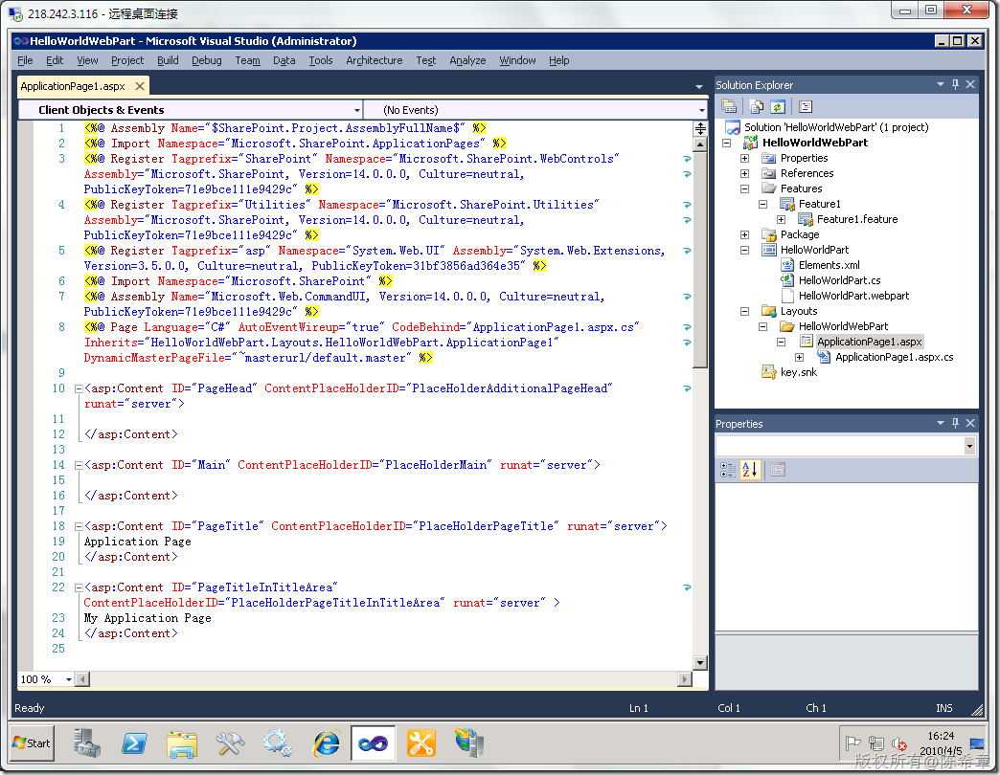

# MOSS 2010：Visual Studio 2010开发体验（4）——应用程序页面(ApplicationPage) 
> 原文发表于 2010-04-05, 地址: http://www.cnblogs.com/chenxizhang/archive/2010/04/05/1704751.html 

这是我们以前经常做的事情。应用程序页面是指那些我们自定义程序所用到的页面。例如工作流页面等等。

 以前做这个事情也相当麻烦，因为这个页面没有项目模板，需要自己编写。而且需要复制到特殊的目录中去，而且在编程的时候也会有不少要注意的。其中一个典型的问题就是如何使用网站的默认母版页

 下面来看在VS2010中是如何做的

  

  

 请注意，现在加了一个layouts的文件夹，这个其实就是映射到了\_layouts目录。这些是SharePoint的特殊目录。

 我们来观察这个自动生成的页面，它有一个DynamicMasterPageFile属性，这个属性有点奇怪，~masterurl/default.master

 其实就是引用到了网站的默认母版页。我们以前要通过代码来修改的。

 我们再来看看代码文件，请注意，它自动继承了LayoutsPageBase。这也是以前朋友会忽视的。虽然继承默认的Page类没有问题，但会丧失很多很好的特性，例如安全控制方面的

  

 我们现在对这个页面做一点点小的修改

  

     部署一下解决方案，然后在浏览器中查看这个页面

  

 作为演示目的，我们的页面并不美观，但这并不妨碍大家了解ApplicationPage开发的过程。

