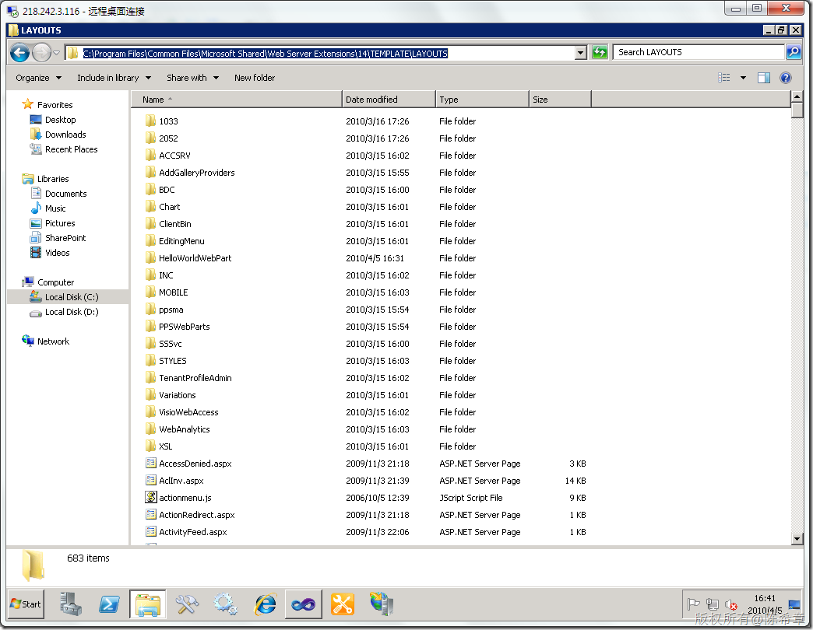
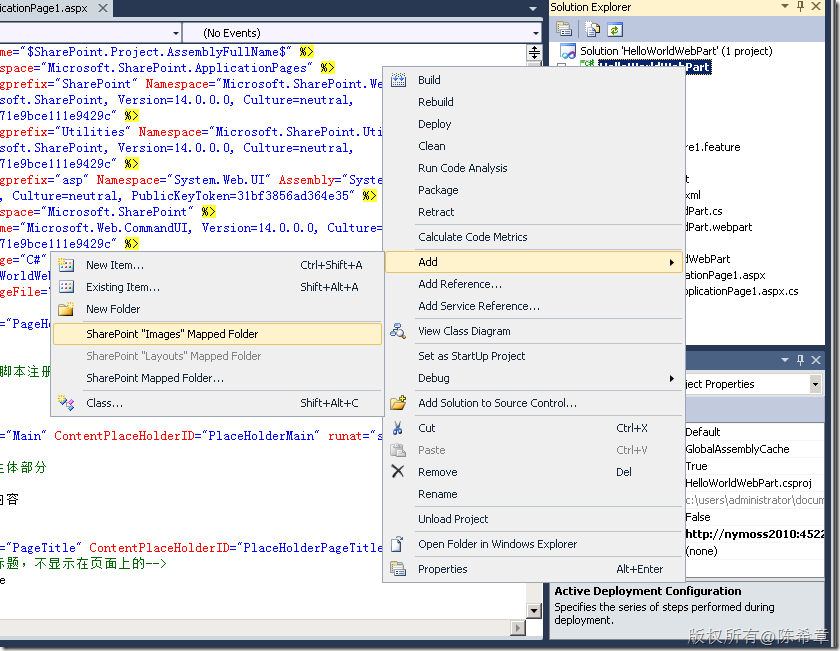
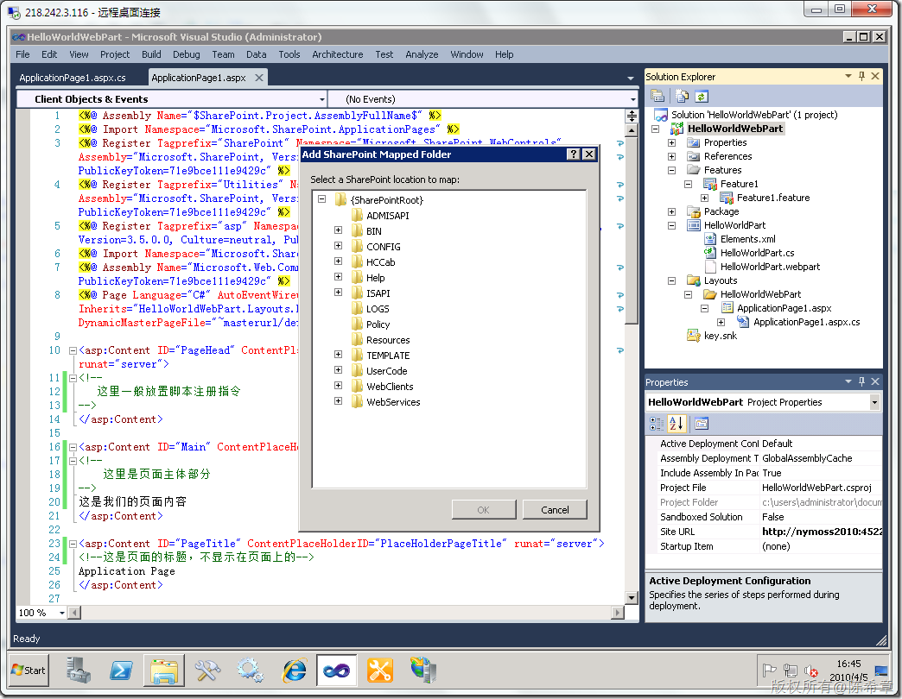

# MOSS 2010：Visual Studio 2010开发体验（5）——Mapped Folder 
> 原文发表于 2010-04-05, 地址: http://www.cnblogs.com/chenxizhang/archive/2010/04/05/1704758.html 

我们都知道，SharePoint有很多特殊的目录，例如最常见的layouts，它可以通过类似下面这样格式的地址访问到 

 <http://intranet.xizhang.com/_layouts>

  

 但是，它其实是下面这个目录

  

 那么，在我们开发的项目中可能用到这样的目录，例如我们需要向这些目录中添加一些内容的话，该怎么办呢？

 这就是所谓的Mapped Folder, 或者可以说是文件夹映射。我们在项目的快捷菜单中其实可以看到有关的子菜单

  

 常见的images和layouts可以直接添加，而其他的，在可以通过点击“SharePoint Mapped Folder…”

 

