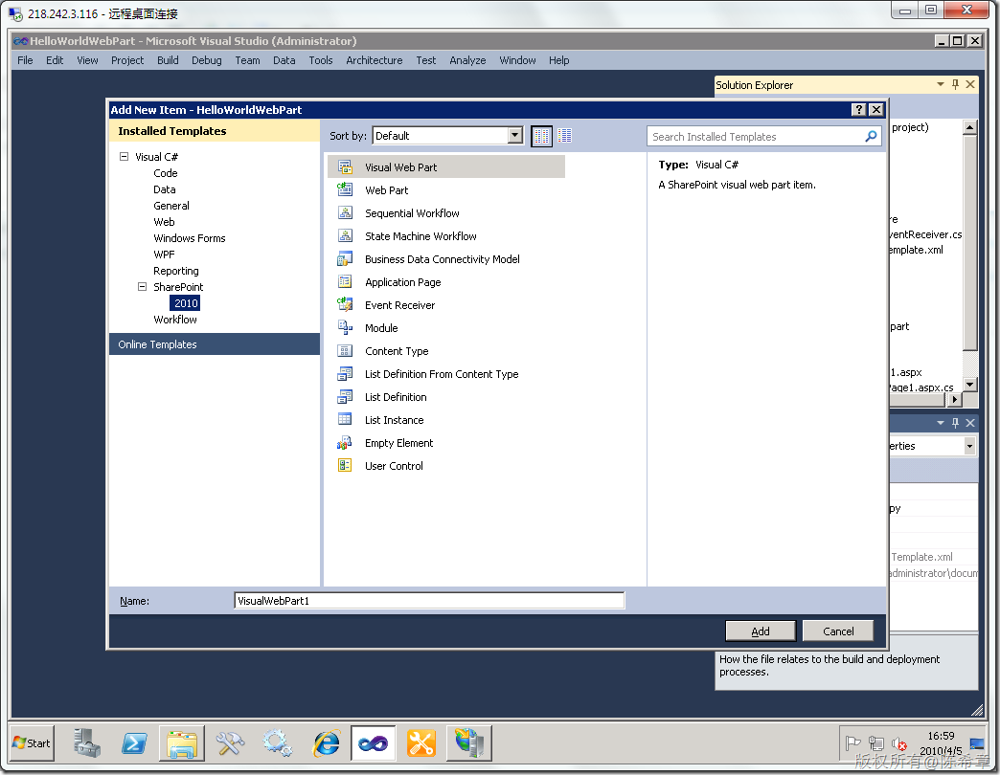
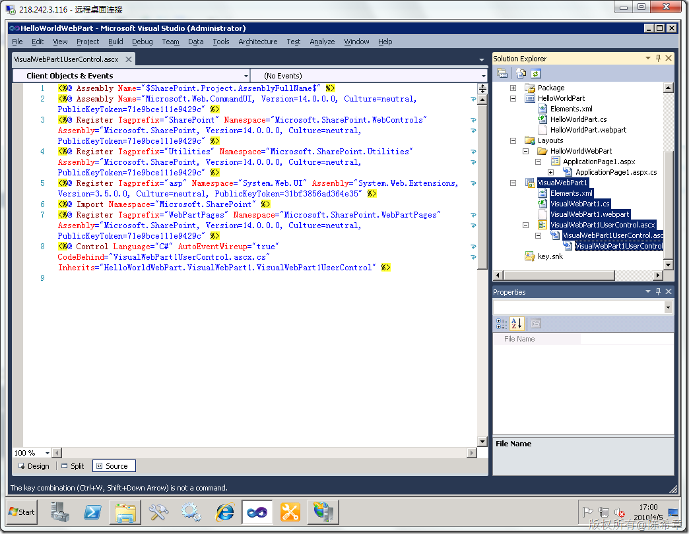
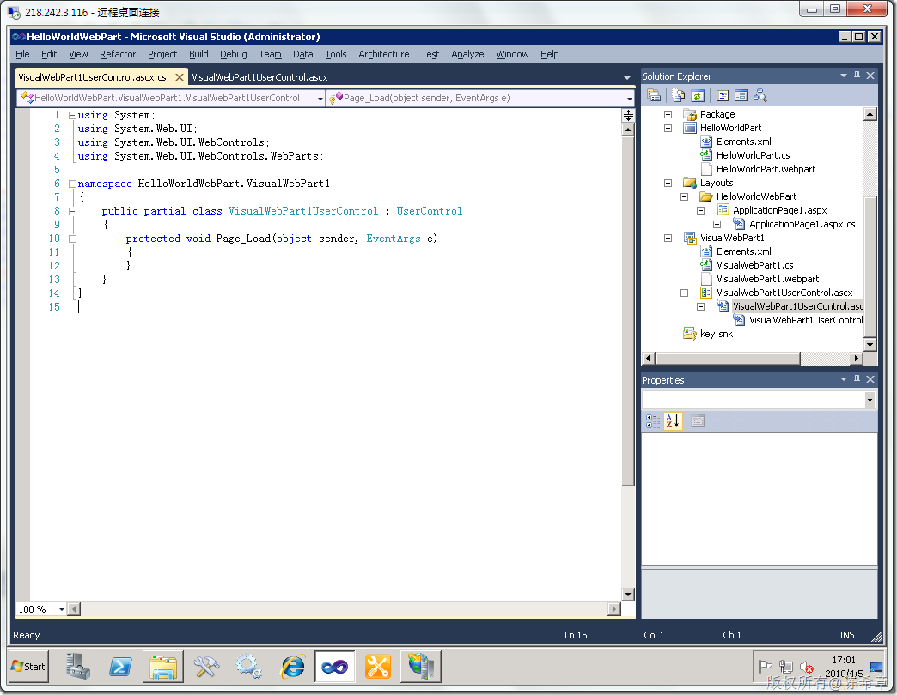
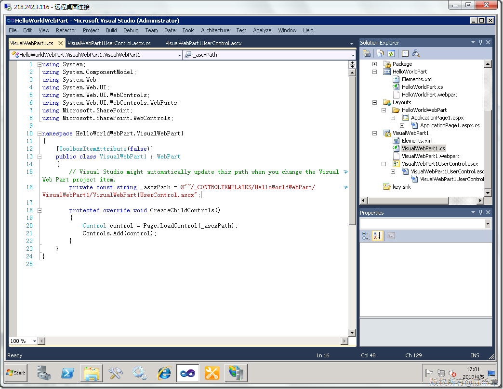
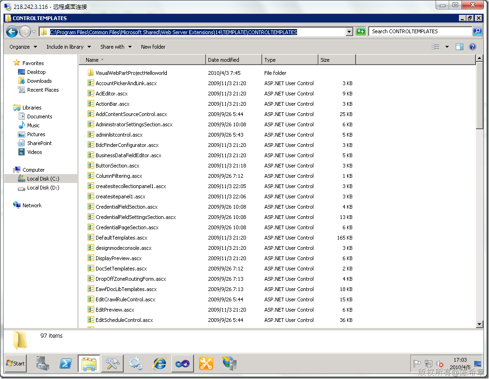
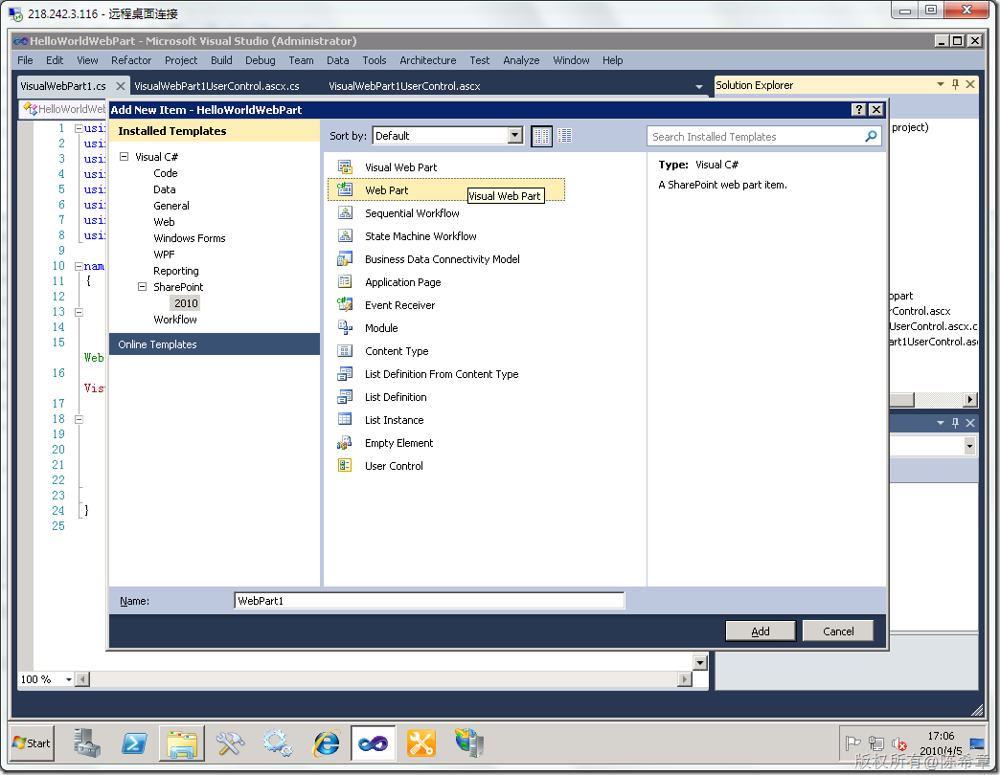
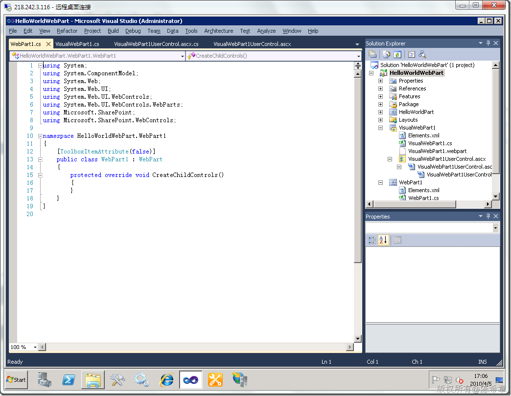

# MOSS 2010：Visual Studio 2010开发体验（6）——开发WebPart 
> 原文发表于 2010-04-05, 地址: http://www.cnblogs.com/chenxizhang/archive/2010/04/05/1704787.html 

还记得，当年WebPart被第一次引入之后，乃至后来在ASP.NET 2.0中直接支持该技术，对我们来说是多么新鲜的一个事物啊。

 它可以随意地组装，定制，而且每个用户都可以有自己的个性化设置。

  

 现在WebPart可以说是很普通的一个技术了，在SharePoint 使用WebPart几乎是必须的了解的技术。

 我们来看一下Visual Studio 2010中提供的WebPart开发工具

 总的来说，现在有一些变化的是，它将WebPart划分为两类：

 1. Visual WebPart - Standard WebPart

 我们先来看一下Visual Web Part

  

 其实，这就是我们以前使用用户控件实现的机制

  

  

 我们都知道用户控件是不可能自己转换为WebPart的，所以还需要下面这个类，它用Page.LoadControl的方式创建控件

  

 [注意]观察这个路径，其实这些ascx文件会被复制到下面的目录

  

 这个流程还是很好理解的吧，你只需要鼓掌，并且感概说，现在开发WebPart居然可以如此简单啊。

  

 Visual Web Part是有界面可以设计的，尤其适合初学者以及界面很复杂的情况。

  

 而另外一种WebPart我们之前大致也介绍到了，它就是标准的WebPart。它没有可视化的设计界面，要靠我们编码实现所有的逻辑 。

  

  

 WebPart其实并不神秘，它就是普通的ASP.NET服务器控件的一种。它有几个方法可以重写，例如CreateChildControls,Render，RendContents等等。这里就不赘述了

