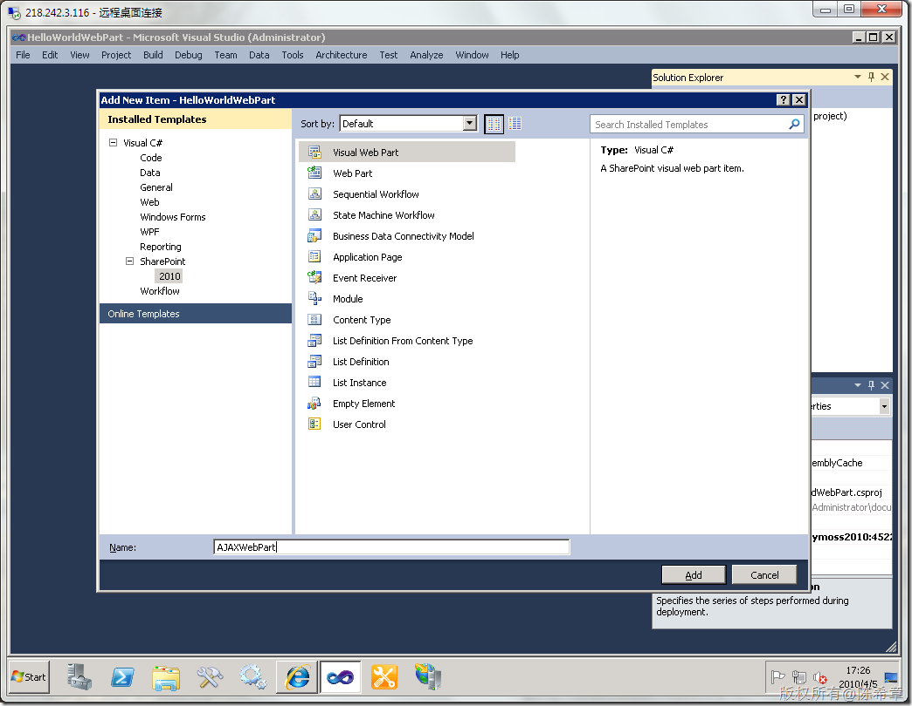
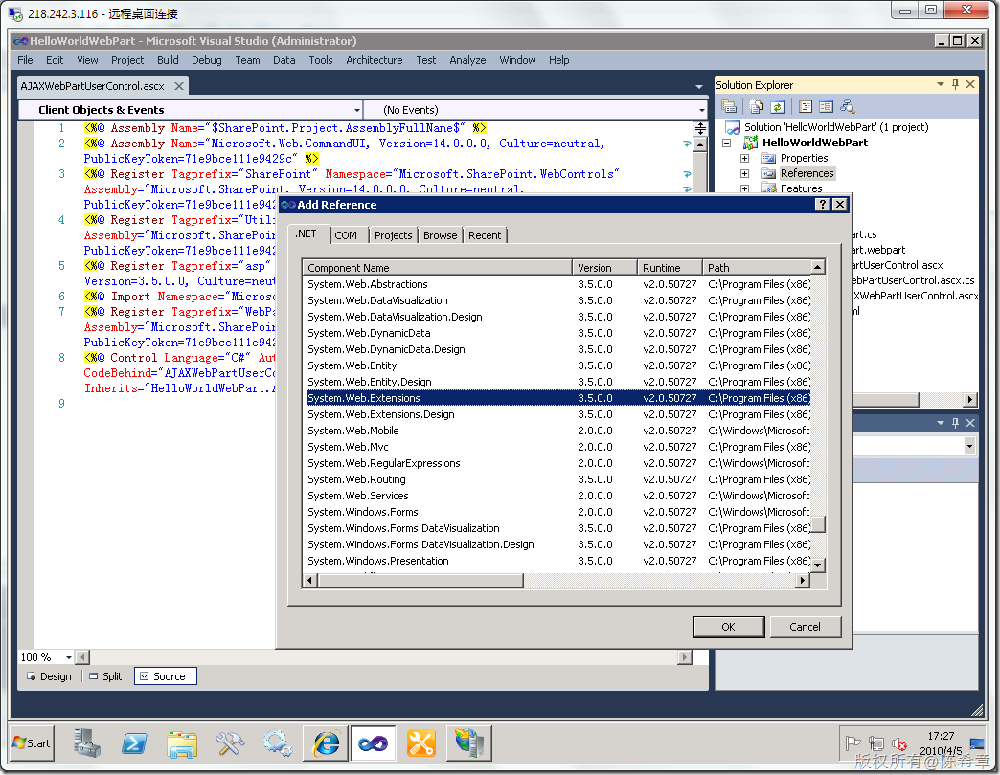
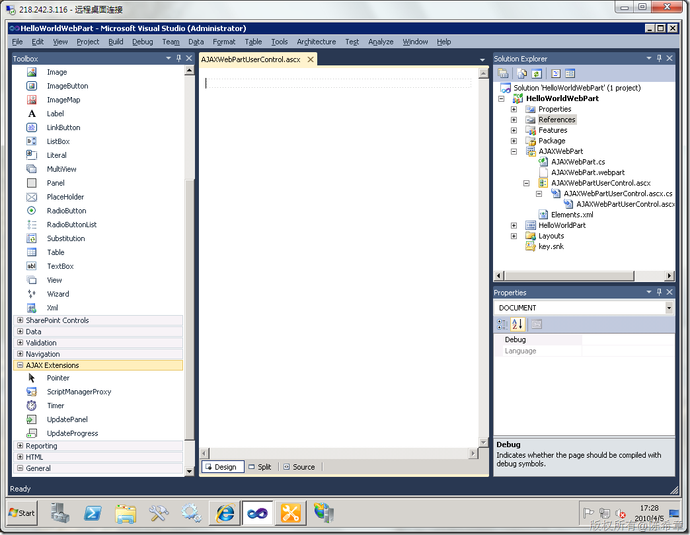
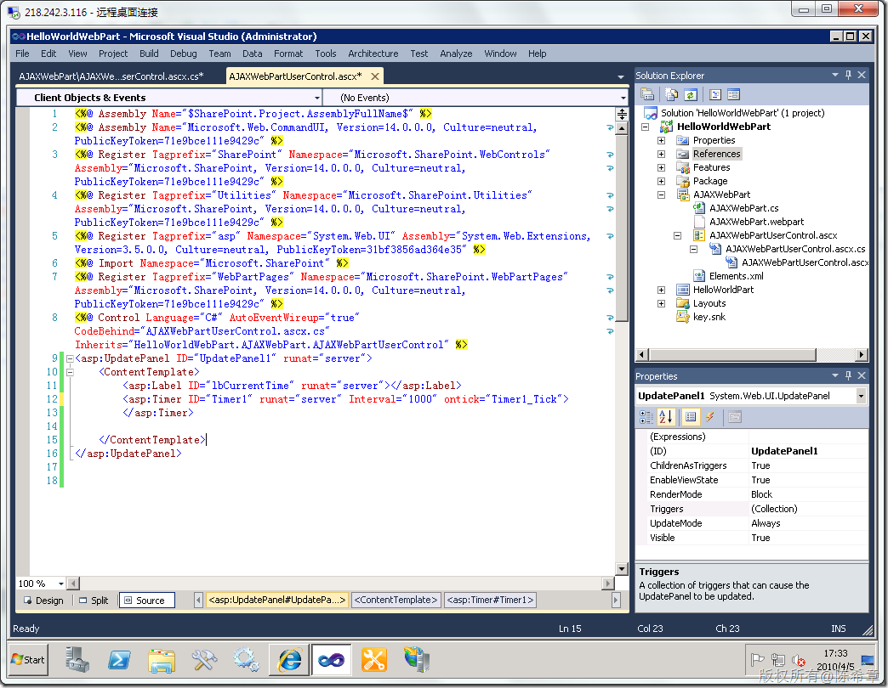
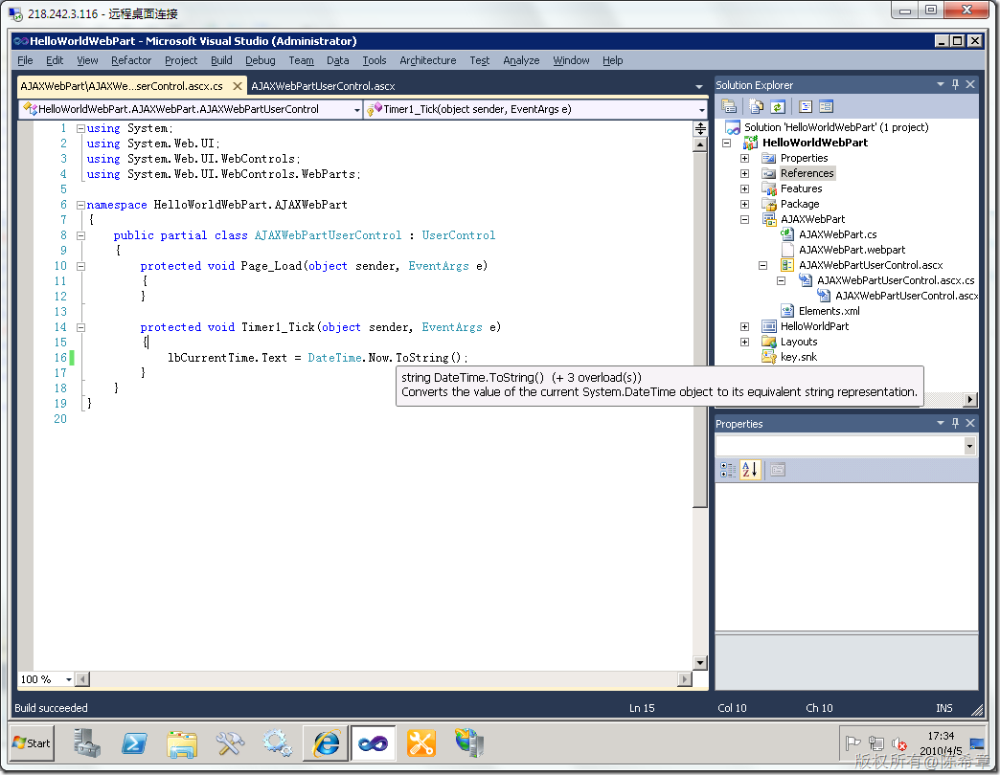
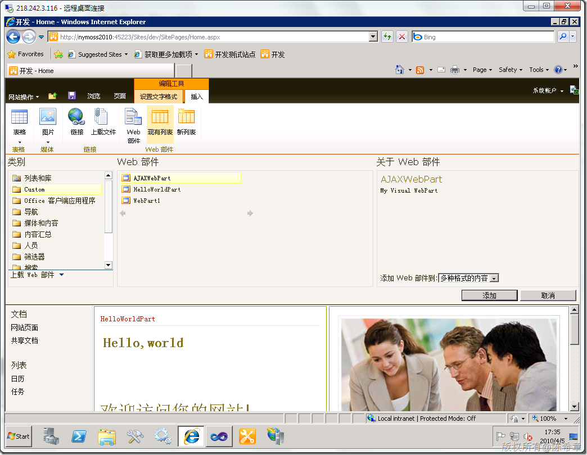
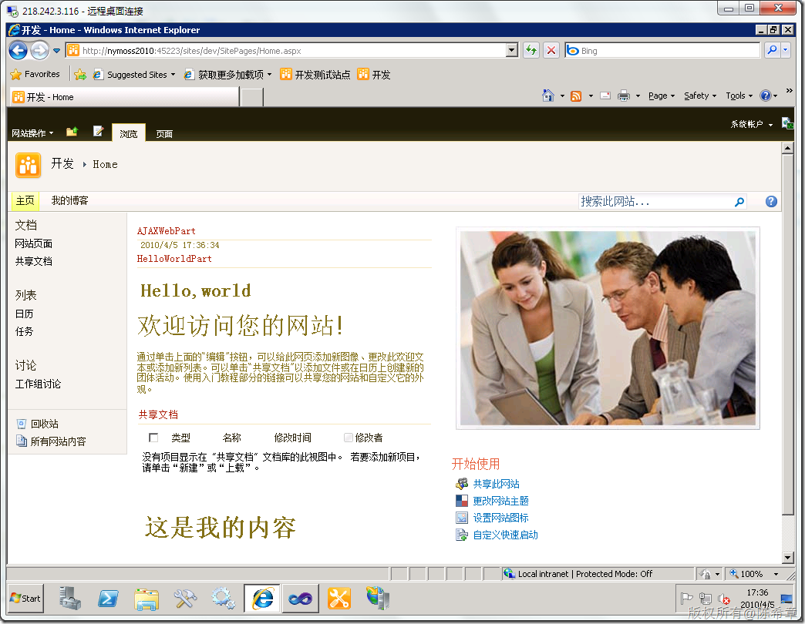

# MOSS 2010：Visual Studio 2010开发体验（7）——AJAX Web Part 
> 原文发表于 2010-04-05, 地址: http://www.cnblogs.com/chenxizhang/archive/2010/04/05/1704800.html 

AJAX，*Asynchronous JavaScript and XML* ，虽然并不是新鲜的技术，但几乎是一夜之间红遍了整个Internet，原因很简单，它提供了比较好的用户体验。现在谁都恨不得表明自己是熟悉AJAX的，虽然事实上并不见得如此。

 好吧，我们并不是讨论AJAX的一些细节，而是看看现在如何开发一个支持AJAX的WebPart

 先回想一下，以前我们该怎么做呢？我们需要安装一个AJAX Extension，然后可以用到一些控件。其实最难的并不是这些，而是我们需要去小心翼翼地修改SharePoint网站的那个web.config。不要小看这些工作，这足以让你打退堂鼓。

 MOSS 2010是天生支持AJAX的，尤其是ASP.NET所提供的AJAX框架，理应得到最优先的支持。让我们拭目以待

 1. 创建一个新的WebPart

  

 2. 添加Systme.Web.Extensions.dll的引用

  

 3. 切换到控件的设计视图，注意看工具箱中有一个AJAX Extensions的Group

  

 我们很显然会用到里面的UpdatePanel控件，这是ASP.NET AJAX框架中最常用的一个控件。

 作为演示目的，我这里用了一个Timer，我会让它每秒钟刷新一下lbCurrentTime这个Label，让它显示当前时间。

  

  

 4. 部署这个解决方案，并在页面中添加这个WebPart

  

  

  

 不要怀疑，这个WebPart的内容会每秒钟刷新一次，但页面并不需要刷新。这就是AJAX。

 当然，这肯定不是AJAX的全部，甚至连AJAX的最基本的都谈不上，你说的很对

 [注意]千万不要真的在你的应用中为了每秒钟刷新一下时间去这样做。你完全可以用Javascript实现同样的功能

 所以，我现在还是先将它删除为好，以免我的服务器被我弄崩溃了，呵呵

