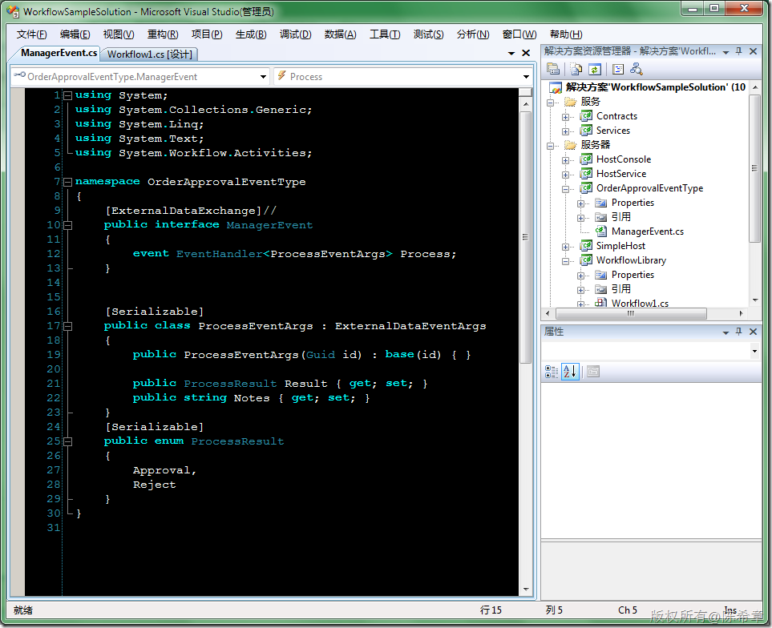

# 关于工作流（Workflow Foundation）的一些总结归纳 
> 原文发表于 2010-04-21, 地址: http://www.cnblogs.com/chenxizhang/archive/2010/04/21/1716774.html 


#### 其实，以我的体会，工作流（Workflow Foundation）从它一诞生就褒贬不一。至少它确实目前看起来还是比较难用。在.NET 3.5以及之前的版本中，为了实现工作流，我们还是需要编写相当多的代码。

  

 我觉得，WF给我们带来的主要有几点是值得了解的

 1. 通过可视化的界面将流程设计与程序逻辑分离开来。
--------------------------

 流程设计的可以只管流程，他们不要知道怎么做。流程设计的人员可能（或者一定）不会用Visual Studio，他们可以使用一些简单的设计器工具。例如下面的这个小例子就是一个独立的程序，上面包装了WF的设计器。结合自定义Activity的设计，可以将业务逻辑隐藏起来。

 [](http://images.cnblogs.com/cnblogs_com/chenxizhang/WindowsLiveWriter/fa2050da86a9_7272/image_2.png) 

 [](http://images.cnblogs.com/cnblogs_com/chenxizhang/WindowsLiveWriter/fa2050da86a9_7272/image_4.png) 

  

 2.业务逻辑的数据还是需要我们自己设计数据库保存以及维护的
-----------------------------

 这是很多人疑惑的，他们觉得既然有Workflow Foundation，就万事大吉了。因为工作流实例确实也有数据，而且我们可以持久化将其保存起来嘛。

 停！这不是一个正确的想法。工作流的持久化服务顾名思义，其实主要是为了给我们维护长时间工作的流程信息的（可以在空闲的时候卸载，保存到数据库等）。

 大家应该这样理解，Workflow Foundation只是管流程的部分，它不管数据。

 没错，它只管流程。这有什么问题么，它管好这个就够了，而且确实能帮很大的忙，不是吗？

 这样，我们就可以将注意力放在业务数据的管理，而不是流程状态的管理之类。

  

 3. 一般一套工作流的解决方案需要包含哪些组件
-----------------------

 [](http://images.cnblogs.com/cnblogs_com/chenxizhang/WindowsLiveWriter/fa2050da86a9_7272/image_6.png) 

 请注意上面选中的项目，我来解释一下

 3.1 WorkflowLibrary 这个项目包含了工作流设计，它是可视化设计的成果。下图是一个典型的审批流程

 [](http://images.cnblogs.com/cnblogs_com/chenxizhang/WindowsLiveWriter/fa2050da86a9_7272/image_8.png) 

 3.2 OrderApprovalEventType 这个项目包含了工作流设计时可能会用到的一些接口和事件定义。为什么需要用事件呢？一般我们的流程如果需要等待用户干预，诸如审批之类的情况，就需要这样做，因为它可能不是立即发生的。

 [](http://images.cnblogs.com/cnblogs_com/chenxizhang/WindowsLiveWriter/fa2050da86a9_7272/image_10.png) 

 注意，接口要标记为ExternalDataExchange，事件参数需要继承ExternalDataEventArgs，而且必须可序列化

  

 3.3 Contracts 这个项目是标准的WCF合约定义，因为我们是分了服务器和客户端的，他们之间通过WCF通讯，包括创建流程，以及激发事件等等

 [](http://images.cnblogs.com/cnblogs_com/chenxizhang/WindowsLiveWriter/fa2050da86a9_7272/image_12.png) 

 3.4 Services，这就是具体实现的WCF服务，在这里可以启动工作流运行时，并且按照客户端指令做相应的事情。这里的代码是相当多的。

 [](http://images.cnblogs.com/cnblogs_com/chenxizhang/WindowsLiveWriter/fa2050da86a9_7272/image_14.png) 


```
using System;
using System.Collections.Generic;
using System.Linq;
using Contracts;

using System.ServiceModel;
using System.Workflow.Runtime;

using OrderApprovalEventType;
using System.Workflow.Activities;

using System.Workflow.Runtime.Hosting;
using System.Workflow.Runtime.Tracking;


namespace Services
{
    [ServiceBehavior(InstanceContextMode=InstanceContextMode.Single)]//只有一个实例
    public class OrderService:IOrderService
    {
        //运行时
        private WorkflowRuntime runtime = null;

        //所有实例
        private List<WorkflowIntanceData> instances = new List<WorkflowIntanceData>();
        //本地服务
        LocalService local = null;

        public OrderService() {
            runtime = new WorkflowRuntime();

            //添加数据交换服务，可以激发事件
            ExternalDataExchangeService svr = new ExternalDataExchangeService();
            runtime.AddService(svr);

            local = new LocalService();
            svr.AddService(local);

            //添加持久化服务，保存实例
            //F:\Windows\Microsoft.NET\Framework\v3.0\Windows Workflow Foundation\SQL\zh-CHS这里会有脚本
            var db = "server=(local);database=WorkflowFoundation;integrated security=true";
            SqlWorkflowPersistenceService sqlsvc = new SqlWorkflowPersistenceService(db);
            runtime.AddService(sqlsvc);


            //添加跟踪服务，可以对服务进行诊断和调试
            SqlTrackingService tracksvc = new SqlTrackingService(db);
            runtime.AddService(tracksvc);
            
            

            //绑定有关的事件
            runtime.WorkflowStarted += new EventHandler<WorkflowEventArgs>(runtime\_WorkflowStarted);
            runtime.WorkflowCompleted += new EventHandler<WorkflowCompletedEventArgs>(runtime\_WorkflowCompleted);
            runtime.WorkflowCreated += new EventHandler<WorkflowEventArgs>(runtime\_WorkflowCreated);
            runtime.WorkflowAborted += new EventHandler<WorkflowEventArgs>(runtime\_WorkflowAborted);
            runtime.WorkflowTerminated += new EventHandler<WorkflowTerminatedEventArgs>(runtime\_WorkflowTerminated);
            runtime.WorkflowUnloaded += new EventHandler<WorkflowEventArgs>(runtime\_WorkflowUnloaded);

            runtime.StartRuntime();//启动运行时
            Console.WriteLine("工作流服务器已经准备就绪");


            
            //加载那些保存好的流程实例
            foreach (var item in sqlsvc.GetAllWorkflows())
            {
                var instance =(WorkflowLibrary.Workflow1)runtime.GetWorkflow(item.WorkflowInstanceId).GetWorkflowDefinition();

                instances.Add(
                    new WorkflowIntanceData()
                    {
                        Id = item.WorkflowInstanceId,
                        Amount = instance.Amount
                    });


            }
        }

        void runtime\_WorkflowUnloaded(object sender, WorkflowEventArgs e)
        {
            Console.WriteLine("时间:{0},卸载流程:{1}", DateTime.Now, e.WorkflowInstance.InstanceId);
            
        }

        void runtime\_WorkflowTerminated(object sender, WorkflowTerminatedEventArgs e)
        {
            

            Console.WriteLine("时间:{0},终止流程:{1}", DateTime.Now, e.WorkflowInstance.InstanceId);
            
        }

        void runtime\_WorkflowAborted(object sender, WorkflowEventArgs e)
        {
            Console.WriteLine("时间:{0},中断流程:{1}", DateTime.Now, e.WorkflowInstance.InstanceId);
            
            
        }

        void runtime\_WorkflowCreated(object sender, WorkflowEventArgs e)
        {
            Console.WriteLine("时间:{0},创建流程:{1}", DateTime.Now, e.WorkflowInstance.InstanceId);
            
            
        }

        void runtime\_WorkflowCompleted(object sender, WorkflowCompletedEventArgs e)
        {
            var found = instances.FirstOrDefault(d => d.Id == e.WorkflowInstance.InstanceId);
            if (found != null)
                instances.Remove(found);

            Console.WriteLine("时间:{0},完成流程:{1}", DateTime.Now, e.WorkflowInstance.InstanceId);
            
            
        }

        void runtime\_WorkflowStarted(object sender, WorkflowEventArgs e)
        {
            Console.WriteLine("时间:{0},启动流程:{1}", DateTime.Now, e.WorkflowInstance.InstanceId);
            
        }


        #region IOrderService 成员

        public void StartRequest(Guid id, int amount)
        {
            //准备数据
            var initParam =new Dictionary<string,object>();
            initParam.Add("Amount",amount);

            //创建实例
            var instance = runtime.CreateWorkflow(
                typeof(WorkflowLibrary.Workflow1),
                initParam,
                id);

            //保存有关数据
            instances.Add(
                new WorkflowIntanceData(){
                    Id = id,
                    Amount = amount,
                    RequestEmployee="陈希章"
                });

            

            //启动实例
            instance.Start();


        }

        public void ProcessRequest(Guid id, OrderApprovalEventType.ProcessResult result, string notes)
        {

            var args = new ProcessEventArgs(id);
            args.Result = result;
            args.Notes = notes;


            //从集合中删除掉有关的实例

            var found = instances.FirstOrDefault(d => d.Id == id);
            if (found != null)
                instances.Remove(found);


            local.RaiseEvent(args);//激发事件

             
        }

        public List<WorkflowIntanceData> GetWorkflowInstances()
        {
            return instances.Where(d => d.Amount >= 2000).ToList();
        }

        #endregion

        #region IOrderService 成员


        public void UnLoad(Guid id)
        {
            runtime.GetWorkflow(id).Unload();//要求开启MSDTC服务
        }

        #endregion

        ~OrderService() { 
            //析构的时候将所有未完成的工作流实例保存起来
            foreach (var item in runtime.GetLoadedWorkflows())
            {
                item.Unload();
            }
        }

        public void UnloadAllInstances() {
            foreach (var item in runtime.GetLoadedWorkflows())
            {
                item.Unload();
            }
        }

    }

    [Serializable]//这个必须标记为可序列化
    internal class LocalService : ManagerEvent
    {

        #region ManagerEvent 成员

        public event EventHandler<ProcessEventArgs> Process;

        #endregion


        internal void RaiseEvent(ProcessEventArgs e) {
            //这里可能要更新数据库

            if (Process != null)
                Process(this, e);
        }
    }
}

```

.csharpcode, .csharpcode pre
{
 font-size: small;
 color: black;
 font-family: consolas, "Courier New", courier, monospace;
 background-color: #ffffff;
 /*white-space: pre;*/
}
.csharpcode pre { margin: 0em; }
.csharpcode .rem { color: #008000; }
.csharpcode .kwrd { color: #0000ff; }
.csharpcode .str { color: #006080; }
.csharpcode .op { color: #0000c0; }
.csharpcode .preproc { color: #cc6633; }
.csharpcode .asp { background-color: #ffff00; }
.csharpcode .html { color: #800000; }
.csharpcode .attr { color: #ff0000; }
.csharpcode .alt 
{
 background-color: #f4f4f4;
 width: 100%;
 margin: 0em;
}
.csharpcode .lnum { color: #606060; }

.csharpcode, .csharpcode pre
{
 font-size: small;
 color: black;
 font-family: consolas, "Courier New", courier, monospace;
 background-color: #ffffff;
 /*white-space: pre;*/
}
.csharpcode pre { margin: 0em; }
.csharpcode .rem { color: #008000; }
.csharpcode .kwrd { color: #0000ff; }
.csharpcode .str { color: #006080; }
.csharpcode .op { color: #0000c0; }
.csharpcode .preproc { color: #cc6633; }
.csharpcode .asp { background-color: #ffff00; }
.csharpcode .html { color: #800000; }
.csharpcode .attr { color: #ff0000; }
.csharpcode .alt 
{
 background-color: #f4f4f4;
 width: 100%;
 margin: 0em;
}
.csharpcode .lnum { color: #606060; }

注意：这里有一个所谓本地服务的概念，是要实现第二步的那个接口，并编写有关触发事件的代码


3.5 HostService 如上都准备好之后，接下来就是通过一定的方式托管这些服务了。我们可以采用Windows Service来托管


[](http://images.cnblogs.com/cnblogs_com/chenxizhang/WindowsLiveWriter/fa2050da86a9_7272/image_16.png) 


3.6 SimpleClient 最后当然少不了要有客户端界面来实现一些操作。我们这里使用了Windows Forms作为界面。


[](http://images.cnblogs.com/cnblogs_com/chenxizhang/WindowsLiveWriter/fa2050da86a9_7272/image_18.png) 


```
using System;
using System.Windows.Forms;

using System.ServiceModel;
using Contracts;

namespace SimpleClient
{
    public partial class Form1 : Form
    {

        IOrderService proxy = null;


        public Form1()
        {
            InitializeComponent();
        }

        protected override void OnLoad(EventArgs e)
        {
            base.OnLoad(e);

            ChannelFactory<IOrderService> factory = new ChannelFactory<IOrderService>(new BasicHttpBinding(), new EndpointAddress("http://localhost:8080/OrderService"));


            proxy = factory.CreateChannel();
        }

        private void btRequest\_Click(object sender, EventArgs e)
        {
            int amount = int.Parse(txtAmount.Text);
            proxy.StartRequest(Guid.NewGuid(), amount);
            MessageBox.Show("已经发起了一个订单");
        }

        private void btGet\_Click(object sender, EventArgs e)
        {
            dgvRequests.DataSource = proxy.GetWorkflowInstances();

        }

        private void dgvRequests\_CellEnter(object sender, DataGridViewCellEventArgs e)
        {
            btOK.Enabled = btCancel.Enabled = true;
        }

        private void dgvRequests\_CellLeave(object sender, DataGridViewCellEventArgs e)
        {
            //btOK.Enabled = btCancel.Enabled = false;

        }

        private void btOK\_Click(object sender, EventArgs e)
        {
            var row = dgvRequests.Rows[dgvRequests.SelectedCells[0].RowIndex];
            var id = (Guid)row.Cells[0].Value;


            proxy.ProcessRequest(
                id, OrderApprovalEventType.ProcessResult.Approval, txtNotes.Text);


                
        }

        private void btCancel\_Click(object sender, EventArgs e)
        {
            var row = dgvRequests.Rows[dgvRequests.SelectedCells[0].RowIndex];
            var id = (Guid)row.Cells[0].Value;


            proxy.ProcessRequest(
                id, OrderApprovalEventType.ProcessResult.Reject, txtNotes.Text);
        }

        private void btUnload\_Click(object sender, EventArgs e)
        {
            var row = dgvRequests.Rows[dgvRequests.SelectedCells[0].RowIndex];
            var id = (Guid)row.Cells[0].Value;

            proxy.UnLoad(id);
        }
    }
}

```

这样，一套工作流解决方案就做好了。这个架构可以供很多朋友参考


 


另外，下面有几篇有关的文章可以参考学习


#### 工作流内部工作原理（一）


<http://blogs.msdn.com/cnflow/archive/2010/04/16/9996989.aspx>


工作流内部工作原理（二）


[http://blogs.msdn.com/cnflow/archive/2010/04/16/9996992.aspx](http://blogs.msdn.com/cnflow/archive/2010/04/16/9996992.aspx "http://blogs.msdn.com/cnflow/archive/2010/04/16/9996992.aspx")


工作流内部工作原理（三）


[http://blogs.msdn.com/cnflow/archive/2010/04/16/9996995.aspx](http://blogs.msdn.com/cnflow/archive/2010/04/16/9996995.aspx "http://blogs.msdn.com/cnflow/archive/2010/04/16/9996995.aspx")

