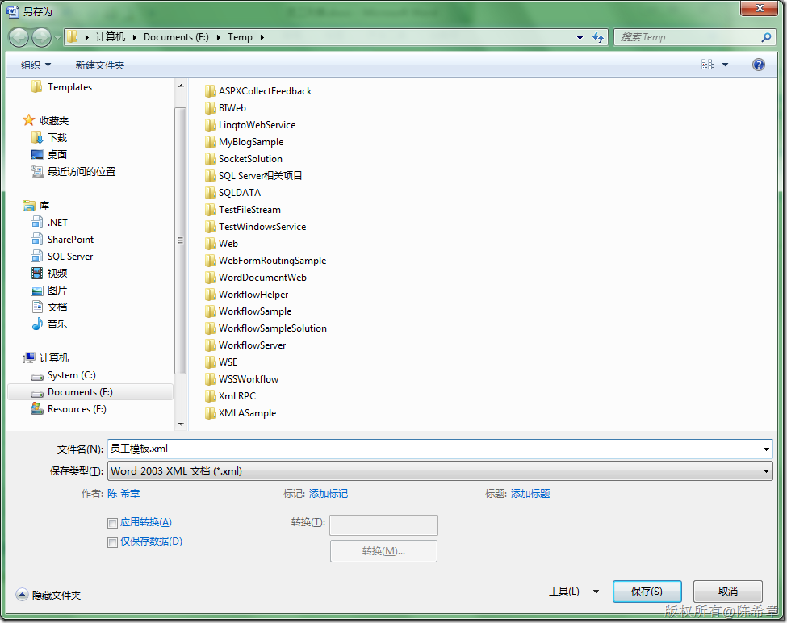
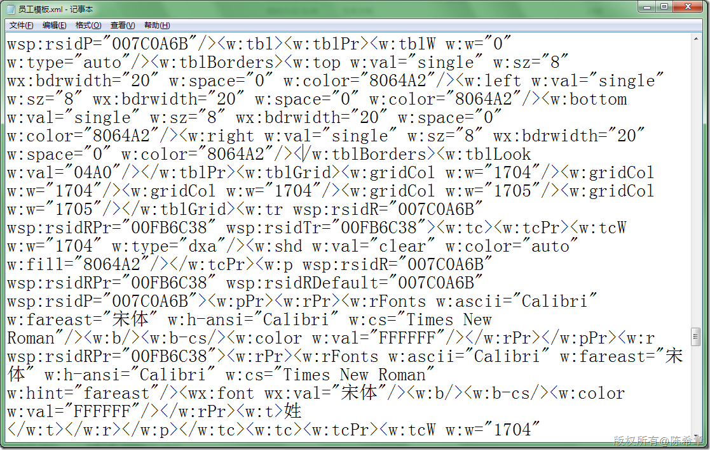
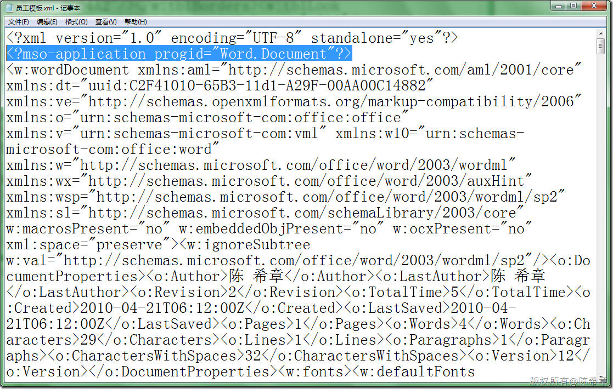
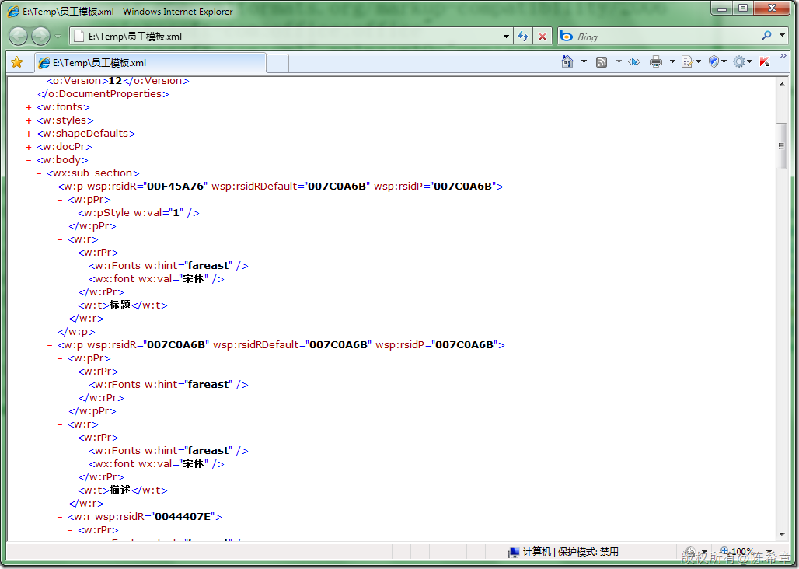
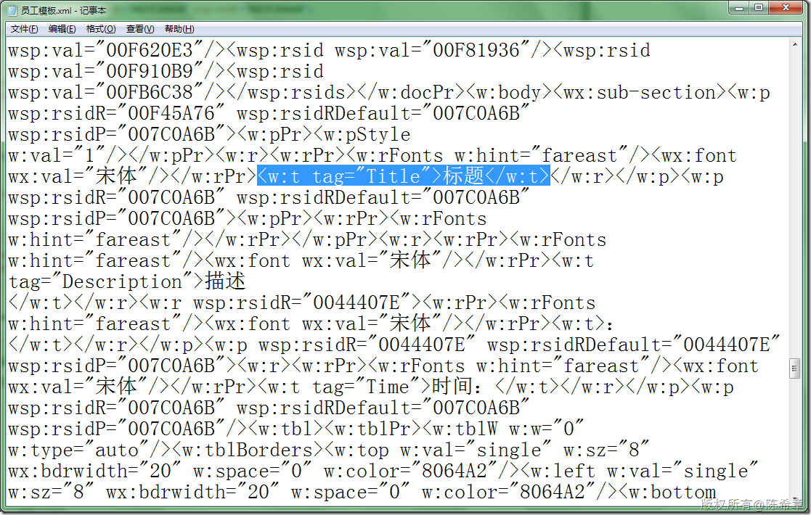
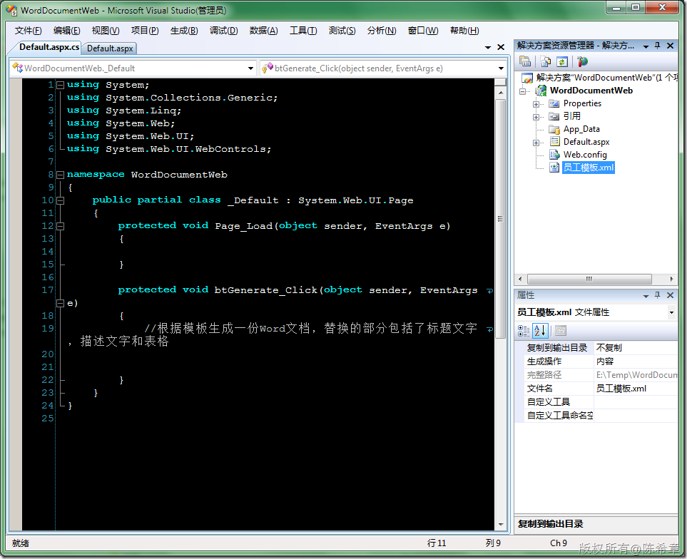
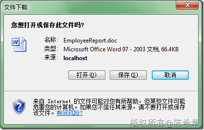
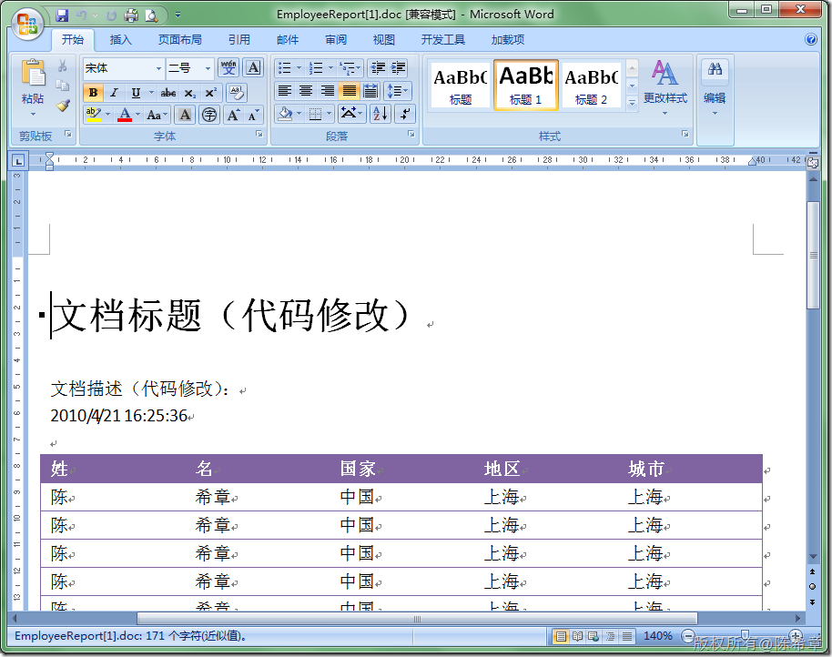

# 如何在不安装Word的情况下生成Word文档 
> 原文发表于 2010-04-21, 地址: http://www.cnblogs.com/chenxizhang/archive/2010/04/21/1717342.html 


我们的需求是这样的

 1. 有如下这样一份Word文档的模板

 [](http://images.cnblogs.com/cnblogs_com/chenxizhang/WindowsLiveWriter/WordWord_C30D/image_16.png) 

 2. 我们需要在服务器端动态生成这样的文件，每次需要换的内容是标题、描述、时间。而且应该把员工列表读出来，填充在下面的表格中

  

  

 我们的解决方案是：

 1. 在服务端安装Word，然后通过使用word的com模型，诸如word.application, word.document等对象去操作和生成文档。

 这种方式的问题就是服务器必须安装Word，这可能在很多客户那边是没有办法去做到的。

  

 2. 通过xml的方式生成word文档。这就是本篇日志主要讲的东西。

  

 首先，我们将word文档全部做好，包括格式设置。如上图所示。

 接下来，我们将该文档保存为XML格式

 [](http://images.cnblogs.com/cnblogs_com/chenxizhang/WindowsLiveWriter/WordWord_C30D/image_6.png) 

 这个文档是怎么样的呢？

 [](http://images.cnblogs.com/cnblogs_com/chenxizhang/WindowsLiveWriter/WordWord_C30D/image_8.png) 

 看起来有点乱，对吧？没关系，我们将有关的架构稍微理一下就明白了

 将该文件在IE中打开。注意首先将下面这句话删除掉

 [](http://images.cnblogs.com/cnblogs_com/chenxizhang/WindowsLiveWriter/WordWord_C30D/image_10.png) 

 [](http://images.cnblogs.com/cnblogs_com/chenxizhang/WindowsLiveWriter/WordWord_C30D/image_12.png) 

 为了后面能够快速地对该文档进行修改和扩展，我们给之前写好文字的XML元素处添加几个tag。

 [](http://images.cnblogs.com/cnblogs_com/chenxizhang/WindowsLiveWriter/WordWord_C30D/image_14.png) 

 我们添加了几个tag

 tag=”Title” 表示标题

 tag=”Description” 表示描述

 tag=”Time” 表示时间

 tag=”Table”表示表格的行

 
>  tag=”FirstName” 表示姓
> 
>  tag=”LastName” 表示名
> 
>  tag=”Country” 表示国家
> 
>  tag=”Region” 表示地区
> 
>  tag=”City” 表示城市
> 
> 

 然后，我们还需要记下来一个命名空间

 xmlns:w="**http://schemas.microsoft.com/office/word/2003/wordml**"

  

 好了，有了这些素材，我们就可以在网站中修改该文件了

 [](http://images.cnblogs.com/cnblogs_com/chenxizhang/WindowsLiveWriter/WordWord_C30D/image_18.png) 

  

 我们用一个单独的ashx来负责生成该文件


```
using System;
using System.Collections.Generic;
using System.Linq;
using System.Web;
using System.Web.Services;

using System.Xml.Linq;
using System.IO;

namespace WordDocumentWeb
{
    /// <summary>
    /// $codebehindclassname$ 的摘要说明
    /// </summary>
    [WebService(Namespace = "http://tempuri.org/")]
    [WebServiceBinding(ConformsTo = WsiProfiles.BasicProfile1\_1)]
    public class DocumentHandler : IHttpHandler
    {

        public void ProcessRequest(HttpContext context)
        {
            context.Response.Clear();
            context.Response.AddHeader("content-disposition", "attachment;filename=EmployeeReport.doc");
            context.Response.ContentEncoding = System.Text.Encoding.GetEncoding("UTF-8");
            context.Response.ContentType = "application/vnd.ms-word";
            XDocument doc = XDocument.Load(context.Server.MapPath("员工模板.xml"));
            //开始修改文档

            XNamespace w = "http://schemas.microsoft.com/office/word/2003/wordml";
            XNamespace wx = "http://schemas.microsoft.com/office/word/2003/auxHint";
            var nodes = doc.Root.Element(w + "body").Descendants(w + "t");
            FindAndReplaceNode(nodes, "Title", "文档标题（代码修改）");
            FindAndReplaceNode(nodes, "Description", "文档描述（代码修改）");
            FindAndReplaceNode(nodes, "Time", DateTime.Now.ToString());


            //填充表格
            var table = doc.Root.Element(w + "body").Element(wx+"sub-section").Element(w + "tbl");//这是表格

            var templateRow = doc.Root.Element(w + "body").Descendants(w + "tr").FirstOrDefault(
                e => e.Attribute("tag") != null && e.Attribute("tag").Value == "Table");

            for (int i = 0; i < 10; i++)
            {
                var newRow = templateRow.Clone();
                var datas = newRow.Descendants(w + "t");
                FindAndReplaceNode(datas, "FirstName", "陈");
                FindAndReplaceNode(datas, "LastName", "希章");
                FindAndReplaceNode(datas, "Country", "中国");
                FindAndReplaceNode(datas, "Region", "上海");
                FindAndReplaceNode(datas, "City", "上海");
                table.Add(newRow);
            }

            templateRow.Remove();

            

            StreamWriter sw = new StreamWriter(context.Response.OutputStream);
            doc.Save(sw);
            sw.Flush();
            sw.Close();
            context.Response.End();

        }


        private void FindAndReplaceNode(IEnumerable<XElement> elements,string tag,string value){
            var found = elements.FirstOrDefault(n => n.Attribute("tag") != null && n.Attribute("tag").Value ==tag);
            if (found != null)
                found.Value = value;
        }

        public bool IsReusable
        {
            get
            {
                return false;
            }
        }
    }


    public static class Extensions {
        /// <summary>
        /// 克隆一个节点
        /// </summary>
        /// <param name="element"></param>
        /// <returns></returns>
        public static XElement Clone(this XElement element)
        {
            return new XElement(element.Name,
                       element.Attributes(),
                       element.Nodes().Select(n =>
                       {
                           XElement e = n as XElement;
                           if (e != null)
                           {
                               return e.Clone();
                           }

                           return n;
                       }
                       ),
                       (!element.IsEmpty && !element.Nodes().OfType<XText>().Any()) ? string.Empty : null
                   );
        }
    }
}

```


.csharpcode, .csharpcode pre
{
 font-size: small;
 color: black;
 font-family: consolas, "Courier New", courier, monospace;
 background-color: #ffffff;
 /*white-space: pre;*/
}
.csharpcode pre { margin: 0em; }
.csharpcode .rem { color: #008000; }
.csharpcode .kwrd { color: #0000ff; }
.csharpcode .str { color: #006080; }
.csharpcode .op { color: #0000c0; }
.csharpcode .preproc { color: #cc6633; }
.csharpcode .asp { background-color: #ffff00; }
.csharpcode .html { color: #800000; }
.csharpcode .attr { color: #ff0000; }
.csharpcode .alt 
{
 background-color: #f4f4f4;
 width: 100%;
 margin: 0em;
}
.csharpcode .lnum { color: #606060; }


接下来在页面中，我们的代码就是


```
        protected void btGenerate\_Click(object sender, EventArgs e)
        {
            //根据模板生成一份Word文档，替换的部分包括了标题文字，描述文字和表格

            Response.Redirect("DocumentHandler.ashx");
        }
```


.csharpcode, .csharpcode pre
{
 font-size: small;
 color: black;
 font-family: consolas, "Courier New", courier, monospace;
 background-color: #ffffff;
 /*white-space: pre;*/
}
.csharpcode pre { margin: 0em; }
.csharpcode .rem { color: #008000; }
.csharpcode .kwrd { color: #0000ff; }
.csharpcode .str { color: #006080; }
.csharpcode .op { color: #0000c0; }
.csharpcode .preproc { color: #cc6633; }
.csharpcode .asp { background-color: #ffff00; }
.csharpcode .html { color: #800000; }
.csharpcode .attr { color: #ff0000; }
.csharpcode .alt 
{
 background-color: #f4f4f4;
 width: 100%;
 margin: 0em;
}
.csharpcode .lnum { color: #606060; }


 


最后运行的效果如下


[](http://images.cnblogs.com/cnblogs_com/chenxizhang/WindowsLiveWriter/WordWord_C30D/image_19.png) 


[](http://images.cnblogs.com/cnblogs_com/chenxizhang/WindowsLiveWriter/WordWord_C30D/image_21.png)

