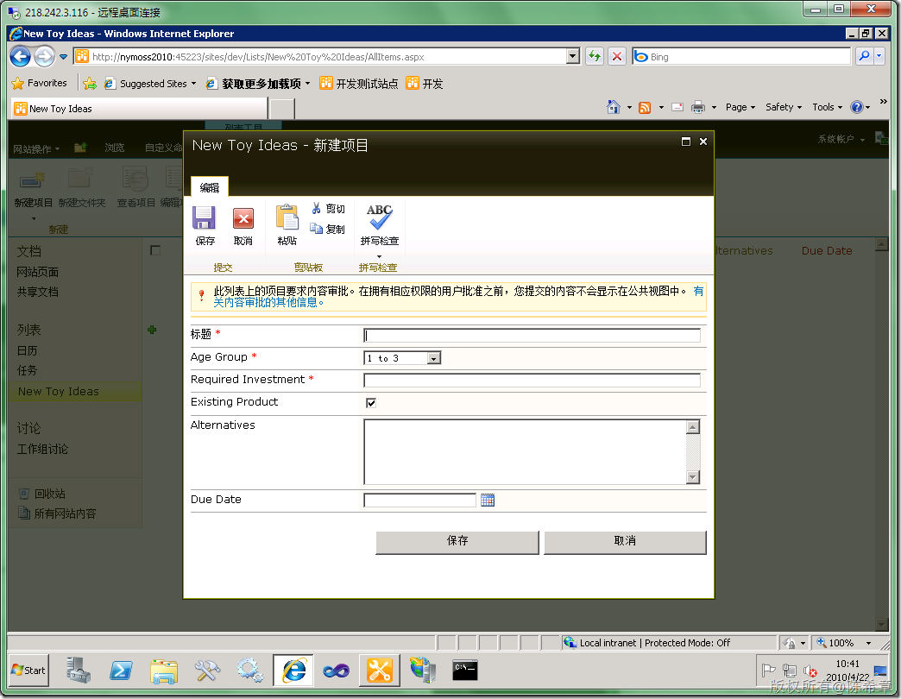
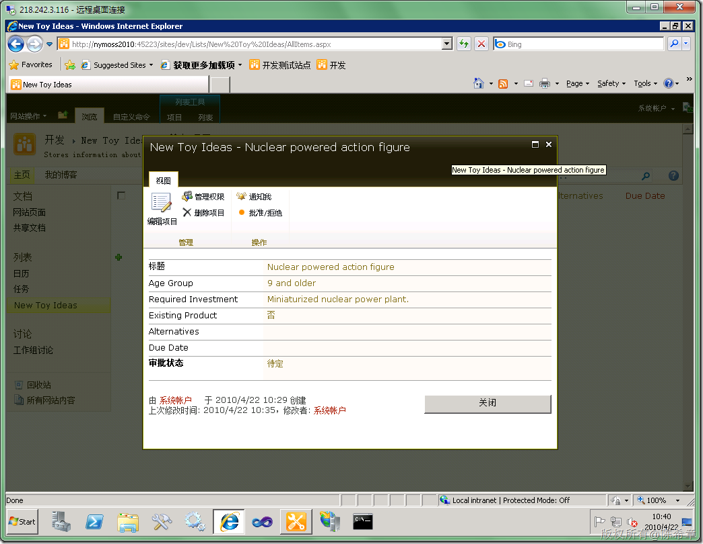
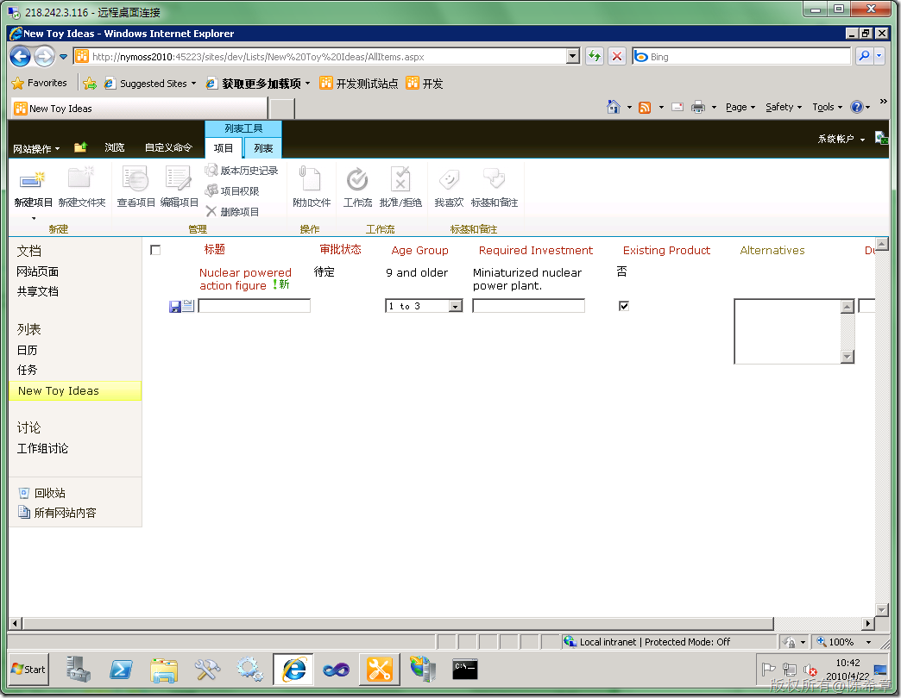
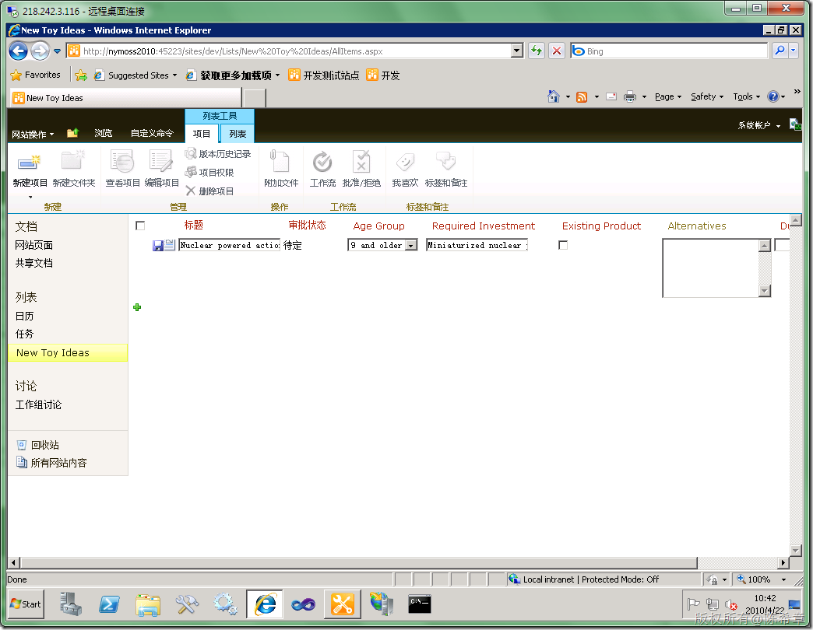
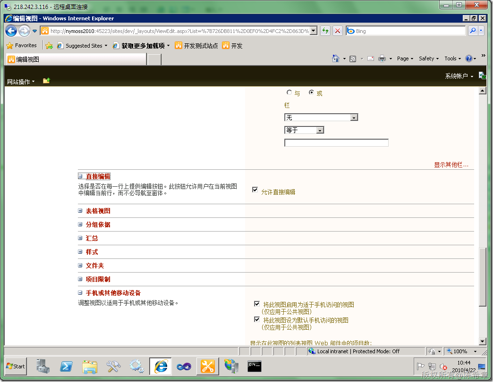
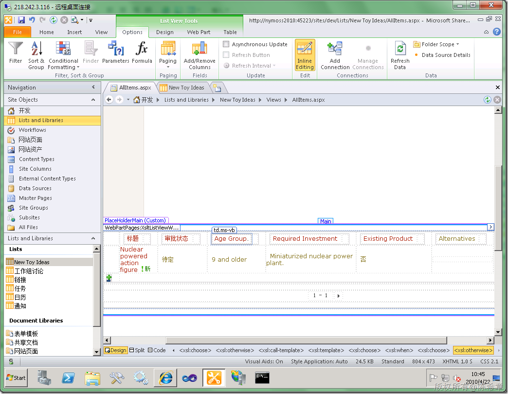

# MOSS 2010：列表编辑变得更加容易 
> 原文发表于 2010-04-22, 地址: http://www.cnblogs.com/chenxizhang/archive/2010/04/22/1717850.html 

MOSS 2010在界面上面下了很大的功能，不光是好看而已。首先有一个重要改进就是，列表项的添加和修改都无需跳转页面，而是采用AJAX弹出对话框的方式来实现。

  

  

 除此之外，甚至可以直接在列表的行中进行创建和修改。连这个对话框都不需要了。

  

  

 这种行内编辑（inline edit）的特性对于有的客户而言可能是很好用的。那么我们来看看具体如何实现的呢

 其实，这是视图的一个选项

  

 如果是在SharePoint Designer中进行修改的话，则可以通过选中下面的一个按钮（Inline Editing)即可

 

