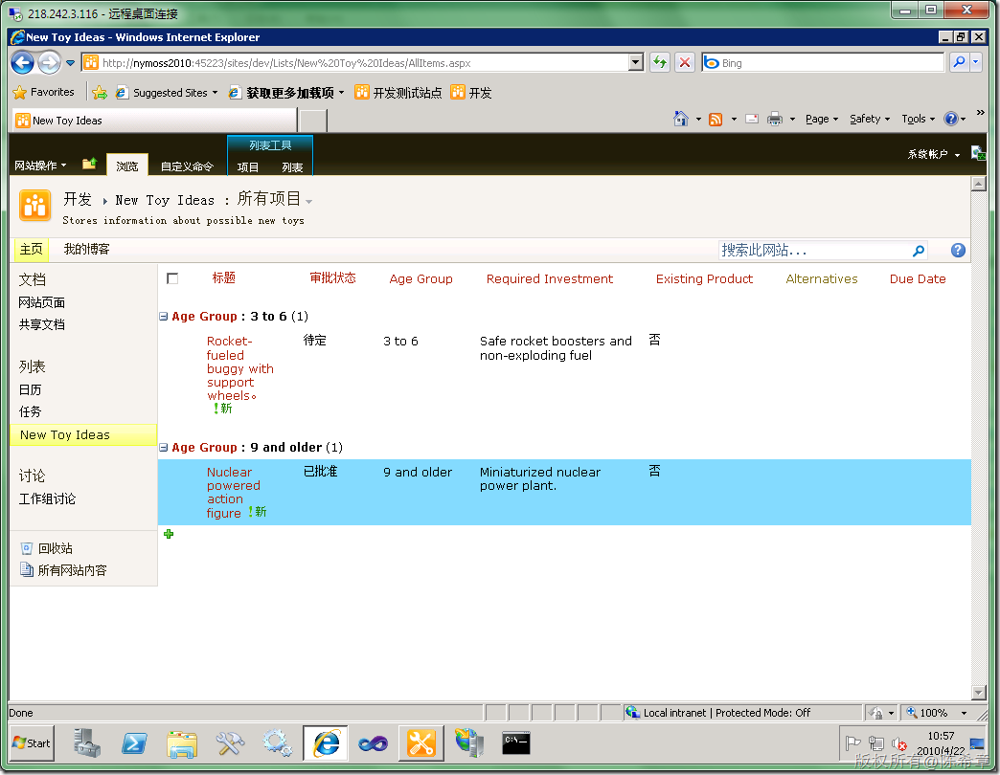
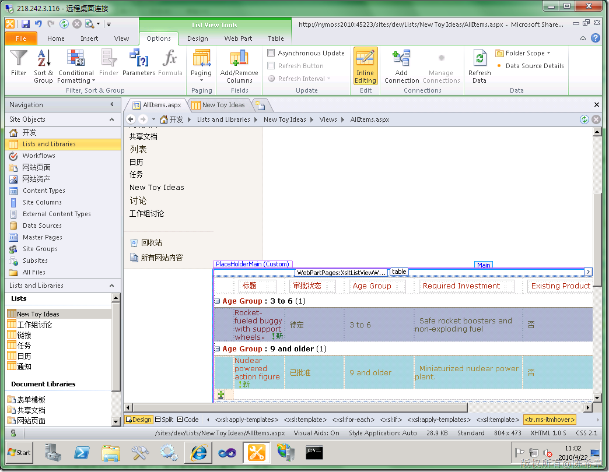
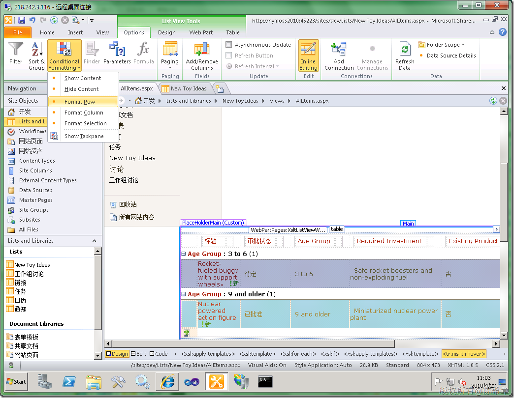
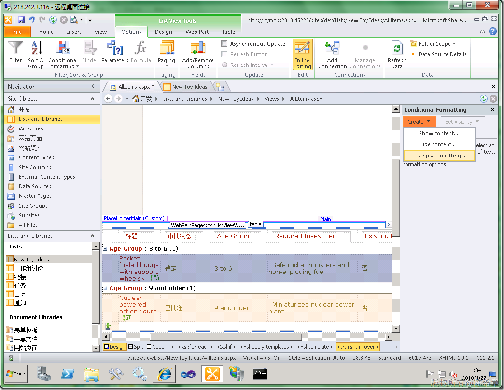
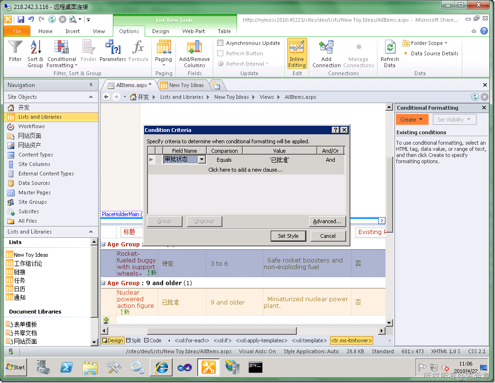
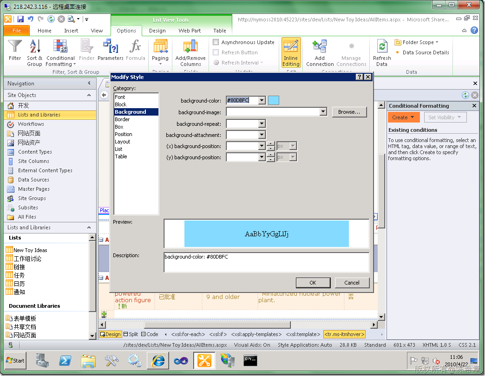

# MOSS 2010:通过SharePoint Designer定制列表项的条件格式 
> 原文发表于 2010-04-22, 地址: http://www.cnblogs.com/chenxizhang/archive/2010/04/22/1717885.html 

继续我的MOSS 2010发现之旅吧，还是来看看界面上的变化。这一篇讲的是如何使用SharePoint Designer来实现列表项的条件格式设置。

 先来看一个效果图

  

 我们希望自定义列表的项目根据审批状态的不同要显示不同的样式。例如已经审批通过的项目，就添加一个背景色。

  

 这是如何实现的呢？首先来说一下，列表是怎么显示的。列表是存储数据的一种机制，它要被用户看到，其实都是需要通过视图的。上面这个图，其实要认真说起来呢，不是列表，而是看到列表的一个视图：“所有项目”，这是任何列表默认的视图。

 这个视图在MOSS 2010中也有一些变化，现在是用了一个全新的xsltListViewWebPart来实现的

  

 既然是利用XSLT的技术实现的，所以就可以实现更加灵活的界面定制了。其实做条件格式就是一个亮点。

 首先选中一个行，然后在顶部的工具面板中，注意切换到Options这个页面

  

 点击“Conditional Formatting”=》“Format Row”

  

 在右侧的一个面板中，选择Create=>Apply Formatting…

  

  

 然后点击Set Style

  

 保存更改即可看到效果。

  

 细心的朋友一定还可以看到，上面还可以实现分组，过滤，分页等等功能，这里就不一一演示了

