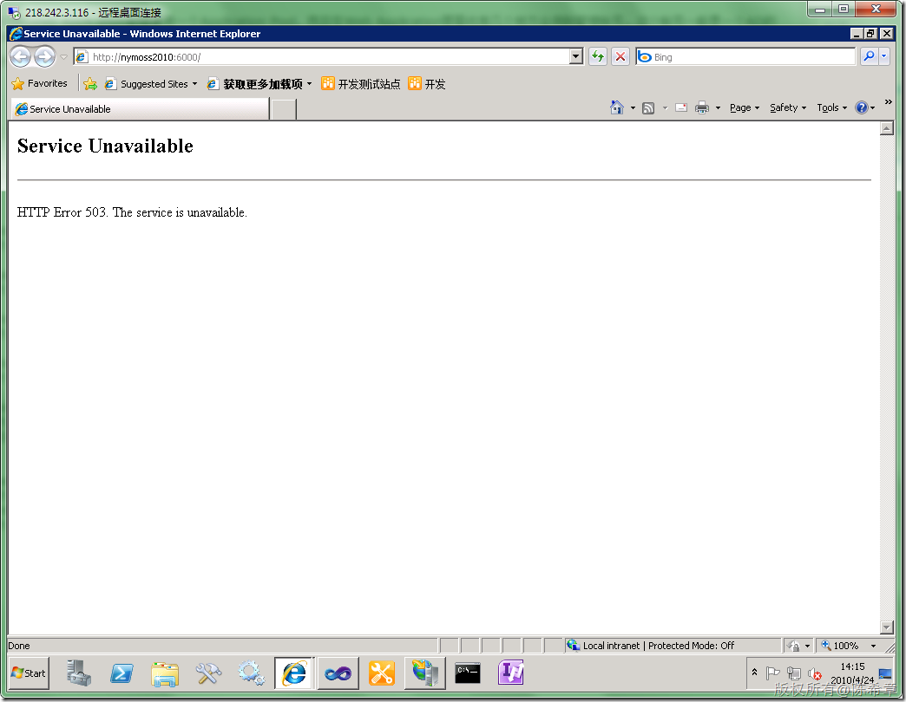

# MOSS 开发之服务帐号过期的问题 
> 原文发表于 2010-04-24, 地址: http://www.cnblogs.com/chenxizhang/archive/2010/04/24/1719310.html 

再次遇到了这个问题，大家知道一般MOSS的Web Application都需要有一个Application Pool，而且在Web Application里面也有几个地方会用到管理帐号。这个帐号一般是一个AD的帐号，而一般AD都有密码策略，规定密码必须多少时间修改一次。

 很显然，如果密码被修改了，则可能导致MOSS的Web Application无法运行，具体的错误是一个503错误，意思是说服务不可用（Service Unavailable)

  

  

 那么如何来解决该问题呢，请参考下面文章的介绍

 [http://support.microsoft.com/kb/934838/en-us/](http://support.microsoft.com/kb/934838/en-us/ "http://support.microsoft.com/kb/934838/en-us/")

  

 我们一般可以通过一个脚本来快速实现这个功能

 @echo off  
rem other app pools  
echo *** Updating app pool passwords  
"%commonprogramfiles%\Microsoft Shared\Web server extensions\12\BIN\Stsadm.exe" -o updateaccountpassword -userlogin %1 -password %2 -noadmin  
rem central admin  
echo *** Updating Central Admin password  
"%commonprogramfiles%\Microsoft Shared\Web server extensions\12\BIN\Stsadm.exe" -o updatefarmcredentials -userlogin %1 -password %2  
rem ssp - new  
echo *** Updating ssp password for new installs  
"%commonprogramfiles%\Microsoft Shared\Web server extensions\12\BIN\Stsadm.exe" -o editssp -title "SharedServices1" -ssplogin %1 -ssppassword %2  
rem ssp - upgrade  
echo *** Updating ssp password for upgraded installs  
"%commonprogramfiles%\Microsoft Shared\Web server extensions\12\BIN\Stsadm.exe" -o editssp -title "Default Web Site" -ssplogin %1 -ssppassword %2  
rem osearch  
echo *** Updating osearch password  
"%commonprogramfiles%\Microsoft Shared\Web server extensions\12\BIN\Stsadm.exe" -o osearch -farmserviceaccount %1 -farmservicepassword %2  
echo *** MANUAL UPDATE NEEDED. To update the password, visit the SSP Web application page, click Search Settings, and then click Default Content Access Account.   
rem spsearch  
echo *** Updating spsearch password  
"%commonprogramfiles%\Microsoft Shared\Web server extensions\12\BIN\Stsadm.exe" -o spsearch -farmserviceaccount %1 -farmservicepassword %2  
echo *** Updating spsearch content access account  
"%commonprogramfiles%\Microsoft Shared\web server extensions\12\BIN\stsadm.exe" -o spsearch -farmcontentaccessaccount %1 -farmcontentaccesspassword %2  
rem restarting IIS  
echo *** Doing soft restart of IIS  
iisreset /noforce  
echo on 

