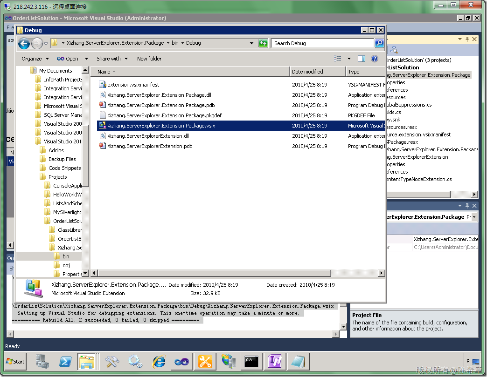
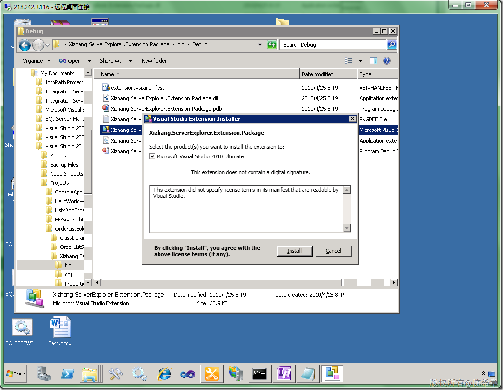

# MOSS 2010:Visual Studio 2010开发体验（11）——扩展SharePoint Explorer 
> 原文发表于 2010-04-25, 地址: http://www.cnblogs.com/chenxizhang/archive/2010/04/25/1719721.html 


关于SharePoint Explorer，是VS2010的一个新特性，可以让开发人员很方便地浏览到SharePoint站点的结构，并且做一些简单事情

 我在下面这篇文章中已经做过一些介绍

 [http://www.cnblogs.com/chenxizhang/archive/2010/04/05/1704680.html](http://www.cnblogs.com/chenxizhang/archive/2010/04/05/1704680.html "http://www.cnblogs.com/chenxizhang/archive/2010/04/05/1704680.html")

 上文中，我已经提到了，这个工具我认为还不是很完善。但它确实留出了定制的空间。那么今天我们就来试一下吧

 为什么我会想做这个事情呢，就是因为我在本系列的[第10篇](http://www.cnblogs.com/chenxizhang/archive/2010/04/25/1719694.html)中提到了内容类型的开发，我们需要查看某个内容类型的定义的话，比较费劲，需要特意去写代码。所以我就想，如果直接在这个Explorer中能做这个工作，当然比较好。然后就手痒无比，马上动手做了起来。

  

 1. 首先来看一下SharePoint Explorer的样子，它实际上是Server Explorer的一个插件

 [](http://images.cnblogs.com/cnblogs_com/chenxizhang/WindowsLiveWriter/MOSS2010VisualStudio201011SharePointExpl_5FE8/image_2.png) 

 2. 好吧，我们如何开始来做扩展呢？

 先想清楚吧，我们希望在ContentType上面有一个快捷菜单，然后点击之后，可以查看到它的属性吧。应该还是比较简单的

 下面这个链接中有比较清楚的介绍，我今天基本上是依葫芦画瓢了

 [http://msdn.microsoft.com/en-us/library/ee471438(VS.100).aspx](http://msdn.microsoft.com/en-us/library/ee471438(VS.100).aspx "http://msdn.microsoft.com/en-us/library/ee471438(VS.100).aspx")

  

 大致的步骤如下,我做了一个简单的翻译

 ##### To extend a SharePoint node in Server Explorer

 1. Create a class library project.（创建一个类库项目）

- Add references to the following assemblies:（添加如下的引用） 
	* Microsoft.VisualStudio.SharePoint
	
	* Microsoft.VisualStudio.SharePoint.Explorer.Extensions
	
	* System.ComponentModel.Composition - Create a class that implements the [IExplorerNodeTypeExtension](http://msdn.microsoft.com/en-us/library/microsoft.visualstudio.sharepoint.explorer.iexplorernodetypeextension(v=VS.100).aspx) interface.（创建一个类，继承一个接口）

- Add the [System.ComponentModel.Composition.ExportAttribute](http://msdn.microsoft.com/en-us/library/system.componentmodel.composition.exportattribute(v=VS.100).aspx) attribute to the class. This attribute enables Visual Studio to discover and load your [IExplorerNodeTypeExtension](http://msdn.microsoft.com/en-us/library/microsoft.visualstudio.sharepoint.explorer.iexplorernodetypeextension(v=VS.100).aspx) implementation. Pass the [IExplorerNodeTypeExtension](http://msdn.microsoft.com/en-us/library/microsoft.visualstudio.sharepoint.explorer.iexplorernodetypeextension(v=VS.100).aspx) type to the attribute constructor.（添加一个Attribute)

- Add the [ExplorerNodeTypeAttribute](http://msdn.microsoft.com/en-us/library/microsoft.visualstudio.sharepoint.explorer.explorernodetypeattribute(v=VS.100).aspx) attribute to the class. This attribute specifies the string identifier for the type of node that you want to extend. To specify built-in node types provided by Visual Studio, pass one of the following enumeration values to the attribute constructor: 
	* [ExplorerNodeTypes](http://msdn.microsoft.com/en-us/library/microsoft.visualstudio.sharepoint.explorer.explorernodetypes(v=VS.100).aspx): Use these values to specify site connection nodes (the nodes that display site URLs), site nodes, or all other parent nodes in Server Explorer.
	
	* [ExtensionNodeTypes](http://msdn.microsoft.com/en-us/library/microsoft.visualstudio.sharepoint.explorer.extensions.extensionnodetypes(v=VS.100).aspx): Use these values to specify one of the built-in nodes that represent an individual component on a SharePoint site, such as a node that represents a list, field, or content type.（继续添加Attribute) - In your implementation of the [IExplorerNodeTypeExtension.Initialize](http://msdn.microsoft.com/en-us/library/microsoft.visualstudio.sharepoint.explorer.iexplorernodetypeextension.initialize(v=VS.100).aspx) method, use members of the nodeType parameter to add features to the node. This parameter is an [IExplorerNodeType](http://msdn.microsoft.com/en-us/library/microsoft.visualstudio.sharepoint.explorer.iexplorernodetype(v=VS.100).aspx) object that provides access to the events defined in the [IExplorerNodeEvents](http://msdn.microsoft.com/en-us/library/microsoft.visualstudio.sharepoint.explorer.iexplorernodeevents(v=VS.100).aspx) interface. For example, you can handle the following events: 
	* [IExplorerNodeEvents.NodeChildrenRequested](http://msdn.microsoft.com/en-us/library/microsoft.visualstudio.sharepoint.explorer.iexplorernodeevents.nodechildrenrequested(v=VS.100).aspx): Handle this event to add new child nodes to the node. For more information, see [How to: Add a Custom SharePoint Node to Server Explorer](http://msdn.microsoft.com/en-us/library/ee256706(v=VS.100).aspx).
	
	* [IExplorerNodeEvents.NodeMenuItemsRequested](http://msdn.microsoft.com/en-us/library/microsoft.visualstudio.sharepoint.explorer.iexplorernodeevents.nodemenuitemsrequested(v=VS.100).aspx): Handle this event to add a custom shortcut menu item to the node.
	
	* [IExplorerNodeEvents.NodePropertiesRequested](http://msdn.microsoft.com/en-us/library/microsoft.visualstudio.sharepoint.explorer.iexplorernodeevents.nodepropertiesrequested(v=VS.100).aspx): Handle this event to add custom properties to the node. The properties appear in the Properties window when the node is selected.

   那我们还等什么呢？ [](http://images.cnblogs.com/cnblogs_com/chenxizhang/WindowsLiveWriter/MOSS2010VisualStudio201011SharePointExpl_5FE8/image_4.png) 将默认的类型名称修改为ContentTypeNodeExtension [](http://images.cnblogs.com/cnblogs_com/chenxizhang/WindowsLiveWriter/MOSS2010VisualStudio201011SharePointExpl_5FE8/image_6.png) 【注意】需要确认框架版本为.NET Framework 4.0 [](http://images.cnblogs.com/cnblogs_com/chenxizhang/WindowsLiveWriter/MOSS2010VisualStudio201011SharePointExpl_5FE8/image_8.png)   添加引用 [](http://images.cnblogs.com/cnblogs_com/chenxizhang/WindowsLiveWriter/MOSS2010VisualStudio201011SharePointExpl_5FE8/image_10.png) [](http://images.cnblogs.com/cnblogs_com/chenxizhang/WindowsLiveWriter/MOSS2010VisualStudio201011SharePointExpl_5FE8/image_12.png) [](http://images.cnblogs.com/cnblogs_com/chenxizhang/WindowsLiveWriter/MOSS2010VisualStudio201011SharePointExpl_5FE8/image_14.png) 3.修改一些简单代码
```
using System;
using Microsoft.VisualStudio.SharePoint.Explorer;
using Microsoft.VisualStudio.SharePoint.Explorer.Extensions;
using System.ComponentModel.Composition;
using Microsoft.VisualStudio.SharePoint;
using System.Windows.Forms;


namespace Xizhang.ServerExplorerExtension
{

    [Export(typeof(IExplorerNodeTypeExtension))]
    [ExplorerNodeType(ExtensionNodeTypes.ContentTypeNode)]
    public class ContentTypeNodeExtension : IExplorerNodeTypeExtension
    {
        public void Initialize(IExplorerNodeType nodeType)
        {
            System.IO.File.AppendAllText("c:\\log.txt",DateTime.Now.ToString());

            nodeType.NodeMenuItemsRequested += new EventHandler<ExplorerNodeMenuItemsRequestedEventArgs>(nodeType\_NodeMenuItemsRequested);

        }

        void nodeType\_NodeMenuItemsRequested(object sender, ExplorerNodeMenuItemsRequestedEventArgs e)
        {
            IMenuItem menuItem = e.MenuItems.Add("我的菜单");
            
            menuItem.Click += new EventHandler<MenuItemEventArgs>(menuItem\_Click);
        }

        void menuItem\_Click(object sender, MenuItemEventArgs e)
        {
            
            IExplorerNode node = (IExplorerNode)e.Owner;
            
            MessageBox.Show(string.Format("你点击了 '{0}' 节点,类型是'{1}'.", node.Text,node.NodeType.Name));

        }
    }
}

```

.csharpcode, .csharpcode pre
{
 font-size: small;
 color: black;
 font-family: consolas, "Courier New", courier, monospace;
 background-color: #ffffff;
 /*white-space: pre;*/
}
.csharpcode pre { margin: 0em; }
.csharpcode .rem { color: #008000; }
.csharpcode .kwrd { color: #0000ff; }
.csharpcode .str { color: #006080; }
.csharpcode .op { color: #0000c0; }
.csharpcode .preproc { color: #cc6633; }
.csharpcode .asp { background-color: #ffff00; }
.csharpcode .html { color: #800000; }
.csharpcode .attr { color: #ff0000; }
.csharpcode .alt 
{
 background-color: #f4f4f4;
 width: 100%;
 margin: 0em;
}
.csharpcode .lnum { color: #606060; }


```
[](http://images.cnblogs.com/cnblogs_com/chenxizhang/WindowsLiveWriter/MOSS2010VisualStudio201011SharePointExpl_5FE8/image_52.png) 
```

```
4. 部署该扩展
```

```
详细的步骤可以参考<http://msdn.microsoft.com/en-us/library/ee513825.aspx>
```

```
更加详细的一个介绍<http://msdn.microsoft.com/en-us/library/dd393694(v=VS.100).aspx>
```

```
 
```

```
简单来说，我们需要创建一个所谓VSIX的项目来定义部署的信息，不过在此之前，你需要安装VS2010 SDK
```

```
<http://www.microsoft.com/downloads/details.aspx?familyid=4659F71D-4E58-4DCD-B755-127539E21147&displaylang=en>
```

```
 
```

```
[](http://images.cnblogs.com/cnblogs_com/chenxizhang/WindowsLiveWriter/MOSS2010VisualStudio201011SharePointExpl_5FE8/image_18.png) 
```

```

[](http://images.cnblogs.com/cnblogs_com/chenxizhang/WindowsLiveWriter/MOSS2010VisualStudio201011SharePointExpl_5FE8/image_20.png) 
```

```
[](http://images.cnblogs.com/cnblogs_com/chenxizhang/WindowsLiveWriter/MOSS2010VisualStudio201011SharePointExpl_5FE8/image_22.png) 
```

```
[](http://images.cnblogs.com/cnblogs_com/chenxizhang/WindowsLiveWriter/MOSS2010VisualStudio201011SharePointExpl_5FE8/image_24.png) 
```

```
[](http://images.cnblogs.com/cnblogs_com/chenxizhang/WindowsLiveWriter/MOSS2010VisualStudio201011SharePointExpl_5FE8/image_26.png) 
```

```
[](http://images.cnblogs.com/cnblogs_com/chenxizhang/WindowsLiveWriter/MOSS2010VisualStudio201011SharePointExpl_5FE8/image_28.png) 
```

```
[](http://images.cnblogs.com/cnblogs_com/chenxizhang/WindowsLiveWriter/MOSS2010VisualStudio201011SharePointExpl_5FE8/image_30.png) 
```

```
[](http://images.cnblogs.com/cnblogs_com/chenxizhang/WindowsLiveWriter/MOSS2010VisualStudio201011SharePointExpl_5FE8/image_34.png) 
```

.csharpcode, .csharpcode pre
{
 font-size: small;
 color: black;
 font-family: consolas, "Courier New", courier, monospace;
 background-color: #ffffff;
 /*white-space: pre;*/
}
.csharpcode pre { margin: 0em; }
.csharpcode .rem { color: #008000; }
.csharpcode .kwrd { color: #0000ff; }
.csharpcode .str { color: #006080; }
.csharpcode .op { color: #0000c0; }
.csharpcode .preproc { color: #cc6633; }
.csharpcode .asp { background-color: #ffff00; }
.csharpcode .html { color: #800000; }
.csharpcode .attr { color: #ff0000; }
.csharpcode .alt 
{
 background-color: #f4f4f4;
 width: 100%;
 margin: 0em;
}
.csharpcode .lnum { color: #606060; }

切换到全屏幕
[](http://images.cnblogs.com/cnblogs_com/chenxizhang/WindowsLiveWriter/MOSS2010VisualStudio201011SharePointExpl_5FE8/image_36.png)
点击“Add Content”
[](http://images.cnblogs.com/cnblogs_com/chenxizhang/WindowsLiveWriter/MOSS2010VisualStudio201011SharePointExpl_5FE8/image_54.png)
设置好之后，就可以编译该项目了。（以前我们要做一个VS的扩展包可远远没这么方便）
------ Rebuild All started: Project: Xizhang.ServerExplorerExtension, Configuration: Debug Any CPU ------  
  Xizhang.ServerExplorerExtension -> C:\Users\Administrator\Documents\Visual Studio 2010\Projects\OrderListSolution\Xizhang.ServerExplorerExtension\bin\Debug\Xizhang.ServerExplorerExtension.dll  
------ Rebuild All started: Project: Xizhang.ServerExplorer.Extension.Package, Configuration: Debug Any CPU ------  
  Xizhang.ServerExplorer.Extension.Package ->   
  Xizhang.ServerExplorer.Extension.Package ->   
  Xizhang.ServerExplorer.Extension.Package -> C:\Users\Administrator\Documents\Visual Studio 2010\Projects\OrderListSolution\Xizhang.ServerExplorer.Extension.Package\bin\Debug\Xizhang.ServerExplorer.Extension.Package.dll  
  Creating intermediate PkgDef file.  
  Creating VSIX Container...  
  Xizhang.ServerExplorer.Extension.Package -> C:\Users\Administrator\Documents\Visual Studio 2010\Projects\OrderListSolution\Xizhang.ServerExplorer.Extension.Package\bin\Debug\Xizhang.ServerExplorer.Extension.Package.vsix  
  Setting up Visual Studio for debugging extensions. This one-time operation may take a minute or more.  
========== Rebuild All: 2 succeeded, 0 failed, 0 skipped ==========
【注意】它生成了一个vsix文件
[](http://images.cnblogs.com/cnblogs_com/chenxizhang/WindowsLiveWriter/MOSS2010VisualStudio201011SharePointExpl_5FE8/image_40.png)
5.安装该扩展
双击vsix文件
[](http://images.cnblogs.com/cnblogs_com/chenxizhang/WindowsLiveWriter/MOSS2010VisualStudio201011SharePointExpl_5FE8/image_42.png)
[](http://images.cnblogs.com/cnblogs_com/chenxizhang/WindowsLiveWriter/MOSS2010VisualStudio201011SharePointExpl_5FE8/image_44.png)
6. 使用该扩展。重新打开Visual Studio，可以通过Extension Manager看到我们安装好的扩展包
[](http://images.cnblogs.com/cnblogs_com/chenxizhang/WindowsLiveWriter/MOSS2010VisualStudio201011SharePointExpl_5FE8/image_48.png)
[](http://images.cnblogs.com/cnblogs_com/chenxizhang/WindowsLiveWriter/MOSS2010VisualStudio201011SharePointExpl_5FE8/image_50.png)
激动人心的时刻到了
[](http://images.cnblogs.com/cnblogs_com/chenxizhang/WindowsLiveWriter/MOSS2010VisualStudio201011SharePointExpl_5FE8/image_56.png)
我们可以点击“我的菜单”
[](http://images.cnblogs.com/cnblogs_com/chenxizhang/WindowsLiveWriter/MOSS2010VisualStudio201011SharePointExpl_5FE8/image_58.png)
到这里为止，我们这个扩展程序就实现了，如果你有兴趣，请将它修改得更加实用些吧


