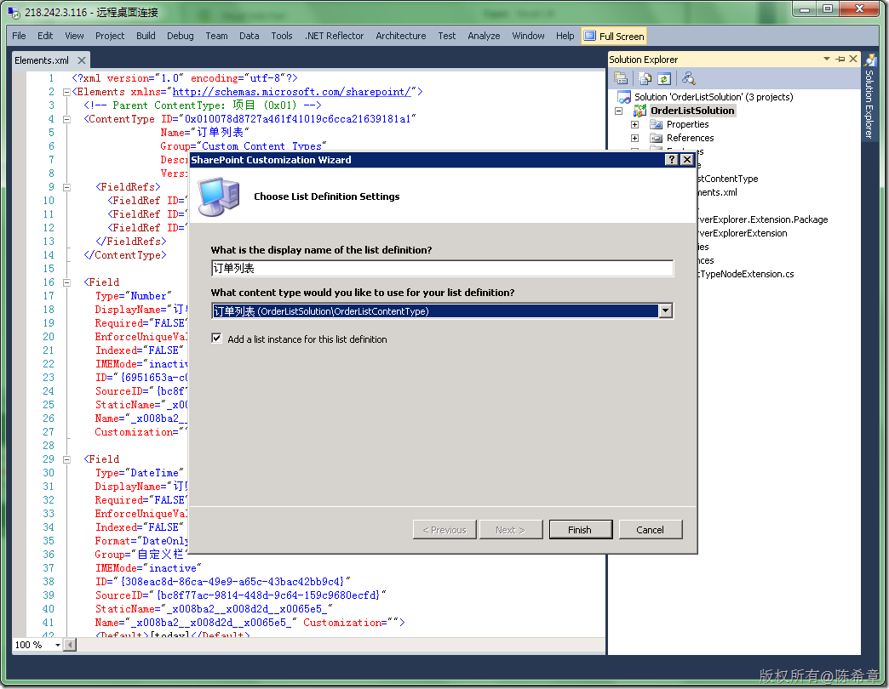

# MOSS 2010:Visual Studio 2010开发体验（12）——列表开发之列表定义 
> 原文发表于 2010-04-25, 地址: http://www.cnblogs.com/chenxizhang/archive/2010/04/25/1719798.html 


上一篇，我们已经在Visual Studio中定义好了内容类型

 [http://www.cnblogs.com/chenxizhang/archive/2010/04/25/1719694.html](http://www.cnblogs.com/chenxizhang/archive/2010/04/25/1719694.html "http://www.cnblogs.com/chenxizhang/archive/2010/04/25/1719694.html")

 [](http://images.cnblogs.com/cnblogs_com/chenxizhang/WindowsLiveWriter/MOSS2010VisualStudio201012_AF8D/image_2.png) 

 下面我们来看看如何创建和使用列表定义(List Definition)

 【注意】如果你不清楚他们有关的概念，请参考 

 [http://www.cnblogs.com/chenxizhang/archive/2010/04/24/1719467.html](http://www.cnblogs.com/chenxizhang/archive/2010/04/24/1719467.html "http://www.cnblogs.com/chenxizhang/archive/2010/04/24/1719467.html")

  

 1. 添加一个列表定义.

 [](http://images.cnblogs.com/cnblogs_com/chenxizhang/WindowsLiveWriter/MOSS2010VisualStudio201012_AF8D/image_4.png) 

 [](http://images.cnblogs.com/cnblogs_com/chenxizhang/WindowsLiveWriter/MOSS2010VisualStudio201012_AF8D/image_6.png) 

 【注意】这里我们选上了“Add a list instance for this list definition”，表示要自动创建一个实例。

 [](http://images.cnblogs.com/cnblogs_com/chenxizhang/WindowsLiveWriter/MOSS2010VisualStudio201012_AF8D/image_8.png) 

 2. 了解有关的定义文件，主要是下面这个schema.xml

 [](http://images.cnblogs.com/cnblogs_com/chenxizhang/WindowsLiveWriter/MOSS2010VisualStudio201012_AF8D/image_10.png) 

 【注意】列表定义通过上面的ContentType属性指定与内容类型的链接，以及也定义了有关的字段（Field)

 完整的定义如下，它还包含了视图的定义


```
<?xml version="1.0" encoding="utf-8"?>
<List xmlns:ows="Microsoft SharePoint" Title="订单列表" FolderCreation="FALSE" Direction="$Resources:Direction;" Url="Lists/OrderListSolution-OrderList" BaseType="0" xmlns="http://schemas.microsoft.com/sharepoint/">
  <MetaData>
    <ContentTypes>
      <ContentType ID="0x010078d8727a461f41019c6cca21639181a1" Name="订单列表" Group="Custom Content Types" Description="填写和编辑订单数据" Version="0">
        <FieldRefs>
          <FieldRef ID="{6951653a-c02e-4440-a918-54dc6c6b4ad4}" />
          <FieldRef ID="{308eac8d-86ca-49e9-a65c-43bac42bb9c4}" />
          <FieldRef ID="{442bcf2b-554b-4f53-8877-8612d85cbb8e}" />
        </FieldRefs>
      </ContentType>
    </ContentTypes>
    <Fields>
      <Field Type="Number" DisplayName="订单编号" Required="FALSE" EnforceUniqueValues="FALSE" Indexed="FALSE" Group="自定义栏" IMEMode="inactive" ID="{6951653a-c02e-4440-a918-54dc6c6b4ad4}" SourceID="{bc8f77ac-9814-448d-9c64-159c9680ecfd}" StaticName="\_x008ba2\_\_x005355\_\_x007f16\_\_x0053f7\_" Name="\_x008ba2\_\_x005355\_\_x007f16\_\_x0053f7\_" Customization="" />
      <Field Type="DateTime" DisplayName="订购日" Required="FALSE" EnforceUniqueValues="FALSE" Indexed="FALSE" Format="DateOnly" Group="自定义栏" IMEMode="inactive" ID="{308eac8d-86ca-49e9-a65c-43bac42bb9c4}" SourceID="{bc8f77ac-9814-448d-9c64-159c9680ecfd}" StaticName="\_x008ba2\_\_x008d2d\_\_x0065e5\_" Name="\_x008ba2\_\_x008d2d\_\_x0065e5\_" Customization="">
    <Default>[today]</Default>
  </Field>
      <Field Type="Text" DisplayName="客户编号" Required="FALSE" EnforceUniqueValues="FALSE" Indexed="FALSE" MaxLength="255" Group="自定义栏" ID="{442bcf2b-554b-4f53-8877-8612d85cbb8e}" SourceID="{bc8f77ac-9814-448d-9c64-159c9680ecfd}" StaticName="\_x005ba2\_\_x006237\_\_x007f16\_\_x0053f7\_" Name="\_x005ba2\_\_x006237\_\_x007f16\_\_x0053f7\_" Customization="" />
    </Fields>
    <Views>
      <View BaseViewID="0" Type="HTML" MobileView="TRUE" TabularView="FALSE">
        <Toolbar Type="Standard" />
        <XslLink Default="TRUE">main.xsl</XslLink>
        <RowLimit Paged="TRUE">30</RowLimit>
        <ViewFields>
          <FieldRef Name="LinkTitleNoMenu">
          </FieldRef>
        </ViewFields>
        <Query>
          <OrderBy>
            <FieldRef Name="Modified" Ascending="FALSE">
            </FieldRef>
          </OrderBy>
        </Query>
        <ParameterBindings>
          <ParameterBinding Name="AddNewAnnouncement" Location="Resource(wss,addnewitem)" />
          <ParameterBinding Name="NoAnnouncements" Location="Resource(wss,noXinviewofY\_LIST)" />
          <ParameterBinding Name="NoAnnouncementsHowTo" Location="Resource(wss,noXinviewofY\_ONET\_HOME)" />
        </ParameterBindings>
      </View>
      <View BaseViewID="1" Type="HTML" WebPartZoneID="Main" DisplayName="$Resources:core,objectiv\_schema\_mwsidcamlidC24;" DefaultView="TRUE" MobileView="TRUE" MobileDefaultView="TRUE" SetupPath="pages\viewpage.aspx" ImageUrl="/\_layouts/images/generic.png" Url="AllItems.aspx">
        <Toolbar Type="Standard" />
        <XslLink Default="TRUE">main.xsl</XslLink>
        <RowLimit Paged="TRUE">30</RowLimit>
        <ViewFields>
          <FieldRef Name="Attachments">
          </FieldRef>
          <FieldRef Name="LinkTitle">
          </FieldRef>
        </ViewFields>
        <Query>
          <OrderBy>
            <FieldRef Name="ID">
            </FieldRef>
          </OrderBy>
        </Query>
        <ParameterBindings>
          <ParameterBinding Name="NoAnnouncements" Location="Resource(wss,noXinviewofY\_LIST)" />
          <ParameterBinding Name="NoAnnouncementsHowTo" Location="Resource(wss,noXinviewofY\_DEFAULT)" />
        </ParameterBindings>
      </View>
    </Views>
    <Forms>
      <Form Type="DisplayForm" Url="DispForm.aspx" SetupPath="pages\form.aspx" WebPartZoneID="Main" />
      <Form Type="EditForm" Url="EditForm.aspx" SetupPath="pages\form.aspx" WebPartZoneID="Main" />
      <Form Type="NewForm" Url="NewForm.aspx" SetupPath="pages\form.aspx" WebPartZoneID="Main" />
    </Forms>
  </MetaData>
</List>
```

.csharpcode, .csharpcode pre
{
 font-size: small;
 color: black;
 font-family: consolas, "Courier New", courier, monospace;
 background-color: #ffffff;
 /*white-space: pre;*/
}
.csharpcode pre { margin: 0em; }
.csharpcode .rem { color: #008000; }
.csharpcode .kwrd { color: #0000ff; }
.csharpcode .str { color: #006080; }
.csharpcode .op { color: #0000c0; }
.csharpcode .preproc { color: #cc6633; }
.csharpcode .asp { background-color: #ffff00; }
.csharpcode .html { color: #800000; }
.csharpcode .attr { color: #ff0000; }
.csharpcode .alt 
{
 background-color: #f4f4f4;
 width: 100%;
 margin: 0em;
}
.csharpcode .lnum { color: #606060; }

【注意】我们现在先不做任何修改。尝试进行部署看看是什么样的效果吧


3. 部署列表定义，并对其进行查看和使用


部署成功之后，我们可以在创建新项的窗口中看到这个列表的模板


[](http://images.cnblogs.com/cnblogs_com/chenxizhang/WindowsLiveWriter/MOSS2010VisualStudio201012_AF8D/image_14.png) 


通过输入一个名称，然后点击Create


[](http://images.cnblogs.com/cnblogs_com/chenxizhang/WindowsLiveWriter/MOSS2010VisualStudio201012_AF8D/image_16.png) 


【注意】从这里看出来，列表定义（List Definition）本身不能直接访问，它只是一个模板，然后需要创建所谓的列表实例才可以使用


上例中的OrderLists就是一个实例（Instance)


【注意】我们目前在默认的视图中并看不到定义好的订单编号之类的列，那是因为在视图中没有添加这些列。可以在下面的界面中将其添加过来


[](http://images.cnblogs.com/cnblogs_com/chenxizhang/WindowsLiveWriter/MOSS2010VisualStudio201012_AF8D/image_18.png) 


[](http://images.cnblogs.com/cnblogs_com/chenxizhang/WindowsLiveWriter/MOSS2010VisualStudio201012_AF8D/image_20.png) 


[](http://images.cnblogs.com/cnblogs_com/chenxizhang/WindowsLiveWriter/MOSS2010VisualStudio201012_AF8D/image_22.png) 


那么是不是每次都要我们手工去修改这个视图定义呢？显然这样做是不合理的，而我们可以很容易在列表定义中完成这个工作。


4. 修改列表的视图定义


[](http://images.cnblogs.com/cnblogs_com/chenxizhang/WindowsLiveWriter/MOSS2010VisualStudio201012_AF8D/image_24.png) 


这样定义好之后，就很方便了。重新部署，我们来看一下默认生成的那个列表实例


[](http://images.cnblogs.com/cnblogs_com/chenxizhang/WindowsLiveWriter/MOSS2010VisualStudio201012_AF8D/image_26.png) 


嗯，看起来很不错吧？


这一篇我们完成了一个列表定义的创建和修改。下一篇我们来谈谈列表实例的创建和修改

