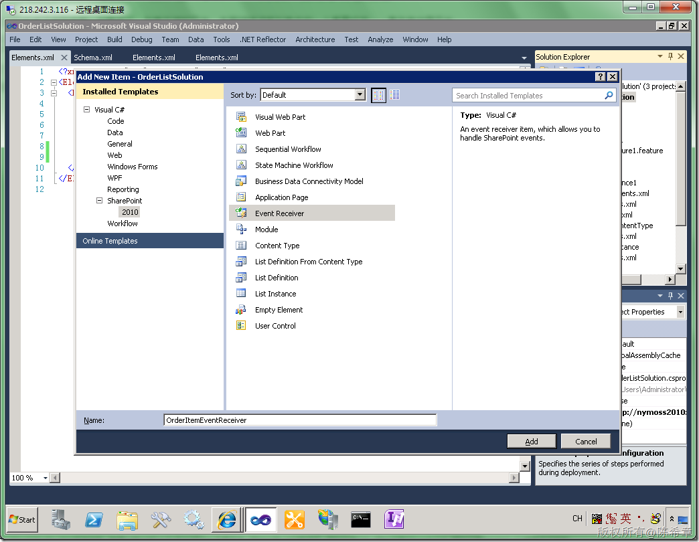
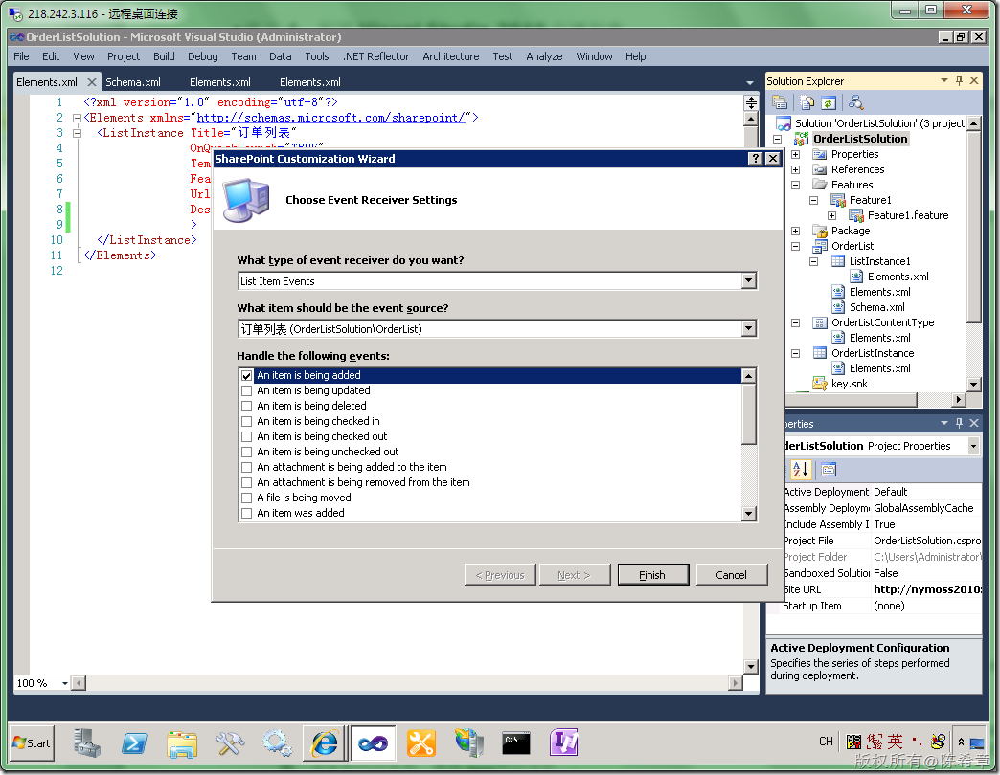
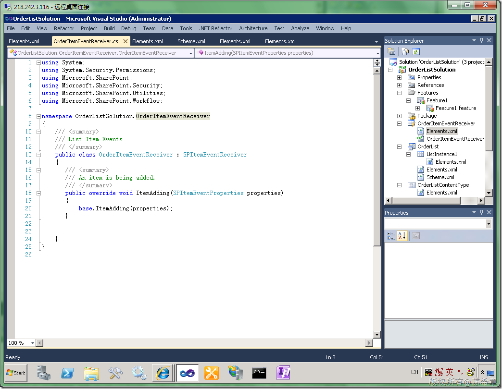
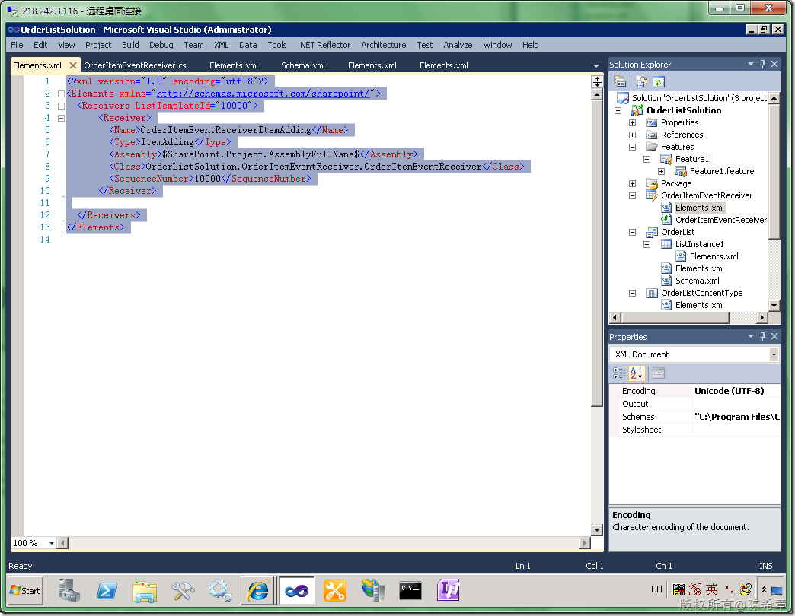
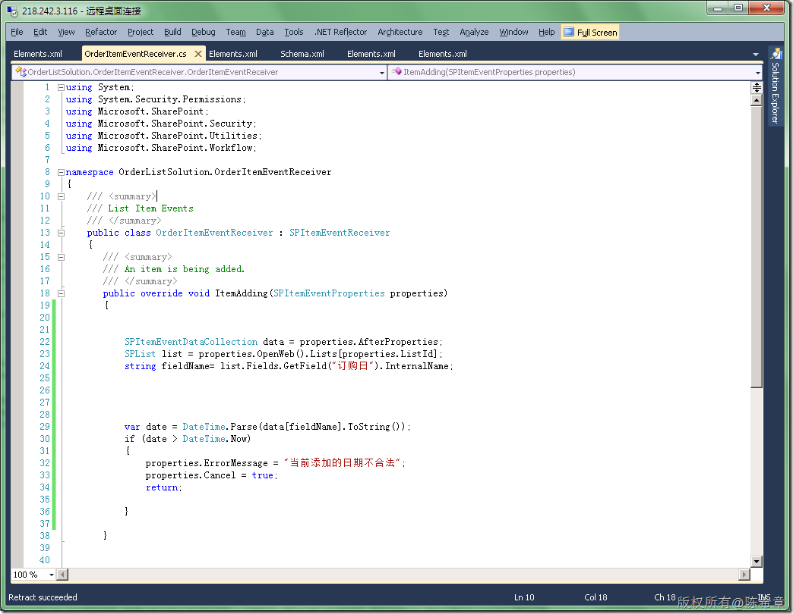
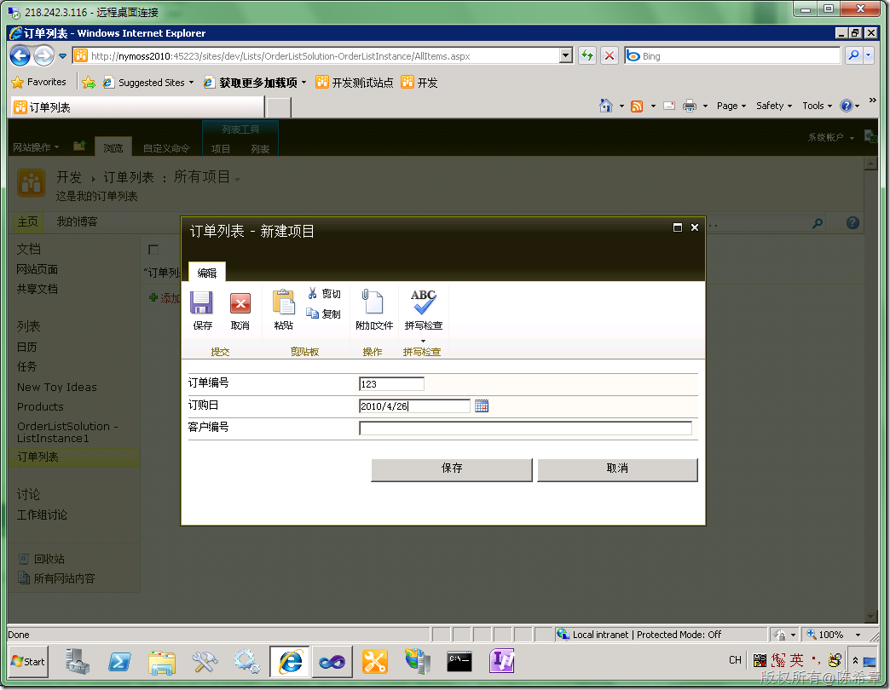
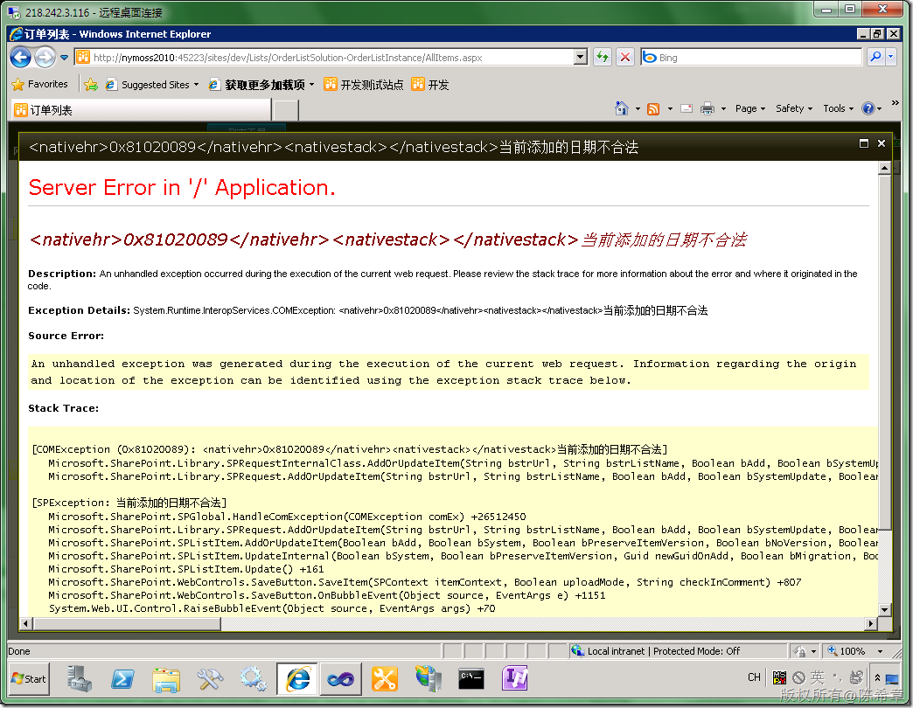
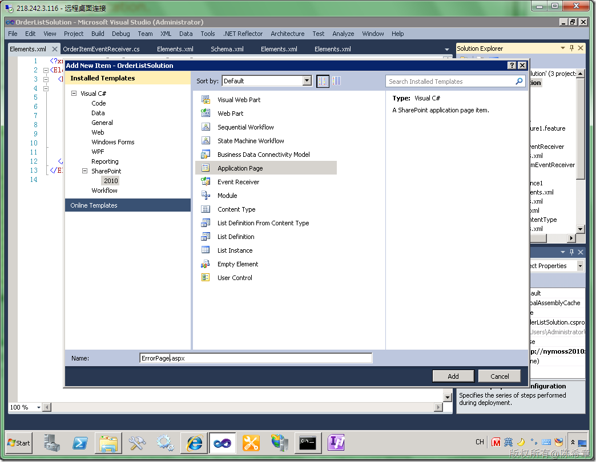
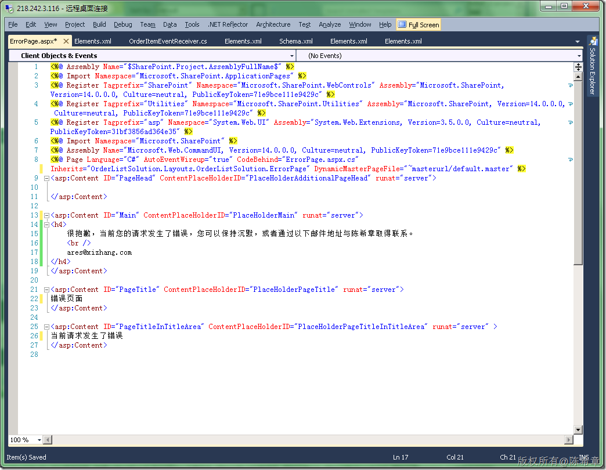

# MOSS 2010:Visual Studio 2010开发体验（14）——列表开发之事件接收器 
> 原文发表于 2010-04-25, 地址: http://www.cnblogs.com/chenxizhang/archive/2010/04/25/1719841.html 


通过前面几篇，我们已经完成了内容类型，列表定义，列表实例的开发。本篇继续讲解列表中的一个重要环节——事件接收器开发。

 我们的场景是：我希望之前做好的订单列表这个内容类型自动地具有某些事件特征，例如当用户在添加一个条目的时候，检查订购日期，如果小于今天的话，就不让添加。（这只是一个假设的场景，现实工作中可以依照业务逻辑而定）

 我们应该如何实现这个需求呢？Follow me 

 1.添加一个事件接收器

 [](http://images.cnblogs.com/cnblogs_com/chenxizhang/WindowsLiveWriter/MOSS2010VisualStudio201014_BCB1/image_2.png) 

 [](http://images.cnblogs.com/cnblogs_com/chenxizhang/WindowsLiveWriter/MOSS2010VisualStudio201014_BCB1/image_6.png) 

  下面是默认生成的两个文件

 [](http://images.cnblogs.com/cnblogs_com/chenxizhang/WindowsLiveWriter/MOSS2010VisualStudio201014_BCB1/image_8.png) 

 [](http://images.cnblogs.com/cnblogs_com/chenxizhang/WindowsLiveWriter/MOSS2010VisualStudio201014_BCB1/image_10.png) 

 <?xml version="1.0" encoding="utf-8"?>  
<Elements xmlns="<http://schemas.microsoft.com/sharepoint/">>  
  <Receivers ListTemplateId="10000">  
      <Receiver>  
        <Name>OrderItemEventReceiverItemAdding</Name>  
        <Type>ItemAdding</Type>  
        <Assembly>$SharePoint.Project.AssemblyFullName$</Assembly>  
        <Class>OrderListSolution.OrderItemEventReceiver.OrderItemEventReceiver</Class>  
        <SequenceNumber>10000</SequenceNumber>  
      </Receiver>   </Receivers>  
</Elements>   

 2. 修改有关代码实现业务逻辑


```
using System;
using System.Security.Permissions;
using Microsoft.SharePoint;
using Microsoft.SharePoint.Security;
using Microsoft.SharePoint.Utilities;
using Microsoft.SharePoint.Workflow; 

namespace OrderListSolution.OrderItemEventReceiver
{
    /// <summary>
    /// List Item Events
    /// </summary>
    public class OrderItemEventReceiver : SPItemEventReceiver
    {
       /// <summary>
       /// An item is being added.
       /// </summary>
       public override void ItemAdding(SPItemEventProperties properties)
       { 

           SPItemEventDataCollection data = properties.AfterProperties;
           SPList list = properties.OpenWeb().Lists[properties.ListId];
           string fieldName= list.Fields.GetField("订购日").InternalName; 

           var date = DateTime.Parse(data[fieldName].ToString());
           if (date > DateTime.Now)
           {
               properties.ErrorMessage = "当前添加的日期不合法";
               properties.Cancel = true;
               return; 

           } 

       } 

    }
}
[](http://images.cnblogs.com/cnblogs_com/chenxizhang/WindowsLiveWriter/MOSS2010VisualStudio201014_BCB1/image_12.png) 
```


.csharpcode, .csharpcode pre
{
 font-size: small;
 color: black;
 font-family: consolas, "Courier New", courier, monospace;
 background-color: #ffffff;
 /*white-space: pre;*/
}
.csharpcode pre { margin: 0em; }
.csharpcode .rem { color: #008000; }
.csharpcode .kwrd { color: #0000ff; }
.csharpcode .str { color: #006080; }
.csharpcode .op { color: #0000c0; }
.csharpcode .preproc { color: #cc6633; }
.csharpcode .asp { background-color: #ffff00; }
.csharpcode .html { color: #800000; }
.csharpcode .attr { color: #ff0000; }
.csharpcode .alt 
{
 background-color: #f4f4f4;
 width: 100%;
 margin: 0em;
}
.csharpcode .lnum { color: #606060; }


3.部署和调试，按下F5键


[](http://images.cnblogs.com/cnblogs_com/chenxizhang/WindowsLiveWriter/MOSS2010VisualStudio201014_BCB1/image_14.png) 


【注意】我们这里故意将订购日设置于大于当前日期。根据事件中的逻辑，我们预期它会报告一个错误，而且取消当前的提交


[](http://images.cnblogs.com/cnblogs_com/chenxizhang/WindowsLiveWriter/MOSS2010VisualStudio201014_BCB1/image_16.png) 


我们看到了这个错误页面，看起来有些吓人，不是吗？对于一般用户来说，他们可能要被吓坏了


接下来，我们可以定义一个专门的页面来显示错误消息，提高用户体验


[](http://images.cnblogs.com/cnblogs_com/chenxizhang/WindowsLiveWriter/MOSS2010VisualStudio201014_BCB1/image_18.png) 


[](http://images.cnblogs.com/cnblogs_com/chenxizhang/WindowsLiveWriter/MOSS2010VisualStudio201014_BCB1/image_20.png) 


然后修改一下代码


```
using System;
using System.Security.Permissions;
using Microsoft.SharePoint;
using Microsoft.SharePoint.Security;
using Microsoft.SharePoint.Utilities;
using Microsoft.SharePoint.Workflow;

namespace OrderListSolution.OrderItemEventReceiver
{
    /// <summary>
    /// List Item Events
    /// </summary>
    public class OrderItemEventReceiver : SPItemEventReceiver
    {
       /// <summary>
       /// An item is being added.
       /// </summary>
       public override void ItemAdding(SPItemEventProperties properties)
       {


           SPItemEventDataCollection data = properties.AfterProperties;
           SPList list = properties.OpenWeb().Lists[properties.ListId];
           string fieldName= list.Fields.GetField("订购日").InternalName;


           

           var date = DateTime.Parse(data[fieldName].ToString());
           if (date > DateTime.Now)
           {
               //properties.ErrorMessage = "当前添加的日期不合法";
               properties.Status = SPEventReceiverStatus.CancelWithRedirectUrl;
               properties.RedirectUrl = "/\_layouts/OrderListSolution/ErrorPage.aspx";
               properties.Cancel = true;

           }

       }


    }
}

```

.csharpcode, .csharpcode pre
{
 font-size: small;
 color: black;
 font-family: consolas, "Courier New", courier, monospace;
 background-color: #ffffff;
 /*white-space: pre;*/
}
.csharpcode pre { margin: 0em; }
.csharpcode .rem { color: #008000; }
.csharpcode .kwrd { color: #0000ff; }
.csharpcode .str { color: #006080; }
.csharpcode .op { color: #0000c0; }
.csharpcode .preproc { color: #cc6633; }
.csharpcode .asp { background-color: #ffff00; }
.csharpcode .html { color: #800000; }
.csharpcode .attr { color: #ff0000; }
.csharpcode .alt 
{
 background-color: #f4f4f4;
 width: 100%;
 margin: 0em;
}
.csharpcode .lnum { color: #606060; }


