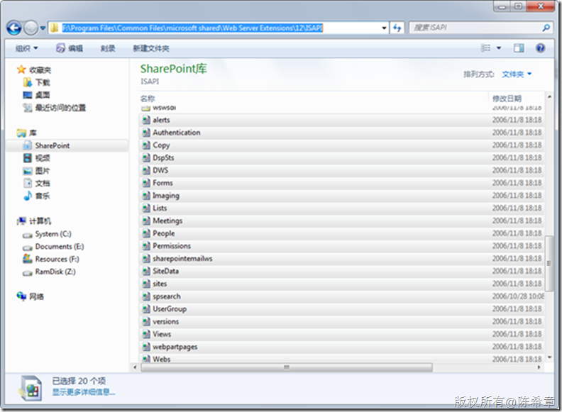
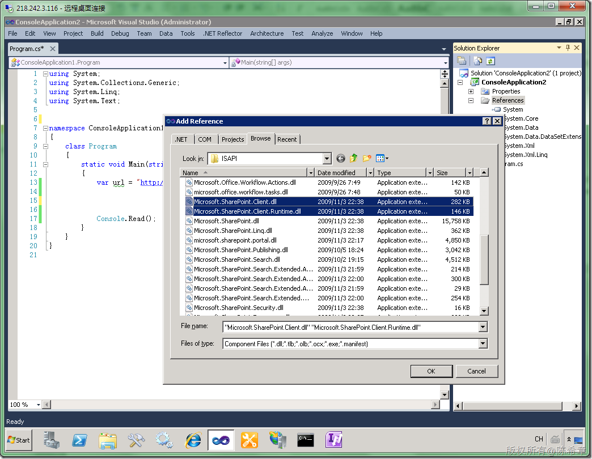
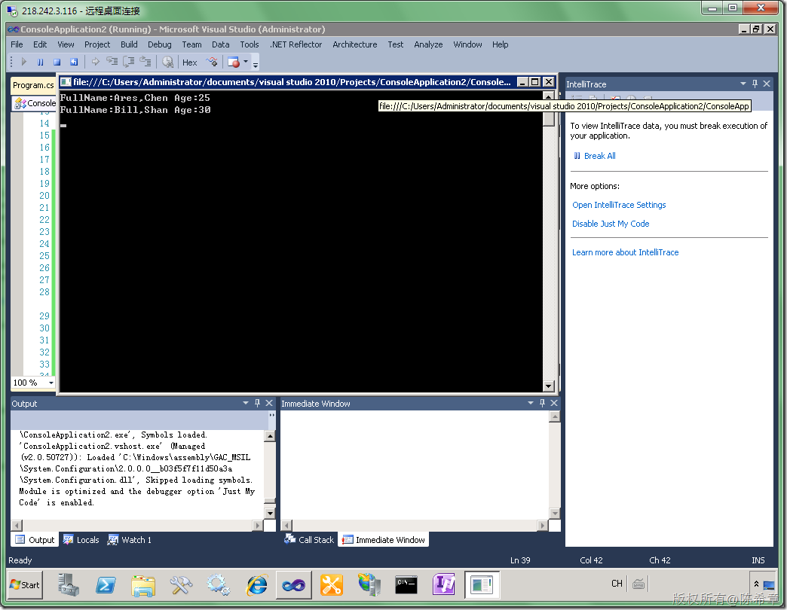

# MOSS 2010:Visual Studio 2010开发体验（16）——客户端对象模型 
> 原文发表于 2010-04-26, 地址: http://www.cnblogs.com/chenxizhang/archive/2010/04/26/1721653.html 


[上一篇](http://www.cnblogs.com/chenxizhang/archive/2010/04/26/1721573.html)，我们讲到了LINQ to SharePoint。它提供了很自然的语法，提高了开发体验。但归根结底，LINQ to SharePoint是使用了服务器对象模型，也就是说，通过这样方式编写的代码，必须在服务器运行。大家其实也发现了，我们并没有在任何地方指定过用户的身份。这意味着什么呢？那种方式就默认使用当前用户的凭据作为身份验证。

 但是，假设我们的应用程序并不在服务器，而是在客户端运行的话，那么该怎么办呢？

 以前（MOSS 2007或者WSS 3.0中），我们是通过一些Web Service的方式来实现的。这里有一个链接可以供参考

 <http://msdn.microsoft.com/en-us/library/ms479390.aspx>

 实际上，他们是在下面的这个目录中的一些asmx文件

 [](http://images.cnblogs.com/cnblogs_com/chenxizhang/WindowsLiveWriter/MOSS2010VisualStudio201016_14CB1/image_2.png) 

 但实际上，我们用起来并不是很方便，为了尽可能通用，所以它返回来的数据是用XML方式包装的，解析起来很费劲，我这里找了一段之前写过的代码


```

            localhost.Lists proxy = new localhost.Lists();
            proxy.UseDefaultCredentials = true;//使用当前用户的凭据

            XmlDocument doc = new XmlDocument();
            XmlNode q = doc.CreateElement("Query");
            q.InnerXml = "<Where><Eq><FieldRef Name=\"Status\" /><Value Type=\"Text\">未启动</Value></Eq></Where>";

            XmlNode f = doc.CreateElement("ViewFields");
            f.InnerXml = GetViewFieldsSettings("标题,说明", list);

            XmlNode o = doc.CreateElement("QueryOptions");

            XmlNode items = proxy.GetListItems("任务", "", q, f, "", o, web.ID.ToString());
            XmlNamespaceManager xnm = new XmlNamespaceManager(items.OwnerDocument.NameTable);
            xnm.AddNamespace("rs", "urn:schemas-microsoft-com:rowset");
            xnm.AddNamespace("z", "#RowsetSchema");
            XmlNode resultcount = items.SelectSingleNode("rs:data", xnm);
            Console.WriteLine("总记录数:{0}", resultcount.Attributes["ItemCount"].Value);

            XmlNodeList result = items.SelectNodes("//z:row", xnm);
            int index = 0;

            foreach (XmlNode item in result)
            {
                Console.WriteLine("第{0}行记录", ++index);
                foreach (XmlAttribute att in item.Attributes)
                {
                    Console.WriteLine("\t{0}:{1}", att.Name, att.Value);
                }
                Console.WriteLine();
            }

```

.csharpcode, .csharpcode pre
{
 font-size: small;
 color: black;
 font-family: consolas, "Courier New", courier, monospace;
 background-color: #ffffff;
 /*white-space: pre;*/
}
.csharpcode pre { margin: 0em; }
.csharpcode .rem { color: #008000; }
.csharpcode .kwrd { color: #0000ff; }
.csharpcode .str { color: #006080; }
.csharpcode .op { color: #0000c0; }
.csharpcode .preproc { color: #cc6633; }
.csharpcode .asp { background-color: #ffff00; }
.csharpcode .html { color: #800000; }
.csharpcode .attr { color: #ff0000; }
.csharpcode .alt 
{
 background-color: #f4f4f4;
 width: 100%;
 margin: 0em;
}
.csharpcode .lnum { color: #606060; }

 


这里首先我们还是需要用到CAML语法定义查询，但最要命的是它返回的结果是XMLNode，我们还要通过XML的解析方式去处理它。这次第，怎一个苦字了得？[](http://images.cnblogs.com/cnblogs_com/chenxizhang/WindowsLiveWriter/MOSS2010VisualStudio201016_14CB1/%E5%AF%92_2.gif) 


为什么这么苦？为什么这么累？归根结底就是因为之前版本的SharePoint并没有提供可供客户端使用的对象模型。


 


现在我们就可以摆脱这种痛苦的境地了，因为MOSS 2010提供了全新的客户端对象模型。该模型既可用于.NET程序，又可用于javascript。换而言之，任何客户端都可以有机会来访问到SharePoint 的数据。


这一篇先讲解一下在.NET客户端应用程序中使用对象模型查询列表数据。


 


第一步，添加引用。MOSS 2010提供了两个特殊的dll，可以供客户端应用程序引用


他们一般是在C:\Program Files\Common Files\Microsoft Shared\Web Server Extensions\14\ISAPI这个目录


[](http://images.cnblogs.com/cnblogs_com/chenxizhang/WindowsLiveWriter/MOSS2010VisualStudio201016_14CB1/image_4.png) 


第二步，编写如下代码来完成列表查询


```
using System;
using System.Collections.Generic;
using System.Linq;
using System.Text;

using Microsoft.SharePoint.Client;


namespace ConsoleApplication1
{
    class Program
    {
        static void Main(string[] args)
        {
            var url = "http://localhost:45223/sites/dev";

            using (ClientContext ctx = new ClientContext(url))
            {
                ctx.Credentials = System.Net.CredentialCache.DefaultNetworkCredentials;
                Web web = ctx.Web;
                ctx.Load(web);
                ctx.Load(web.Lists);
                ctx.Load(web, w => w.Lists.Where(l => l.Title == "Employees"));
                ctx.ExecuteQuery();

                List list = web.Lists[0];
                CamlQuery camlQuery = new CamlQuery();
                camlQuery.ViewXml = "<View><Query><Where><Lt><FieldRef Name='Age' /><Value Type='Number'>60</Value></Lt></Where></Query><RowLimit>100</RowLimit></View>";

                ListItemCollection collListItem = list.GetItems(camlQuery);

                ctx.Load(collListItem);
                ctx.ExecuteQuery();

                foreach (var item in collListItem)
                {
                    Console.WriteLine("FullName:{0},{1} Age:{2}",
                        item["FirstName"],
                        item["LastName"],
                        item["Age"]);
                }
            }

            Console.Read();
        }
    }
}

```

.csharpcode, .csharpcode pre
{
 font-size: small;
 color: black;
 font-family: consolas, "Courier New", courier, monospace;
 background-color: #ffffff;
 /*white-space: pre;*/
}
.csharpcode pre { margin: 0em; }
.csharpcode .rem { color: #008000; }
.csharpcode .kwrd { color: #0000ff; }
.csharpcode .str { color: #006080; }
.csharpcode .op { color: #0000c0; }
.csharpcode .preproc { color: #cc6633; }
.csharpcode .asp { background-color: #ffff00; }
.csharpcode .html { color: #800000; }
.csharpcode .attr { color: #ff0000; }
.csharpcode .alt 
{
 background-color: #f4f4f4;
 width: 100%;
 margin: 0em;
}
.csharpcode .lnum { color: #606060; }

【注意】这里的CamlQuery的定义有些特殊，它最外层是一个View元素，里面有一个Query元素。


【注意】ClientContext这个对象是有一个属性叫Credentials的，换而言之，我们可以在客户端传递有关的身份过来


[](http://images.cnblogs.com/cnblogs_com/chenxizhang/WindowsLiveWriter/MOSS2010VisualStudio201016_14CB1/image_6.png) 


通过这个简单的例子，大家了解了如何通过客户端对象模型访问到SharePont站点中的列表。（其实远远不限于列表访问）


如果和之前Web Service的方式进行比较的话，一个最明显的好处就是返回值是强类型的，而不是一段XML了。这既有好处，也有坏处。好处就是.NET程序处理比较方便，坏处就是其他平台可能就无法使用这些结果。那么如何让其他平台，或者简单地说，我们如何在javascript中访问这些数据呢？请期待下一篇的介绍


后面我们还将介绍在Silverlight中使用客户端模型的做法，那是不太一样的。Silverlight的所有数据访问操作都是异步的，具体的内容，请听下回分解吧

