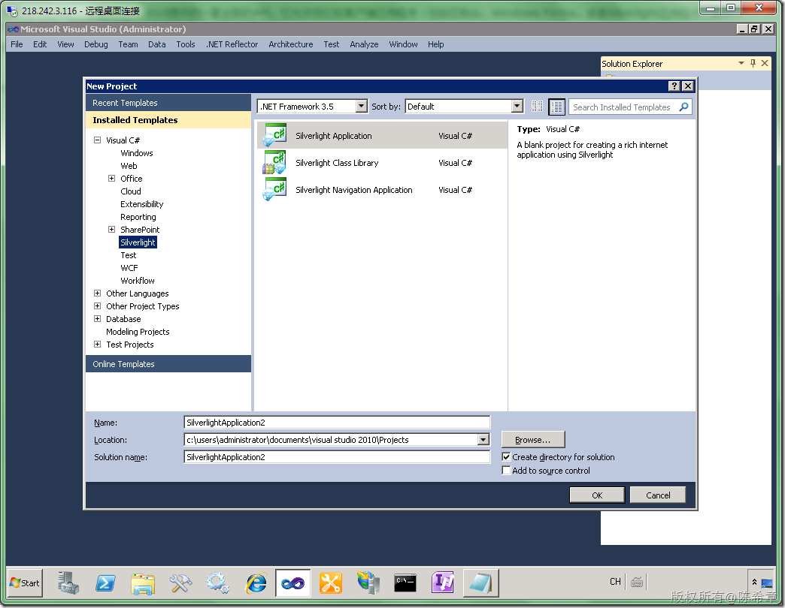
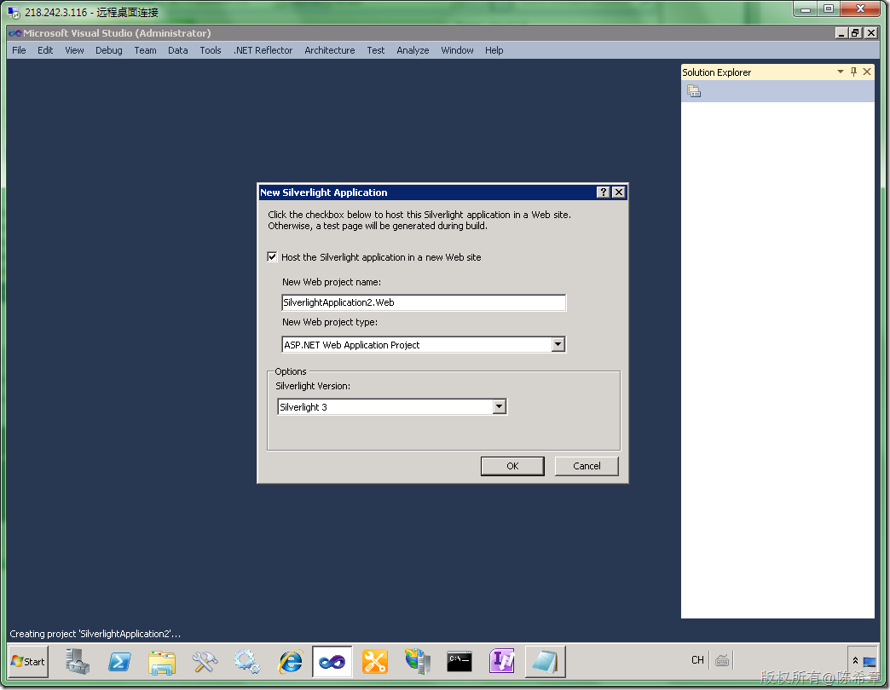
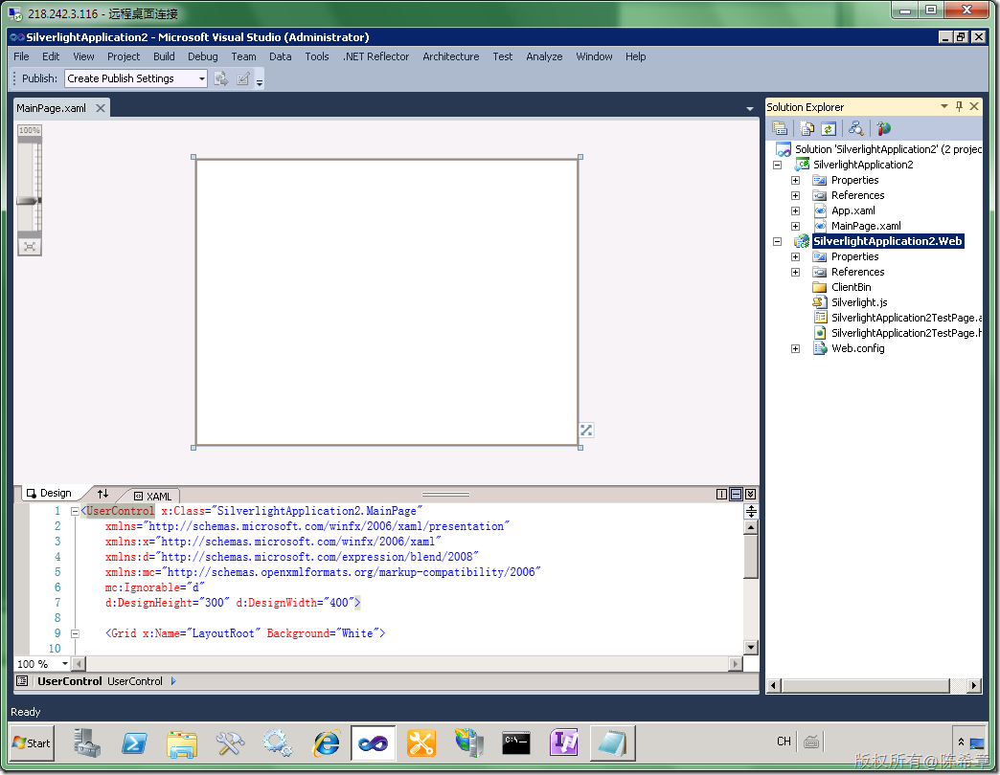
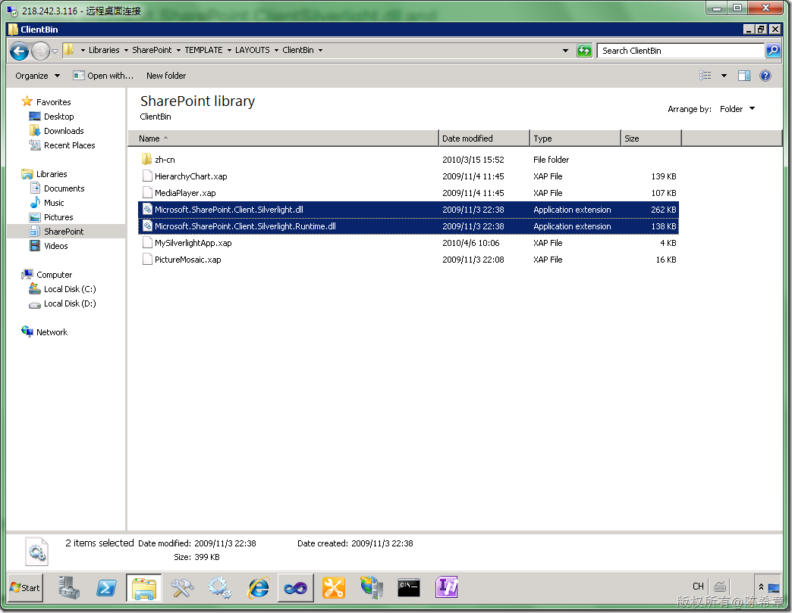
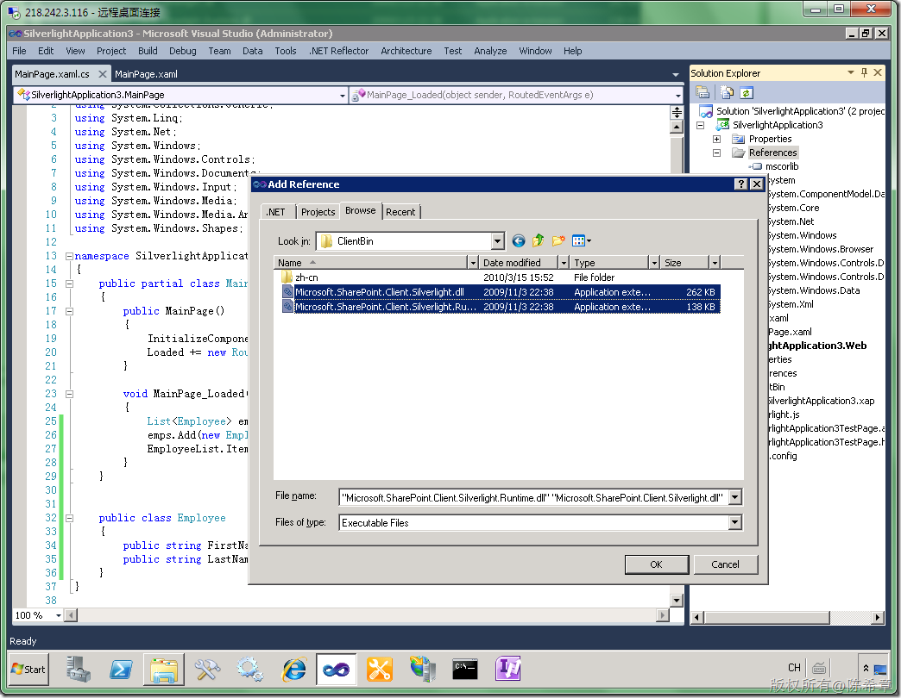
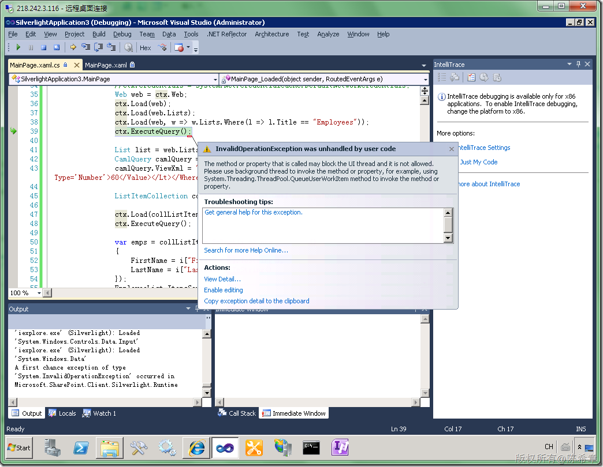
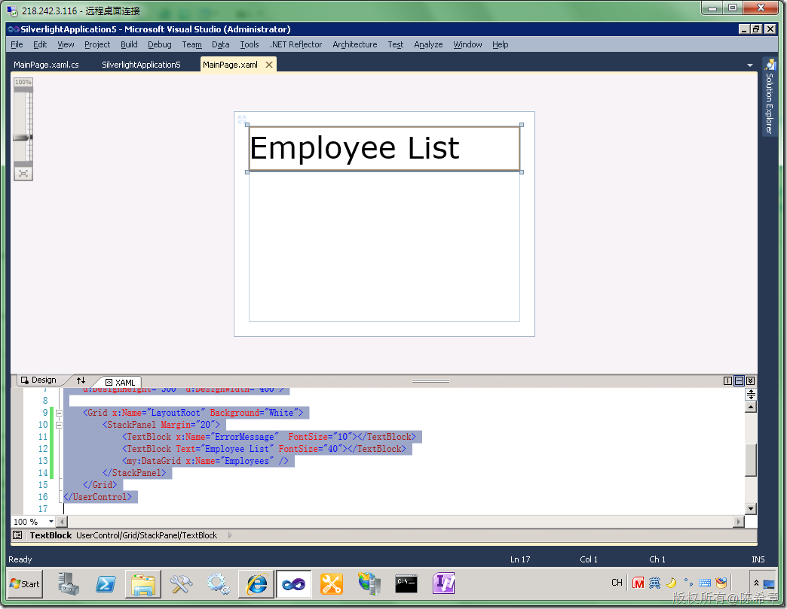
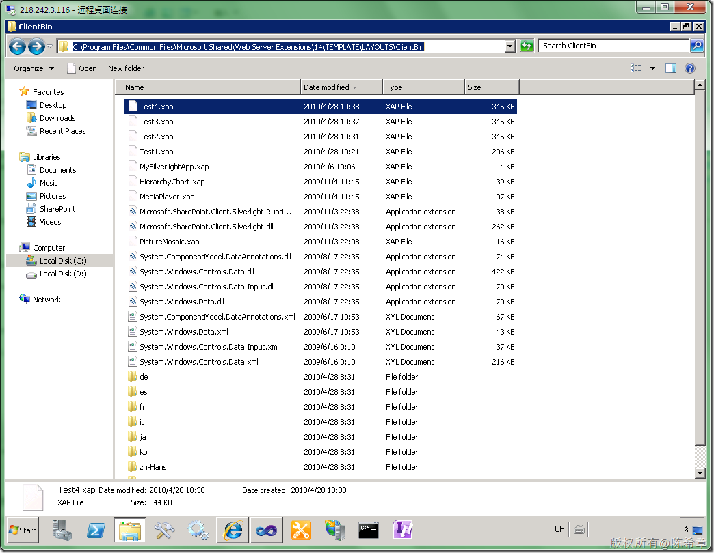

# MOSS 2010:Visual Studio 2010开发体验（17）——在Silverlight应用程序中访问客户端对象模型 
> 原文发表于 2010-04-28, 地址: http://www.cnblogs.com/chenxizhang/archive/2010/04/28/1722759.html 


[上一篇](http://www.cnblogs.com/chenxizhang/archive/2010/04/26/1721653.html)我们开始介绍到了客户端对象模型，这是MOSS 2010提供的一套全新的API，它允许我们在客户端应用程序（包括控制台，Windows Forms，或者Silverlight应用程序）能够方便地访问到SharePoint的数据和组件。典型的引用是列表数据查询。（但不仅限于此）

 我们这一篇将继续这个话题，我们来看看在Silverlight应用程序中如何使用客户端对象模型。这与之前的控制台应用程序还是有些不一样的。根本性的区别在于异步操作。

  

 【注意】在Silverlight中使用客户端对象模型访问SharePoint数据的做法有两种，一种是作为Web Part的一部分直接嵌入在SharePoint里面，这种做法相对比较简单。而另外一种做法是在独立的应用程序中，（不在SharePoint站点中），这时会遇到很多复杂的问题，例如跨域访问方面的限制等等。

 本篇我们讨论的是第一种做法

  

 1. 创建一个简单的Silverlight应用程序
-------------------------

 [](http://images.cnblogs.com/cnblogs_com/chenxizhang/WindowsLiveWriter/MOSS2010VisualStudio201017Silverlight_7B49/image_2.png) 

 [](http://images.cnblogs.com/cnblogs_com/chenxizhang/WindowsLiveWriter/MOSS2010VisualStudio201017Silverlight_7B49/image_4.png) 

  [](http://images.cnblogs.com/cnblogs_com/chenxizhang/WindowsLiveWriter/MOSS2010VisualStudio201017Silverlight_7B49/image_6.png) 

 2. 设计界面，我们可以加入一个DataGrid控件来做数据展示。
---------------------------------


```
<UserControl xmlns:my="clr-namespace:System.Windows.Controls;assembly=System.Windows.Controls.Data"  x:Class="SilverlightApplication3.MainPage"
    xmlns="http://schemas.microsoft.com/winfx/2006/xaml/presentation"
    xmlns:x="http://schemas.microsoft.com/winfx/2006/xaml"
    xmlns:d="http://schemas.microsoft.com/expression/blend/2008"
    xmlns:mc="http://schemas.openxmlformats.org/markup-compatibility/2006"
    mc:Ignorable="d"
    d:DesignHeight="300" d:DesignWidth="400">

    <Grid x:Name="LayoutRoot" Background="White">

        <my:DataGrid x:Name="EmployeeList" Margin="20" />
        
    </Grid>
    
    
</UserControl>
```

.csharpcode, .csharpcode pre
{
 font-size: small;
 color: black;
 font-family: consolas, "Courier New", courier, monospace;
 background-color: #ffffff;
 /*white-space: pre;*/
}
.csharpcode pre { margin: 0em; }
.csharpcode .rem { color: #008000; }
.csharpcode .kwrd { color: #0000ff; }
.csharpcode .str { color: #006080; }
.csharpcode .op { color: #0000c0; }
.csharpcode .preproc { color: #cc6633; }
.csharpcode .asp { background-color: #ffff00; }
.csharpcode .html { color: #800000; }
.csharpcode .attr { color: #ff0000; }
.csharpcode .alt 
{
 background-color: #f4f4f4;
 width: 100%;
 margin: 0em;
}
.csharpcode .lnum { color: #606060; }

然后，我们用少量的代码做一个测试，确认它能够正常工作 
先不连接到SharePoint，我们在本地做一个范例


```
using System;
using System.Collections.Generic;
using System.Linq;
using System.Net;
using System.Windows;
using System.Windows.Controls;
using System.Windows.Documents;
using System.Windows.Input;
using System.Windows.Media;
using System.Windows.Media.Animation;
using System.Windows.Shapes;

namespace SilverlightApplication3
{
    public partial class MainPage : UserControl
    {
        public MainPage()
        {
            InitializeComponent();
            Loaded += new RoutedEventHandler(MainPage\_Loaded);
        }

        void MainPage\_Loaded(object sender, RoutedEventArgs e)
        {
            List<Employee> emps = new List<Employee>();
            emps.Add(new Employee() { FirstName = "ares", LastName = "chen" });
            EmployeeList.ItemsSource = emps;
        }
    }


    public class Employee
    {
        public string FirstName { get; set; }
        public string LastName { get; set; }
    }
}

```

按下F5键调试，我们可以在浏览器中，看到如下的效果


[](http://images.cnblogs.com/cnblogs_com/chenxizhang/WindowsLiveWriter/MOSS2010VisualStudio201017Silverlight_7B49/image_8.png) 


还不错，我们一次就成功了（当然，这没有什么可值得骄傲的，呵呵）


 


3. 使用专用的客户端模型访问到SharePoint的数据
-----------------------------


注意，我们这里所说的“专用”二次，这是有两个特殊的程序集需要引用，他们的位置是在下面C:\Program Files\Common Files\Microsoft Shared\Web Server Extensions\14\TEMPLATE\LAYOUTS\ClientBin


[](http://images.cnblogs.com/cnblogs_com/chenxizhang/WindowsLiveWriter/MOSS2010VisualStudio201017Silverlight_7B49/image_10.png) 


所以，不用多说，添加他们


[](http://images.cnblogs.com/cnblogs_com/chenxizhang/WindowsLiveWriter/MOSS2010VisualStudio201017Silverlight_7B49/image_12.png) 


 


然后，我们把[上一篇](http://www.cnblogs.com/chenxizhang/archive/2010/04/26/1721653.html)的代码复制过来，看看能不能工作


 


```
using System;
using System.Collections.Generic;
using System.Linq;
using System.Net;
using System.Windows;
using System.Windows.Controls;
using System.Windows.Documents;
using System.Windows.Input;
using System.Windows.Media;
using System.Windows.Media.Animation;
using System.Windows.Shapes;

using Microsoft.SharePoint.Client;


namespace SilverlightApplication3
{
    public partial class MainPage : UserControl
    {
        public MainPage()
        {
            InitializeComponent();
            Loaded += new RoutedEventHandler(MainPage\_Loaded);
        }

        void MainPage\_Loaded(object sender, RoutedEventArgs e)
        {


            var url = "http://localhost:45223/sites/dev";

            using (ClientContext ctx = new ClientContext(url))
            {
                //ctx.Credentials = System.Net.CredentialCache.DefaultNetworkCredentials;
                Web web = ctx.Web;
                ctx.Load(web);
                ctx.Load(web.Lists);
                ctx.Load(web, w => w.Lists.Where(l => l.Title == "Employees"));
                ctx.ExecuteQuery();

                List list = web.Lists[0];
                CamlQuery camlQuery = new CamlQuery();
                camlQuery.ViewXml = "<View><Query><Where><Lt><FieldRef Name='Age' /><Value Type='Number'>60</Value></Lt></Where></Query><RowLimit>100</RowLimit></View>";

                ListItemCollection collListItem = list.GetItems(camlQuery);

                ctx.Load(collListItem);
                ctx.ExecuteQuery();

                var emps = collListItem.Select(i => new Employee()
                {
                    FirstName = i["FirstName"].ToString(),
                    LastName = i["LastName"].ToString()
                });
                EmployeeList.ItemsSource = emps;


            }
        }
    }


    public class Employee
    {
        public string FirstName { get; set; }
        public string LastName { get; set; }
    }
}

```

.csharpcode, .csharpcode pre
{
 font-size: small;
 color: black;
 font-family: consolas, "Courier New", courier, monospace;
 background-color: #ffffff;
 /*white-space: pre;*/
}
.csharpcode pre { margin: 0em; }
.csharpcode .rem { color: #008000; }
.csharpcode .kwrd { color: #0000ff; }
.csharpcode .str { color: #006080; }
.csharpcode .op { color: #0000c0; }
.csharpcode .preproc { color: #cc6633; }
.csharpcode .asp { background-color: #ffff00; }
.csharpcode .html { color: #800000; }
.csharpcode .attr { color: #ff0000; }
.csharpcode .alt 
{
 background-color: #f4f4f4;
 width: 100%;
 margin: 0em;
}
.csharpcode .lnum { color: #606060; }

【注意】以上代码几乎和之前在Console里面一模一样


 


按下F5键运行，我们却收到了一个错误


[](http://images.cnblogs.com/cnblogs_com/chenxizhang/WindowsLiveWriter/MOSS2010VisualStudio201017Silverlight_7B49/image_14.png) 


这其实是我们预见到的错误，之前我就说到过了，Silverlight程序所有的外部资源访问都要求是异步进行的。那就动手改一下吧


 


首先为了做得更加完善些，我们在布局方面做了一下小的调整添加了错误消息提示的功能


```
<UserControl xmlns:my="clr-namespace:System.Windows.Controls;assembly=System.Windows.Controls.Data"  x:Class="SilverlightApplication5.MainPage"
    xmlns="http://schemas.microsoft.com/winfx/2006/xaml/presentation"
    xmlns:x="http://schemas.microsoft.com/winfx/2006/xaml"
    xmlns:d="http://schemas.microsoft.com/expression/blend/2008"
    xmlns:mc="http://schemas.openxmlformats.org/markup-compatibility/2006"
    mc:Ignorable="d"
    d:DesignHeight="300" d:DesignWidth="400">

    <Grid x:Name="LayoutRoot" Background="White">
        <StackPanel Margin="20">
            <TextBlock x:Name="ErrorMessage"  FontSize="10"></TextBlock>
            <TextBlock Text="Employee List" FontSize="40"></TextBlock>
            <my:DataGrid x:Name="Employees" />
        </StackPanel>
    </Grid>
</UserControl>

```

.csharpcode, .csharpcode pre
{
 font-size: small;
 color: black;
 font-family: consolas, "Courier New", courier, monospace;
 background-color: #ffffff;
 /*white-space: pre;*/
}
.csharpcode pre { margin: 0em; }
.csharpcode .rem { color: #008000; }
.csharpcode .kwrd { color: #0000ff; }
.csharpcode .str { color: #006080; }
.csharpcode .op { color: #0000c0; }
.csharpcode .preproc { color: #cc6633; }
.csharpcode .asp { background-color: #ffff00; }
.csharpcode .html { color: #800000; }
.csharpcode .attr { color: #ff0000; }
.csharpcode .alt 
{
 background-color: #f4f4f4;
 width: 100%;
 margin: 0em;
}
.csharpcode .lnum { color: #606060; }

在设计视图中，看起来应该是这样的


[](http://images.cnblogs.com/cnblogs_com/chenxizhang/WindowsLiveWriter/MOSS2010VisualStudio201017Silverlight_7B49/image_22.png) 


然后，我们的代码修改成下面这样


```
using System;
using System.Collections.Generic;
using System.Linq;
using System.Net;
using System.Windows;
using System.Windows.Controls;
using System.Windows.Documents;
using System.Windows.Input;
using System.Windows.Media;
using System.Windows.Media.Animation;
using System.Windows.Shapes;
using Microsoft.SharePoint.Client;

namespace SilverlightApplication5
{
    public partial class MainPage : UserControl
    {
        public MainPage()
        {
            InitializeComponent();
            Loaded += new RoutedEventHandler(MainPage\_Loaded);
        }

        void MainPage\_Loaded(object sender, RoutedEventArgs e)
        {

            ClientContext ctx = ClientContext.Current;
            Web web = ctx.Web;
            ctx.Load(web);
            ctx.Load(web.Lists);
            ctx.Load(web, w => w.Lists.Where(l => l.Title == "Employees"));
            ctx.ExecuteQueryAsync(
                new ClientRequestSucceededEventHandler((o, e1) =>
                {
                    List list = web.Lists[0];
                    CamlQuery camlQuery = new CamlQuery();
                    camlQuery.ViewXml = "<View><Query><Where><Lt><FieldRef Name='Age' /><Value Type='Number'>60</Value></Lt></Where></Query><RowLimit>100</RowLimit></View>";
                    ListItemCollection collListItem = list.GetItems(camlQuery);
                    ctx.Load(collListItem);

                    ctx.ExecuteQueryAsync(
                        new ClientRequestSucceededEventHandler((obj, e3) =>
                        {
                            this.Dispatcher.BeginInvoke(new Action(() =>
                            {
                                List<Employee> emps = new List<Employee>();
                                foreach (var item in collListItem)
                                {
                                    emps.Add(new Employee()
                                    {
                                        FirstName = item["FirstName"].ToString(),
                                        LastName = item["LastName"].ToString(),
                                    });

                                }

                                Employees.ItemsSource = emps;
                            }));

                        }),
                        new ClientRequestFailedEventHandler((obj, e4) =>
                        {
                            ErrorMessage.Text = e4.Exception.Message;
                        }));

                }),
                new ClientRequestFailedEventHandler((o, e2) =>
                {
                    ErrorMessage.Text = e2.Exception.Message;
                }));

        }


        public class Employee
        {
            public string FirstName { get; set; }
            public string LastName { get; set; }
        }
    }
}

```

.csharpcode, .csharpcode pre
{
 font-size: small;
 color: black;
 font-family: consolas, "Courier New", courier, monospace;
 background-color: #ffffff;
 /*white-space: pre;*/
}
.csharpcode pre { margin: 0em; }
.csharpcode .rem { color: #008000; }
.csharpcode .kwrd { color: #0000ff; }
.csharpcode .str { color: #006080; }
.csharpcode .op { color: #0000c0; }
.csharpcode .preproc { color: #cc6633; }
.csharpcode .asp { background-color: #ffff00; }
.csharpcode .html { color: #800000; }
.csharpcode .attr { color: #ff0000; }
.csharpcode .alt 
{
 background-color: #f4f4f4;
 width: 100%;
 margin: 0em;
}
.csharpcode .lnum { color: #606060; }

【注意】因为是作为WebPart使用，所以访问SharePoint的地址不能硬编码，而且事实上也没有必要硬编码，因为它有一个ClientContext.Current属性可以获取当前的SharePoint站点的上下文引用


 


接下来我们部署这个程序。因为我们需要将该Silverlight程序在MOSS中使用，所以需要将输出的结果复制到下面的目录


C:\Program Files\Common Files\Microsoft Shared\Web Server Extensions\14\TEMPLATE\LAYOUTS\ClientBin


 


 


[](http://images.cnblogs.com/cnblogs_com/chenxizhang/WindowsLiveWriter/MOSS2010VisualStudio201017Silverlight_7B49/image_18.png) 


然后在页面中添加一个Silverlight WebPart来显示它，部署完成之后，我们看到的效果大致如下


[](http://images.cnblogs.com/cnblogs_com/chenxizhang/WindowsLiveWriter/MOSS2010VisualStudio201017Silverlight_7B49/image_24.png) 


 


【注意】关于如何在MOSS中使用Silverlight Web Part，我之前也有一篇文章专门介绍。这里就不重复了。如果你还不熟悉，请参考下面的链接


<http://www.cnblogs.com/chenxizhang/archive/2010/04/06/1705132.html>


 


【注意】大家请注意，我的那个目录为什么会有很多个Test.xap呢，其实这也是无奈之举。如果有兴趣测试的朋友会发现，假如你对Silverlight程序做了修改，即便你覆盖掉原来的文件，那么在页面中加载的xap还是之前的那个。这的确是一个很让人诧异的设计（Web Part是不是把那个xap保存起来了呢？），目前也只有这样通过修改名字来刷新Silverlight部件了。这个问题折腾了很久的时间。


下一篇我将继续讲解在独立的Silverlight应用程序中如何访问SharePoint数据。

