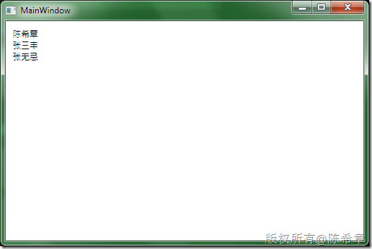
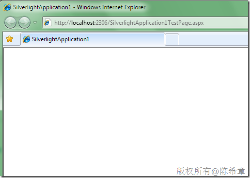
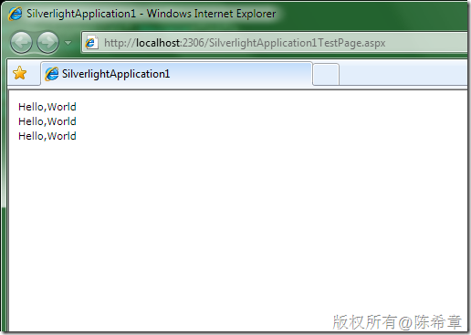
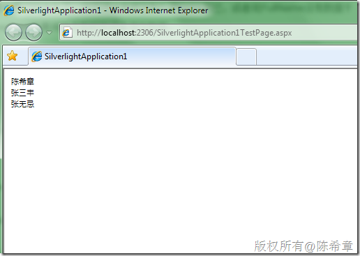

# 关于Silverlight对匿名类型数据绑定的问题及其解决方法 
> 原文发表于 2010-04-28, 地址: http://www.cnblogs.com/chenxizhang/archive/2010/04/28/1722966.html 


这是一个不得不说一下的问题。同样的代码在WPF应用程序中是可以工作的，而在Silverlight中却不可以。我们来看一下例子吧

  

 1.WPF窗体标记


```
<Window x:Class="WpfApplication1.MainWindow"
        xmlns="http://schemas.microsoft.com/winfx/2006/xaml/presentation"
        xmlns:x="http://schemas.microsoft.com/winfx/2006/xaml"
        Title="MainWindow" Height="350" Width="525">
    <Grid>
        <ItemsControl x:Name="EmployeeList" Margin="10">
            <ItemsControl.ItemTemplate>
                <DataTemplate>
                    <TextBlock Text="{Binding FullName}"></TextBlock>
                </DataTemplate>
            </ItemsControl.ItemTemplate>
        </ItemsControl>
    </Grid>
</Window>

```


.csharpcode, .csharpcode pre
{
 font-size: small;
 color: black;
 font-family: consolas, "Courier New", courier, monospace;
 background-color: #ffffff;
 /*white-space: pre;*/
}
.csharpcode pre { margin: 0em; }
.csharpcode .rem { color: #008000; }
.csharpcode .kwrd { color: #0000ff; }
.csharpcode .str { color: #006080; }
.csharpcode .op { color: #0000c0; }
.csharpcode .preproc { color: #cc6633; }
.csharpcode .asp { background-color: #ffff00; }
.csharpcode .html { color: #800000; }
.csharpcode .attr { color: #ff0000; }
.csharpcode .alt 
{
 background-color: #f4f4f4;
 width: 100%;
 margin: 0em;
}
.csharpcode .lnum { color: #606060; }

2.WPF窗体代码


```
using System.Windows;

namespace WpfApplication1
{
    /// <summary>
    /// Interaction logic for MainWindow.xaml
    /// </summary>
    public partial class MainWindow : Window
    {
        public MainWindow()
        {
            InitializeComponent();
            Loaded += new RoutedEventHandler(MainWindow\_Loaded);
        }

        void MainWindow\_Loaded(object sender, RoutedEventArgs e)
        {
            var emps = new[]{
                new{
                    FullName="陈希章"

                },
                new{
                    FullName="张三丰"
                },
                new{
                    FullName="张无忌"
                }
            };

            EmployeeList.ItemsSource = emps;
        }
    }
}

```


.csharpcode, .csharpcode pre
{
 font-size: small;
 color: black;
 font-family: consolas, "Courier New", courier, monospace;
 background-color: #ffffff;
 /*white-space: pre;*/
}
.csharpcode pre { margin: 0em; }
.csharpcode .rem { color: #008000; }
.csharpcode .kwrd { color: #0000ff; }
.csharpcode .str { color: #006080; }
.csharpcode .op { color: #0000c0; }
.csharpcode .preproc { color: #cc6633; }
.csharpcode .asp { background-color: #ffff00; }
.csharpcode .html { color: #800000; }
.csharpcode .attr { color: #ff0000; }
.csharpcode .alt 
{
 background-color: #f4f4f4;
 width: 100%;
 margin: 0em;
}
.csharpcode .lnum { color: #606060; }

3.WPF运行起来的效果


[](http://images.cnblogs.com/cnblogs_com/chenxizhang/WindowsLiveWriter/Silverlight_9DE7/image_2.png) 


 


然后我们来看Silverlight


1. Silverlight页面标记


```
<UserControl x:Class="SilverlightApplication1.MainPage"
    xmlns="http://schemas.microsoft.com/winfx/2006/xaml/presentation"
    xmlns:x="http://schemas.microsoft.com/winfx/2006/xaml"
    xmlns:d="http://schemas.microsoft.com/expression/blend/2008"
    xmlns:mc="http://schemas.openxmlformats.org/markup-compatibility/2006"
    mc:Ignorable="d"
    d:DesignHeight="300" d:DesignWidth="400">
    <Grid x:Name="LayoutRoot" Background="White">
        <ItemsControl x:Name="EmployeeList" Margin="10">
            <ItemsControl.ItemTemplate>
                <DataTemplate>
                    <TextBlock Text="{Binding FullName}"></TextBlock>
                </DataTemplate>
            </ItemsControl.ItemTemplate>
        </ItemsControl>
    </Grid>
</UserControl>

```

2. Silverlight页面代码


```
using System.Windows;
using System.Windows.Controls;

namespace SilverlightApplication1
{
    public partial class MainPage : UserControl
    {
        public MainPage()
        {
            InitializeComponent();
            Loaded += new RoutedEventHandler(MainPage\_Loaded);
        }

        void MainPage\_Loaded(object sender, RoutedEventArgs e)
        {
            var emps = new[]{
                new{
                    FullName="陈希章"

                },
                new{
                    FullName="张三丰"
                },
                new{
                    FullName="张无忌"
                }
            };

            EmployeeList.ItemsSource = emps;
            
        }
    }
}

```


.csharpcode, .csharpcode pre
{
 font-size: small;
 color: black;
 font-family: consolas, "Courier New", courier, monospace;
 background-color: #ffffff;
 /*white-space: pre;*/
}
.csharpcode pre { margin: 0em; }
.csharpcode .rem { color: #008000; }
.csharpcode .kwrd { color: #0000ff; }
.csharpcode .str { color: #006080; }
.csharpcode .op { color: #0000c0; }
.csharpcode .preproc { color: #cc6633; }
.csharpcode .asp { background-color: #ffff00; }
.csharpcode .html { color: #800000; }
.csharpcode .attr { color: #ff0000; }
.csharpcode .alt 
{
 background-color: #f4f4f4;
 width: 100%;
 margin: 0em;
}
.csharpcode .lnum { color: #606060; }


3. 运行起来看的效果


[](http://images.cnblogs.com/cnblogs_com/chenxizhang/WindowsLiveWriter/Silverlight_9DE7/image_6.png) 


是的，什么也没有。而如果我们不使用Binding语法，直接写好固定的文本值。例如下面这样


```
<UserControl x:Class="SilverlightApplication1.MainPage"
    xmlns="http://schemas.microsoft.com/winfx/2006/xaml/presentation"
    xmlns:x="http://schemas.microsoft.com/winfx/2006/xaml"
    xmlns:d="http://schemas.microsoft.com/expression/blend/2008"
    xmlns:mc="http://schemas.openxmlformats.org/markup-compatibility/2006"
    mc:Ignorable="d"
    d:DesignHeight="300" d:DesignWidth="400">
    <Grid x:Name="LayoutRoot" Background="White">
        <ItemsControl x:Name="EmployeeList" Margin="10">
            <ItemsControl.ItemTemplate>
                <DataTemplate>
                    <TextBlock Text="Hello,World"></TextBlock>
                </DataTemplate>
            </ItemsControl.ItemTemplate>
        </ItemsControl>
    </Grid>
</UserControl>

```


.csharpcode, .csharpcode pre
{
 font-size: small;
 color: black;
 font-family: consolas, "Courier New", courier, monospace;
 background-color: #ffffff;
 /*white-space: pre;*/
}
.csharpcode pre { margin: 0em; }
.csharpcode .rem { color: #008000; }
.csharpcode .kwrd { color: #0000ff; }
.csharpcode .str { color: #006080; }
.csharpcode .op { color: #0000c0; }
.csharpcode .preproc { color: #cc6633; }
.csharpcode .asp { background-color: #ffff00; }
.csharpcode .html { color: #800000; }
.csharpcode .attr { color: #ff0000; }
.csharpcode .alt 
{
 background-color: #f4f4f4;
 width: 100%;
 margin: 0em;
}
.csharpcode .lnum { color: #606060; }

则运行起来会怎么样呢？我们能看到三行数据


[](http://images.cnblogs.com/cnblogs_com/chenxizhang/WindowsLiveWriter/Silverlight_9DE7/image_8.png) 


这说明什么问题呢？我想至少说明，绑定的操作是已经发生了，只不过没有绑定到FullName而已，或者说FullName没有数据？


好吧，那么怎么解决该问题呢？答案是在Silverlight中要用强类型的方式来保存数据。


例如下面这样的代码


```
using System.Windows;
using System.Collections.Generic;
using System.Windows.Controls;

namespace SilverlightApplication1
{
    public partial class MainPage : UserControl
    {
        public MainPage()
        {
            InitializeComponent();
            Loaded += new RoutedEventHandler(MainPage\_Loaded);
        }

        void MainPage\_Loaded(object sender, RoutedEventArgs e)
        {

            List<Employee> emps = new List<Employee>(){
                new Employee(){FullName="陈希章"},
                new Employee(){FullName="张三丰"},
                new Employee(){FullName="张无忌"}
            };


            EmployeeList.ItemsSource = emps;
            
        }

        public class Employee
        {
            public string FullName { get; set; }
        }
    }
}

```


.csharpcode, .csharpcode pre
{
 font-size: small;
 color: black;
 font-family: consolas, "Courier New", courier, monospace;
 background-color: #ffffff;
 /*white-space: pre;*/
}
.csharpcode pre { margin: 0em; }
.csharpcode .rem { color: #008000; }
.csharpcode .kwrd { color: #0000ff; }
.csharpcode .str { color: #006080; }
.csharpcode .op { color: #0000c0; }
.csharpcode .preproc { color: #cc6633; }
.csharpcode .asp { background-color: #ffff00; }
.csharpcode .html { color: #800000; }
.csharpcode .attr { color: #ff0000; }
.csharpcode .alt 
{
 background-color: #f4f4f4;
 width: 100%;
 margin: 0em;
}
.csharpcode .lnum { color: #606060; }

然后，再次运行就可以了


[](http://images.cnblogs.com/cnblogs_com/chenxizhang/WindowsLiveWriter/Silverlight_9DE7/image_10.png) 


这样就和谐了！


【注意】这个问题有些不合情理。但我目前也没有想明白为什么，或者是不是因为某些bug导致也未可知。先解决问题吧，以后再看看。如果有哪位朋友对此有什么高见，请不吝赐教

