# MOSS 2010:Visual Studio 2010开发体验（20）——使用ADO.NET Data Service快速访问SharePoint列表数据 
> 原文发表于 2010-04-28, 地址: http://www.cnblogs.com/chenxizhang/archive/2010/04/28/1723251.html 


[上一篇](http://www.cnblogs.com/chenxizhang/archive/2010/04/28/1723196.html) 讨论ECMAScript Object Model的时候，我们在结尾说到了，其实客户端的Javascript是通过一个client.svc文件去查询的。请注意看下图选中的部分

 地址是： [http://nymoss2010:45223/Sites/dev/\_vti\_bin/client.svc/ProcessQuery](http://nymoss2010:45223/Sites/dev/_vti_bin/client.svc/ProcessQuery "http://nymoss2010:45223/Sites/dev/_vti_bin/client.svc/ProcessQuery")

 [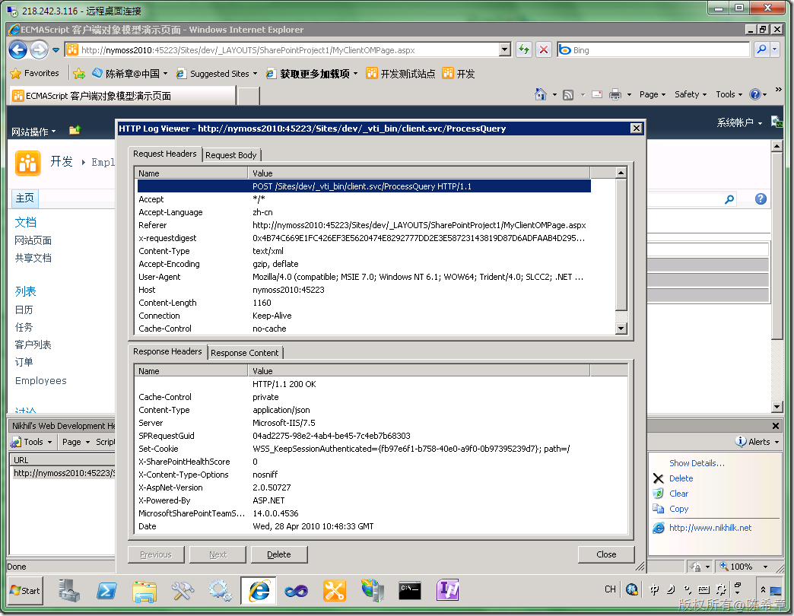](http://images.cnblogs.com/cnblogs_com/chenxizhang/WindowsLiveWriter/MOSS2010VisualS.NETDataServiceSharePoint_11F05/image_2.png) 

 有些朋友看到这个可能会感到新奇，实际上在我看来没有什么可奇怪的。我之前也提到过，原先MOSS 2007的时候，为了让客户端可以访问到SharePoint的数据，实际上也有公开一些Web Service的。那时候的做法是基于asmx的方式去做的。

 时代不同了，这个方面当然也要考虑升级了。就像WCF是对asmx的升级一样，原先那套服务都升级成了这种svc的服务。实际上，就是WCF服务啦。

 当然，认真说起来呢，它不是简单的WCF服务，而是所谓的ADO.NET Data Service。关于什么是ADO.NET Data Service，有兴趣的朋友可以参考我下面的文章

 <http://www.cnblogs.com/chenxizhang/archive/2009/05/18/1459533.html>

 也可以通过下面的地址查看更多

 <http://www.google.com.hk/custom?hl=zh-CN&newwindow=1&safe=strict&client=pub-4210569241504288&cof=FORID:1;GL:1;S:http://www.cnblogs.com/;L:http://www.cnblogs.com/images/logo_small.gif;LH:50;LW:129;LBGC:FFFFFF;LC:%230000ff;VLC:%23663399;GFNT:%230000ff;GIMP:%230000ff;DIV:%23336699;&domains=cnblogs.com&sitesearch=cnblogs.com&channel=5875741252&q=site:www.cnblogs.com/chenxizhang/+ado.net+data+service&start=0&sa=N>

  

 我们需要展开一些讨论，这个地址（[http://nymoss2010:45223/Sites/dev/\_vti\_bin/client.svc/ProcessQuery](http://nymoss2010:45223/Sites/dev/_vti_bin/client.svc/ProcessQuery "http://nymoss2010:45223/Sites/dev/_vti_bin/client.svc/ProcessQuery")）到底代表请求了什么地方的什么文件呢？

 我们都知道\_vti\_bin是一个SharePoint中的一个特殊目录，SharePoint有很多类似的特殊目录。大家简单地记住，所有下划线开头的一般都是特殊目录。例如\_layouts,\_images等等

 \_vti\_bin其实代表了下面这个位置，在里面我们确实可以找到Client.svc文件

 [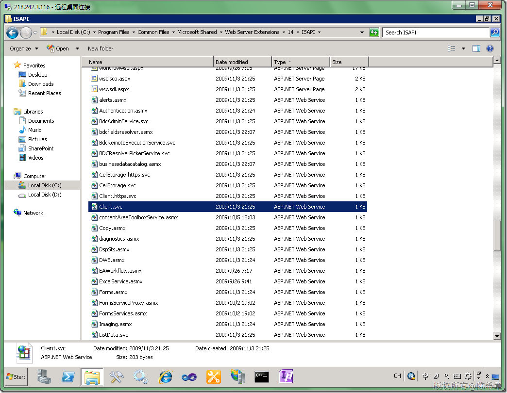](http://images.cnblogs.com/cnblogs_com/chenxizhang/WindowsLiveWriter/MOSS2010VisualS.NETDataServiceSharePoint_11F05/image_22.png) 

 我记得在很多次给一些朋友讲解SharePoint的内部架构时，讲到这里，很多朋友就会好奇地问，为什么是叫\_vti，而不叫别的呢？

 Good question! 其实，保留vti 很大意义上是为了纪念一家公司吧，这家公司就叫vti （Vermeer Technologies Inc ）,你可能会说，这有什么大不了的呀。我要是说出一个产品，你就会知道为什么要纪念他们。FrontPage。是的，这家公司发明的FrontPage,后来被微软收购了，后来才慢慢有了STS,然后才有了WSS,然后今天才有MOSS。

 【注意】FrontPage不光是网页设计工具，它还有服务器组件（FrontPage Extension)，正是这个组件，构成了SharePoint最早的形状。

 【注意】我强烈建议大家学一个新技术，或者一种新的架构时，要花些时间看看它背后到底做了什么样的设计

 呵呵，下面这个 链接介绍了VTI这个公司，以及FrontPage的历史

 <http://www.seoconsultants.com/frontpage/history/>

 我现在都还记得当年用FrontPage 97做出第一个网站（其实就几个很简单的asp页面，链接到Access数据库），发布到Windows 98的一个所谓的PWS(Personal Web Server)上面的激动心情啊 [](http://images.cnblogs.com/cnblogs_com/chenxizhang/WindowsLiveWriter/MOSS2010VisualS.NETDataServiceSharePoint_11F05/%E4%BF%BA%E6%98%AF%E5%A4%A7%E7%88%B7_2.gif) 

  

 咳，低调低调。继续咱们的正题吧。我们现在找到了这个文件，接下来看看它里面到底是什么呢？我们用记事本将其打开

 [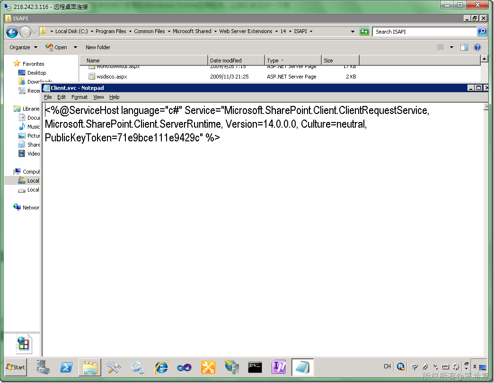](http://images.cnblogs.com/cnblogs_com/chenxizhang/WindowsLiveWriter/MOSS2010VisualS.NETDataServiceSharePoint_11F05/image_24.png) 

 通过反编译工具，我们可以很清楚看到，它就是一个WCF服务

 [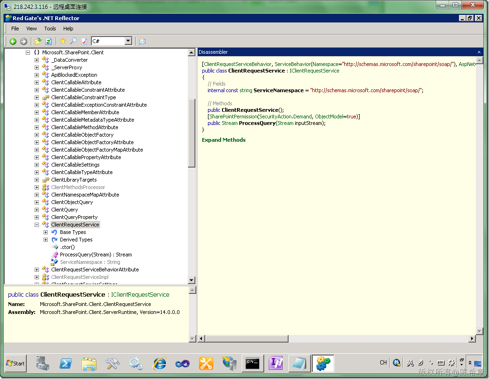](http://images.cnblogs.com/cnblogs_com/chenxizhang/WindowsLiveWriter/MOSS2010VisualS.NETDataServiceSharePoint_11F05/image_26.png) 

 事实上，除了client.svc，还有其他几个svc，如下图所示

 [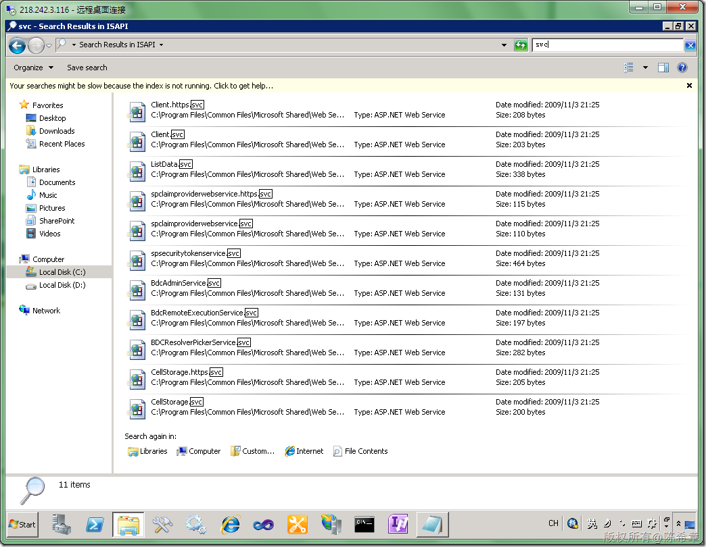](http://images.cnblogs.com/cnblogs_com/chenxizhang/WindowsLiveWriter/MOSS2010VisualS.NETDataServiceSharePoint_11F05/image_28.png) 

  

  

 接下去我们将介绍使用ListData.svc这个服务来进行列表的读写操作，据我所知，这是很多朋友非常感兴趣的

  

 1. 创建一个新的项目
-----------

 [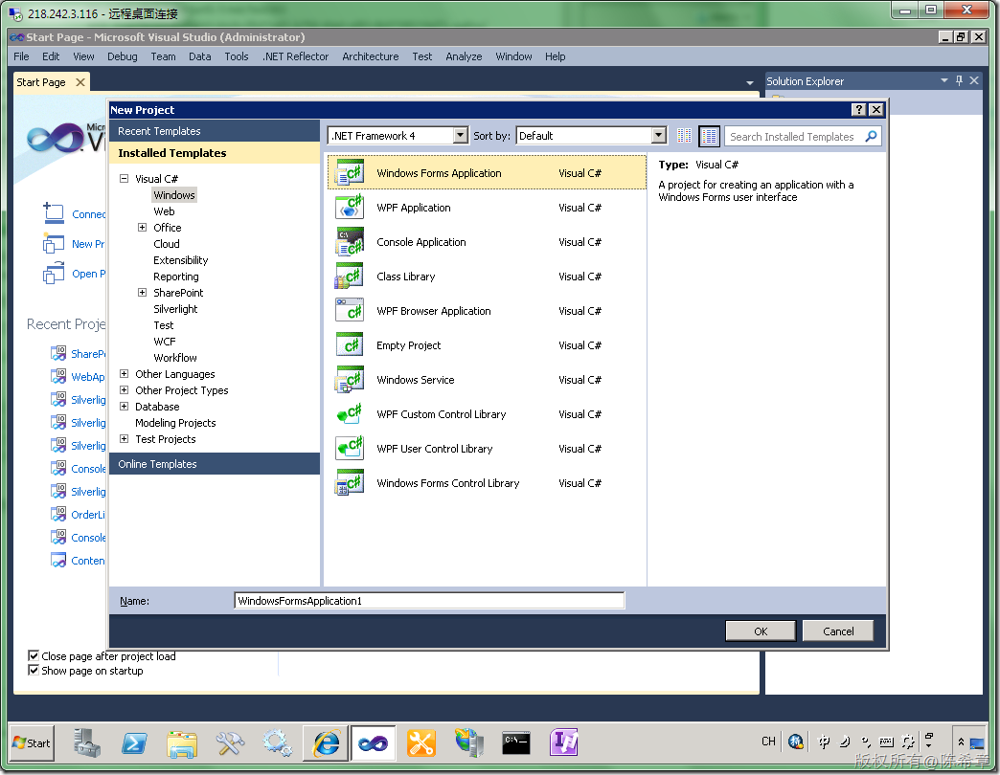](http://images.cnblogs.com/cnblogs_com/chenxizhang/WindowsLiveWriter/MOSS2010VisualS.NETDataServiceSharePoint_11F05/image_4.png) 

 2. 添加服务引用
---------

 [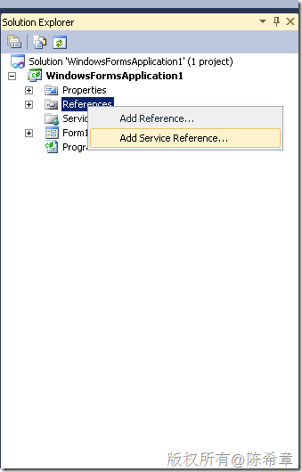](http://images.cnblogs.com/cnblogs_com/chenxizhang/WindowsLiveWriter/MOSS2010VisualS.NETDataServiceSharePoint_11F05/image_30.png) 

 [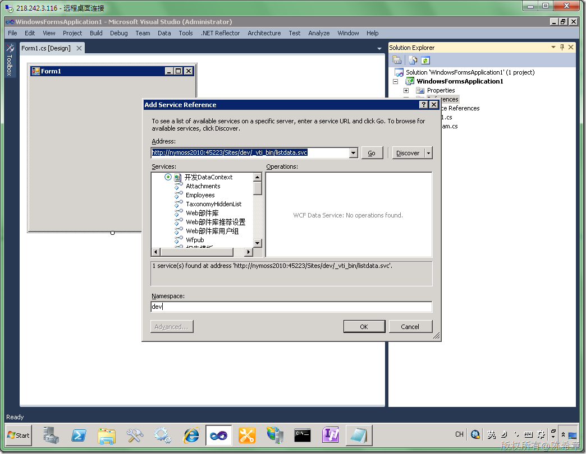](http://images.cnblogs.com/cnblogs_com/chenxizhang/WindowsLiveWriter/MOSS2010VisualS.NETDataServiceSharePoint_11F05/image_32.png) 

 这个引用添加完之后，确实和一般的WCF服务是不一样的。下图所示，就是典型的ADO.NET Data Service的效果

 [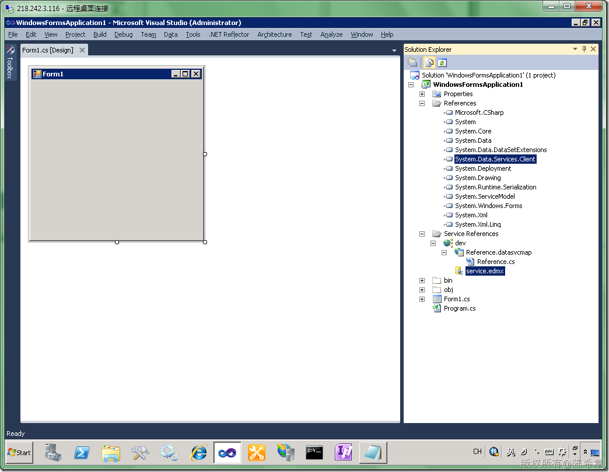](http://images.cnblogs.com/cnblogs_com/chenxizhang/WindowsLiveWriter/MOSS2010VisualS.NETDataServiceSharePoint_11F05/image_34.png) 

  

 3. 使用服务
-------

 首先将整个解决方案生成一下，然后我们可以显示一下数据源

 [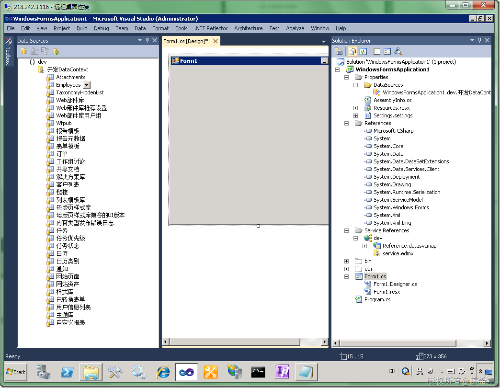](http://images.cnblogs.com/cnblogs_com/chenxizhang/WindowsLiveWriter/MOSS2010VisualS.NETDataServiceSharePoint_11F05/image_50.png) 

 然后，我们可以选中左侧的“Employees”，将它拖拽到窗体上面

 [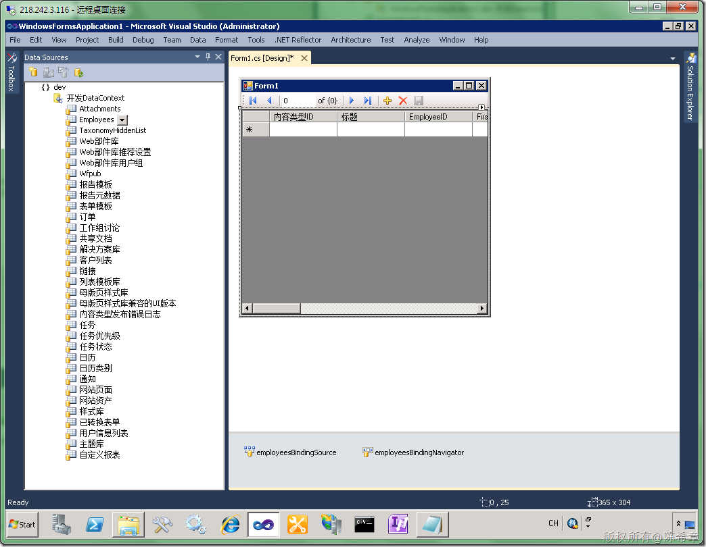](http://images.cnblogs.com/cnblogs_com/chenxizhang/WindowsLiveWriter/MOSS2010VisualS.NETDataServiceSharePoint_11F05/image_52.png) 

 看起来很神奇吧，呵呵。它自动地做好了所有的控件。

 然后，我们添加几句简单的代码，在窗体加载的时候读取数据


```
using System;
using System.Collections.Generic;
using System.ComponentModel;
using System.Data;
using System.Drawing;
using System.Linq;
using System.Text;
using System.Windows.Forms;

namespace WindowsFormsApplication1
{
    public partial class Form1 : Form
    {
        public Form1()
        {
            InitializeComponent();
            Load += new EventHandler(Form1\_Load);
        }

        void Form1\_Load(object sender, EventArgs e)
        {
            dev.开发DataContext ctx = new dev.开发DataContext(new Uri("http://localhost:45223/sites/dev/\_vti\_bin/listdata.svc"));

            ctx.Credentials = System.Net.CredentialCache.DefaultNetworkCredentials;

            employeesBindingSource.DataSource = ctx.Employees.ToArray();

        }
    }
}

```

.csharpcode, .csharpcode pre
{
 font-size: small;
 color: black;
 font-family: consolas, "Courier New", courier, monospace;
 background-color: #ffffff;
 /*white-space: pre;*/
}
.csharpcode pre { margin: 0em; }
.csharpcode .rem { color: #008000; }
.csharpcode .kwrd { color: #0000ff; }
.csharpcode .str { color: #006080; }
.csharpcode .op { color: #0000c0; }
.csharpcode .preproc { color: #cc6633; }
.csharpcode .asp { background-color: #ffff00; }
.csharpcode .html { color: #800000; }
.csharpcode .attr { color: #ff0000; }
.csharpcode .alt 
{
 background-color: #f4f4f4;
 width: 100%;
 margin: 0em;
}
.csharpcode .lnum { color: #606060; }

按下F5键，我们就可以读取到这些员工数据了


[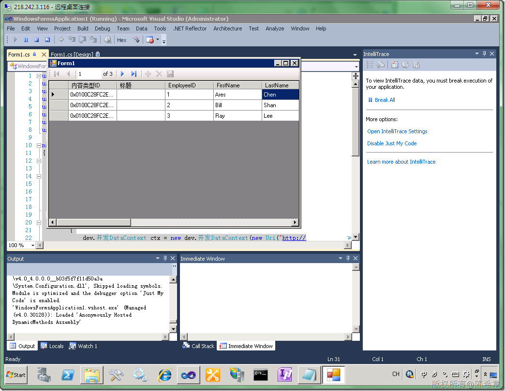](http://images.cnblogs.com/cnblogs_com/chenxizhang/WindowsLiveWriter/MOSS2010VisualS.NETDataServiceSharePoint_11F05/image_54.png) 


 


假如我们只要显示年龄小于60岁的员工，应该如何做呢？只要修改下面这句代码即可


```
employeesBindingSource.DataSource = ctx.Employees.Where(emp => emp.Age < 60).ToArray();
```

.csharpcode, .csharpcode pre
{
 font-size: small;
 color: black;
 font-family: consolas, "Courier New", courier, monospace;
 background-color: #ffffff;
 /*white-space: pre;*/
}
.csharpcode pre { margin: 0em; }
.csharpcode .rem { color: #008000; }
.csharpcode .kwrd { color: #0000ff; }
.csharpcode .str { color: #006080; }
.csharpcode .op { color: #0000c0; }
.csharpcode .preproc { color: #cc6633; }
.csharpcode .asp { background-color: #ffff00; }
.csharpcode .html { color: #800000; }
.csharpcode .attr { color: #ff0000; }
.csharpcode .alt 
{
 background-color: #f4f4f4;
 width: 100%;
 margin: 0em;
}
.csharpcode .lnum { color: #606060; }

这样显示出来的列表就只有两项了


[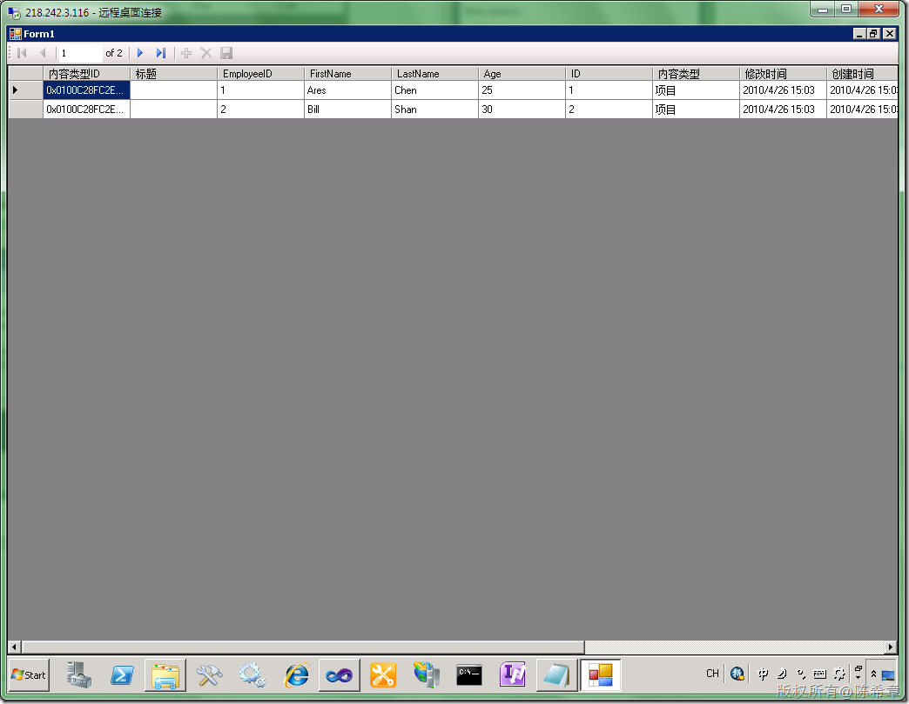](http://images.cnblogs.com/cnblogs_com/chenxizhang/WindowsLiveWriter/MOSS2010VisualS.NETDataServiceSharePoint_11F05/image_56.png) 


太方便了吧。还没有完了，我们甚至可以在窗体上修改数据，然后保存和提交到SharePoint。


只要调用下面这句代码就可以了


ctx.SaveChanges(); 
 


总结一下：
=====


MOSS 2010提供了一系列基于ADO.NET Data Service和WCF技术实现的服务，利用这些服务，可以在客户端开发的时候大大地提高生产力。到这一篇，本系列的客户端访问技术部分就结束了。下一篇开始讨论工作流


