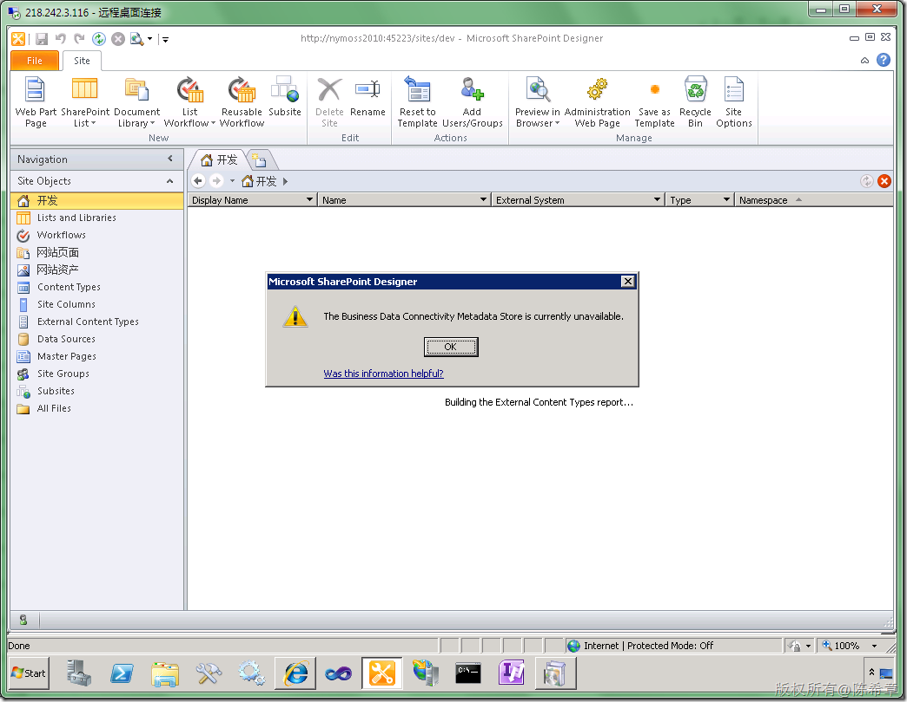
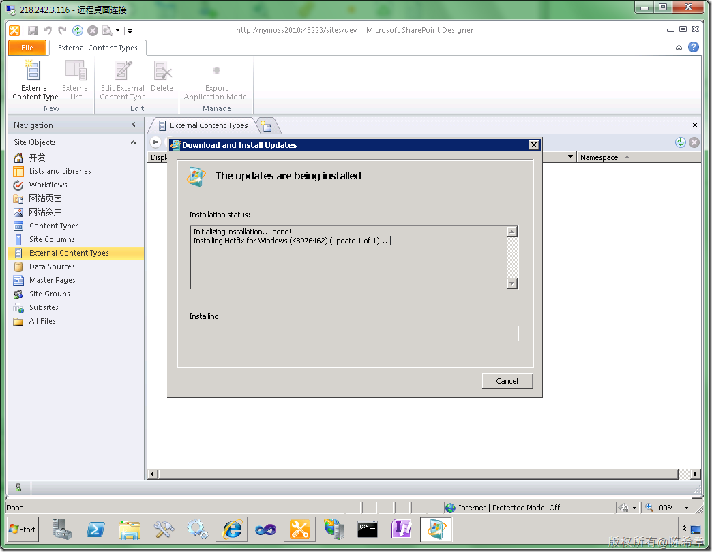
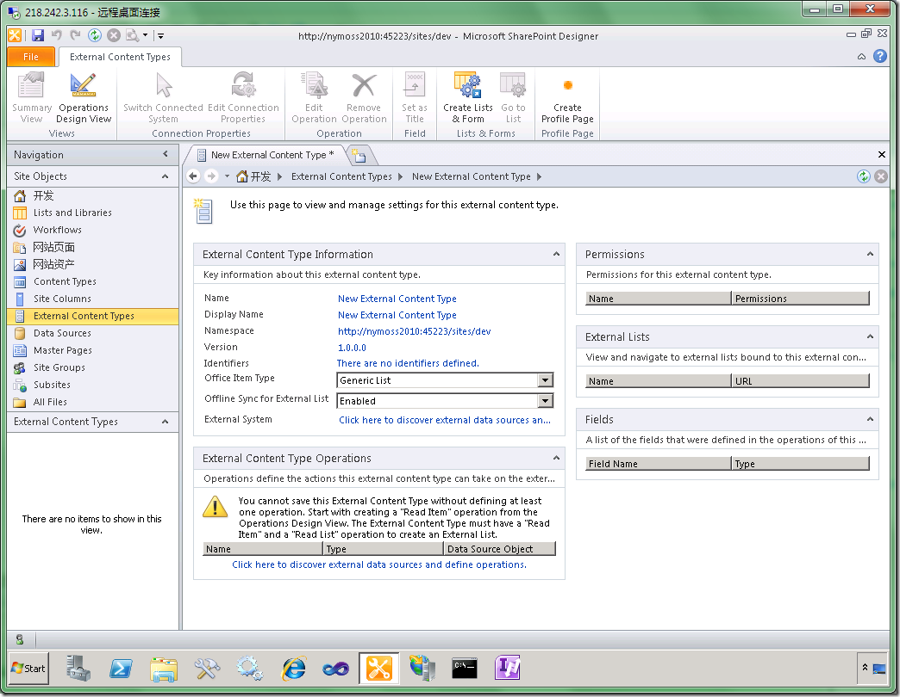

# MOSS 2010 : 如何启用(BDC)Business Data Connectivity——安装WCF Fix 
> 原文发表于 2010-04-29, 地址: http://www.cnblogs.com/chenxizhang/archive/2010/04/29/1723463.html 

在使用MOSS 2010的BDC功能时，你可能会遇到下面的问题（The Business Data Connectivity Metadata Store is currently unavailable)。

 我的环境是Windows Server 2008 R2 

  

 【注意】虽然都叫BDC，但MOSS 2010与MOSS 2007的解释是不一样的。原先在MOSS 2007叫Business Data Catalog

  

 经过查找有关资料，找到解决方法，是需要安装如下的一个补丁包 

 ###### WCF Fix for SharePoint 2010

 Windows Server 2008/Vista:  
<http://go.microsoft.com/fwlink/?linkID=160770>  
Windows Server 2008 R2/Windows 7:  
<http://go.microsoft.com/fwlink/?LinkID=166231>  

  

 

 安装完之后，一定要重启服务器

 

