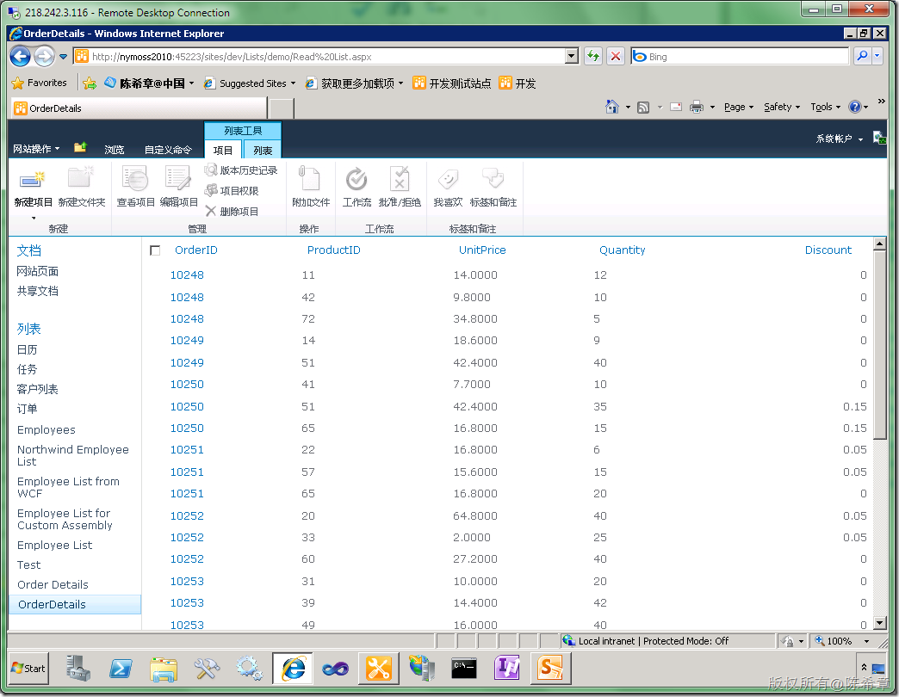
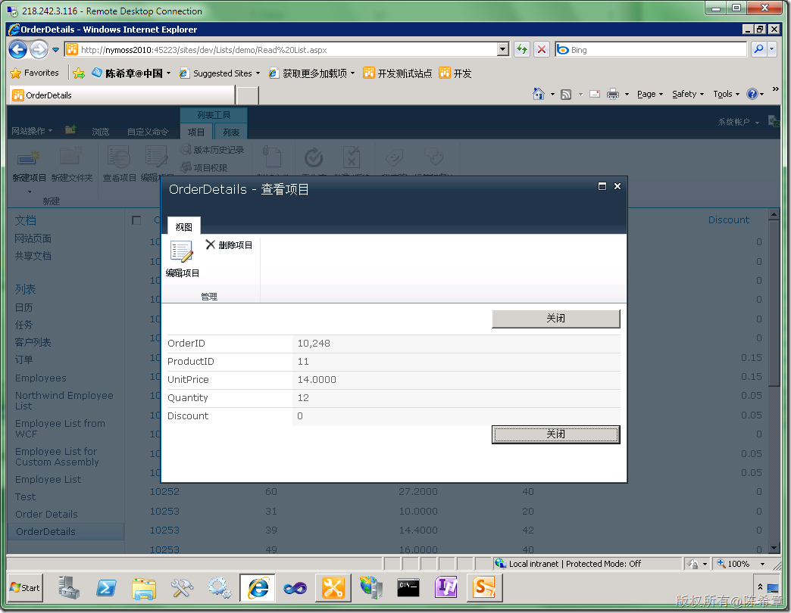
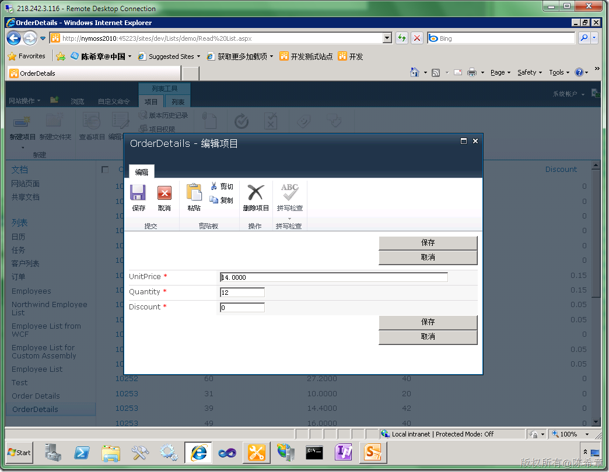
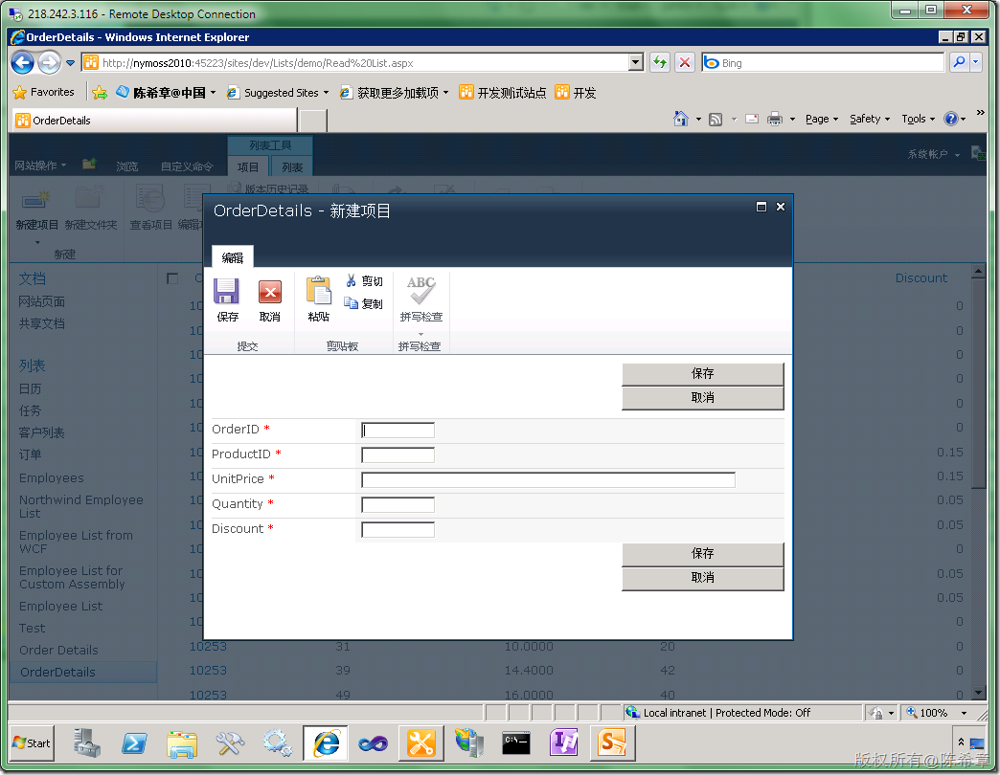
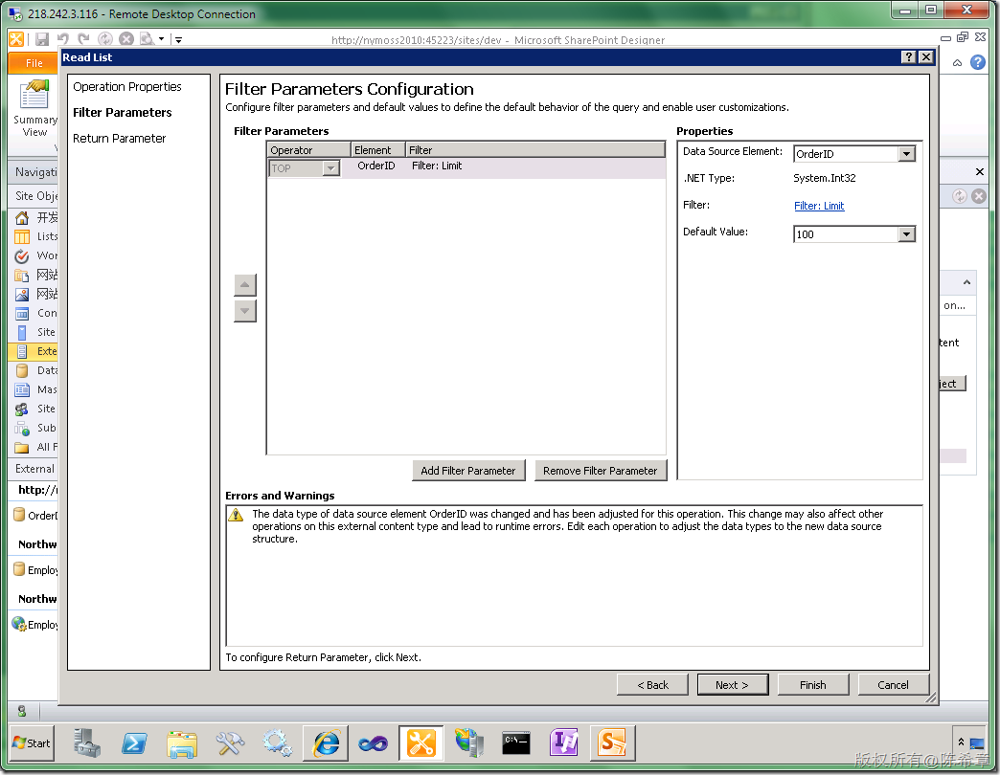

# MOSS 2010:Visual Studio 2010开发体验（24）——如何在浏览器中直接对BCS模型直接进行编辑和新增操作 
> 原文发表于 2010-05-02, 地址: http://www.cnblogs.com/chenxizhang/archive/2010/05/02/1725914.html 

[上一篇](http://www.cnblogs.com/chenxizhang/archive/2010/05/01/1725531.html)文章我演示了如何结合SQL Server的表格，快速创建一个BCS的模型。然后，可以在浏览器中查看，并且在Workspace中编辑或者新增。

 如果你还不熟悉该操作，请参考 <http://www.cnblogs.com/chenxizhang/archive/2010/05/01/1725531.html>

  

 有朋友问到，是不是要编辑的话，就必须在Workspace中去做？这个是要看具体情况的，我上次的演示之所以没有办法在浏览器中编辑，是因为那个数据模型（Employee）包含了特殊字段，是一个Photo字段，这是一个二进制字段，它没有办法在网页中编辑。

 这个列表看起来像下面这样

  

 大家可以看到，“新建项目”这个按钮是灰色的。

 而事实上，即便是在workspace中可以新建项目，Photo字段也是自动忽略的。

  

 所以，归根结底来说，尽量不要在业务实体中包含复杂类型。这样就没有问题了。

 例如，我下面再做一个实体，它仅仅包含了一些简单类型的话，就可以在浏览器中直接添加和更新了

  

  

 点击“编辑项目”

  

 下面的是新增项目的界面

  

  

  

 【注意】这里还要特别提一下，上面这个Order Details表的数据是很多的，必须在定义模型的时候对数据过滤，否则是无法正确工作的。BCS这样做的意思是为了避免数据的滥用

  

 上面这样设置的意思就是最多读取100行数据。

