# MOSS 2010:Visual Studio 2010开发体验（25）——编写自定义的BCS连接器（续） 
> 原文发表于 2010-05-02, 地址: http://www.cnblogs.com/chenxizhang/archive/2010/05/02/1725964.html 


[上一篇](http://www.cnblogs.com/chenxizhang/archive/2010/05/01/1725711.html)我讲解到了如何在Visual Studio 2010中编写自定义的BCS连接器来实现更加灵活的应用程序集成。在那篇文章，我主要讲解了有关的概念，并且做了一个最简单的模型，发布之后能够使用它。

 这一篇，我们继续来实现一个更加有现实意义的 BCS 连接器。我们需要读取的数据仍然是有关员工信息的。

 我们希望员工实体拥有如下的信息

 * ID * FirstName * LastName * Age

  

 【提示】通过跟随本文做练习，你将学会如何设计一个自己的业务实体模型。

 【注意】不要小看这个步骤，我之前就提到过，自定义BCS模型这个小工具其实还有值得改进的地方。目前的情况是一不小心就会出错。所以，最好按照我的步骤来做练习。这个步骤是我总结出来的最佳实践，你可以先做完练习，然后对某些步骤的细节做一些进一步的学习

  

 1. 创建一个空白SharePoint项目
---------------------

 [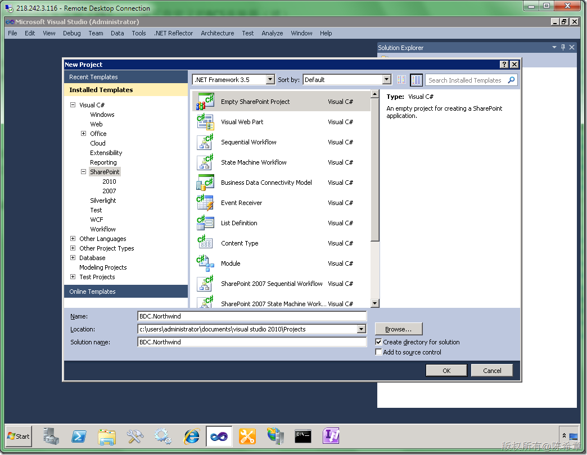](http://images.cnblogs.com/cnblogs_com/chenxizhang/WindowsLiveWriter/MOSS2010VisualStudio201025BCS_AE75/image_41.png) 

 [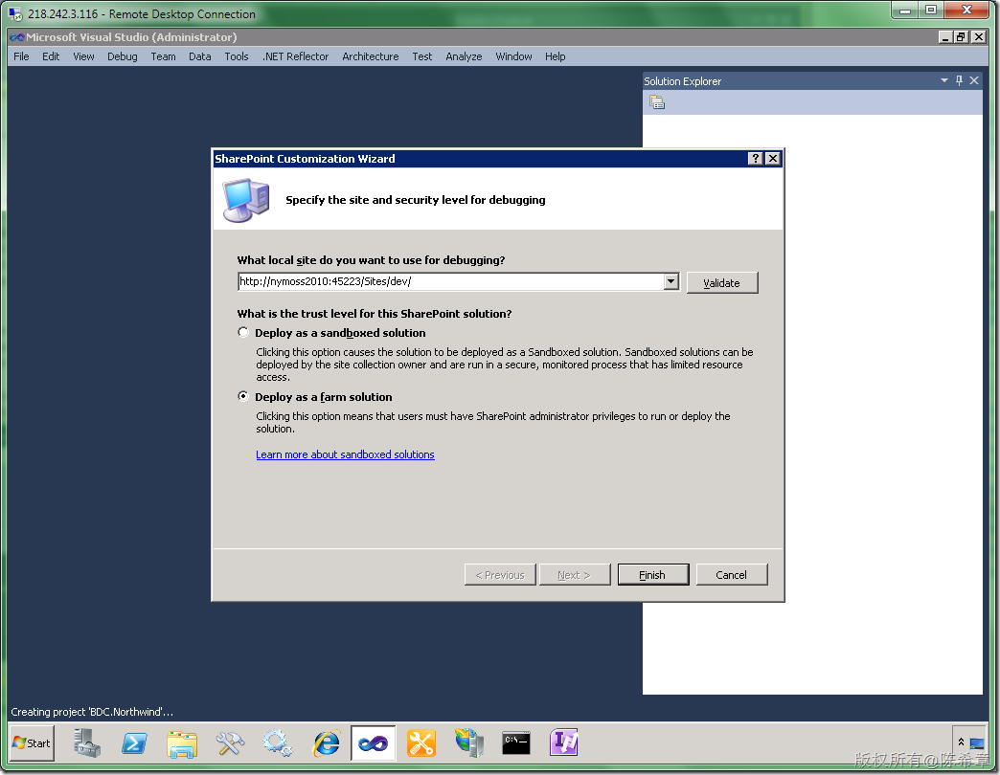](http://images.cnblogs.com/cnblogs_com/chenxizhang/WindowsLiveWriter/MOSS2010VisualStudio201025BCS_AE75/image_61.png) 

 2. 添加一个BDC模型
------------

 [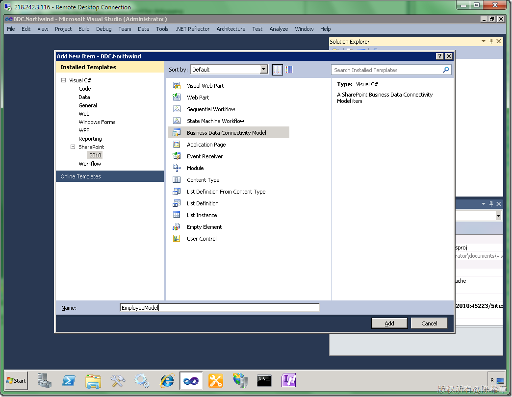](http://images.cnblogs.com/cnblogs_com/chenxizhang/WindowsLiveWriter/MOSS2010VisualStudio201025BCS_AE75/image_63.png) 

 3. 修改业务实体（Entity）
-----------------

 所谓实体就是在BDC服务中交换的数据格式。例如我们要处理员工数据，这就是一个实体。项目模板默认生成的实体类型如下（Entity1.cs)

 [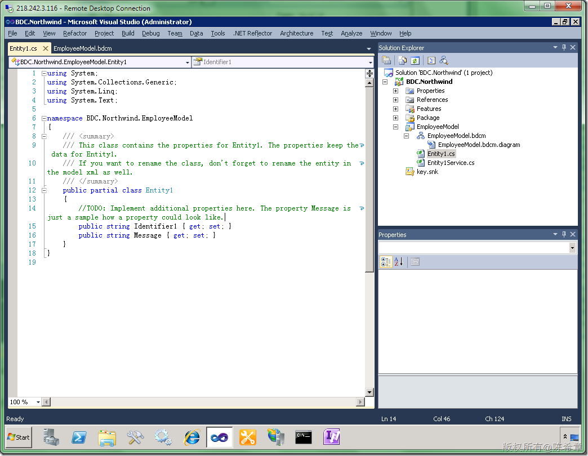](http://images.cnblogs.com/cnblogs_com/chenxizhang/WindowsLiveWriter/MOSS2010VisualStudio201025BCS_AE75/image_65.png) 

 将代码修改为下面这样


```
using System;
using System.Collections.Generic;
using System.Linq;
using System.Text;

namespace BDC.Northwind.EmployeeModel
{
    /// <summary>
    /// This class contains the properties for Entity1. The properties keep the data for Entity1.
    /// If you want to rename the class, don't forget to rename the entity in the model xml as well.
    /// </summary>
    public partial class Employee
    {
        //TODO: Implement additional properties here. The property Message is just a sample how a property could look like.
        public int EmployeeID { get; set; }
        public string FirstName { get; set; }
        public string LastName { get; set; }
        public int Age { get; set; }
    }
}
[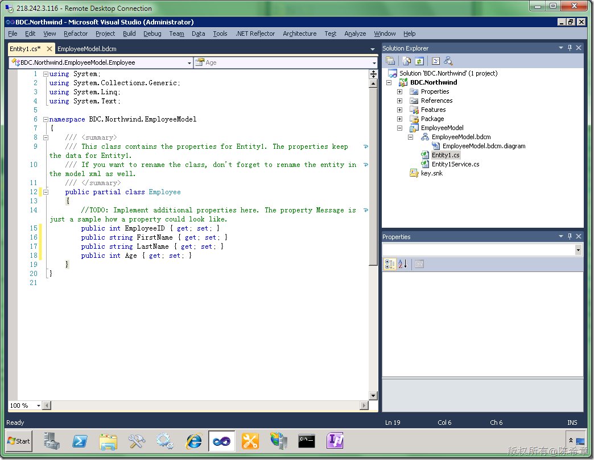](http://images.cnblogs.com/cnblogs_com/chenxizhang/WindowsLiveWriter/MOSS2010VisualStudio201025BCS_AE75/image_67.png) 
```

.csharpcode, .csharpcode pre
{
 font-size: small;
 color: black;
 font-family: consolas, "Courier New", courier, monospace;
 background-color: #ffffff;
 /*white-space: pre;*/
}
.csharpcode pre { margin: 0em; }
.csharpcode .rem { color: #008000; }
.csharpcode .kwrd { color: #0000ff; }
.csharpcode .str { color: #006080; }
.csharpcode .op { color: #0000c0; }
.csharpcode .preproc { color: #cc6633; }
.csharpcode .asp { background-color: #ffff00; }
.csharpcode .html { color: #800000; }
.csharpcode .attr { color: #ff0000; }
.csharpcode .alt 
{
 background-color: #f4f4f4;
 width: 100%;
 margin: 0em;
}
.csharpcode .lnum { color: #606060; }

 


4. 修改服务类型(Service)
------------------


实体只是数据,但谁来接受请求并且处理,然后返回数据呢?这就是服务的概念. 默认生成的那个 Entity1Service.cs就是服务所在的文件。它现在看起来是下面这样的


[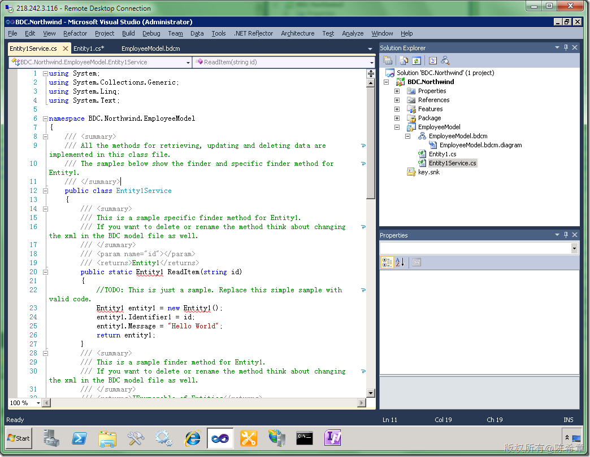](http://images.cnblogs.com/cnblogs_com/chenxizhang/WindowsLiveWriter/MOSS2010VisualStudio201025BCS_AE75/image_69.png) 


将代码修改如下


```
using System;
using System.Collections.Generic;
using System.Linq;
using System.Text;

namespace BDC.Northwind.EmployeeModel
{
    /// <summary>
    /// All the methods for retrieving, updating and deleting data are implemented in this class file.
    /// The samples below show the finder and specific finder method for Entity1.
    /// </summary>
    public class EmployeeService
    {

        static List<Employee> GetEmployees()
        {
            return new List<Employee>(){
                new Employee(){
                    EmployeeID=1,
                    FirstName="ares",
                    LastName="chen",
                    Age=20
                },
                new Employee(){
                    EmployeeID=2,
                    FirstName="bill",
                    LastName="gates",
                    Age=20
                },
                new Employee(){
                    EmployeeID=3,
                    FirstName="steve",
                    LastName="ballmer",
                    Age=20
                }
            };
        }

        /// <summary>
        /// This is a sample specific finder method for Entity1.
        /// If you want to delete or rename the method think about changing the xml in the BDC model file as well.
        /// </summary>
        /// <param name="id"></param>
        /// <returns>Entity1</returns>
        public static Employee ReadItem(int id)
        {
            return GetEmployees().FirstOrDefault(e => e.EmployeeID == id);
        }
        /// <summary>
        /// This is a sample finder method for Entity1.
        /// If you want to delete or rename the method think about changing the xml in the BDC model file as well.
        /// </summary>
        /// <returns>IEnumerable of Entities</returns>
        public static IEnumerable<Employee> ReadList()
        {
            return GetEmployees();
        }
    }
}

```


.csharpcode, .csharpcode pre
{
 font-size: small;
 color: black;
 font-family: consolas, "Courier New", courier, monospace;
 background-color: #ffffff;
 /*white-space: pre;*/
}
.csharpcode pre { margin: 0em; }
.csharpcode .rem { color: #008000; }
.csharpcode .kwrd { color: #0000ff; }
.csharpcode .str { color: #006080; }
.csharpcode .op { color: #0000c0; }
.csharpcode .preproc { color: #cc6633; }
.csharpcode .asp { background-color: #ffff00; }
.csharpcode .html { color: #800000; }
.csharpcode .attr { color: #ff0000; }
.csharpcode .alt 
{
 background-color: #f4f4f4;
 width: 100%;
 margin: 0em;
}
.csharpcode .lnum { color: #606060; }

上述代码中，我们先用一个静态的函数模拟了一个读取所有员工的操作，它是返回了三个员工的数据。很明显，这三位都是赫赫有名的大人物[](http://images.cnblogs.com/cnblogs_com/chenxizhang/WindowsLiveWriter/MOSS2010VisualStudio201025BCS_AE75/%E6%9C%AA%E5%91%BD%E5%90%8D_2.gif) 


然后，我们让ReadItem和ReadList方法有了更加好的实现。


[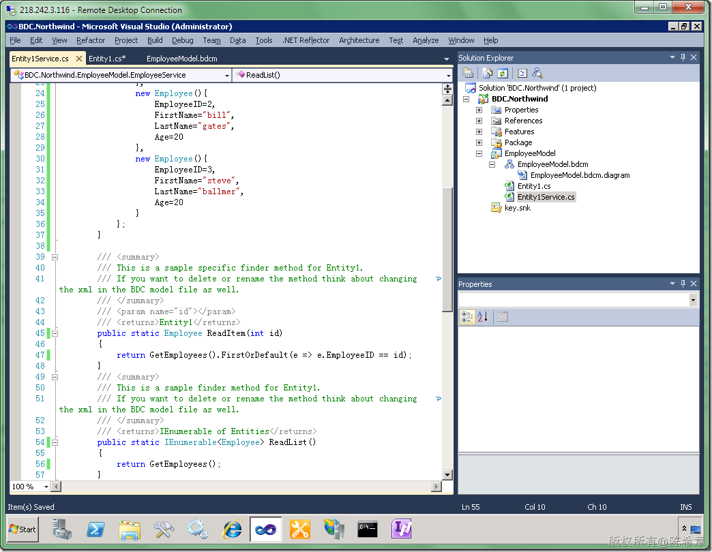](http://images.cnblogs.com/cnblogs_com/chenxizhang/WindowsLiveWriter/MOSS2010VisualStudio201025BCS_AE75/image_71.png) 


 


5. 修改模型定义（EmployeeModel.bdcm)
-----------------------------


[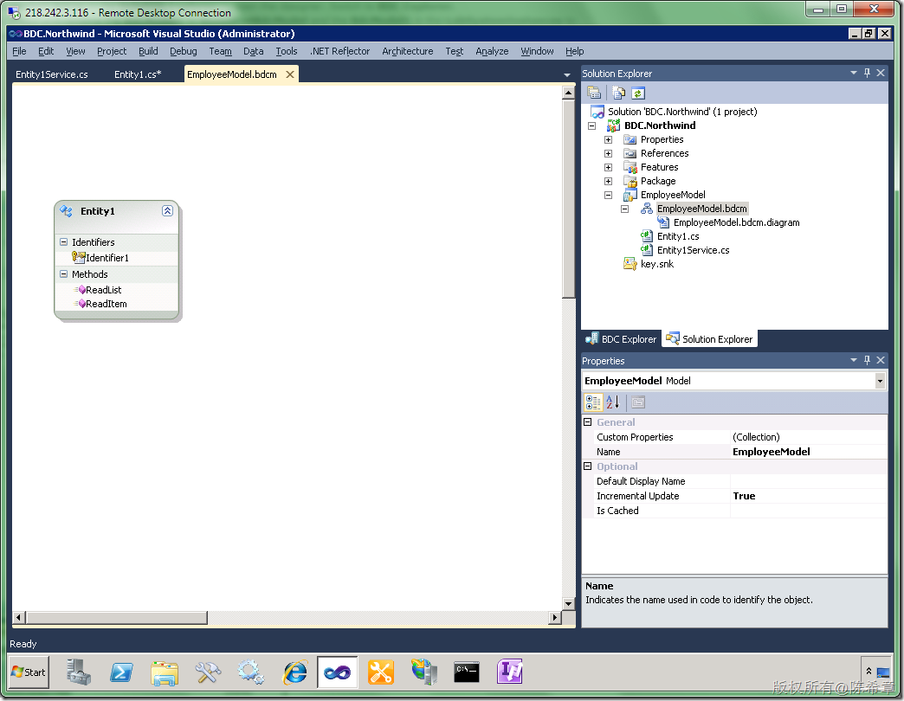](http://images.cnblogs.com/cnblogs_com/chenxizhang/WindowsLiveWriter/MOSS2010VisualStudio201025BCS_AE75/image_73.png) 


首先将Entity1重命名为Employee


[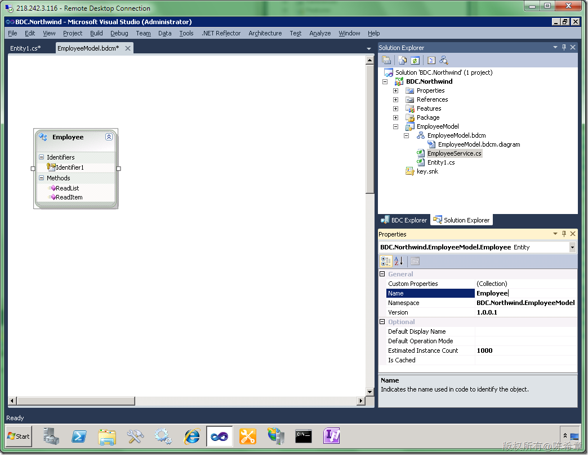](http://images.cnblogs.com/cnblogs_com/chenxizhang/WindowsLiveWriter/MOSS2010VisualStudio201025BCS_AE75/image_75.png) 


【注意】如果你注意观察的话，原先的那个Entity1Service.cs文件也被重命名为了EmployeeService.cs


接下来，我们需要将它的Identifier1修改为EmployeeID


[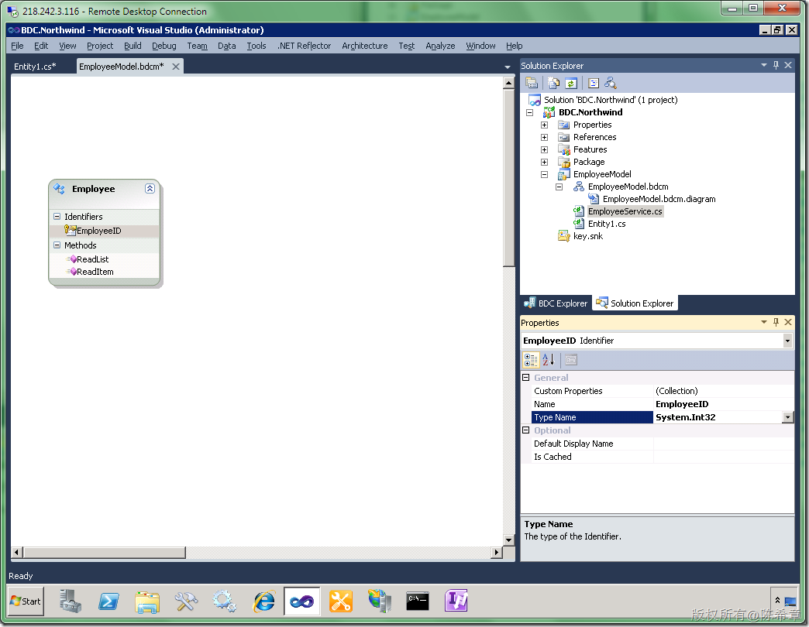](http://images.cnblogs.com/cnblogs_com/chenxizhang/WindowsLiveWriter/MOSS2010VisualStudio201025BCS_AE75/image_77.png) 


接下来，我们需要切换到BDC Explorer来完成进一步的修改。如果你没有看到BDC Explorer，那么可以通过View==>Other Window==>BDC Explorer打开它


为了方便修改，请将IDE调整为下面这样


[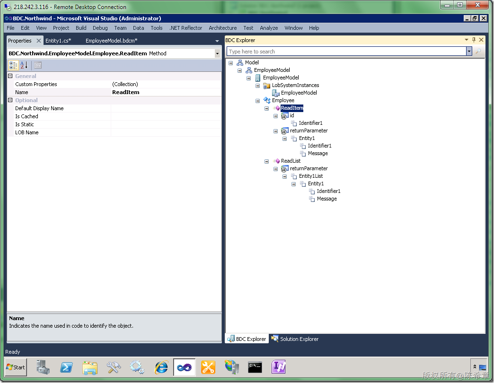](http://images.cnblogs.com/cnblogs_com/chenxizhang/WindowsLiveWriter/MOSS2010VisualStudio201025BCS_AE75/image_79.png) 


我们要将它修改成下面这样。（这里的步骤很繁琐，我就不全部截图了。基本上都是在属性窗口中做设置，要特别注意的是TypeName的设置）


[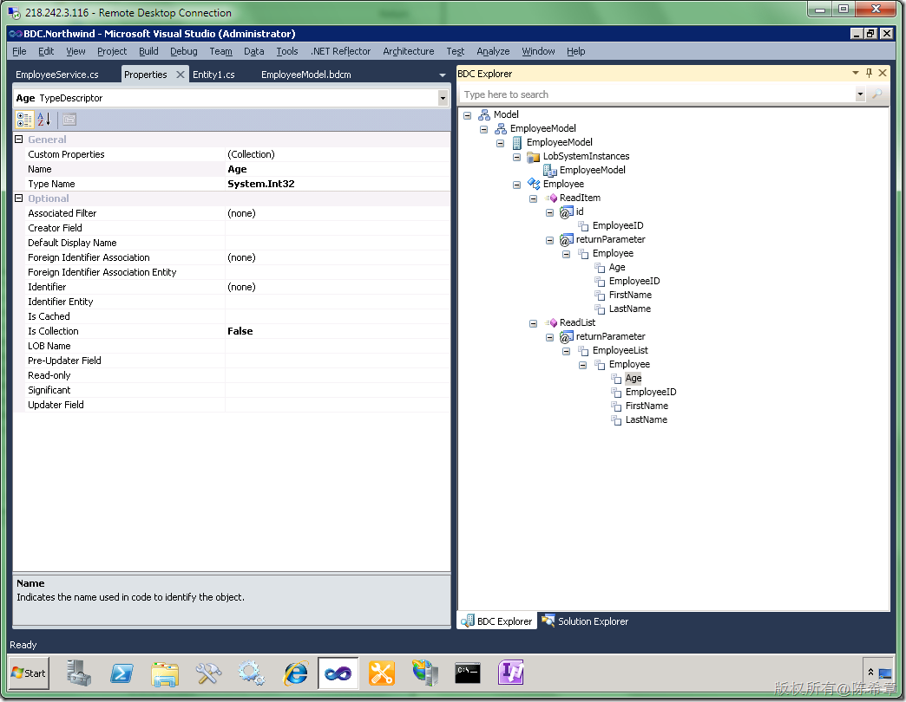](http://images.cnblogs.com/cnblogs_com/chenxizhang/WindowsLiveWriter/MOSS2010VisualStudio201025BCS_AE75/image_81.png) 


【注意】原先的Message直接修改Name为FirstName


而LastName和Age是我们通过下面的方式添加的


[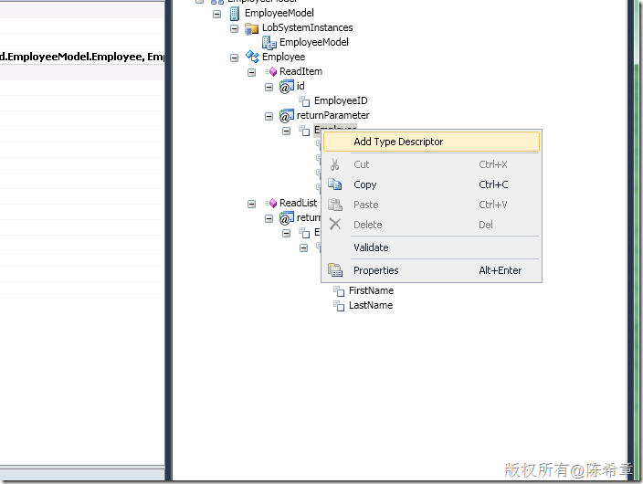](http://images.cnblogs.com/cnblogs_com/chenxizhang/WindowsLiveWriter/MOSS2010VisualStudio201025BCS_AE75/image_83.png) 


 


6. 编译项目并且部署（确保没有任何错误）
---------------------


[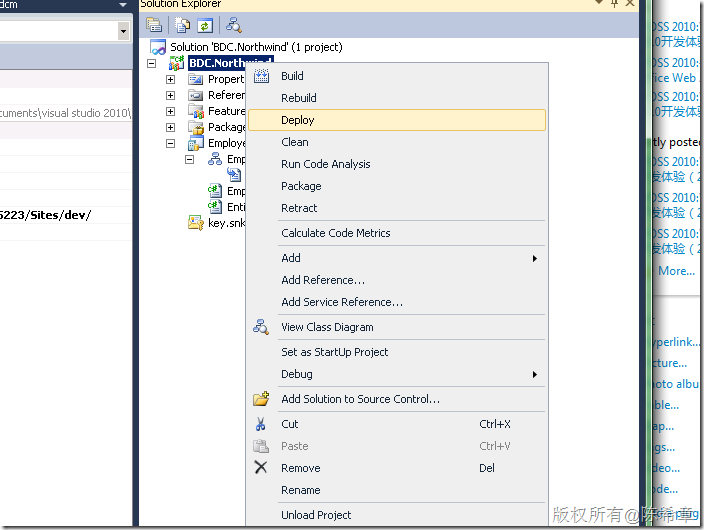](http://images.cnblogs.com/cnblogs_com/chenxizhang/WindowsLiveWriter/MOSS2010VisualStudio201025BCS_AE75/image_85.png) 


7. 验证和使用该模型
-----------


[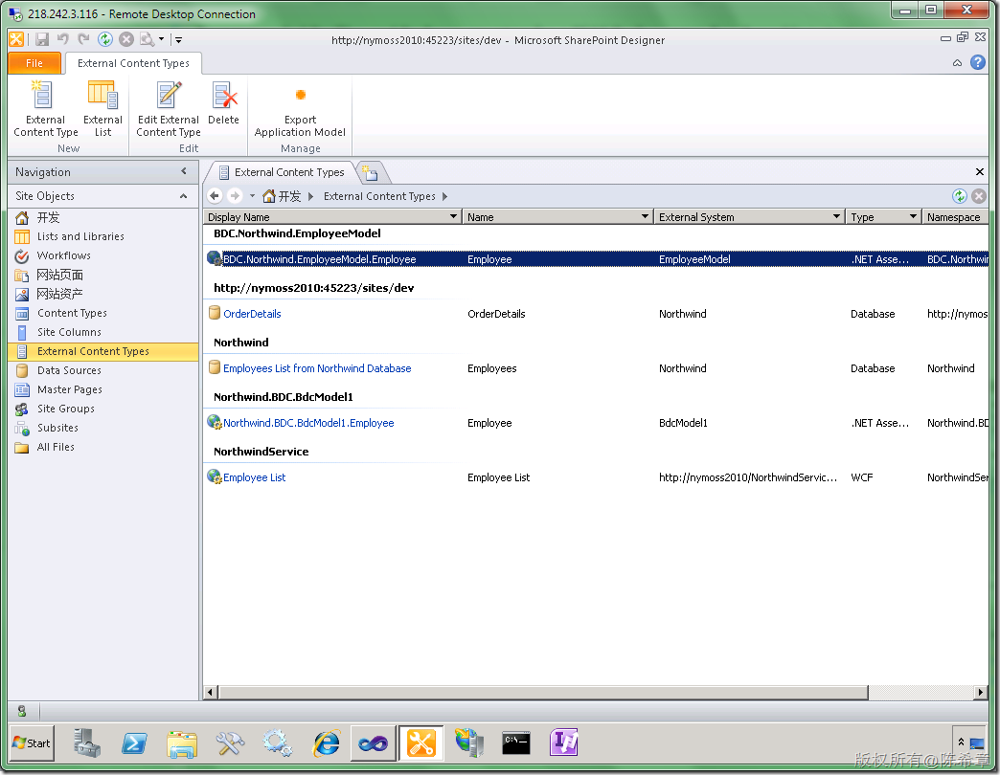](http://images.cnblogs.com/cnblogs_com/chenxizhang/WindowsLiveWriter/MOSS2010VisualStudio201025BCS_AE75/image_87.png) 


[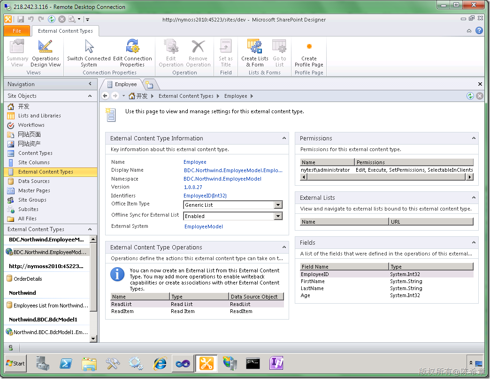](http://images.cnblogs.com/cnblogs_com/chenxizhang/WindowsLiveWriter/MOSS2010VisualStudio201025BCS_AE75/image_89.png) 


点击“Create Lists & Form”按钮


[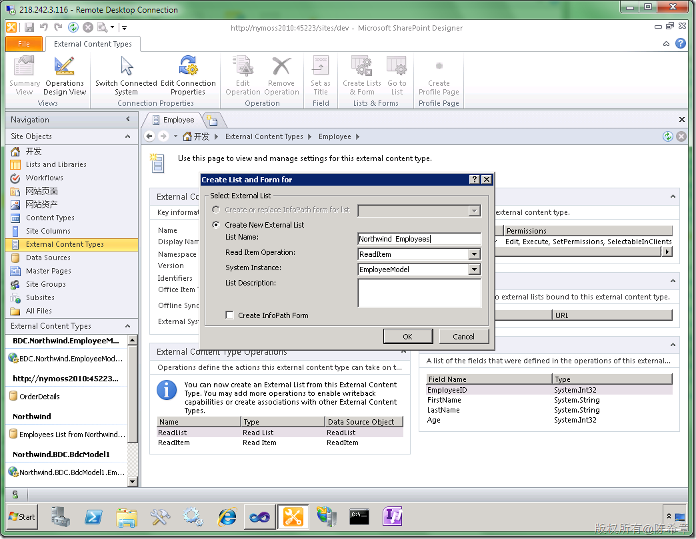](http://images.cnblogs.com/cnblogs_com/chenxizhang/WindowsLiveWriter/MOSS2010VisualStudio201025BCS_AE75/image_91.png) 


最后，我们就可以在网站中看到下面这个列表了


[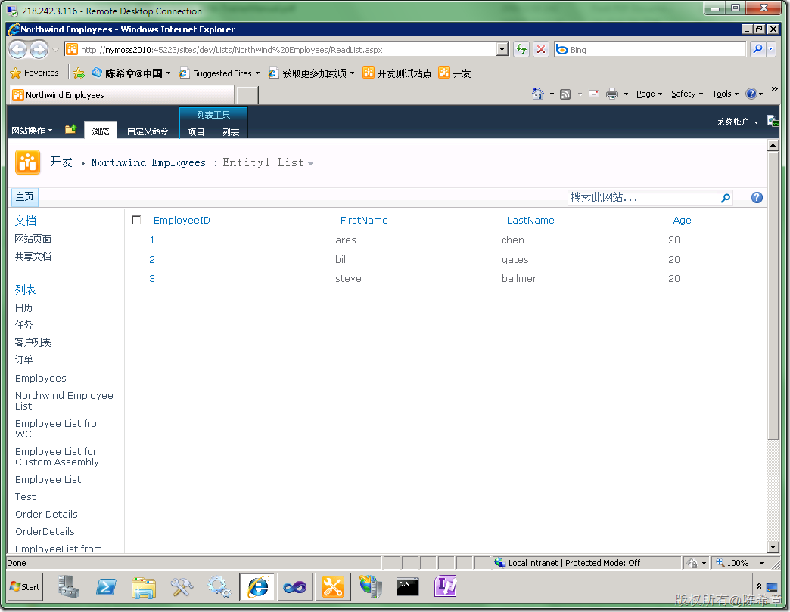](http://images.cnblogs.com/cnblogs_com/chenxizhang/WindowsLiveWriter/MOSS2010VisualStudio201025BCS_AE75/image_93.png) 


[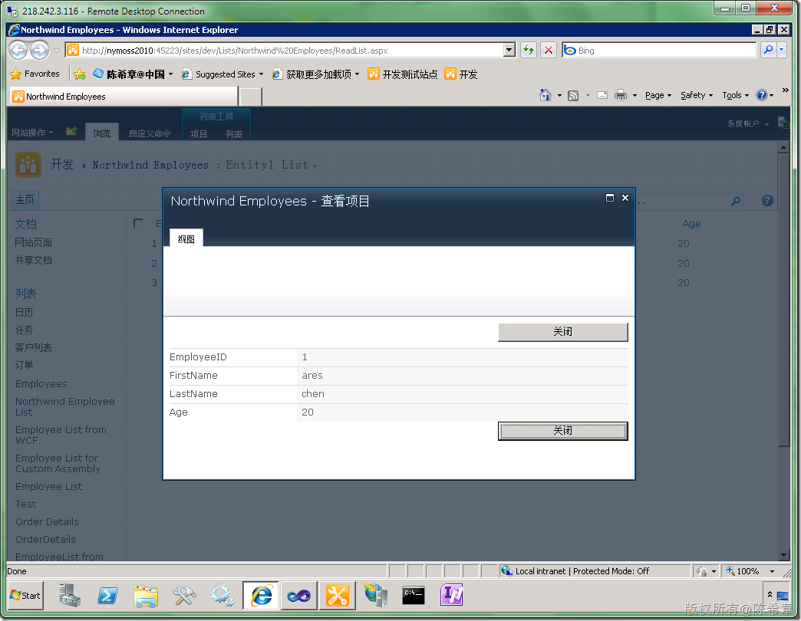](http://images.cnblogs.com/cnblogs_com/chenxizhang/WindowsLiveWriter/MOSS2010VisualStudio201025BCS_AE75/image_95.png) 


 


总结：这一篇文章我讲解了如何实现自定义BDC模型。其实这个工作并不难，但却是比较繁琐的，而且容易出错。


我不确信每个人都能通过看一遍就学会如何做，所以如果你实在遇到了问题，也可以通过下面地址下载范例代码


[http://files.cnblogs.com/chenxizhang/BDC\_Northwind.rar](http://files.cnblogs.com/chenxizhang/BDC_Northwind.rar "http://files.cnblogs.com/chenxizhang/BDC_Northwind.rar")

